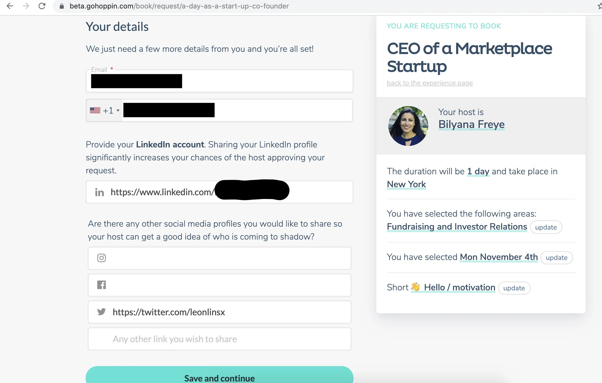

최근에 직업 그림자 관찰을 했습니다 [Bilyana Freye](https://twitter.com/bilyanafreye?lang=en 'Billy') 직업 체험 시장의 이야기 [Hoppin](https://gohoppin.com/ 'Hoppin')아래는 제 경험에 대한 초기 의견입니다\.

솔직히 말씀드리자면\, 저희 회사는 이 활동을 전문성 성장 학습 예산의 일부로 지원했습니다 [^1]

사람들이 새 직장을 찾을 때 흔히 듣는 조언 중 하나는 먼저 조사를 하라는 것입니다\. 현재 사람들이 인턴십을 하거나 해당 역할을 맡은 다른 사람들에게 직접 조사를 요청하는 방법이 있습니다\. 인턴십은 더 많은 시간 투자가 필요하고 항상 현실적이지는 않지만\, 현재 직원들과 대화하는 것은 인턴십 중 직접 경험하는 것만큼 풍부한 정보를 얻지 못합니다\. 이것이 호핀이 채우려는 공백입니다\.

Hoppin은 하루 동안 누군가를 섀도잉하고 싶은 사람들과 하루 동안 다른 사람을 호스팅할 의향이 있는 사람을 연결하려는 직업 쉐도잉 마켓플레이스입니다\. 이상적으로는 양쪽 모두 이로부터 혜택을 볼 수 있습니다\. 섀도잉 담당자는 역할에 대해 훨씬 더 잘 이해할 수 있는 진정한 \'하루\' 경험을 얻고\, 호스트는 자신의 역할에 대한 새로운 관점과 잠재적으로 신입 채용 기회를 얻게 됩니다\. 사람들이 관심을 가지는 이유를 이해할 수 있고\, 이제 이 문제를 어떻게 사업으로 발전시킬 수 있을지 찾는 것이 Hoppin이 해결해야 할 핵심 문제입니다\.

먼저 예약 과정을 설명하고\, 제 개인적인 경험을 말씀드리고\, 마지막으로 회사에 대한 생각과 피드백을 나누겠습니다\. 결론적으로\, 저는 이 경험이 정말 멋졌고 꼭 한 번 살펴볼 가치가 있다고 생각했지만\, 아래에 언급할 주의사항을 제외하고는 말씀드리겠습니다\.

## 예약 흐름

사이트에는 관심 분야 내 경험을 검색할 수 있는 검색 기능이 있습니다\. 아래 예시는 제가 \'마켓플레이스\' 검색 결과 끝에 있을 때 찍은 것입니다\. 저 코기를 보세요\.

관심 있는 경험을 선택한 후\, 그 사람과 그 경험의 프로필로 이동합니다\. 이 예시에서 [^2]역할\, 기간\, 위치 등에 대한 간단한 정보는 접이식 아래에 있고\, 그 아래에 더 자세한 정보가 있습니다\.

예약을 클릭한 후\, 호스트가 자신의 계정을 만들 때 제공한 미리 채워진 관심사 목록에서 관심사를 선택할 수 있습니다\.

그 다음 자신에게 맞는 날짜를 선택하세요\:

그리고 그 후에 의도에 대해 자유롭게 답변할 수 있습니다\. 덧붙여 생각하자면\, 이걸 \'관심사 선택 섹션\'과 결합할 수 있을까요\? 목적이 비슷해 보입니다

다음 단계는 연락처 정보와 링크하고 싶은 다른 소셜 미디어 프로필을 입력하는 것입니다\. 여기서 보시다시피\, 편의를 위해 이미 프로필에 입력한 정보를 불러오고 있습니다\.

호핀은 B2B로 전환하려고 해서 쿠폰 신청이라는 다음 단계가 있어요\. 몇 주 전에 처음 예약할 때는 없었어요\. 쿠폰을 적용하면 제가 다음에 말하는 것과는 약간 다른 흐름이 진행되는 것 같아요\; 아마도 바로 확인 페이지로 가는 걸까요\?

마지막 단계는 결제 세부사항입니다\. 아직 가격 책정 중이라 숫자는 가렸습니다\. 개인적으로는 경험 페이지에서 가격을 미리 보고 싶지만\, 왜 여기 있는지 이해는 됩니다

예약 후에 확인 이메일과 영수증도 받는 것으로 알려져 있습니다 [^3]\. 그 후에는 해당 주에 알림 이메일을 보내고\, 당일에는 경험을 공유하도록 유도하는 이메일 안내를 받습니다\.

게다가 호스트\(창립자인 빌리아나\)로부터 제 계획이 담긴 이메일을 받았습니다\. 이 정보가 기대할 수 있는 부분에 대한 걱정을 덜어주는 데 도움이 되었습니다 [^4]\. 또한 그녀가 제가 관심 있는 경험에 맞는 경험을 명확히 준비해준 점도 멋지다고 생각했습니다\. 호핀 팀은 호스트가 먼저 연락할 계획이라고 밝혔는데\, 호스트가 돈을 받기 때문입니다\; 앞으로 호스트들에게 그 점을 더 명확히 할 계획입니다\.

## 직업 체험 경험

아침에 카페에서 빌리아나를 만나 소개 대화를 나눴습니다\. 우리는 서로의 배경에 대해 이야기했습니다 [^5] 그리고 회사 개요를 간단히 설명하며\, 바로 다음 투자자 미팅에서 더 자세히 설명할 수 있을 것이라고 말했다\.

호핀은 현재 자금 조달 중이라 곧바로 잠재 투자자를 만났습니다\. 투자자는 자신의 배경을 설명하고\, 피치를 들었으며\, 다음과 같은 질문을 했습니다\:

- 회사 전략과 장기 비전
- 자금 조달 라운드 및 조건
- 현재 연소 속도와 팀 규모
- 현재 지표
- 계획된 파트너십
- 공급 대 수요의 문제와 어떤 것이 게이팅 요인이었는지
- 고용주 인출 문제 관리
- 호스트와 섀도어의 교차
- 일반적인 섀도잉 데이가 어떻게 구성되었는지에 대해

저도 투자자로서 관심 있었을 만한 사려 깊은 질문들이라고 느꼈습니다\.

그 투자자 미팅 이후\, 우리는 빌리아나의 공동 창업자와 합류했습니다 [Luuk Derksen](https://gohoppin.com/about 'Luuk') 그들이 협력한 가속기와 만나기 위해서였습니다\. 호핀 팀은 주로 자금 조달과 투자자 관계 관리에 관한 조언을 얻고자 했습니다\. 특히 제가 강한 의견을 가진 주제는 투자자 업데이트 빈도였습니다\. 제가 공공 시장 투자 측면에서 경험한 바로는\, 회사가 정기 업데이트를 중단하거나 지표를 추출하는 것은 보통 좋지 않은 신호입니다\. 상황이 나빠지면 이야기를 멈추지만\, 바로 그때가 가장 이야기해야 할 때입니다\. 많은 경우 개인 투자자들은 회사의 문제를 일찍 알았다면 도울 수 있었지만\, 상황이 붕괴했을 때만 개입했습니다\. [Carta has a sensible investor update format.](https://carta.com/blog/how-to-write-an-investor-update/ 'Carta') 이 글을 읽는 창업자 분들께 투자자 업데이트를 계속 확인해 주시기 바랍니다\.

점심을 함께 먹었고\(호핀이 비용을 지불\)\, 이후 크리에이티브 에이전시와 만나 호핀이 에이전시 서비스로부터 어떻게 혜택을 받을 수 있을지에 대해 이야기를 나눴습니다\. 에이전시는 포지셔닝\, 비즈니스 디자인\, 디지털 브랜딩을 돕기 위해 할 수 있는 일에 대해 이야기했습니다\. 또한 마케팅 메시지\, 회사 정체성\, 매각 완료 시 이슈에 대해 논의했습니다\. 회의는 양측이 후속 사안에 합의하며 마무리되었습니다\. 개인적으로는 이 단계에서 에이전시와 일하는 것이 시기상조일 수 있다고 생각했지만\, 창업자들의 판단에 따라 사업을 운영할 것입니다\.

그 후 그들의 사업 개발 책임자와 만났습니다\. [Addi](https://www.linkedin.com/in/addisonbolin/ 'Addi') 잠시 동안\. 그녀는 자신의 영업 퍼널을 설명하며\, 잠재 고객을 유치하고 후속 조치를 취하는 방법을 설명해 주었습니다\. Addi는 참여율을 높이기 위한 전략을 설명했는데\, 예를 들어 스타트업과 기업의 목표가 다르기 때문에 그 사람에 맞게 카피를 맞춤화하는 것이었습니다\. Addi는 또한 직장 외 시간에 여러 행사에 참석해 Hoppin을 만나고 제안합니다\.

그 후 현재 투자자와 만나는 통화를 진행했는데\, 내용은 다음과 같습니다\:

- 이정표 달성
- 직면한 문제들
- 모금 활동
- 투자자가 더 전문적으로 도울 수 있는 부분
- 다음 라운드를 모으려면 회사가 어떤 모습이어야 하는지
- 회사 확장 가능성

저는 공개 시장 쪽에서의 경험과 비공개 프로세스에 대한 지식을 바탕으로 회의가 꽤 표준적이라고 느꼈습니다\. 호핀 팀은 승패 모두에 대해 솔직하게 이야기했고\, 앞으로 몇 주를 어떻게 대비할지에 대한 좋은 조언을 받았습니다 [^6]\.

원래는 기자와 한 번의 시내 미팅을 하기로 했지만\, 연기되어 결국 시간이 좀 생겼습니다\. 그 시간을 빌리아나와 Q\&A 세션을 진행하고\, 루크와 함께 제품을 함께 살펴보며 채웠습니다\. 제품 세션 동안 우리는 다음과 같은 주제를 이야기했습니다\:

- 플랫폼 구축 방법
- 기술 문제
- 고객 기대와 그 기대가 지금 높아진 점에 대해
- 큰 우선순위
- 장기 전략

저도 작은 과제를 해야 했는데\, 위 두 세션이 예상보다 오래 걸려서 그것도 줄여야 했어요\. 보통 기대치는 섀도우어가 참여도를 높이기 위해 무언가를 하는 거라고 들었어요\. 호핀 팀에 한 명의 전임 멤버\(아비\?\)가 한 명 더 있었는데\, 안타깝게도 그와 많이 시간을 보내지 못했어요\. 그건 예상된 일이었죠\. 결국 저는 팀이 아니라 특정 사람을 따라다니고 있었으니까요\.

마지막에는 예정된 브리핑으로 마무리했는데\, 제가 준 댓글들 때문에 원래 종료 시간을 넘겼습니다\. 모두에게 길고 분주한 하루였습니다\. 호핀 팀이 더 오래 머물며 그림자 체험을 해주셔서 감사합니다\!

## 생각

- 전략
  - 리크루팅 담당자들에게 흔히 하는 조언 중 하나는 해당 역할을 맡았거나 이전에 있었던 사람들과 최대한 많이 이야기하는 것입니다 [^7]\. 직무 체험은 한 단계 더 나아가서 관심 있는 역할에 대해 더 많은 통찰을 제공합니다\. 그게 좋다고 생각하고\, 예를 들어 같은 사람과 한 달에 한 번 더 긴 그림자 체험 기간도 가능할 것 같아요\.
  - Hoppin은 B2C를 시작했고\, 현재 B2B로 전환하며 자신들을 \'일의 ABNB\'로 자리매김하고 있습니다\. 장점으로는 더 큰 계약\, 높은 유지율\, 그리고 브랜드화가 있습니다\. 단점으로는 더 긴 영업 주기\, 인센티브 정렬의 어려움\, 집중 위험 등이 있습니다\. 모든 전환과 마찬가지로 이 역시 어려울 것입니다\. 하지만 어떤 형태로든 SaaS 제품으로 반복 수익을 확보하려는 것은 당연합니다\.
  - 특히 인센티브 정렬과 관련해서\(아래 참조\) 제품 시장 적합성을 아직 확보하는 과정에 있는 것으로 보입니다
  - 그들은 대안도 생각하고 있었다 [^8] 현재 완전히 다른 직업을 재미로 섀도잉하는 사람들에게\, 이것이 섀도잉 담당자들이 현재 이 플랫폼을 사용하는 주된 이유인 것 같습니다
  - 단기적으로는 매칭\, 일정 관리\, 피드백을 완전히 자동화하는 것이 목표입니다
  - 장기적인 비전은 학습과 개발의 플랫폼이 되는 것입니다\. 직무 체험은 플랫폼에서 제공하는 여러 제품 중 하나일 수 있습니다\. 직원이 자신만의 맞춤형 학습 및 개발 계획을 가질 수도 있습니다\. 흥미로운 점입니다\. 저는 HR 분야에 대해 잘 알지는 못하지만\, 이 분야가 분산되어 있어 이 부분도 쉽지 않을 수 있음을 의미합니다\.
  - 이 규모가 얼마나 커질 수 있을까요\? 모르겠어요\, 경험이 새롭고 자체 시장을 만들어내고 있을 수도 있겠네요\. 정말 흥미롭네요
- 인센티브 정렬
  - 저는 개인적으로 모든 측이 대체로 인센티브가 일치하는 비즈니스를 좋아하며\, 여기서 잠재적 문제가 있다고 봅니다\. 직원들이 다른 일자리를 찾기 위해 이 서비스를 이용할 가능성이 있어 고용주에게 서비스의 이점을 설득하기 어려울 수 있습니다\. 팀이 직원 만족도 등으로 ROI를 입증할 수 있다면\, 매각 과정에 도움이 될 수 있습니다
  - 즉\, 팀은 모든 이해관계자가 만족할 수 있도록 자신들의 부가가치를 간결하게 전달하는 방법을 아직 고민 중이라고 생각합니다
  - 호스트와 섀도어 모두 서로에게서 배울 수 있다면 한 가지 방식만 있는 것보다 더 좋은 경험이 될 것입니다\. 예를 들어\, 호스트가 경험 많은 사람이 고등학생을 호스트한다면\, 그렇게 유용하지 않을 것입니다
  - 플랫폼에서 상위 호스트에게 추가적인 인센티브가 있나요\? 상위 호스트들이 대부분의 예약을 차지할 거라 생각하고\, 금방 피곤해질 것 같아요\.
  - 섀도너가 본업과 완전히 다른 경험을 쌓으려는 의도인가요\, 아니면 직장에 복귀할 수 있는 보완적인 경험을 얻으려는 건가요\?
- 가격
  - 전환 이후에도 Hoppin은 여전히 가격 책정 작업을 진행 중입니다\. 현재 생각은 비즈니스 계정을 온보딩하기 더 쉽게 경험당 가격을 표준화하는 것입니다\.
  - 참고로\, 가격이 비싸서 개인으로는 예약하지 않았을 거예요\. 비용을 청구할 수 있어서 제품을 써보고 싶었거든요
  - 테이크 비율도 높았는데\, 그쪽도 개선할 거라고 생각해요
  - 가격 책정에서 까다로운 점은 호스트가 충분히 가치 있을 만큼 가격을 책정해야 하되\, 섀도우어들이 꺼릴 정도로 높지 않다는 점입니다\.
- 시장 유동성
  - 대부분의 마켓플레이스는 공급이 제한적이며\, Hoppin도 마찬가지일 것이라고 생각합니다\. 충분한 수와 다양성을 갖춘 호스트를 확보할 수 있다면\, 서비스에 대한 수요도 충분히 생길 것이라고 생각합니다 [^9]
  - 가장 인기 있는 사람들이 얼마나 자주 진행하는지\, 그 진행 방식이 얼마나 지속 가능한지\, 그리고 그들의 유지 곡선은 어떤지 궁금합니다
  - 그들의 B2B 파트너십은 더 많은 공급을 확보할 수 있는데\, 제 회사도 그랬습니다
- 다른 투자자 프레임워크를 이용한 평가
  - 원작 [Bill Gurley's framework](http://abovethecrowd.com/2012/11/13/all-markets-are-not-created-equal-10-factors-to-consider-when-evaluating-digital-marketplaces/ 'Gurley')
    - 새로운 경험과 기존 상태 \- 네\, 맞아요
    - 경제적 이점과 현상 유지 \- 아니요\?
    - 기술이 가치를 더할 기회 \- 네\, 집계 측면에서요
    - 높은 단편화\(fragmentation\) \- 그럴 것 같아요
    - 공급업체 가입 마찰 \- 쉽지는 않았지만\, 호핀은 기업용으로 더 템플릿화하고 있다고 말했습니다
    - 시장 기회의 규모는 잘 모르겠습니다
    - 시장 확장\, 그런 것 같네요
    - 빈도 \- 낮은 것 같아
    - 결제 흐름 \- 아니요\?
    - 네트워크 효과\. 네\, 국지적이지만
  - 원작 [Josh Breinlinger's framework](https://acrowdedspace.com/post/73232464154/the-ingredients-for-a-successful-marketplace 'Josh')
    - 반복 사용 \- 사실은 아니죠\?
    - 불규칙한 사용 \- 네
    - 표준화된 작업 \- 아니요
    - 신뢰가 거의 필요 없죠\?
    - 비독점 관계 \- 네
- 자금 조달
  - 명백한 이유로 자세한 내용은 말하지 않겠습니다\. 하지만 회사는 초기 단계였고 더 많은 자금을 조달할 계획이라\, B2B 영업 구축에 전문성이 있는 투자 투자자라면 연락해 보는 것도 좋을 것 같습니다\.

## 더 세밀한 피드백

1. 처음 예약할 때는 내부 승인을 받아야 해서 결제 페이지에서 멈췄습니다\. 예약 확인 요청 이메일을 받았는데\, 그건 좋았습니다\. 하지만 그 링크 때문에 날짜 확인 같은 다른 필드를 다시 수정할 수 없었어요
2. 예약을 완료한 후에는 창을 닫는 것밖에 없었고\, 예약\, 프로필\, 홈페이지로 다시 연결되지 않았습니다\. 이것은 섀도우어들이 호스트가 되도록 유도하거나\, 기대할 수 있는 경험을 설명하는 기사로 연결되는 경로가 될 수 있습니다
3. 호스트와 섀도어 모두 가입 과정이 제가 선호하는 것보다 길게 느껴졌지만\, 그건 개인적인 경험일 뿐입니다\.
4. 처음에는 로그인해서 프로필을 만들었지만\, 사이트에 다시 들어갔을 때 그 링크를 찾을 수 없었어요\. 다시 가입할 수 있는 사람만 허용하는 것 같았어요\.

호핀 팀은 위 문제들을 인지하고 있다고 말했습니다\.

## 결론

마켓플레이스 회사에서 일하는 사람과 하루를 보내는 경험이 정말 좋았고\, 개인적으로 관심 있는 다양한 활동이 있어 더욱 흥미로웠습니다\. 소매 소비자에게는 가격이 높다고 생각하지만\, B2B 인사 자원으로서는 합리적일 것입니다\. 호핀이 그 전환을 성공시켜 마켓플레이스의 공급 측면을 확장한다면\, 2년 후 그들의 모습을 지켜보는 데 흥미로울 것입니다\.

[^1]: 그리고 호핀이 점심이랑 커피도 사줬어\. 내 객관성에 영향을 줄지 네가 판단해 달라\.\.\.

[^2]: 실제 예약할 때 스크린샷을 찍는 걸 깜빡해서 대부분 재현한 거예요

[^3]: 예약할 때 영수증을 못 받아서 버그가 있었던 것 같아요\. 호핀이 조사 중이라고 했어요\.

[^4]: 기밀 유지 의제에서 세부 사항은 편집했습니다

[^5]: 그녀의 배경에 대해 더 읽어보실 수 있습니다 [here](https://www.swaay.com/how-this-co-founder-is-building-the-airbnb-for-work 'swaay')\. 그리고 당연히 저에 대해 더 읽어보실 수 있습니다 [here](https://leonlins.com/about 'me')

[^6]: 투자자는 사업 운영 방법에 대해 너무 세세하게 파고들지 않았는데\, 이는 좋은 투자자의 징후라고 생각합니다\. 예약 흐름의 일부를 어디에 결합할지 조언하는 사람과는 다릅니다\.

[^7]: A16Z가 방금 투자했습니다 [Lunchclub](https://techcrunch.com/2019/09/18/lunchclub-raises-4m-from-a16z-for-its-ai-warm-intro-service/ 'lunch') 예를 들어\,

[^8]: 아직 개발 중이라 기밀 유지를 위해 언급하지 않겠습니다

[^9]: 가격을 정확히 정하는 것에 달려 있고\, 그건 그들이 B2B 전환을 어떻게 해내느냐에 달려 있습니다\.
