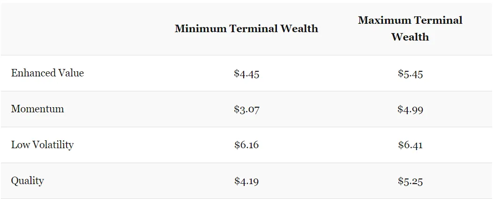

## 주요 내용

1. 비디오 게임은 다음 문화 현상이며\, 가상현실이 그 혁명을 이끌 것입니다
2. 투자 포트폴리오를 재조정하는 시기는 수익률에 상당한 차이를 가져올 수 있습니다
3. 우리는 확률을 설명하는 데 서툴고\, 결합하는 데는 더더욱 못합니다

### 비디오 게임이 스포츠 스타를 죽였다

11월 21일\, 인기 게임 회사가 [Valve](https://store.steampowered.com/ 'Steam') 새로운 게임을 발표했습니다\. [Half-Life Alyx](https://half-life.com/en/alyx 'Alyx')\. Alyx는 Half\-Life 시리즈의 후속작으로\, 역대 최고의 게임 중 하나로 널리 평가받고 있습니다\; 마지막 업데이트는 12년 전에 출시되었습니다\. 아래에서 Alyx의 2분 트레일러를 확인하실 수 있습니다\. 이 게임은 플레이를 목적으로 만들어졌다는 점을 기억하세요 _VR에서\!_

  <iframe src="https://www.youtube.com/embed/O2W0N3uKXmo" title="Alyx Trailer" frameborder="0" allowfullscreen style="position:absolute;top:0;left:0;width:100%;height:100%;"></iframe>

<a href="https://www.youtube.com/watch?v=O2W0N3uKXmo" target="_blank" rel="noopener">Watch on YouTube</a>

왜 이게 중요한가요\? 여러분은 기술\, 금융\, 그리고 가끔 나오는 자비하 농담에 대해 읽기 위해 구독하고 있습니다\; 아마 절반은 그 영상을 클릭하지 않았을 것입니다\. _비디오 게임에 누가 신경 쓰겠어요\?_

왜 관심을 가져야 하는지 말씀드릴게요\. 저는 비디오 게임과 e스포츠\(재미로 비디오 게임을 보는 것\)가 다음 문화 현상이라고 믿습니다\. 최신 어벤져스 영화를 않았다면 대화에서 소외감을 느끼는 것처럼\, 곧 최신 비디오 게임을 플레이하거나 않아 소외감을 느끼게 될 날이 올 것입니다 [^1]\. 또한 AR과 VR이 우리가 오락하는 다음 형태가 될 것이라고 믿습니다\. 마치 휴대폰\, PC\, 텔레비전처럼요\. Alyx가 VR을 주류로 끌어올리는 촉매제가 되길 바라지만\, 아직 시장이 이르다는 점도 인정합니다\.

말도 안 되게 들리죠\? 어쨌든 어벤져스\: 엔드 게임만으로도 30억 달러짜리 흥행 영화였으니\, 돌 하나 던질 수 없어요 [^2] 재미없는 어벤져스 밈을 건드리지 않고\, [Marvel movie spinoffs are reproducing like rabbits](https://time.com/5167535/upcoming-marvel-movies/ 'List of upcoming Marvel movies')\. _비디오 게임은 얼마나 클 수 있을까요\?_

음\:

게임은 필름보다 크지만 여전히 더 빠르게 성장합니다\. [global sports industry at $500bn in size](https://www.businesswire.com/news/home/20190514005472/en/Sports---614-Billion-Global-Market-Opportunities 'Sports')스포츠 규모에 도달하기 전에 게임이 성장할 여지가 충분합니다\.

이를 위해 게임은 단순히 부모님의 신용카드로 포트나이트를 하는 아이들을 넘어서는 확장이 필요합니다\. [The largest esports tournament already has about the same number of viewers as the Super Bowl](https://marginalrevolution.com/marginalrevolution/2018/08/esports-update.html 'MR')하지만 소규모 토너먼트는 아직 비교할 수 없습니다\. 새로운 게임들은 성인과 노인들도 즐길 수 있는 포용적인 경험이어야 합니다\. _할머니가 비디오 게임을 하셨을까요\?_

음 [^3]\:

저만 게임에 대해 낙관적인 것은 아닙니다\. 잘 알려진 벤처 캐피털 회사인 A16Z가 게임에 대한 관심을 높였습니다 [wrote about some trends they believe in](https://a16z.com/2019/10/16/trends-revolutionizing-games/ 'a16z') [^4]\:

> 게임은 다음 소셜 네트워크입니다

> 크로스 플랫폼 플레이가 새로운 표준이 됨에 따라\, 멀티플레이어 게임은 이전 세대보다 훨씬 빠르고 규모가 커질 것입니다

> 다음 대형 영화 프랜차이즈\, 테마파크\, 장난감 라인은 아마도 게임에서 나올 것입니다\.

제가 이 일은 일어날 것이라고 확신하는 최소 세 가지 이유가 있습니다\:

1. 인구 통계\. 게이머 아이들은 점점 게이머 부모로 성장하고 있습니다\. 그들의 아이들도 아마도 게이머가 될 가능성이 높아\, 멀티플레이어 게임을 일시정지할 수 없는 이유를 더 이상 설명할 필요가 없게 됩니다\.

2. 포용과 상호작용이 증가합니다\. 누구나 비디오 게임을 할 수 있습니다\, [even a Saudi prince](https://www.dailydot.com/parsec/saudi-arabian-prince-on-steam/ 'Saudi')\. 팀이 이기는 모습을 보는 것에서 바로 같은 방에서 직접 게임을 플레이할 수 있습니다\. VR이 마침내 본격적으로 시작되면\, 복잡한 조작에 대해 걱정할 필요도 없을 것입니다\. 상호작용이 직관적이기 때문입니다\.

3. 공동체에 대한 갈망\. 모두가 무언가에 속하고 싶어 합니다\. 게임은 더 큰 부족의 일원으로 정체성을 가질 수 있는 사실상 무한한 선택지를 제공합니다\. 더 많은 게임이 사회적 경험을 제공한다는 것을 깨닫게 되면서\, 개발자들은 다음과 같은 커뮤니티 기능을 포함하기 시작할 것입니다 [Fortnite's in-game concert](https://www.theverge.com/2019/2/21/18234980/fortnite-marshmello-concert-viewer-numbers 'Fortnite') [^5]

이로 인해 게임 경제 모델이 어떻게 변할지 궁금합니다\. 게임 내 가상 아이템을 실제 현금으로 판매하는 것은 [not that old](https://www.eurogamer.net/articles/USD25-wow-horse-makes-millions 'WoW')게임 내 수익화 시사는 아직 미성숙하며\, 앞으로 수익화 모델의 진화를 볼 수 있을 것입니다\. e스포츠에 대해\, 전 게임 회사 임원 미치 라스키 [^6]\, 는 다음을 지적한다\. [the current structure of esports is different from live sports](https://www.quora.com/What-is-your-view-on-the-future-of-eSports-in-comparison-to-other-major-US-sports 'Mitch')\. e스포츠 게임은 퍼블리셔와 직접 연결되어 있으며\, 퍼블리셔들은 e스포츠를 마케팅 도구로 봅니다\. e스포츠 팀들은 수익을 내지만\, 전체 게임 수익의 비중은 매우 적습니다\. 이는 라이브 스포츠가 경기장 티켓과 TV 계약 수익을 얻는 것과 대조되며\, 팀과 선수들이 더 큰 몫을 가져갑니다\.

아마도 제가 수천 시간 동안 비디오 게임을 하면서 쓴 시간이 헛되지 않았다고 스스로를 설득하려는 것 같아요\. 하지만 저는 그럴 것 같지 않아요 [^7]비디오 게임과 VR이 앞으로도 계속 존재할 것이라고 생각합니다\. 저는 90\% 확률로 비디오 게임을 하는 것이 예외가 아닌 표준이 될 것이고\, VR이 이 변화를 가능하게 하는 플랫폼일 것이라고 50\% 확신합니다\. 소외감을 느끼고 싶지 않다면\, 다음에 아이들에게 얼리어터였다고 자랑할 수 있도록 VR 경험을 한 번 경험해보는 것도 가치 있다고 생각합니다\.

### 타이밍 운과 운 좋은 타이밍

분산된 포트폴리오를 가진 투자자들은 보통 포트폴리오를 정기적으로 재조정하여 이상적인 포트폴리오 비율로 되돌리기 위해 투자를 조정합니다\. 예를 들어\, 이상적인 포트폴리오가 주식 60\%\, 채권 40\%라면\, 1년에 한 번 그 비율을 확인하고 필요에 따라 매수·매도하여 60\% 주식과 40\% 채권으로 다시 돌아올 수 있습니다\.

이 재균형을 언제 하는지가 중요한가요\? [This research by Corey Hoffstein](https://blog.thinknewfound.com/2019/11/the-dumb-timing-luck-of-smart-beta/ 'Newfound Research') 그렇게 주장합니다\. 그들은 \'타이밍 운\'을 리밸런싱 날짜를 선택한 것과의 성과 차이\(예\: 12월 대신 6월을 선택하는 것\)로 정의하고 측정합니다\. 그 후 다양한 투자 전략\, 투자 수\, 리밸런싱 빈도를 포함한 포트폴리오를 구성합니다\; 간결함을 위해 세부 사항은 생략합니다 [^8]\.

그들은 다음과 같은 것을 발견했습니다\:

> 이직률이 높은 전략은 타이밍 운이 더 높습니다\.

> 더 자주 리밸런싱하는 전략은 타이밍 운이 낮습니다\.

> 제약이 덜한 전략은 타이밍 운이 더 높습니다\.

즉\, 회전율이 높거나\, 재밸런싱 빈도가 적거나\, 제약 조건이 적을수록 리밸런싱 타이밍이 최종 수익에 미치는 영향이 커집니다\. 아래 화살표는 가장 좋은 성과를 내는 변동과 가장 낮은 성적 변동의 차이를 나타냅니다\. _같은 포트폴리오 소속_\.

또한 다양한 투자 전략 간 델타를 보여주는 요약표도 제시합니다\. 아래를 이해하자면\, \"향상된 가치\" 포트폴리오의 \$1이 \$4\.45에서 \$5\.45로 수익을 낼 수 있었고\, 그 \$1 차이는 리밸런싱 시 운에 따른 것입니다\.

그들은 다음과 같이 결론짓습니다\:

> 반기별 리밸런싱 빈도를 가진 합리적으로 집중된 포트폴리오\(100개 종목\)에서는 연간 타이밍 운이 1\%에서 4\% 사이였으며\, 이는 연간 성과 분산의 95\% 신뢰구간이 약 \+\/\-1\.5\%에서 \+\/\-12\.5\%로 이어집니다\.

> 타이밍 운의 엄청난 크기는 두 전략 간 의미 있는 상대적 성과 결론을 도출하는 능력에 의문을 제기합니다\.

이것을 맥락에 맞게 설명하자면\, [stocks have averaged a nominal return of ~10% a year](https://mebfaber.com/2018/11/14/episode-129-mebs-take-on-return-expectations-portfolio-construction-and-practical-market-approaches/ 'Meb')\. 당신의 포트폴리오가 비슷한 수익을 낸다고 가정할 때 [^9]10\% 중 최대 4\%포인트는 리밸런싱 날짜 때문일 수 있습니다\.

개인 투자자에게 제안된 해결책 중 하나는 포트폴리오를 분할하는 것이지만\, 이는 많은 작업이 필요해 보입니다\:

> 우리는 모멘텀 포트폴리오를 분기마다 재밸런싱해야 한다고 믿습니다 \\\[\.\.\.\\\] 자본을 세 개의 포트폴리오에 나누어 3개월 리밸런스 기간\(예\: 1월\-4월\-7월\-10월\, 2월\-5월\-8월\-11월\, 3월\-6월\-9월\-12월\)에 걸쳐 나누는 방안을 제안했습니다\. 이 해결책은 \"트랜칭\" 또는 \"중복 포트폴리오\"라고 불립니다\.

또는 앞서 언급한 조건들을 뒤집어 타이밍 운을 줄일 수도 있습니다\. 낮은 회전율\, 더 자주 리밸런싱\, 덜 집중된 포트폴리오는 이러한 시기가 예상 수익 분포에 미치는 영향을 줄입니다\.

### 가능성은 어느 정도입니다

만약 제가 말한다면\:

- 전문가는 내가 자밀라 자밀의 전속 바텐더가 되기 위해 직장을 그만뒀을 가능성이 높다고 말한다 [^10]
- 두 번째 전문가도 가능성이 높다고 말합니다

이런 일이 일어날 가능성이 \"높다\"고 생각하나요\, 아니면 \"매우 확률이 높은\" 일인가요\?

만약에\:

- 첫 번째 전문가는 위 증상이 발생할 확률이 80\%라고 말합니다
- 두 번째 전문가는 70\% 확률이라고 말합니다

지금 이런 일이 일어날 확률은 어느 정도라고 생각하시나요\? 그리고 그것이 \'가능성\'이라고 생각하시나요\? \'매우 가능성 높다고요\?\'

[This paper by Celia Gaertig and Robert Mislavsky](https://papers.ssrn.com/sol3/papers.cfm?abstract_id=3454796 'paper') 사람들이 위와 유사한 실험을 통해 여러 출처의 확률 예측을 어떻게 결합하는지 논의합니다\. 이 뉴스레터를 오랫동안 읽어오셨다면\, 우리가 판단과 확률 조합에 있어 일관성이 없다는 사실에 놀랄 일은 아닙니다 [^11]\.

우리는 모두 언어적 확률과 수치적 확률을 다르게 다룹니다\; 조직과 개인은 \'가능성\'에 대한 생각이 다릅니다\:

> IPCC \\\[정부간 기후변화 패널\\\] 보고서에서 \"가능성\"으로 묘사된 사건은 발생 확률이 66\%에서 100\%여야 합니다\. 반면\, DNI \\\[미국 국가정보국장\] 보고서에서 \"가능성\"으로 묘사된 사건은 55\%에서 80\% 사이의 확률이어야 합니다\.

그리고 물론\, 친구들에게 \'그럴 가능성\'의 정의를 물어본다면\, [you'd get such a wide range of answers it'd be unhelpful.](https://link.springer.com/article/10.3758/BF03327890 'polls')

논문은 다음과 같이 제안합니다\:

> 일반적으로 수치 확률은 정확하지만 방향성이 부족하고\, 언어적 확률은 방향은 있지만 정밀도가 부족합니다

여기서 방향은 긍정적이거나 부정적인 의미를 의미합니다\. 예를 들어\, 어떤 사건이 \'가능성 높다\'는 말을 들으면 \'80\%\' 예측보다 더 많은 맥락과 신뢰를 얻습니다\.

수치 확률과 언어 확률의 차이를 확립한 후\, 저자들은 사람들이 이 확률들을 어떻게 결합하는지 연구합니다\:

> 우리는 예측을 결합할 때 \'평균화\' 또는 \'카운팅\' 전략을 사용하는 참가자들을 의미합니다\.

> \"평균화\"는 참가자가 자문가들의 예측을 가중 평균으로 삼아 자신의 예측을 자문가들의 예측 사이에 배치하는 복합 전략을 의미합니다

> \"카운팅\"은 참가자들이 각 자문가의 예측을 긍정적 신호로 해석하고 신호 방향으로 자신의 예측을 조정하는 복합 전략을 의미합니다

예를 들어\, 60\%에서 80\%까지의 여러 예측을 받았다면\, \"평균화\" 전략은 70\%에 가깝고\, \"카운팅\" 전략은 많은 예측이 당신의 관점을 확인시켜 주었기 때문에 80\% 이상을 달성할 수 있습니다 [^12]\. 만약 여러 개의 예측이 대부분 \'가능성\'이라고 나왔다면\, \'평균화\' 전략은 \'가능성\'이라고 결론 내리지만\, \'집계\' 전략은 많은 사람들이 \'가능성 높다\'고 말했기 때문에 사건이 \'매우 확률적\'이라고 판단합니다

연구진은 사람들이 수치 확률과 언어적 확률을 다르게 결합한다는 것을 발견했습니다\:

> 사람들은 여러 수치 예측을 평균내지만\, 여러 구두 확률 예측을 \'계산\'하여 각 자문가의 예측보다 더 극단적인 예측을 내놓습니다

즉\, 위 예시에서 70\%까지 평균을 내지만\, 그 수치적 예측을 구두 예측으로 변환하면 예측 수를 \"세고\" 평균 대신 \"매우 확률\"로 계산합니다\. 연구진은 이것이 행동에 영향을 미치며\, 예측이 제시되는 방식에 따라 소비자가 상품을 구매하도록 영향을 받을 수 있음을 보여줍니다\.

하지만 \"카운트\"를 할지\, \"평균\"을 내야 할지는 전문가들이 가진 정보가 비슷한지 다르는지에 달려 있습니다\. 만약 그들이 같은 정보를 바탕으로 한다면\, \"평균화\"가 특이한 오차를 상쇄하는 데 더 효과적입니다\. 그렇지 않다면\, \"카운팅\"은 개인 예측을 개선하는 베이지안 전략의 근사일 수 있습니다\.

## 기타

1. [Obvious career mistakes (that might not be so obvious)](https://www.calnewport.com/blog/2019/11/11/the-obvious-way-to-improve-your-career-that-might-not-be-so-obvious/ 'Cal')

   > 명백한 경력 실수 \#1\: 대부분 일반적인 조언만 묻는다는 점입니다

   > 명백한 경력 실수 \#2\: 원인이 아니라 표면만 따라 한다는 점입니다

   > 명백한 경력 실수 \#3\: 목적지를 향하지 않더라도 쉬운 경로를 계획하는 것입니다

2. [What the WSJ got wrong in their investigation of Google's search algorithms](https://searchengineland.com/misquoted-and-misunderstood-why-we-the-search-community-dont-believe-the-wsj-about-google-search-325241 'SEL')
3. [How has the dating market changed?](https://gallery.mailchimp.com/2506bda6ca9a8b7ce8b3c54b4/files/1a8cc94c-6198-4f3d-b27d-8a6060ed6c5d/Tyro_Dating_Market_Thesis_Final_For_Twitter_Pub_v2.pdf 'Tyro')

   

   > 위 차트에서 \'술집이나 식당에서 만났다\'는 숫자가 급등한 것을 주목하세요\. 데이터 과학에서는 이러한 신고자들을 \'거짓말쟁이\'라고 부르는 기술적 용어입니다\.

4. [How to build a pyramid](https://analog-antiquarian.net/2019/08/30/chapter-16-how-to-build-a-pyramid/ 'pyramid')
5. [Explaining a math olympiad problem](https://aeon.co/videos/can-you-solve-this-slippery-maths-puzzle-that-doubles-as-a-morality-tale 'aeon')

[^1]: 이미 25억 명의 비디오 게이머가 있으며\, 대략적으로 정의됩니다\. [according to Statista.](https://www.statista.com/statistics/748044/number-video-gamers-world/ 'Stats') 통계적 방법론이 부족하다는 점을 감안해 그 숫자를 크게 줄여도\, 여전히 클 수밖에 없습니다\. 게이머들은 우리 사이에 살고 있습니다\. 제가 게임과 e스포츠를 혼용해서 부르는 것을 눈치채실 수 있을 겁니다\. 기술적으로 e스포츠는 전체 비디오 게임의 작은 부분에 불과합니다\. 정의에 모호함이 충분히 있고\, e스포츠가 충분히 성장할 때 그 구분은 무의미해질 것이라고 생각합니다\.

[^2]: 헤\.

[^3]: 저는 ~~비합리적이다~~ 포켓몬 고에 대한 강한 반감은 충분히 정당하지만\, 이 게임이 단독으로 더 노년층으로 전락했다는 점은 인정해야 합니다 ~~중독~~ 제가 아는 어떤 게임보다도 열정적인 게이머들입니다

[^4]: 저는 그들의 모든 트렌드\, 특히 단발성 히트포인트\(게임은 여전히 기대 내에서 일회성 히트\)와 유기적 발견 포인트\(광고 채널 전환일 뿐\)에 동의하지는 않지만\, 그 논평은 다른 글에서 미루겠습니다\.

[^5]: 저는 VR 방에서 플레이하고 싶은 모든 게임을 연결하고\, 한 게임에서의 상태가 다른 게임으로 이전되는 레디 플레이어 원 메타게임 플랫폼 같은 것이 있기를 여전히 희망합니다\.

[^6]: 출처 [Blake Robbins](https://twitter.com/blakeir/status/1110954210747650052?s=20 'Blake')

[^7]: 시간 낭비가 아니라 나 자신을 설득하는 거야\. 확실히 시간 낭비였어\.

[^8]: 자세한 내용은 논문에서 확인할 수 있으며\, 간단히 요약하자면\, 2000년부터 2019년까지 S\&P 500 보유 자산을 기준으로 네 가지 다른 포트폴리오를 만들었습니다\: 1\) 가치\: 수익률 기준으로 정렬\. 2\) 모멘텀\: 이전 12개월 수익률로 정렬\. 3\) 낮은 변동성\: 실현된 12개월 변동성으로 정렬합니다\. 4\) 품질\: 평균 순위 점수\, 발생 비율\, 레버리지 비율로 정렬합니다\. 이 4개 포트폴리오 각각에 대해 1\) 보유 개수\: 50\, 100\, 150\, 200\, 250\, 300\, 350\, 400 및 2\) 리밸런싱 빈도\: 분기별\, 반기\, 연례\.

[^9]: 물론 큰 가정이지만\, 단순화를 위해 합리적인 판단입니다\. 10\%보다 훨씬 더 큰 수익률을 기대한다고 주장할 수도 있지만\, 다른 사람들도 마찬가지이고 실제로 기대 위험이 크게 높아지지 않으면 실제로 수익을 얻는 경우는 거의 없을 것입니다\.

[^10]: 최근 멋진 쇼에서의 역할로 잘 알려져 있습니다 [The Good Place](https://www.nbc.com/the-good-place 'Good') 그리고 건강 옹호 활동에도 해당됩니다\. 물론 이것은 순전히 가상의 시나리오입니다\. 만약 당신이 자밀라라면\, 그럴 경우에는 _고용해 주세요\, 정말 가능성이 높아요\._

[^11]: 이 뉴스레터의 부제는 \"인간은 우리가 하는 모든 일에 서툴다\"일 수도 있지만\, 그건 너무 극적으로 들릴 수 있습니다\.

[^12]: 물론 예측 분포와 가중치 부여 방식에 따라 다르지만\, 설명을 쉽게 하기 위해 단순화한 것입니다\.
