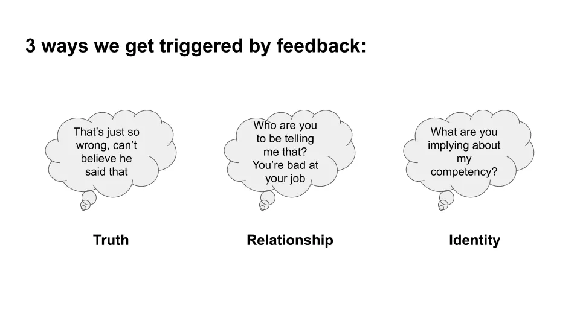
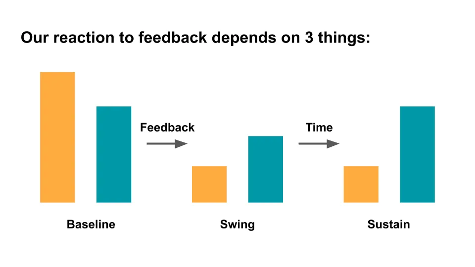
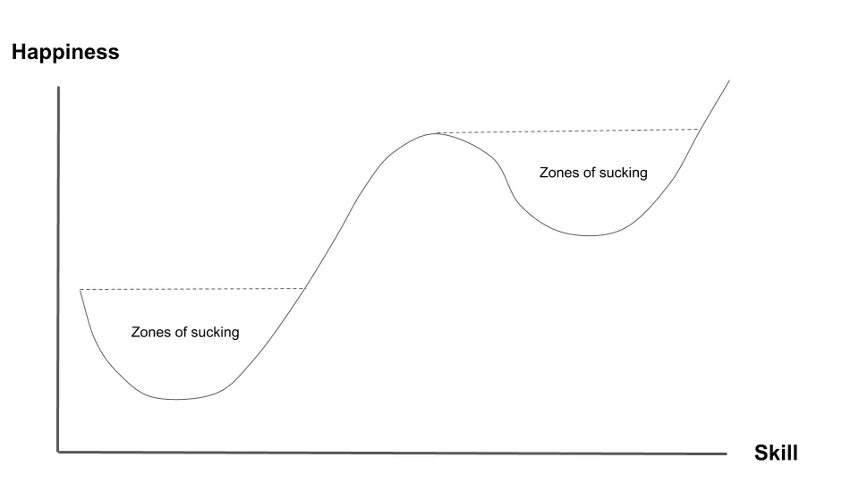

## 주요 내용

- 우리는 종종 피드백에 의해 불리하게 반응할 수 있습니다
- 주요 피드백 유형을 알면 대화가 더 생산적으로 나아질 것입니다
- 오해는 대화 중에 항상 발생하며\, 우리는 그 순간에 오해가 일어나고 있음을 인지해야 합니다
- 피드백에 대비하려면 준비에 대한 노력이 필요합니다
- 우리는 자신에게 좀 더 친절해야 합니다
- 피드백 후 행동하는 것이 핵심입니다

방학 동안 나는 책을 읽었다 [Thanks for the Feedback](https://www.npr.org/books/titles/441536239/thanks-for-the-feedback-the-science-and-art-of-receiving-feedback-well-even-when 'Thanks') 더글라스 스톤과 실라 힌이 쓴 책으로\, 지난 1년간 읽은 책 중 가장 좋은 책 중 하나라고 생각했습니다\. 이 책은 다음과 같이 이야기합니다\. **피드백 세션에서 피드백의 유형과 흔한 문제를 설명하여 피드백 대화를 더 생산적으로 만드는 방법\.**

아래에 책을 요약하고 제 생각도 덧붙였습니다\. 참고\: 많은 요점이 책에서 인용한 내용일 것입니다\.

### 우리는 종종 피드백에 의해 불리하게 반응할 수 있습니다

- 피드백을 들을 때 반응을 일으키는 세 가지 다른 피드백 트리거가 있습니다
  - **진실 유발 요인** 피드백의 내용 때문에 방해받는다\; 도움이 되지 않거나 그냥 잘못된 느낌이다
  - **관계 유발 요인** 피드백을 주는 사람이 우리가 그 사람을 어떻게 인식하고 대우받고 있다고 느끼는지에 따라 반응이 나타난다
  - **정체성 트리거** 어떤 것에 의해 우리의 정체성에 위협을 느끼게 됩니다
  - 이 모든 것은 합리적입니다\. 우리가 유발하는 반응은 불합리해서 장애물이 되는 것이 아니라\, 대화에 참여하는 것을 방해하기 때문입니다\.
  - 피드백을 더 잘 받아들이는 것이 반드시 그 피드백을 절대적인 진실로 받아들여야 한다는 뜻은 아닙니다

_LL\: 저는 트리거가 되었을 때 피드백을 받아들이지 않았어요\. 그게 저에게 불리한 영향을 준 적은 없어요\. 그 사람이 마음에 들지 않는다고 해서 피드백이 부정확하다는 뜻은 아니에요\. 왜 이런 일이 일어나는지 인지하고 인지하는 법을 배우는 것이 저 자신이 더 나아지는 첫걸음이에요\._

### 주요 피드백 유형을 알면 대화가 더 생산적으로 나아질 것입니다

- 피드백은 세 가지 유형으로 나뉩니다
  - 감사와 감사를 전합니다
  - 더 나은 방법으로 과제를 수행할 수 있도록 코칭해 줍니다
  - 자신의 위치에 대한 평가 [^1]
  - 세 가지 모두 필요하지만\, 원하는 것과 다른 종류를 자주 얻는 경우가 많습니다

_LL\: 저는 직장에서 코칭이나 평가를 받는 걸 훨씬 선호하지만\, 분명 모두에게 해당되는 건 아니에요\. 이런 점이 사람들이 왜 과소평가되거나 오해받는다고 느끼는지 많은 부분을 설명해줍니다\. 이건 저에게 [Five Love Languages framework](https://www.5lovelanguages.com/ 'Five')\. 저는 직장에서 인정하기보다는 코칭과 평가를 명확히 요청하기 시작했습니다\._

- 피드백은 종종 라벨 형태로 도착합니다\. 예를 들어\, \'더 자신감을 가져야 한다\'
  - 이로 인해 의도된 것과 들었던 것 사이에 차이가 생깁니다\. 예를 들어\, 모른다고 자신 있게 말하는 것과 실제로 모르는 것처럼 보이는 것 같은 인상을 주는 것
  - 이 차이를 줄이려면 피드백이 어디에 있는지 파악하세요
  - 1. 데이터와 해석에 근거해
    - 무엇이 다른지 물어보세요 1\) 데이터와 2\) 해석에 대해
  - 2. 피드백이 어디로 향하는지\, 그들이 무엇을 기대하는지
    - 코칭을 받을 때는 조언을 명확히 하세요
    - 평가를 받을 때는 그 결과를 명확히 하세요
  - 피드백의 어떤 점이 옳을 수 있는지 물어보세요

_LL\: 저는 피드백이 주어질 때마다 예시를 요청하는 것을 항상 선호했고\, 이제는 해석 부분도 명확히 다시 확인할 예정입니다\. 효과적인 회의를 주선하는 것처럼\, 피드백 대화 후 기대치가 같은 방향인지 확인하는 것이 핵심입니다\._

### 오해는 대화 중에 항상 발생하며\, 우리는 그 순간에 오해가 일어나고 있음을 인지해야 합니다

- 우리 자신을 인식하는 것과 타인이 우리를 인식하는 방식 사이에는 간극이 있습니다 [^2]\. 이 부분은 어떻게 영향을 받는지에 따라 달라집니다
  - 우리는 순간의 감정을 무시하지만\, 다른 사람들이 우리를 그렇게 보고 생각하는 것입니다\. 예를 들어\, 우리가 어떤 제안에 화를 내면 그것이 한 번뿐인 일로 생각하지만\, 다른 사람들은 그것이 대표적이라고 생각합니다
  - 우리는 상황에 대해 여러 가지를 탓하지만\, 다른 사람들은 그것을 우리의 성격 탓으로 돌립니다
  - 우리는 의도로 스스로를 판단하지만\, 다른 사람들은 결과로 우리를 판단합니다

_LL\: 행동금융에 대해 읽어본 분들께는 익숙할 것입니다\. [Kahneman's work there](https://en.wikipedia.org/wiki/Thinking,_Fast_and_Slow 'Thinking')\. 단순한 결론은 우리가 항상 모든 것에 대해 틀렸다는 것입니다\, 특히 우리 자신에 대해서는\._

- 피드백을 받는 사람이 트리거되어 주제를 바꿀 때 대화가 \'스위치트랙\'될 수 있습니다
  - 잠재적 긍정적 영향은 다른 주제도 중요할 수 있다는 점입니다
  - 부정적인 영향은 두 가지 주제가 얽히는 것인데\, 우리가 두 가지 주제가 있다는 사실을 깨닫지 못해 더 악화됩니다
  - 두 개의 주제가 동시에 진행 중임을 깨달았을 때\, 명확히 지적하고 앞으로 나아갈 방안을 제안하세요\. 예를 들어\, 두 개의 관련 있지만 별개의 주제가 있으니 각각을 따로따로\, 완전히 논의해 봅시다

_LL\: 이런 게 있다는 걸 몰랐는데\, 이제 언급을 듣고 나니 정말 이해가 돼요\. 과거 대화에서 그런 예시를 많이 보게 되더라고요\. 다시 한 번 명확히 지적하는 게 해결책이라는 점을 기억하세요\. 불편하겠지만 더 효과적인 상황을 만들어 줄 거예요\._

- 피드백을 더 큰 관점에서 바라보세요
  - 너와 나 사이에 차이가 생기는 거야\?
  - 서로 다른 역할들이 문제를 일으키고 있나요\?
  - 프로세스\, 정책\, 아니면 다른 무언가가 문제를 일으키는 걸까요\?

_LL\: 당신과 당신의 숙적 모두 유능할 수는 있지만\, 조직 내 인센티브 구조 때문에 업무 관계가 좋지 않을 수 있습니다\._

### 피드백에 대비하려면 준비에 대한 노력이 필요합니다

- 피드백에 어떻게 반응하는지는 세 가지에 달려 있습니다\:
  - 행복과 만족도의 기본 상태\, 예를 들어 행복도가 높은 사람들이 낮은 기준선을 가진 사람들보다 긍정적인 피드백에 더 긍정적으로 반응합니다
  - 피드백을 받을 때 기준선에서 얼마나 스윙하는지\, 예를 들어 스윙이 많을수록 부정적인 피드백에 더 민감해진다는 뜻입니다
  - 기본 상태로 돌아가는 데 걸리는 시간은요

- 피드백에 더 잘 대비할 수 있는 몇 가지 방법은 다음과 같습니다\:
  - 미리 생각해보고\, 자신을 점검하며\, 발병할 때는 속도를 늦추세요
  - 순간의 감정\, 자신에 대해 이야기하는 것\, 그리고 실제 피드백을 구분하세요
  - 피드백은 무엇에 관한 것인지에 대해 담아두고\, 무엇에 관한 것인지 이해하세요
  - 다른 사람\, 미래\, 혹은 좀 더 유머러스한 관점으로 관점을 바꿔보세요
  - 다른 사람들이 당신을 어떻게 보는지 통제할 수 없다는 것을 받아들이세요 [^3]
- 우리는 피드백을 통제할 수 없지만\, 다음과 같은 방식으로 피드백을 받는 방식을 개선할 수 있습니다\:
  - 단순한 꼬리표에서 벗어나 복잡성을 받아들이는 방향으로 나아가고 있습니다
  - 고정된 사고방식에서 성장 마인드셋으로 나아가기

_LL\: 피드백 제공자의 선의를 가정할 때 [^4]그들은 실제로 우리가 더 나아지도록 돕고 싶어 합니다\. 그렇지 않다면\, 무엇을 바꿔야 할지 말할 시간을 들이지 않을 것입니다\. 그리고 우리는 더 나은 방향으로 변할 수 있습니다\._

### 우리는 자신에게 좀 더 친절해야 합니다

- 우리는 자신에 대해 세 가지를 받아들여야 합니다\:
  - 우리는 실수를 할 것이다
  - 우리는 복잡한 의도를 가지고 있습니다
  - 우리는 문제에 일조해 왔습니다

- 자신의 책임을 지되\, 모든 책임을 부인하거나 모든 책임을 떠안는 극단적인 행동은 하지 마세요

_LL\: 저는 전에 극단적인 상황을 겪어본 적이 있어요\. 책임을 회피하거나 지나치게 자책하는 경우요\. 둘 다 생산적이지 않고 오히려 당신을 더 나쁘게 보이게 만듭니다\._

- 첫 번째 점수나 피드백을 얼마나 잘 처리했는지에 따라 두 번째 점수를 스스로 부여하세요

_LL\: 저는 이 두 번째 점수 개념이 마음에 들어요\; 몇 번 넘어지는 게 아니라 몇 번 일어나느냐가 중요하다는 오래된 클리셰와 관련이 있어요\. 진부하다고 해서 나쁜 건 아니에요\. 앞으로 실패에 대해 더 쓸 것 같지만\, 실패는 학습의 핵심이에요\. 그 말은 우리가 나쁜 피드백을 받을 것이고\, 그것을 다루는 법을 배워야 한다는 뜻이에요\._

- 경계를 세우고 피드백을 거절할 수 있는 능력은 건강한 관계에 매우 중요합니다\. 여기에는 다음이 포함됩니다\:
  - 고맙다고 말하고 아니라고 말하는 것\, 예를 들어 기쁘다고 말하는 것\, 받아들이지 않을 수도 있어요
  - 지금은 아니라고 말하는 것\, 예를 들어 지금은 너무 민감한 문제입니다\.
  - 어떤 피드백도 거절하는 것

_LL\: 이건 저에게 새롭지만 중요해요\. 누군가에게서 피드백을 받는 게 부담스러울 수 있어요\. 상대방이 진심으로 당신의 최선의 이익을 생각한다면\, 당신이 공간이 필요하다는 걸 이해할 거예요\. 누군가가 자신의 관점을 받아들이도록 강요할 때\, 보통 그 사람이 자기 의도를 가지고 있다는 걸 알 수 있어요\._

### 피드백 후 행동하는 것이 핵심입니다

- 피드백 대화는 세 부분으로 구성됩니다\:
  - 오픈\: 대화의 목적이 무엇인지\, 어떤 피드백인지\, 최종적인지\?
  - 본문\: 경청\, 주장\, 대화 과정 관리\, 문제 해결
    - 경청하기\: 명확한 질문을 던지고\, 그들의 감정을 인정하기
    - 주장하기\: 대립하지 않고 당당히 당당히 말하기 [^5]
    - 관리\: 토론을 관찰하고\, 어디서 잘못됐는지 진단한 뒤\, 명확히 개입해 바로잡으세요
    - 문제 해결\: 이제 이 피드백에 대해 어떻게 해야 할까요\?
  - 마무리\: 현재 상황과 앞으로 무엇을 해야 할지 명확히 하기

- 행동에 나서는 몇 가지 방법\:
  - \'내가 하는 일 중에 내 길을 막는 게 뭐가 있을까\?\'라고 물어보세요\.
  - \'내가 할 수 있는 한 가지 중에 당신에게 도움이 되는 일이 무엇일까요\?\'라고 물어보세요\.
  - 작고 위험이 낮은 실험을 시도해 보세요
  - 사람들을 받아들이고 도움을 요청하는 것이 친밀감이 자라는 과정입니다
- J 곡선을 이해하세요\: 습관을 바꿀 때마다 나아지기 전에 더 나빠질 가능성이 큽니다\. 더 중요한 것은\, 나아지기 전에 더 나빠질 것입니다

\_LL\: [Waitbutwhy](https://waitbutwhy.com/2018/04/picking-career.html 'wait') 또한 새로운 것을 배우는 것이 어렵다는 글도 썼는데\, 바로 그 초기 변화가 고통스럽고 보람이 없기 때문이에요\. 첫 정점을 넘기 전까지는 한동안 힘들 거예요\. 저는 학습을 연속적인 곡선\(J 또는 S\, 마음에 드는 모양\)으로 생각해요\. 즉\, 더 나아지려면 계속 불편하고 힘들게 만들어야 한다는 뜻이죠\. \_

- 변할 수 없다면\, 다른 사람들에게 미치는 영향을 줄이기 위해 노력하세요
  - 그들에게 어떤 영향을 미치는지 물어보세요
  - 변하지 않은 당신을 다루도록 코치하세요
  - 팀으로 문제를 해결해 보세요

_LL\: 우리 자신에 대해 바꿀 수 없는 것들이 있어요\. 제가 잔뜩 발라붙는 걸 막을 수는 없어요 [ridiculous amounts of butter at every dinner](https://www.thecitycook.com/articles/2015-10-12-bordier-butter 'butter')\. 저자들이 괜찮다고 생각하지만\, \\\*당신이 다른 사람들에게 미치는 부정적인 영향을 줄여야 해요\\\* 무례하게 굴지 마세요\._

- 조직의 맥락에서\, 피드백을 제공하는 데 도움이 될 수 있는 몇 가지 사항을 소개합니다\:
  - 이점뿐만 아니라 트레이드오프도 설명하세요
  - 별도의 감상\, 코칭\, 평가
  - 조직 내 학습 촉진

LL\: 아직 깊이 살펴보진 않았지만\, 저자들이 피드백을 더 효과적으로 제공하는 방법에 대해 더 많이 썼기를 바랍니다\. 학습 문화를 촉진하는 기업의 사례를 드물게 본 적이 있는데\, Stripe가 그 예외 중 하나인데\, 그래서 좋은 평가를 받는 것일 수도 있습니다\.

**전반적으로 이 책은 훌륭했고 그만한 가치가 있다고 생각했습니다\.** 명확하게 쓰여 있고\, 더 쉽게 둘러볼 수 있도록 요약 섹션도 포함되어 있습니다\. 읽기 편이고\, 특히 연례 리뷰 시기를 앞두고 있으니 꼭 한 번 읽어보시길 권합니다\.

[^1]: 모든 코칭에는 평가도 포함되어 있으며\, 종종 오해받을 수 있습니다\. 평가는 다른 유형의 피드백을 압도할 수 있습니다

[^2]: 저자들은 간극 지도에 대해 이야기합니다\. **내 생각과 감정** 로 **내 의도** 로 **내 행동** 로 **다른 사람들에게 끼친 영향** 로 **다른 사람들이 나에 대해 들려준 이야기들**

[^3]: 그들이 하는 모든 말을 그대로 받아들이지 마세요\. 그들의 의견을 하나의 입력으로 받아들이세요

[^4]: 예전에도 악의적인 피드백이나 앙심 가득한 피드백을 받은 적이 분명히 있습니다\. 어렵겠지만\, 앞으로 나아가는 최선의 방법은 그냥 무시하는 것 같습니다\.

[^5]: 피드백을 받는 맥락에서 자기주장에 대해 이야기하는 것은 역설적으로 들릴 수 있지만\, 피드백은 일방적인 활동이 아닙니다\. 당신의 관점이 없으면 주는 사람은 자신이 하는 말이 유용한지\, 옳은지\, 당신의 생각과 일치하는지 알지 못할 것입니다
