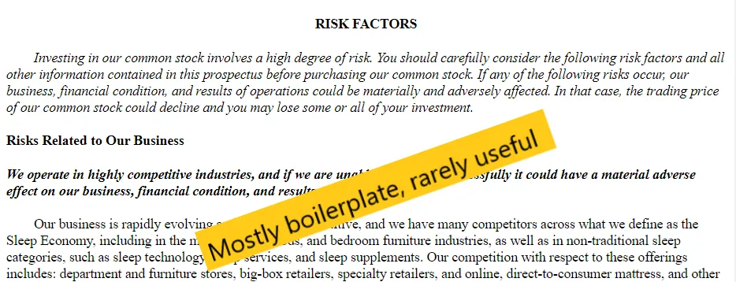
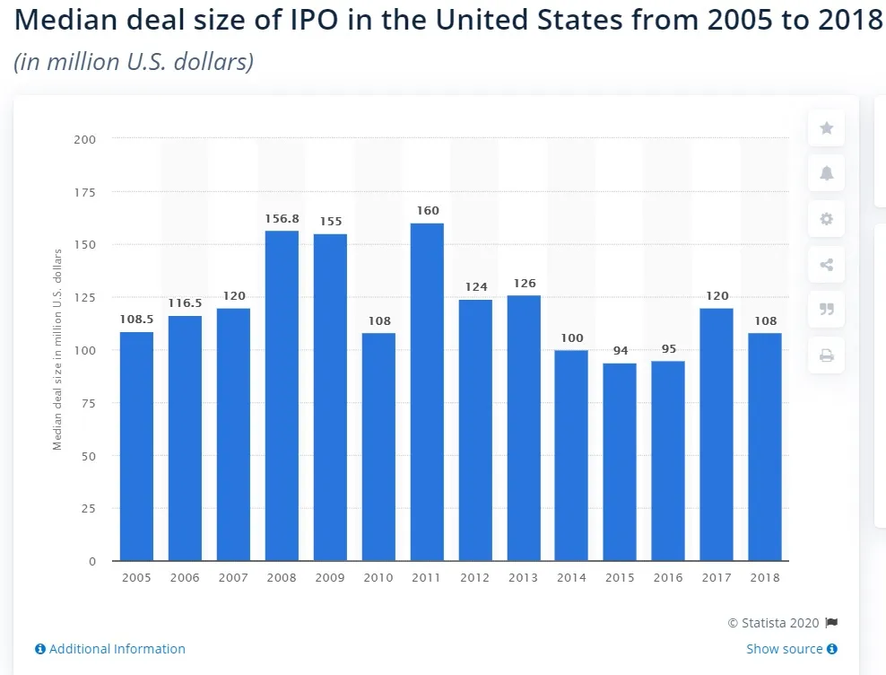

## 주요 내용

직접 상장을 해야 하는지는 회사 유형에 따라 다릅니다

## IPO 대 직접 상장

[Aswath Damodaran](https://twitter.com/AswathDamodaran?ref_src=twsrc%5Egoogle%7Ctwcamp%5Eserp%7Ctwgr%5Eauthor 'Aswath')최고의 금융 교수 중 한 명이십니다 [^1]\, [wrote about IPOs vs direct listings a while ago](http://aswathdamodaran.blogspot.com/2019/10/disrupting-ipo-process-challenging.html? 'Aswath')\. 아래에서 주요 내용을 검토하겠습니다\; 은행 출신 동료들은 자유롭게 동의하지 않아도 됩니다\. 직접 상장에 익숙하지 않으시다면\, [a16z has a primer.](https://a16z.com/2019/07/02/direct-listings/ 'a16z')

> 하지만 가장 큰 차이점은 \\\[직접 상장\\\] 공개일에 신규 자본을 조달할 수 없다는 점입니다 \\\[\.\.\.\\\] 생각만큼 큰 문제는 아닙니다\. 회사는 투자자들로부터 사전 상장 라운드에서 현금을 조달하거나\, 이후 몇 달 동안 2차 공개를 할 수 있기 때문입니다

새로운 자본을 조달할 수 없는 점은 현재로서는 여전히 사실입니다\. [after the SEC rejected a proposal to allow it](https://www.cnbc.com/2019/12/06/nyse-proposal-to-allow-fundraising-in-direct-listings-rejected-by-sec.html 'CNBC')\. Aswath가 지적했듯이\, 이는 결정적인 문제가 아닙니다\. 기업들은 매물 전후로 인출을 할 수 있기 때문입니다\.

아스와스는 은행들이 IPO를 관리하는 것과 은행의 개입이 적은 직접 상장을 하는 것의 찬반 입장을 설명합니다 [^2]\:

> **타이밍\:** 은행들은 그들의 경험과 관계가 IPO에 가장 적합한 시기에 대한 통찰을 제공한다고 주장합니다

> 다모다란은 2019년 말처럼 모멘텀이 급격히 바뀌는 상황에서 볼 수 있듯이\, 아무도 시장 타이밍을 제대로 맞출 수 없다고 주장합니다

저는 이 부분에서 다모다란 쪽에 더 기울고 있습니다\. 은행 입장에서는 투자자들과 중개인으로서 투자자들의 감정에 대한 피드백을 정기적으로 받습니다\. 하지만 실제로 주가를 가격에 올려보기 전까지는 확실히 말할 수 없습니다\.

> **투자설명서 전문성\:** 은행들은 자신들의 경험이 제출 서류 작성에 도움이 될 수 있다고 주장합니다

> 다모다란은 대부분의 투자설명서가 특히 위험과 사업 부문에서 비슷하게 보인다고 주장합니다\.

다모다란 의견에 동의하지만\, 그가 암시한 대로 대부분은 법적 이유 때문이라고 합니다\. 투자설명서의 위험 섹션은 법적 보호를 위한 것이지\, 중요한 것을 알려주기보다는 더 중요합니다 [^3]\. 전 동료들은 회사 섹션 초안을 많이 작성했지만\, **여기서 큰 가치를 더하기는 어렵습니다** \(죄송합니다 여러분\)\, 특히 회사가 상장할 때 전직 은행가들로 가득하다면요\.

> **IPO 가격 책정\:** 은행들은 지난 사장 라운드와 예정된 공개 가격 사이의 간극을 메우고\, 적절한 비교 가능한 회사 집합을 찾으며\, 적절한 평가 배수를 선택하고\, 투자자들의 우려를 파악할 수 있다고 주장합니다\.

> 다모다란은 은행들이 가격 책정을 제대로 하지 못한다고 주장하는데\, 이는 WeWork IPO에서 볼 수 있습니다\. 이는 은행들이 잘못된 종합 또는 배수를 선택하거나\, 잘못된 투자자와 대화하거나\, 가격 책정 과정에서 편향되어 있기 때문입니다\. 특히 후자가 가장 가능성이 높습니다\.

비교 가능한 회사를 잘못 선택하거나 여러 회사를 선택하는 것은 덜 큰 문제가 됩니다\. 투자 대상 조합은 사전에 투자자들 사이에 사회화되어 있어 보통 광범위한 합의가 있습니다 [^4]\. 일반적인 배수는 몇 가지\(EV\/Rev\, EV\/EBITDA\, P\/E\)뿐이라 배수 유형도 넓게 이해됩니다\.

은행들이 가격 책정 과정에서 편향되어 있다는 점에는 동의하며\, 그럴 인센티브도 있습니다\. As [Matt Levine has written before](https://www.bloomberg.com/opinion/articles/2019-09-09/we-might-not-be-working 'Matt')은행은 회사에 채용되기 위해 홍보하고 있으므로\, 제시된 가격대가 높을수록 좋습니다\. **CEO에게 1억 달러 가치라고 말하면 채용이 더 쉬워요\, 1억 달러 대신에요\.** 그들이 채용되어 그 가격을 충족해야 할 때가 바로 기대치를 관리하기 시작하는 단계입니다\.

회사에 적합한 가격은 어려운 문제이며\, 그 부분은 나중에 다시 다루겠습니다\.

> **마케팅\:** 은행들은 투자자 고객층에 다가가 발행 회사의 투자자 기반을 확장할 수 있다고 주장합니다

> 다모다란은 a\) 일부 기업이 이제 은행보다 더 잘 알려졌고\, b\) 투자자들이 은행의 제안에 더 회의적이라고 주장합니다

첫 번째는 주관적입니다\; 슬랙과 스포티파이는 스스로를 마케팅할 수 있습니다\, [SiTime likely can't](https://www.globenewswire.com/news-release/2019/11/21/1950494/0/en/SiTime-Corporation-Announces-Pricing-of-Initial-Public-Offering.html 'SiTime')\. 덜 알려진 사람이라면 은행이 당신을 마케팅하는 것이 좋은 생각일 것입니다\. 은행들은 투자자와 연결되어 있지만\, 당신은 그렇지 않습니다\.

이 점을 염두에 두고요 [the median IPO offering size is ~$100mm](https://www.statista.com/statistics/251149/median-deal-size-of-ipos-in-the-united-states/ 'Statista')\, 그리고 [IPOs sell ~20% of the company](https://corpgov.law.harvard.edu/2017/05/25/2017-ipo-report/ 'Harvard')대부분의 IPO가 이미 알고 있는 대형 유명 기업은 아니라고 추론할 수 있습니다\. 직접 둘러보실 수 있습니다 [the list of recent IPOs](https://www.nyse.com/ipo-center/recent-ipo 'NYSE') 몇 명인지 알아보는 거야\. **대부분의 기업은 은행이 마케팅하고 투자자와 접촉하는 것이 이익을 얻을 수 있습니다\.**

두 번째 점은 별로 중요하지 않은 것 같습니다\. 전문 투자자\(매수 측\)라면 어차피 주식 조사\(매도 측\) 추천에 따라 결정을 내리는 게 아닙니다\(매도 측 친구들\, 죄송합니다\)\. 개인 투자자라면 그런 정보를 얻지 못합니다\.

> **인수 보증\:** 은행들은 가격 리스크를 감수하고 주식이 특정 가격에 팔릴 수 있다고 주장합니다

> 다모다란은 IPO가 어차피 기업의 가격을 낮추고 있다면\, 낮은 가격을 보장하는 것은 도움이 되지 않는다고 주장합니다

인수 보증은 역사적으로 더 중요했지만 지금은 덜 중요해졌습니다\. 가격 문제로 다시 돌아가겠습니다\.

> **애프터마켓 가격 지원\:** 은행들은 주가 거래가 시작된 직후 가격을 안정시키는 데 도움을 줄 수 있다고 주장합니다

> 다모다란은 대기업 IPO에서는 이것이 어렵거나 불가능하다고 주장합니다

동의합니다 **대규모 IPO에서는 가격 안정이 어렵습니다\.** 위에서 언급한 중간 IPO 발행 규모의 맥락을 고려할 때\, 많은 기업들에게는 여전히 가치가 있다고 생각합니다\. 은행 가격이 안정되는 방법은 할당된 주식보다 더 많이 팔고 회사에 대해 공매도 포지션을 보유하는 것입니다\. 은행은 회사나 공개시장에서 주식을 받아 공도 포지션을 보완하여 개장 전에 가격을 지지합니다 [^5]\.

적절한 가격은 얼마인가요\? 이 질문은 복잡합니다\. IPO의 공통된 특징은 주식이 전문 투자자에게 10달러 같은 가격에 미리 판매되고\, IPO 후에는 프리미엄인 20달러를 받아 공개 시장에서 거래되기 시작하는 것입니다\. 이 말입니다 [IPO pop](https://pitchbook.com/news/articles/understanding-the-ipo-markets-pop-culture 'IPO') 이 책은 다음과 같이 비판받았습니다 [VCs such as Bill Gurley,](https://markets.businessinsider.com/news/stocks/slacks-direct-listing-bill-gurley-says-startups-call-morgan-stanley-2019-6-1028298641 'Bill') 이들은 이 비효율성이 사설 투자자\(빌 같은 VC\)에서 IPO 과정에서 주식을 받은 공공 투자자로 자금을 이전하는 것이라고 말합니다 [^6]\.

가격 책정에 비효율이 있다는 데 동의하지만\, 대부분의 회사는 과도하게 가격을 내서 주가가 하락하기보다는 저평가로 주가가 오르는 것을 선호합니다\. **만약 우리가 은행가들이 저평가 가격을 가졌다고 비난한다면\, 그들이 과대평가된 것도 칭찬해야 합니다** 그리고 회사에 가장 많은 돈을 받는 것\. 이해할 만하게도 그런 사람은 없을 거야\.

기업들은 더 나은 사기를 위해 비효율성을 기꺼이 받아들이는 것 같습니다\. 물론 개가에 20달러를 받고 주가가 정체할 수도 있었지만\, 10달러에서 20달러로 급상승하는 것이 \(비합리적으로\) 사람들을 더 행복하게 만듭니다\. 또한\, 만약 20달러에 시작했다가 3개월 후에 10달러로 내려간다면 어떨까요\? 그때는 적절한 가격이 얼마였을까요\?

다모다란은 IPO 현상 유지가 유지된 이유를 제시하며 다음과 같이 마무리한다 **관성\, 은행 관계에 해를 끼칠까 두려워하는 기업들\, 그리고 누군가를 비난할 기업들이 필요하다는 점입니다\.** 저도 동의합니다\. 결국 회사마다 다릅니다\; 직접 상장이 가격 효율성이 더 높기 때문입니다\. 규모가 크고 잘 알려져 있다면 직접 상장할 수 있을 가능성이 높고\, 이메일 뉴스레터로 조언을 받아서는 안 됩니다\. 작고 작지 않다면\, 은행가들이 투자자와 마케팅을 도와주고 연결해줄 필요가 있을 것입니다\. 3년 후에도 IPO가 상장의 대다수를 차지할 것이라고 80\% 확신합니다\.

## 기타

1. [Could a text prediction algorithm (like gmail or your phone keyboard) be used to play chess?](https://slatestarcodex.com/2020/01/06/a-very-unlikely-chess-game/ 'Slate')
2. [Self-disclosing weakness at work could help or hinder, depending on your status](https://faculty.wharton.upenn.edu/wp-content/uploads/2019/10/when_sharing_hurts.pdf 'Wharton')\. 참고 [here](https://twitter.com/leon_lin_s/status/1221891694964113409?s=20 'twitter') 트윗 요약을 위해
3. [Examples of games made by China tech companies for Chinese new year](https://a16z.com/2020/01/24/tech-and-chinese-new-year/ 'a16z')
4. [How some restaurants PR their way to success and best-of lists](https://ny.eater.com/2020/1/13/21009796/restaurant-publicists-pr-agencies-nyc 'Eater')
5. [How to design complex and aesthetically pleasing mazes](http://www.cgl.uwaterloo.ca/csk/projects/mazes/ 'Mazes')

[^1]: 금융뿐만 아니라 실제로 교육하고 싶다는 마음도 포함됩니다\. 얼마나 많은 교수님들이 돈을 내지 않고 무료로 온라인으로 책을 구하라고 말할까요\?

[^2]: 솔직히 말씀드리자면\, 저는 예전에 IB 보도 애널리스트였고 IPO 업무도 했습니다\. 또한\, 투자은행은 투자와 아무런 관련이 없다는 점을 이미 알고 계셨다면 말씀드리자면\,

[^3]: 기업들은 법적 책임을 줄이기 위해 가능한 모든 위험을 투자 설명서에 쏟아붓도록 유인됩니다\. 그래서 \"우리는 한 번도 이익을 낸 적이 없고 앞으로도 이익을 낼 수 없을 수도 있다\"는 말을 자주 보게 됩니다

[^4]: 이런 식으로 진행됩니다\: 투자자가 은행에 \"어떤 비교 상품을 생각하고 있나요\?\"라고 묻고\, 은행은 \"이 세트\, 이 다른 그룹\, 그리고 저 그룹\"이라고 답할 것입니다\. 투자자는 \"음\, 그 그룹도 포함시켰네요\. 하지만 그 외에는 맞는 것 같네요\. 다른 투자자들은 어떻게 생각하나요\?\"라고 말하고\, 은행은 \"아\, 그들도 누구누구와 비교하고 있어요\"라고 말할 것입니다\.

[^5]: 이것은 처음 도입한 회사의 이름을 따서 그린슈 옵션으로 알려져 있습니다

[^6]: 빌이 편향되어 있을 수 있다는 점을 알 수 있습니다
