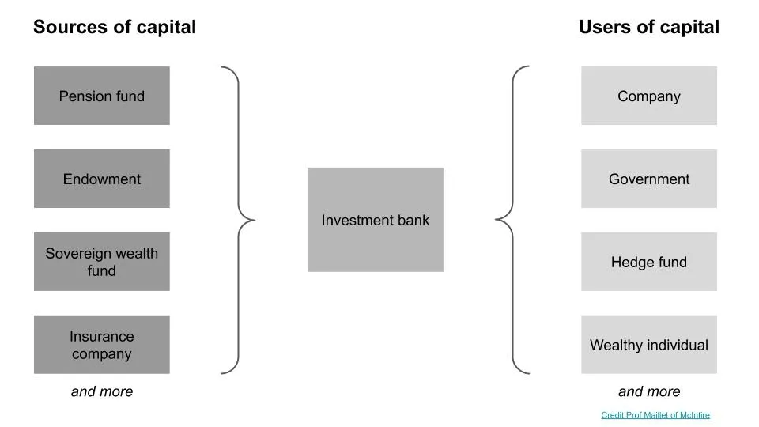

## 주요 정보

로봇이 매도 측 주식 조사에 접근하고 있으며\, 그것이 중요하지 않을 수도 있습니다

---

만약 당신이 생각한다면 **자본의 원천과 사용자 간의 상호작용으로서의 금융\,** 골드만\, 모건 스탠리\, JP 모건과 같은 투자은행들은 중간에 위치해 자금이 있는 사람과 필요한 사람 간의 거래를 촉진합니다\.

은행들은 특정 금융 상품\(주식\, 부채\, M\&A 등\)이나 특정 산업\(소비자\, 의료\, 기술 등\)을 담당하는 은행가들이 있으며\, 그 범위 내에서 기업 금융 거래를 주선합니다\.

이 거래 외에는\, **은행들은 보통 주식 연구 그룹을 두고 있으며\, 이 그룹은 주식에 대한 견해를 발행합니다** 회사 조사와 경영진과의 관계를 유지하는 데 기반합니다\. 이것들은 뉴스에서 보도되는 \'매수\/보유\/매도\' 권고사항이나 가격 목표입니다\. 참고로 이들은 권고사항이며\, 연구 그룹은 회사 내 포지션을 취하지 않으므로 전문 투자자와 구별됩니다 [^1]\.

주식 리서치는 전문 투자자들에게 판매되고\, 이론적으로는 투자자들이 그 정보를 활용해 투자 결정을 내립니다\. 하지만 이 투자자들은 자체 조사를 하기 때문에 은행 리서치에서 얼마나 많은 정보를 반영하는지는 불확실합니다\. 중요한 점은\, 이들은 추천의 정확성에 따라 주식 리서치를 지불하지 않고\, 은행을 통한 거래 수수료를 통해 간접적으로 지급한다는 것입니다\.

**따라서 투자자들이 무엇을 위해 비용을 지불하는지는 열린 질문입니다\: 1\) 연구\, 2\) 회사와의 관계\, 3\) 투자 추천 [^2]\.** 제 셀사이드\(리서치\) 친구들은 모두 그렇다고 주장할 것이고\, 바이사이드\(투자자\) 친구들은 \(2\)라고 할 것이며\, 개인 투자자 친구들은 \(1\)와 \(2\)가 제공되지 않기 때문에 \(3\)이라고 할 것입니다\.

가장 큰 부가가치가 \(3\)에서 온다고 가정하면\, [this paper by Braiden Coleman, Kenneth Merkley, Joseph Pacelli on computer programmed equity research](https://papers.ssrn.com/sol3/papers.cfm?abstract_id=3514879 'Robots') 흥미로울 것 같아요\. **그들은 자동화된 연구 분석을 수행하는 인간 분석가 지원 컴퓨터 프로그램인 \'로보 분석가\'가 인간 연구 분석가와 어떻게 경쟁하는지 연구합니다** 두 기관의 권고사항 차이를 분석함으로써

팀은 로보를 사용하는 기업들을 선정하고\, 그들로부터 주식 추천을 수집했습니다 [^3]그리고 편향\, 빈도\, 초과 성과에 관한 세 가지 가설을 검증합니다\. 이 세 가지 모두 일치하는 결과를 찾았고\, 차례로 살펴보겠습니다\:

> 첫째\, 로보 분석가는 인간 분석가보다 매수\, 보유\, 매도 권고를 더 균형 있게 분배합니다\. 이는 행동 편향과 이해 충돌에 덜 영향을 받기 때문입니다

첫 번째는 로보가 이해 충돌이 있는 인간 분석가보다 편향이 적다는 것입니다\. 그 결과\, 로봇은 추천 분포가 더 \"자연스러운\" 주식을 추천하며\, 모든 주식이 \"매도\"가 없는 \"매수\"가 아닙니다\. 이러한 이해 상충은 \"투자은행 업무 확보나 경영진의 호의를 얻기 위한 경제적 인센티브와 관련되어 있습니다\.\"

[Sarbanes-Oxley was intended to reduce such conflicts of interest,](https://www.sec.gov/news/speech/spch012803cag.htm 'Sarbox') 투자은행가\(금융 거래\)와 주식 연구 그룹 간의 접촉을 제한함으로써 [^4]\. 제한적 접촉이 성공적으로 이루어졌다고 가정하더라도\, 애널리스트에게는 긍정적인 회사 보고서를 게시할 유인이 있습니다\. CEO로서 여러 애널리스트로부터 주식에 대해 \'매수\'와 \'매도\' 평가를 받았다면\, 누구와 더 친하게 지낼 가능성이 높나요\?

> 둘째\, \\\.\.\.\\\] 로보 분석가는 인간 분석가보다 권고사항을 더 자주 수정하고\, 다양한 생산 공정을 채택합니다

두 번째는 로보가 인간보다 더 자주\, 그리고 다른 데이터를 사용해 입력을 더 자주 업데이트하기 때문에 권고안도 더 자주 업데이트한다는 것입니다\. 이를 이해하려면 기업들이 재무 정보를 어떻게 공개하는지 이해해야 합니다\. 미국에서는 기업들이 한 개의 대형 연례 보고서\(10\,000개\)와 세 개의 작은 분기별 보고서\(10분기\)를 발표합니다\. 이와 더불어\, 이들은 이 보고서들\(8\,000달러\)에 앞서 실적 발표를 하며\, 분기 실적을 포함하고 추가 정보를 포함할 수 있습니다\.

**투자자들은 보통 8K에 거래하는데\, 그 정보는 10분기 이전에 나오기 때문입니다\.** 마찬가지로\, 인간 분석가들도 8K에 대응해 보고서를 업데이트합니다\. 반면 로보들은 10Q와 10K에 더 많은 관심을 기울이며\, 그 이후에 업데이트할 가능성이 더 높습니다\.

이 두 번째 발견이 흥미로운지는 투자자 유형에 따라 다릅니다\. 많은 투자자들이 실적 발표\(8K\) 사이에 거래합니다\. 투자의 절반은 기대치에 달려 있고\, 이 투자자들이 알고 싶어 하는 정보 대부분이 이미 8K에 포함되어 있기 때문에\, 8K 이후에는 추천이 적고 10Q 이후에는 더 많은 추천을 받는 것이 덜 도움이 됩니다\. 8K에 따라 가격이 변동하기 때문에 더 자세한 10Q가 나올 때까지 기다리기보다는 가능한 빨리 아는 것이 좋습니다\.

> 셋째\, 로보 애널리스트의 매수 추천에 따라 구성된 포트폴리오가 인간 애널리스트보다 더 좋은 성과를 내는 것으로 보이며\, 이는 그들의 매수 콜이 더 수익성이 높다는 것을 시사합니다

세 번째 발견은 논문의 \"그래서 뭐\"로\, 다음과 같이 말합니다 **위 두 가지 발견은 인간 분석가보다 로보를 추적할 때 더 나은 수익을 얻기 때문에 중요합니다\.** 이런 현상은 \'매수\' 추천에서는 일어나지만 \'매도\'에서는 그렇지 않으며\, 인간이 \'매수\'를 덜 하향 조정하고 로보가 과도하게 보정하며 너무 많은 \'매도\'를 내놓기 때문이라고 믿고 있습니다\.

그들의 방법론에 대해 한 가지 이민이 있는데\, 이는 각주에 적겠습니다 [^5]\. 전반적으로\, 많은 개인 투자자들이 주가 추천하는 것이 중요하다고 생각한다면\, **이 논문은 편향이 적고 더 자주 업데이트하며 성과를 초과할 수 있는 로보 애널리스트도 팔로우해야 한다고 주장합니다\.**

이것이 주식 연구 산업에 어떤 의미를 가지는지는 그들의 서비스 구매자에게 어떤 부가가치를 제공하는지에 따라 다릅니다\. 만약 \(1\) 또는 \(3\)라면 이 논문은 나쁜 소식이지만\, \(2\)라면 덜 좋겠습니다\. 저는 로보가 증가할 것이라고 60\% 확신하며\, 대부분의 연구 분석가에게는 여전히 큰 영향이 없을 것입니다\.

## 기타

1. [Is the momentum factor in stocks explained by randomness?](https://breakingthemarket.com/randomness-in-momentum-everywhere/ 'Random')
2. [The 4 major parts of shipping and maintaining a software application, and the products, methods, and services developers use](https://technically.dev/posts/what-your-developers-are-using.html 'dev')
3. [Buying your way into nobility](https://www.bloomberg.com/news/articles/2020-02-02/even-if-you-weren-t-born-into-nobility-you-can-buy-your-way-in 'Nobility')
4. ["Romeo and Juliet is not a love story. It is a six-day relationship between adolescents and an infatuation that leads to a tribal war."](https://aeon.co/essays/how-emotionally-focused-couple-therapy-can-help-love-last? 'EFT')
5. [Interactive documentary of Jheronimus Bosch's artwork "the Garden of Earthly Delights"](https://archief.ntr.nl/tuinderlusten/en.html# 'Art')

[^1]: 기업의 컴플라이언스 정책에 따라 주식 연구 애널리스트 본인이 직책을 가질 수도 있지만\, 그럴 가능성은 매우 낮고 실제로 금지될 수도 있다고 생각합니다\. 혼란스럽게도\, 은행 전체가 자산 관리 그룹을 통해 직책을 두고 있을 가능성이 높으며\, 자산 관리 그룹은 주식 리서치와는 별개의 사업 분야입니다\.

[^2]: MiFID의 새로운 규제로 주식 리서치 인센티브 구조도 변화하고 있으며\, 이로 인해 은행들의 행동에도 변화가 일어났습니다\. 또한\, 주식 리서치 분석가들이 자신의 일을 못한다고 주장하는 것은 아닙니다\; 메리 미커\(Mary Meeker\) 같은 일부 인물들은 리서치 애널리스트로서 훌륭한 성과를 내어 명성을 얻었습니다

[^3]: 그들은 권고안에 초점을 맞췄습니다\. \"이는 로보 애널리스트 회사들 전반에서 가장 자주 보고되는 산출물이며\, 개인 투자자들이 가장 집중하는 산출물이기도 하기 때문이다\"

[^4]: 또한 \"연구 보고서에는 분석가의 권고와 비교해 주식의 과거 변동을 추적하는 가격 차트를 포함해야 한다\"는 규칙도 포함되어 있었습니다\. 제가 은행에 있을 때 회사 경영을 위한 자료를 작성할 때 그 페이지를 삭제했고\, 매수측에서는 주의를 기울이지 않았던 점을 고려하면\, 선의의 규제가 실제로 얼마나 효과적이었는지 의문이 듭니다

[^5]: 추천이 발행된 후 \"다음 날 거래 종료 시점에 해당 주식들을 해당 포트폴리오에 추가\"하는 방식으로 포트폴리오를 구성합니다\. 즉\, 로보가 추천을 하고\, 거래일이 있으며\, 거래 당일 후 종가에 주식을 넣는 것입니다\. 권고에 따라 가격이 이미 영향을 받지 않았을까요\? 그렇지 않다면\, 모멘텀이 얼마나 되는지 궁금합니다
