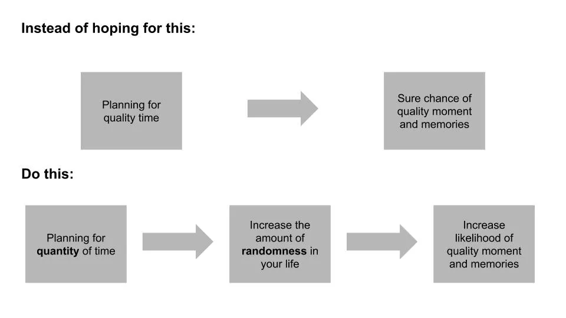

[About Time](<https://en.wikipedia.org/wiki/About_Time_(2013_film)> 'About') 내가 가장 좋아하는 영화 중 하나이며\, 레이첼 맥아담스가 또 다른 시간 여행 영화에 출연하기 때문만은 아니다 [^1]\. 영화 마지막에 머릿속에 강하게 전달되는 메시지 중 하나는 인생의 모든 순간을 소중히 여기라는 것이다\. 비록 로맨틱 코미디에서 나온 것이지만\, 나는 이 말이 사실 중요한 교훈이라고 믿는다\.

만약 우리가 매 순간을 소중히 여겨야 한다면\, 그렇다면 질 좋은 시간이라는 개념은 어떻게 해야 할까요\? [Ryan Holiday recently wrote about how he disagrees with the concept entirely:](https://forge.medium.com/theres-no-such-thing-as-quality-time-58db618c099d 'Ryan')

> 우리가 아무렇지 않게 던지는 말 중 하나예요\: \"더 많은 \'질 좋은 시간\'을 보내고 싶다\"

> 우리 뇌의 완벽주의적 면은 모든 것이 특별하고\, \'옳았다\'고 원합니다\. 하지만 그것은 우리가 항상 그 이상에 부응할 수 있는 것은 아닙니다

> 결과는\? 피할 수 없는 실망감

> 그 이유는 \'질 좋은 시간\'이라는 것이 존재하지 않기 때문입니다\.

질 좋은 시간은 오래전부터 존재해 온 개념이며\, 시간이 지날수록 관심이 높아지고 있습니다\.

그건 [even one of the love languages.](https://www.5lovelanguages.com/ 'love')

이것이 우리가 존재하지 않는 무언가를 쫓으려 집단적 망상 속에 살고 있다는 뜻일까\? 라이언은 제리 사인펠드를 인용하며 그렇게 생각한다\:

> \"나는 평범한 것과 평범한 것을 믿는다\. \'질 좋은 시간\'을 말하는 사람들 — 그들이 \'우리는 질 좋은 시간이 있다\'고 말할 때 항상 조금 슬프게 느껴진다\. 나는 질 좋은 시간을 원하지 않아\. 나는 쓰레기 같은 시간을 원해\. 그게 내가 좋아하는 거야\.\"

저는 라이언과 사인펠드의 의견에 대체로 동의합니다\. **시간을 보내는 것은 고품질의 시간이 될 수 있지만\, 질 좋은 시간 자체를 쫓는 것은 헛된 일입니다\. 이는 1\) 기대와 2\) 무작위성이 복합적으로 작용하기 때문입니다\.**

우리는 소중한 순간과 좋은 추억을 원합니다\. 휴가처럼 그렇게 지정하면 질 좋은 시간을 만들 수 있다고 생각하기 쉽습니다\. 하지만 이는 보통 역효과를 낳습니다\. **우리의 기대치가 현실에 의해 좌절되는 것\.** 휴가가 완벽할 거라고 기대한다면\, 단 한 번의 실수도 경험을 망칩니다\.

반면\, 기대치가 낮을 때는 긍정적인 놀라움을 경험할 가능성이 높으며\, 이는 \'평범한 하루\' 때가 흔한 일입니다\. 완벽을 맞추기 어렵고\, 평범함을 이기기 쉽습니다\. 이 때문에\, **오히려 좋은 순간들은 우연에서 비롯된 것 같아요\.**

만약 질 좋은 시간을 설계할 수 없고 무작위 사건의 문제라면\, 그런 사건이 얼마나 자주 일어나는지 늘려야 한다는 뜻입니다\. 확률을 높일 수는 없지만\, 그런 사건이 일어나는 기간은 늘릴 수 있습니다\. 다르게 말하면\, **시간을 늘리고 싶지\, 질 좋은 시간을 만드는 게 아니에요\.**

라이언은 다른 조언자의 인용을 통해 그 평범한 시간을 찾는 방법에 대해 간접적으로 지속 시간이 핵심임을 암시합니다\:

> \"순간 사이의 순간들을 찾아야 해\.\"

> 때로는 이런 어색하고 중간 순간들이 그렇지 않았다면 절대 일어나지 않았을 대화를 가능하게 합니다\. 심지어 제가 원하지 않는 곳에 갇히거나 하고 싶지 않은 일을 하고 있을 때도 최고의 글쓰기와 생각을 할 수 있었습니다\.

> 바쁘다는 핑계가 다 떨어지면 \\\[\.\.\.\\\] 그냥 눈앞에 있는 것에 만족해야 할 수밖에 없어요

사랑하는 사람들과 가능한 한 많은 시간을 보내고 싶어 하는데\, 그것이 더 많은 무작위 상황을 만들어 기억에 남는 순간이 될 기회를 주기 때문입니다\. 기회가 일어날 시간을 만들지 않으면 원하는 질 높은 관계를 얻기 더 어려워집니다\. **질 좋은 시간이 필요한 게 아니라\, 그냥 시간이 필요해요\.**

가끔은 찾으려고 원하는 걸 찾기 어려울 때가 있어요\.

[^1]: 네\, 비평가들이 엇갈렸다는 건 알고 있어요\. 저한테 싸워보세요\. 레이첼은 타임 트래블러의 아내\(별로\)와 미드나잇 인 파리에도 출연했어요 \(훌륭했고\, \'파리에 있는 미국인\'과 혼동하지 마세요\. 그렇지 않으면 영화 절반을 보면서 뮤지컬 부분이 언제 나올지 궁금해질 거예요\. 물론 저한테는 그런 일이 없었지만요\)
