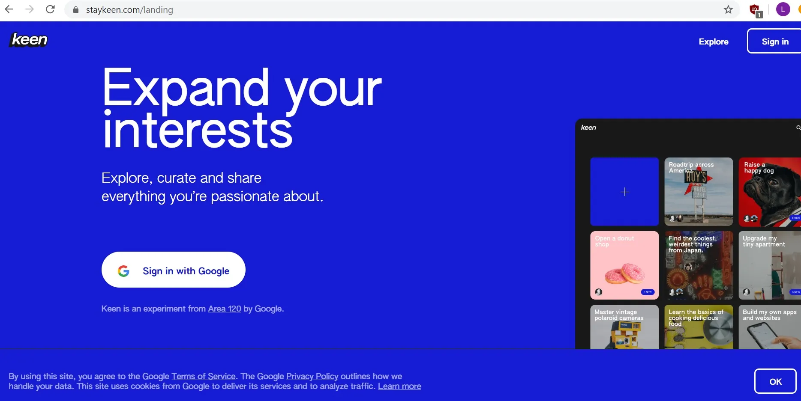
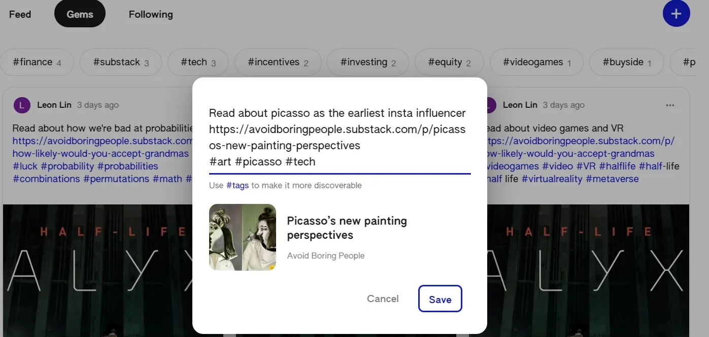
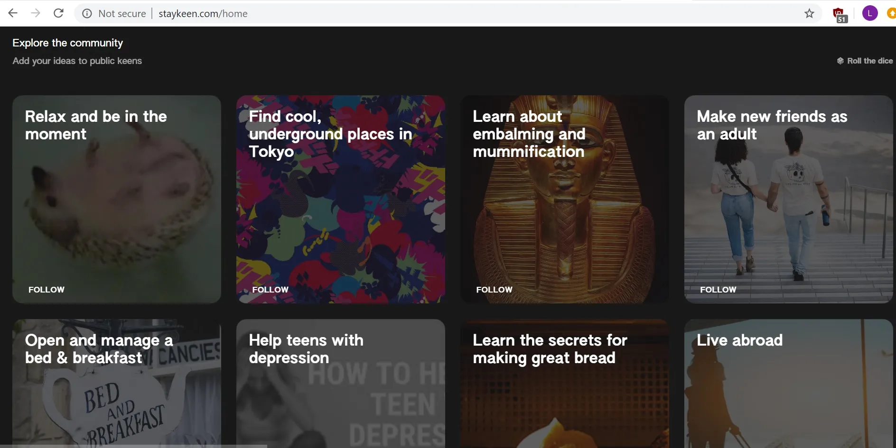

## 주요 정보

Keen은 구글에서 당신의 관심사를 추적하기 위해 만든 새로운 제품이지만\, 이 제품이 더 사회적인지 아이디어 중심인지 확실하지 않습니다

## 예리한 공략

베타 버전을 시도해 보라는 초대를 받았습니다 [Keen](https://staykeen.com/ 'Keen')\, 새로운 제품입니다\. [Area 120, Google's workshop for experimental products](https://area120.google.com/ '120') [^1]\. Keen은 \"관심사를 확장하는 데 도움을 주고\" \"관심사에 집중하고\, 추천을 받으며\, 좋은 아이디어를 큐레이션하는 것\"을 목적으로 합니다\.

제품을 좀 더 자세히 살펴보겠습니다\.

### 가입 및 사용자 흐름

구글 계정이 있고 이미 브라우저에 로그인되어 있다면 가입 절차는 간단합니다\. 구글 계정이 없는 사람들을 위한 옵션은 못했고\, 베타가 끝나면 바뀔 것으로 예상합니다\.

가입 후 첫 번째 화면은 왼쪽에 큰 플러스 기호가 있는 타일 화면입니다\. 다른 타일들은 제가 관심 가질 만한 다양한 주제를 다루고 있는 것 같습니다\. 만약 구글이 당신과 당신의 데이터를 감시하지 않는다는 주장이 있다면\, 이 부분이 맞을 수도 있습니다\. 초기 제안들은 제 관심사와 거의 맞지 않았기 때문입니다\. 아마도 평균적인 미국인이 관심 가질 만한 내용을 미리 채워두는 걸까요\?

플러스 기호와 다른 카드 사이에서 무엇을 먼저 해야 하는지 명확하지 않아서 플러스 기호를 클릭했습니다\.

그래서 \"만들기\" 옵션이 생겨서 제가 하고 싶은 것을 입력할 수 있었습니다\. 그래서 이름이 붙은 것 같아요\. 뉴스레터를 홍보할 기회를 항상 찾고 있기 때문인 것 같아요 [^2]\, 저는 \"글쓰기\"라고 입력했어요\.

하단에 \"새 발견물에 대해 이메일로 보내세요\"라는 옵션도 있었습니다\. 보통은 새 서비스라도 이메일을 더 받고 싶지 않지만\, 이메일 제안이 어떤지 보고 싶어서 체크박스를 그대로 두었습니다\. 이 글을 쓰는 시점까지 아직 이메일을 받지 못했습니다\; 특별히 강조할 만한 내용이 있으면 게시글을 업데이트하겠습니다\.

다음 단계에서는 \"검색 결과가 필요한 검색어나 질문 목록\"이라는 텍스트 박스가 나왔습니다\. 가능한 한 많은 검색어를 넣는 것이 한 문구만 두는 것보다 나은지 확신이 없어서 한 개의 검색어만 입력했습니다\. 긴 구문 목록을 넣는 것보다 더 타겟팅된 결과를 얻을 거라 생각했지만\, 확실하지는 않습니다\.

이 목록에 멤버를 추가할 수도 있어요 \(Keen\?\)\. 멤버들은 Keen에 보석을 추가할 수 있어요\. 친구가 없어서 대부분 격리 중인 사람들처럼 그냥 두었어요\.

그게 이 타일\/카드\/키엔을 만드는 마지막 단계였어요 [^3]\. 결국 핀터레스트를 떠올리게 하는 화면에 도착했어요\. 내비게이션 메뉴에는 \"feed\"\, \"gems\"\, \"팔로잉\" 3개의 항목이 있었어요\. 그 아래에는 메뉴에서 선택한 항목과 페이지가 있었어요\. 아래 스크린샷에서 제가 아직 \"feed\"에 있는 걸 볼 수 있어요\.

사이트에서 이제 제 컬렉션에 보석을 추가하라고 했고\, 제가 좋아하는 것들도 보석으로 넣으라고 했습니다\. 그래서 초기 홈페이지에서 여러 컬렉션을 봤고\, 직접 컬렉션을 만들 수 있게 되었습니다\. 컬렉션 내에는 여러 보석을 보여주는 또 다른 페이지가 있고\, 저희도 보석을 만들 수 있습니다\.

그럼 보석을 만들어 봅시다\. 다시 플러스 기호를 누르자 팝업이 뜨면서 \"새로운 것을 추가하라\"는 안내가 나왔습니다\. UI가 한 줄처럼 보여서 당황스러워서 링크를 추가해야 할지\, 이미지\, 텍스트 본문 또는 다른 것을 추가해야 할지 고민했습니다\. 텍스트를 많이 입력하면 아래로 스크롤되기 시작하지만 오른쪽에 시각적 스크롤 바는 없습니다\. 아마도 디자인 목적일 겁니다\. 텍스트 박스는 최대 4줄까지 스크롤 후 스크롤되며\, 모바일이든 데스크톱이든 이는 포스트 미리보기를 위해 아래에 충분한 여백을 남기기 위한 것 같습니다\.

결국 다른 사람들의 컬렉션을 살펴보다가 다시 돌아왔는데\, 사용자 흐름이 좋지 않은 것 같아요\. 다른 사람들이 하는 걸 바탕으로 제목\, 기사 링크\, 그리고 여러 해시태그를 넣었어요 [^4]\. 줄 나누기를 넣어봤는데\, 보석이 출판될 때는 그런 표시가 나타나지 않는 것 같았어요\.

팝업은 약간의 지연 후에 링크 미리보기를 보여줍니다\. 그 미리보기는 편집할 수 없고\, 박스 내 모든 텍스트를 삭제해도 사라지지 않습니다\. 텍스트를 더 입력하지 않는 한 말이죠\.

저장을 클릭하면 제 보석이 생성되었고\, 내비게이션 메뉴의 \"보석\" 옵션을 클릭하면 제가 만든 모든 보석이 표시되는 것으로 보입니다\. 이것은 Keen이 확인하라고 생각하는 보석들을 \"피드\"와 비교하는 것입니다\. \"팔로잉\" 옵션은 이 컬렉션에 더 많은 검색이나 질문을 추가할 수 있는 옵션을 제공합니다\.

가입부터 컬렉션 생성 단계까지의 흐름이 이렇습니다\. 이제 브루징이 어떻게 작동하는지 살펴보겠습니다\.

### 다른 컬렉션 탐색하기

본인이 아닌 보석이나 컬렉션을 탐색하려면 홈 페이지로 돌아가야 합니다\. 거기서 아래로 스크롤하여 \"커뮤니티 탐색\"과 \"아이디어를 공개 키엔에 추가\"로 설정할 수 있습니다\. Keen은 무작위 카드 목록을 주고\, 오른쪽 상단에서 주사위를 굴려 목록을 새로고침할 수 있는 것 같습니다\. 처음에는 구절을 검색할 수 없고 운에 맡겨야 한다는 점이 이상하게 느껴졌지만\, 다시 위로 스크롤하면 검색 버튼이 있다는 것을 깨달았습니다\.

반복되는 목록이 계속 올라와서 공개 컬렉션이 제한적인 것 같았습니다\. 하지만 추천된 목록에서 제 공개 컬렉션은 본 적이 없어서\, 아마 그 가정이 틀렸을 수도 있습니다\. 몇 번 굴려서 \"사진 찍는 법\(여자용\)\"과 \"베이비 샤워 계획\" 같은 결과가 나오자 금융이나 기술 관련 관련 자료를 찾는 것을 포기하고 \"생산성 유지\"라는 공개 컬렉션에 들어갔습니다\.

컬렉션에는 유튜브 링크와 웹사이트를 혼합해 올린 다른 기여자들의 보석들이 소개되었습니다\. 각 보석 카드는 공유\, 댓글\, 열기 옵션을 제공합니다\. 카드 상단을 클릭해도 아무 반응이 없지만\, 하단 사진이나 제목의 일부를 클릭하면 첨부된 링크가 열립니다\.

공유하면 복사하거나 이메일이나 왓츠앱으로 보낼 수 있는 링크가 나왔다\.

열면 새 페이지로 이동했고\, 카드의 확대 버전이 있었지만\, 컬렉션에서 카드를 보는 것과 크게 다르지 않았습니다\. 중요한 점은\, 이 문서가 링크된 전체 기사를 열지 않고\, 링크를 클릭해 다른 탭을 열어야 추가 단계가 있다는 것입니다\. 즉\, 보석은 작은 미리보기만 제공하며\, 열기 기능은 현재 추가 작업을 거의 하지 않는 것 같으며\, 실제 기사를 읽으려면 Keen 사이트를 거쳐야 합니다\.

댓글을 달면 오프닝과 같은 페이지로 이동했는데\, 카드 하단에 고정되어 댓글을 입력할 수 있게 되었습니다\. 기능 테스트용으로 카드에 댓글을 올렸습니다\. 댓글을 게시한 후에는 편집하거나 삭제할 수 있습니다\.

카드를 열면 아래에 키인이 \"더 탐험할 것\"을 강조하는 공간이 있습니다\. 이 보석들은 같은 컬렉션의 보석처럼 보였지만 확신할 수는 없었습니다\. 이 보석들을 \"열어\" 할 수 없었고\, 클릭하면 보석을 열었을 때 바로 링크로 이동할 수 있었습니다\.

여기까지만 탐색할 수 있습니다\. 열린 보석 페이지에서 다른 컬렉션을 탐험하고 싶다면\, 보통 왼쪽 상단에 있던 Keen 로고가 보통 없고\, 화살표로 바뀌어 보석 컬렉션으로 돌아가기 때문에 직접 돌아갈 수 없습니다\. 거기서 홈 페이지로 돌아가서 더 많은 컬렉션을 찾기 위해 계속 운을 굴릴 수 있습니다\.

### 킨에 대한 생각

Keen을 사용해본 경험으로\, 아래는 아직 베타 단계이고 실험적인 단계임을 감안하고 몇 가지 초기 생각을 정리합니다\:

1. Keen에서 의도된 콘텐츠 크리에이터는 누구인가요\? 컬렉션과 젬을 추가할 때\, Keen 자체에는 제 콘텐츠를 만들 공간이 없으니 그냥 링크를 스팸하는 건가요\? 만약 이것이 확장된 제품이 된다고 가정한다면\, 콘텐츠 크리에이터가 계속 링크를 게시할 동기가 무엇일까요\?

   좋아요나 조회수가 없으니 팔로워 수를 위한 것이라고 추측합니다\. 그래서 아이디어만 빼면 또 다른 Pinterest가 될 것 같습니다\. 저도 콘텐츠 크리에이터로서 조회수 수익이 시간 투자 가치가 있다고 믿는다면 더 많은 사이트에 콘텐츠를 추가하는 것도 열려 있습니다\. Keen의 규모는 아직 그 수준에 이르지 못했겠지만\, 불 케이스일 수도 있습니다\.

   하지만 모든 링크가 저를 Keen에서 벗어나게 할 것이기 때문에\, 저는 사용자와 직접 관계를 쌓고 싶습니다\. 예를 들어\, Keen에서 뉴스레터를 둘러보는 것보다 이메일로 읽어주길 바랍니다\. 이 말은 당신이 Keen 밖에서 저를 팔로우하면 제가 Keen에 계속 머무를 동기가 없다는 뜻이며\, 오히려 제 것이 아닌 다른 콘텐츠를 발견할 수 있기 때문에 오히려 의욕을 떨어뜨릴 수도 있다는 뜻입니다\.

2. Keen의 대상 콘텐츠 소비자는 누구인가요\?

   무작위 수집 기능은 틱톡\, 스텀블 어폰\, 인스타그램과 좀 더 비슷합니다\. 제 구글 검색 기록이나 이미 업로드한 컬렉션과 보석과는 관련이 없는 것 같습니다\. 그렇다면 평균적인 사용자는 지루해서 오락을 찾는 사람인가요\? 규모가 크다면\, 사람들이 주사위를 굴릴 때마다 탐색할 만한 흥미로운 카테고리가 충분히 있을 것 같습니다\. \"내가 좋아하는 것과 관련 없지만 충분히 인접해서 흥미로운 콘텐츠를 찾는 소수의 사람들\"인 것 같아요\.

   Keen은 \"관심사에 집중하고\, 추천을 받으며\, 좋은 아이디어를 선별할 수 있도록\" 도와주기 위한 것입니다\. 만약 제가 관심 있는 것들만 모아 컬렉션을 만들고\, 그 컬렉션 내 피드를 이용해 무작위 검색 결과를 반환한다면\, 가끔 관련 링크를 찾을 수도 있을 것 같아요\. 그 결과들이 어떻게 순위가 매지고 반환되는지 모르기 때문에\, 특히 매번 Keen 페이지에서 튕겨 나갈 테니 굳이 둘러볼 가치가 있을지 확신이 서지 않습니다\.

   Keen에는 댓글 기능이 있지만\, 다른 소셜 기능들은 부족해 보이고\, 사용자 프로필에 클릭할 수도 없었습니다\. 이 용도가 소셜 제품보다는 아이디어 활용에 더 가깝다는 생각이 듭니다\.

3. 이걸 어떻게 수익화할 수 있을까요\?

   구글에서는 아마도 영원히 없을 것입니다\. 하지만 만약 수익화된다면\, 아마도 디스플레이 광고 형태\, 예를 들어 후원 컬렉션이나 스폰서 보석 같은 형태일 것이라고 생각합니다\.

4. 이 프로젝트가 어떻게 성장하고 창작자와 소비자를 확보할 수 있을까요\?

   창작자들이 Keen을 홍보할 동기가 적은데\, 선택권이 주어진다면 직접 콘텐츠를 홍보하는 것을 선호하기 때문입니다\. 예를 들어\, 제가 트위터에 글을 올린다면\, Keen보다는 제 개인 사이트로 안내해 드리고 싶습니다\.

   소비자들은 충분한 양질의 콘텐츠가 있다면 Keen을 새로운 콘텐츠 발견 수단으로 홍보하는 데 관심을 가질 수 있습니다\. 어쩌면 그들 중 일부는 크리에이터가 될 수도 있습니다\.

   이는 성장의 게이팅 요인이 충분한 크리에이터를 플랫폼에서 확보하는 것이고\, 소비자가 충분히 성장하기 전에 그 가치를 높여야 한다는 뜻입니다\. 제가 구글이라면 다른 사이트의 콘텐츠 크리에이터를 타겟팅하고 Keen에 게시하면 혜택을 줄 것입니다 [^5]\. 그리고 팔로우\, 컬렉션\, 젬 순으로 크리에이터를 리더보드에 띄워 상위 크리에이터에게 보상하는 기능이 있다면 흥미로울 수 있겠네요\.

5. 비용은 어떻게 증가할까요\?

   장기적으로는 사용자가 크리에이터를 끌어들이고 또 유치하는 플라이휠을 만들어 고객 확보 비용이 낮아지는 것을 계획할 것입니다\. 단기적으로는 이 작업에 참여하는 직원들의 고정비와 광고 및 소셜 아웃리치를 통한 신규 크리에이터와 사용자 확보에 따른 높은 변동 비용이 있습니다\.

6. 왜 제 모든 컬렉션과 보석 컬렉션의 홈페이지 피드가 없나요\?

   각 관심사별로 별도의 피드를 두려는 의도였던 것 같은데\, 확장이 일어나면 좀 번거로워집니다\. 컬렉션이나 젬 모양도 커스터마이징할 수 없어요\.

7. 왜 Keen에 보석을 추가하지 않고 추가할 수 없는 걸까요\?

   다시 말해\, Keen을 만들어서 보관할 필요 없이 그냥 보석을 만들 수 있지 않을까요\? 만약 제가 10가지 다른 관심사가 있다면\, 제 보석을 추가할 Keen 10개를 찾아야 하나요\? 보석들도 태그하고 있다는 점을 고려하면\, 좀 복잡해 보입니다\.

   전반적으로 Keen은 Stumbleupon과 결합된 더 시각적이고 빠른 Pinterest 버전을 떠올리게 합니다\. 현재 인센티브 정렬 상황에서 사용 사례와 제품 성장 방식은 아직 확실하지 않지만\, 시간이 지나면 알게 될 것입니다\. 대부분의 소셜 제품처럼 베타 버전만으로도 성공을 예측하기 어렵습니다\.

[^1]: 생각만큼 독점적이지는 않고\, 저는 슬랙 그룹에서 그 카드를 나눠주는 사람과 함께 있었어요\. 솔직히 말하면\, 베타 테스터에게 기프트 카드를 주는 이야기가 있었어요\.

[^2]: 내가 이런 글을 정기적으로 쓴다는 거 알고 있었어\? [Avoid Boring People?](https://avoidboringpeople.substack.com/ 'ABP')

[^3]: 제가 틀릴 수도 있지만\, 이 시점에서 \'열성\(keen\)\'이라는 표현이 제품에 아직 등장하지 않았던 것 같습니다\. 회원 추가를 클릭하지 않는 한

[^4]: 아래 스크린샷은 이미 몇 개의 보석을 만든 후에 찍은 것입니다\; 처음 시도할 때는 관리자나 다른 사람의 계정을 사용하면서 계정 로그인 문제로 보입니다

[^5]: 또는 베타 테스트를 진행하고 그 링크를 보내는 방법도 있습니다\. 음\.
