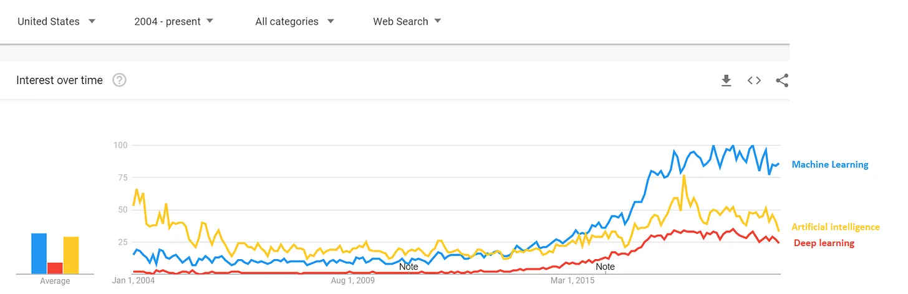
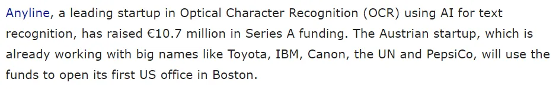

## 주요 정보

머신러닝은 생각보다 덜 무섭고\, 더 흔합니다\.

## 머신러닝 마법

우리는 이제 머신러닝\(ML\)\, 딥러닝\, 인공지능에 대해 자주 듣게 됩니다 [^1]\.

검색 관심사에서\:

책에 언급된 인물들\:

로봇이 우리의 일을 장악했다는 신문 헤드라인에 대해\:

머신러닝에 대한 관심이 높아지고 있고\, 매일로 새로운 스타트업이 신기술 머신러닝 기술을 바탕으로 1억 달러를 모금하는 것 같습니다\.

하지만 대부분의 사람들은 머신러닝을 마치 최첨단 스타트업만이 하는 마법처럼 여기며 위축됩니다\. 수학이 부담스러울 수 있다는 점도 도움이 되지 않습니다\:

오늘은 먼저 ML을 사용하는 회사를 살펴보고\, 그 다음에 신경망이 어떻게 작동하는지 기본으로 설명해 보면서 ML에 대한 직관을 더 잘 이해할 수 있도록 돕고자 합니다\. 이 글의 마지막에 제 목표는 누군가가 \'ML\'이라는 용어를 학교에서 너무 멋지게 여기는 것처럼 말할 때 덜 두려워하는 것입니다\.

## 머신러닝 사례 연구

제가 ML을 사용하는 회사에 투자를 요청하러 왔다고 상상해 보세요\. 제안은 다음과 같습니다\:

\"회사 M은 ML을 사용하고 [optical character recognition (OCR)](https://en.wikipedia.org/wiki/Optical_character_recognition 'OCR') 입력 데이터를 수억 건의 기록과 순식간에 대조하는 것입니다\. 이미 아마존\, 미국 정부\, 페덱스와 파트너십을 맺고 있습니다\. M 회사는 연간 \>1\,000억 건의 거래가 가능하도록 확장했으며\, 미국 전역으로 커버리지를 확장했습니다\.\"

흥미진진하게 들리죠\? 몇몇 언어를 골라서 썼지만\, 크게 다르지 않은 것 같아요 [actual press releases by other companies:](https://www.eu-startups.com/2020/01/anyline_raises_over_10_million_and_zooms_to_us/ 'eu')

\"텍스트 인식을 위한 AI를 활용한 광학 문자 인식\(OCR\) 분야의 선도적인 스타트업인 Anyline이 시리즈 A 자금으로 1\,070만 유로를 모금했습니다\. 이미 도요타\, IBM\, 캐논\, 유엔\, 펩시코 등 대기업과 협력 중인 이 오스트리아 스타트업은 이 자금을 활용해 보스턴에 미국 첫 사무소를 열 예정입니다\.\"

하지만 다시 회사 M으로 돌아가서\, OCR은 이미지를 보고 ML을 통해 그 내용을 인식하는 것을 의미합니다\. 그들은 효율적이고 정확하며 대규모로 그렇게 하는 것 같습니다\. 그들의 파트너십도 존경받는 것으로 보입니다\. 아마도 기저귀를 차고 코딩을 시작한 스탠포드 졸업생들이 이끄는 유망한 유니콘이라고 생각할 겁니다\.

투자하시겠습니까\?

만약 네라고 했으면\, 그냥 투자한 거죠 [United States Postal Service](https://www.enterpriseai.news/solution_content/hpe/governmentacademia/machine-learning-applications-for-the-modern-enterprise/ 'USPS')\.

정말로\, 우체국은 오랫동안 ML을 사용해왔습니다\. [They started trialing it in 1997, and by 2014 were already mostly recognising addresses via ML algorithms.](https://www.buffalo.edu/content/dam/www/research/pdf/Postal-Automation-Highlights_20160516.pdf 'ML') 당신이 상상했던 스타트업 고정관념과는 조금 다릅니다\.

여기서 제 요점은 Anyline이나 비슷한 스타트업을 비난하려는 것이 아닙니다\. 그들이 어려운 문제를 해결하고 있을 것이고\, 단순한 과장이 아님을 확신합니다 [^2]\. 오히려 여러분께 깨닫게 하고 싶습니다 **머신러닝은 평범해 보이는 상황에서 사용되고 있으며\, 이미 한동안 그러해 왔습니다\.** 다음에 누군가가 ML에서 제안할 때는 이 점을 기억하세요\.

## 머신러닝 직관

이제 머신러닝이 어디에 사용되는지 알았으니\, 머신러닝이 어떻게 작동하는지 살펴보겠습니다\. 저는 다음을 사용하겠습니다 [neural network](http://news.mit.edu/2017/explained-neural-networks-deep-learning-0414 'NN') 하지만 머신러닝을 실행할 수 있는 다른 방법도 많습니다\.

신경망은 뇌의 뉴런을 모델링하므로\, 그 연결이 어떻게 작동하는지 이해하는 데 도움이 될 것입니다\. 뉴런의 모습은 다음과 같습니다\:

우리가 아직 [aren't quite sure how the brain works, a leading theory is that the neurons can take inputs, do some computation, and then send outputs.](https://www.quantamagazine.org/neural-dendrites-reveal-their-computational-power-20200114/ 'neural') [^3] 두 뉴런이 상호작용하는 것을 단순화해서 표현하는 방법은 다음과 같을 수 있습니다\. 원이 본체이고\, 그 선이 다른 뉴런과 연결된 축삭이라고 상상해 보세요\:

그리고 만약 세 쌍의 뉴런이 있다면\, 다음과 같이 보일 수 있습니다\:

그리고 만약 뉴런들이 서로 상호작용할 수 있다면\, 이런 모습일 수 있습니다 [^4]\:

이 이미지가 컴퓨터와 머신러닝과 어떻게 연결될지 생각해보면서 기억해 봅시다\.

간단한 수학 식을 가져와 봅시다\. 예를 들어 2 x 3 \= 6과 같이 말이죠\. 입력 데이터로 \"2\"를\, 수행하려는 함수를 \"x 3\"로\, 출력 데이터로 \"6\"을 설정합시다\. 이렇게 하면 다음과 같은 결과가 나옵니다\:

입력 데이터가 하나 이상이라면 어떻게 될까요\? \(2 \+ 5\) x 3 \= 21을 할 수 있습니다\. 이렇게 하면 다음과 같은 결과가 나옵니다\:

그리고 다시 한 번 여러 입력에 상호작용하는 여러 함수를 결합할 수 있습니다\. 예를 들면\:

이것이 위의 뉴런 상호작용 도표와 비슷해 보이므로 \'신경망\'이라는 이름이 붙었습니다\.

한 걸음 더 나아가 봅시다\. 이전처럼 A\, B\, C 값이 있다고 상상해 보세요\. 이번에는 값들이 다음을 나타냅니다 [pixel values.](https://homepages.inf.ed.ac.uk/rbf/HIPR2/value.htm#:~:text=For%20a%20grayscale%20images%2C%20the,is%20taken%20to%20be%20white. 'pixel') 이 경우에는 3픽셀을 보고 있습니다\.

비슷하게 그 데이터 포인트에 대해 어떤 수학 함수를 적용하면 X\, Y\, Z 출력을 얻을 수 있습니다\. 지금은 정확히 어떤 수학 함수를 사용하는지는 무시하겠습니다 [^5]하지만 데이터 포인트에서는 0 또는 1만 반환됩니다\. 게다가 단일 \"1\"만 반환하고 나머지는 \"0\"이 됩니다\. 여기서 출력은 예측된 알파벳을 나타내며\, 그 원에서 \"1\"이 반환될 경우입니다\.

이런 식으로 보입니다\:

이 예시에서 원래 X로 표시된 출력에 대해 \"1\"이 반환되었고\, 다른 출력들에 대해 \"0\"이 반환된 것을 볼 수 있습니다\. 이는 우리가 주었던 3개의 픽셀\(0\, 100\, 255\)에서 받은 입력을 바탕으로 X가 예측된 값임을 의미합니다\.

알파벳의 모든 글자와 필요한 만큼 입력 픽셀에 대해 이런 틀을 확장한다고 상상할 수 있습니다\. 직관은 비슷하지만\, 더 많은 단계가 필요하다는 점이 다릅니다\. 예를 들어\, 1000개의 픽셀 이미지를 바탕으로 26글자 중 하나를 예측하고 싶다면\, 왼쪽에는 1000개의 입력\, 오른쪽에는 26개의 출력이 필요합니다\. 출력 중 1개만 \'1\'이 들어가고\, 나머지는 \'0\'이 됩니다\.

입력과 출력이 두 레이어에만 국한되지 않습니다\. 왼쪽에서 입력을 받아 오른쪽으로 출력을 반환하는 \'숨겨진 레이어\'를 더 추가할 수도 있습니다\. 함수를 마지막 레이어에서 \'1\'과 \'0\'으로 반환하도록 설정하면 충분합니다\. 숨겨진 레이어는 무제한으로 존재할 수 있고\, 각 레이어는 입력이나 출력과 같을 필요는 없으며\,

그게 전부입니다\! 여러분은 프로세스가 데이터 입력\(예\: 이미지의 픽셀 값\)을 출력\(알파벳과 주소\)으로 변환하는 과정을 보셨습니다\. 이제 대부분의 신경망이 어떻게 작동하는지 이해하셨습니다\. 많은 머신러닝 구현이 신경망을 사용하므로\, 이런 머신러닝 회사를 이끄는 기본 개념도 알게 되었습니다\.

물론 실제 설정은 더 복잡하고 훨씬 더 많은 시간과 전문성이 필요합니다 [^6]\. 저는 ML을 실제로 구현하기 더 어렵게 만드는 수학\, 통계\, 프로그래밍 부분을 모두 건너뛰었습니다\. 하지만 지금 가진 직관이 앞으로 누군가가 \'ML\'을 유행어로 쓸 때 덜 위축되게 해주길 바랍니다\.

[^1]: 글 전반에 걸쳐 머신러닝\(ML\)\, 딥러닝\(DL\)\, 인공지능\(AI\)을 번갈아 사용하지만\, 기술적으로는 서로 다른 개념입니다\. [some being a subset of the other.](https://towardsdatascience.com/clearing-the-confusion-ai-vs-machine-learning-vs-deep-learning-differences-fce69b21d5eb 'ML') 하지만 글을 쓰기 위해서라면 크게 중요하지 않아요\.

[^2]: 음\, 아마도 완전한 사기일 수도 있겠네요

[^3]: 저는 과학자가 아니니 틀렸다면 정정해 주세요\.

[^4]: 이해하기 쉽도록 한 뉴런에 들어오는 모든 입력을 하나의 색상과 크기로 보여줬고\, 특히 신경망 수학으로 번역할 때 그렇습니다\. 그룹화를 다른 방식으로 생각할 수도 있는데\, 예를 들어 한 뉴런의 모든 출력을 하나의 색으로 보는 식입니다\.

[^5]: 여기서 일어나는 일은 매개변수에 입력을 곱한 첫 함수가 있고\, 그 다음에 [logistics function](https://en.wikipedia.org/wiki/Logistic_function 'log') 출력 범위를 0에서 1로 제한하는 데 적용합니다\. 이 아이디어는 학습 데이터 세트에서 데이터를 반복적으로 학습시키면\, 검증 데이터셋과 비교했을 때 매개변수의 첫 번째 함수가 낮은 예측 오차를 제공하도록 하는 것입니다\.

[^6]: 예를 들어\, 어떤 기능을 사용해야 할지 어떻게 알 수 있을까요\? 프로그램에서 이걸 어떻게 설정하나요\? 예측이 정확한지 어떻게 확인할 수 있을까요\? 대부분의 기술적인 부분은 단순화했지만\, 더 알고 싶으시다면\, [Andrew Ng's coursera is a good place to start](https://www.coursera.org/learn/machine-learning 'coursera')\. 경고하자면\, 훨씬 더 복잡하고 어렵습니다\.
