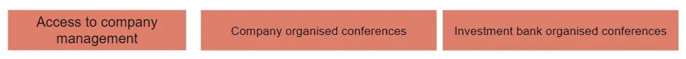

## 주요 정보

개인 투자자로서 전문가 사이에서 정보 우위를 가진 것은 거의 없을 것입니다\; 다른 곳에서 우위를 찾아야 합니다

## 투자에 데이터 활용

지난주에 우리는 [how companies use machine learning to take data, process it, and come to a conclusion.](/writing/ml 'ML')

이번 주에는 좀 더 인간 중심적인 과정을 살펴보겠습니다\. 투자 회사의 애널리스트들이 데이터를 어떻게 수집하고\, 분석하며\, 투자 논문을 형성하는지 살펴보겠습니다\. 투자자들과 함께 [spending >$30bn on data](https://www.ft.com/content/222855de-4fbf-11e9-9c76-bf4a0ce37d49 'spend')\, 그 돈 다 어디로 가는 거야\?

저는 평범한 상황에서 이 작업을 진행할 예정입니다 [long/short fundamental hedge fund](https://en.wikipedia.org/wiki/Long/short_equity 'LS') 정량적 기업이 아닌 관점에서 [^1]\. 편의를 위해 미국 기업 관점에서도 이 문제를 논의할 예정이지만\, 아래의 일반적인 절차는 국제적으로도 적용됩니다\.

제 목표는 개인 투자자로서 전문가들이 가진 우위와 그것이 가질 수 있는 우위가 무엇을 의미하는지 더 잘 이해하는 것입니다 [^2]\.

### 공개 데이터

상장 기업 [have to file financial statements regularly with the SEC.](https://www.sec.gov/edgar.shtml 'SEC') 이 자료들은 회사 투자자 관계 페이지와 [SEC Edgar](https://www.sec.gov/edgar/searchedgar/companysearch.html 'Edgar') 네가 찾아볼 수 있어\.

기업들은 주요 실적 발표마다 정기적인 실적 발표를 개최하며\, 누구나 이 회의에 접속할 수 있습니다 [^3]\. 통화 녹취록은 때때로 투자자 관계 페이지나 같은 사이트에서도 찾아볼 수 있습니다 [Seeking Alpha.](https://seekingalpha.com/earnings/earnings-call-transcripts 'SA') 하지만 재무제표보다 추적이 더 어려울 수 있습니다\.

기업들은 보통 다음과 같은 방식으로 뉴스를 발표합니다 [PR newswire](https://prnewswire.mediaroom.com/about-pr-newswire 'PR') 또한 자체 웹사이트에도 게시할 수 있습니다\. 이러한 뉴스는 앞서 언급한 재무 보고서나 인수\, 경영진 교체와 같은 특별 이벤트일 수 있습니다\. 이 뉴스는 PR 뉴스와이어를 통해 다른 뉴스 사이트에 배포됩니다\.

앞서 언급한 공개 데이터 외에도\, 애널리스트는 트위터를 살펴보거나 구글링하거나 레딧을 읽는 데 시간을 할애합니다\. 그들은 이 모든 1차 출처를 모아 회사에 투자할지 여부를 판단합니다\.

이것은 투자 조사 과정의 한 부분으로\, 모두가 할 수 있는 공개된 정보를 발견하고 활용하는 것입니다\. 위 내용을 통해 이미 기업 재무 모델을 구축하고 추세를 분석하며 투자 논지를 형성할 충분한 데이터를 갖추게 됩니다\. 사실 많은 개인 투자자들은 이 단계를 넘어서지 않고도 스스로 잘 운영됩니다\. 앞서 말했듯이\, 투자에서 성공하는 방법은 여러 가지가 있습니다\.

### 공공 데이터 접근

그렇다면 그게 전부라면\, 왜 투자자들에게 정보를 제공하는 다른 회사들이 그렇게 많은가\? 블룸버그는 어떻게 수익을 내는지 [$20k a year from a single subscription?](https://www.vox.com/2020-presidential-election/2019/12/11/21005008/michael-bloomberg-terminal-net-worth-2020 'Bloomberg')

알고 보니\:

1. SEC 에드가로부터 직접 데이터를 얻는 것은 엄청난 번거로움입니다
2. 사람들은 항상 더 많은 데이터를 원합니다\. 왜냐하면 더 많은 데이터가 더 좋다고 믿기 때문입니다
3. 구매할 수 있는 비공개 데이터가 많이 있습니다

이 섹션에서는 첫 번째 포인트\, 즉 사용자 경험에 대해 논의하겠습니다\.

예를 들어\, 한 회사의 매출을 빠르게 시간에 따른 결과를 보고 싶다고 가정해 봅시다\. 전통적인 방법으로 Edgar에서 했다면 회사를 검색해야 하므로 다음과 같은 페이지가 나올 것입니다\:

그 후 원하는 각 신고를 찾아 모두 다운로드한 뒤 스프레드시트에 데이터를 복사해야 합니다 [^4]\. 데이터를 정리하고 연도 대비 계산을 위해 행을 추가한 후에야 원하는 추세가 나올 수 있었습니다\.

많은 노력과 거의 보상이 없었기 때문에 블룸버그\, 팩트셋\, 톰슨 같은 회사들이 존재합니다\. 이들은 금융 데이터를 수집하고 플랫폼 내에서 쉽게 접근할 수 있도록 합니다\.

한 회사의 수익을 찾기 위해 한 모든 노력은\? FactSet에서는 모든 상장 기업에 대해 확인할 수 있습니다\:

물론 저장된 데이터가 항상 완벽한 것은 아닙니다 [^5]\. 하지만 빠르게 참고할 수 있는 자료가 필요할 때\, 이미 모든 작업을 쉽게 소화할 수 있는 형식으로 처리한 플랫폼은 매우 소중합니다\. 몇 번의 키로 데이터를 얻을 수 있을 때 몇 시간씩 데이터를 가져올 필요가 없습니다\. 이러한 편리함 덕분에 플랫폼이 고정된 구독자 기반을 확보할 수 있는 이유 중 하나입니다 [^6]\, 하지만 파괴자들은 [Koyfin](https://www.koyfin.com/ 'koy') 그들을 깎아내리려 하고 있어\.

또한 BamSEC나 Last10K 같은 회사들이 있어 제출 서류를 찾기 쉽게 만듭니다\. 예를 들어\, BamSEC는 서로 다른 유형의 제출 서류를 분류하고\, 제출 제목을 보여주며\, 이전 제출 판본을 빠르게 찾을 수 있게 해줍니다\. 이 회사들은 위 플랫폼들만큼 기능이 많지는 않지만\, 분석가 시간을 절약해 줍니다\.

### 매도 측 연구 데이터 접근

사용자 경험에 대해 이야기했으니\, 이제 더 많은 데이터를 얻고 비용을 지불하는 방법에 대해 이야기해 보겠습니다\.

블룸버그 등은 기업에 대한 집계된 재무 데이터를 제공하는 것 외에도\, 매도 측 조사 추정치를 제공합니다\.

참고로\, 이 연구원들은 투자은행에서 회사에 관한 보고서를 발행하는 사람들입니다\. 보통 뉴스에서 \"애널리스트가 회사를 매도로 하향 조정했다\"거나 \"은행이 회사의 목표주가를 올렸다\"고 할 때 언급되는 사람들이 바로 이들입니다\. 셀사이드 리서치는 미래 회사 재무 전망에 대한 추정치를 내는 자체 재무 모델을 만들어내며\, 이를 이용해 가격 목표치를 산출한다고 주장합니다 [^7]\.

많은 투자자들은 시장 합의가 어디에 있는지 파악하기 위해 이러한 매도 측 수치를 보고 싶어 합니다\. 예를 들어\, 내년 매출에 대한 매도 예상치가 100달러인데\, 1000달러일 것 같다면\, 이는 매우 좋은 시간을 보내거나 매우 나쁜 시간을 보낼 것입니다\.

전문 투자자라면 은행에 이메일을 보내 조사를 요청할 수도 있습니다 [^8]\. 정말 원한다면 모든 PDF와 엑셀을 모아 직접 벤치마킹을 할 수도 있습니다\.

분명히 아무도 그렇게 하고 싶어 하지 않아요 [^9]연구자들은 이 데이터를 플랫폼에 제공하고\, 플랫폼은 이를 투자자 커뮤니티에 보여줍니다\. 셀사이드 컨센서스가 어디에 있는지 간단히 요약하고 싶다면\, 몇 번의 키로 확인할 수 있습니다\.

### 회사 경영진에 대한 접근

많은 투자자들이 경영진의 질을 기준으로 기업을 평가합니다\. 이를 위해 기업과 매도자 측 리서치 모두 정기적인 투자자 컨퍼런스를 개최합니다\. 이 회의의 목적은 경영진이 투자자를 만나고\, 해고된 모든 투자자를 대체하는 신규 투자자들에게 회사 전략을 설명하며\, 질문에 답하는 것입니다\.

투자자들은 경영진과의 미팅을 통해 재무 모델이나 회사에 대한 견해를 업데이트할 수 있습니다\. 예를 들어\, 경영진이 당신의 질문에 대해 부적절한 답변을 했다면\, 주식을 공매도하는 데 관심이 있을 수 있습니다\.

\"잠깐만\, 이거 내부자 거래 같아\"

아니\, 그렇지 않아\. 버핏의 연례 주주총회가 그럴 거라고 생각해\? [attracting 40k people yearly](https://www.investopedia.com/articles/investing/121715/how-attend-berkshire-hathaways-annual-meeting.asp 'Buffett')\, 내부자 거래인가요\? 만약 아니라면\, 위 컨퍼런스들이 다른 이유는 무엇인가요\? 파티에 초대받지 못했다고 해서 불법인 것은 아닙니다\. 경영진이 말할 수 있는 내용을 규율하는 규칙이 있지만\, 이런 관행은 오래전부터 이어져 왔습니다\.

### 업계 전문가들

투자자들은 자신이 조사하는 분야의 직원들과도 대화하는 데 관심이 있습니다\. 예를 들어\, 페이스북 광고 수익이 어떻게 될지 이해하려면 페이스북 광고의 대규모 구매자들과 대화하고 싶습니다\. 그들이 제품에 대해 더 낙관적이라면 긍정적인 신호가 될 수 있습니다\.

[Expert network firms like GLG, AlphaSights, Third Bridge](https://www.forbes.com/sites/jonyounger/2020/02/12/the-global-expert-network-business-is-growing-fast-meet-inex-one/#435336b2f257 'GLG') 투자자들이 그런 사람들을 찾을 수 있도록 돕기 위해 존재합니다\. 이 회사들은 투자자와 업계 전문가를 연결해 주는 역할을 합니다\; 컨설턴트들도 시간에 대해 보수를 받습니다\. 전 C\-레벨 출신들이 여가 시간에 이런 일을 하는 사람이 얼마나 많은지 놀랄 겁니다\.

\"잠깐만\, 이거 내부자 거래 같아\"

아니요\, 그렇지 않습니다\. 만약 의료 회사에 투자하고 싶다면\, 의사 친구들에게 회사에 대해 묻는 것이 내부자 거래라고 생각하시겠습니까\? 그렇지 않다면\, 위 내용이 왜 다를 수 있을까요\? 중개인을 감당할 수 없다고 해서 불법인 것은 아닙니다 [^10]\.

### 산업 데이터

마지막으로\, 투자자들은 회사 결과를 더 잘 예측하기 위해 \'대체 데이터\'를 활용하기도 합니다\. 예를 들어\, 모바일 앱의 성과에 관심이 있다면 그 회사의 앱 다운로드 통계에 관심이 있을 수 있습니다\. 전자상거래 매출에 관심이 있다면\, 특정 산업의 신용카드 데이터에 관심이 있을 수 있습니다\. 트럭 무게를 모니터링하여 어떤 회사가 더 많은 판매\(더 무거운 트럭\)를 하고 있는지 추정하고 싶다면\, 그 분야를 위한 회사가 있습니다 [^11]\.

여기 [large market of sellers for such data](https://alternativedata.org/data-providers/ 'mkt')\. AppAnnie\, SensorTower\, QuestMobile 같은 회사들은 앱 데이터를 제공하는 것으로 잘 알려져 있습니다\. Earnest Research\, Second Measure와 같은 회사들도 신용카드 데이터를 제공하는 것으로 잘 알려져 있습니다\.

\"잠깐만\, 이거 내부자 거래 같아\"

가게에서 손님을 세는 것이 불법일까요\?

### 이것이 개인 투자자에게 의미하는 바

우리는 일반적인 펀더멘털 투자자가 사용할 수 있는 공개 및 비공개 데이터를 모두 검토했습니다\. 이것이 개인 투자자로서 귀하에게 어떤 의미인가요\?

만약 당신이 다른 사람들보다 회사에 대해 더 많은 정보를 가지고 있다는 점이 투자 이점이라고 믿는다면\, 당신의 조사 과정이 위에서 언급한 것보다 더 철저했다고 신뢰할 만하게 믿어야 합니다\. 또는 당신의 조사 과정이 충분히 다르고 일반적인 전문가가 사용할 수 있는 다양한 출처를 사용했다고 믿어야 합니다\.

몇 가지 예를 살펴보겠습니다\.

만약 당신의 강점이 신제품에 대해 경영진이 기대했다는 신문 기사였다고 믿는다면\, 경영진이 이미 오래전에 투자자들과 이 문제를 논의하고 있지 않았다는 주장을 해야 할 것입니다\.

만약 당신이 트위터에서 본 앱 다운로드 데이터의 강점이라고 믿는다면\, 투자자들이 당신보다 먼저 그 데이터에 접근하지 못했다는 주장을 해야 할 것입니다\.

만약 당신의 강점이 업계 전문가 같은 친척이라고 믿는다면\, 그들이 전문가들이 이야기하는 사람들보다 그 분야를 더 잘 알고 있다는 주장을 해야 할 것입니다\.

명확히 하자면\, 위 모든 시나리오가 사실일 수도 있습니다\. 경영진이 최근에 마음을 바꿨거나\, 투자자들이 앱 데이터를 봤지만 신경 쓰지 않았거나\, 업계 전문가들이 전문가가 아니었을 수도 있습니다\.

여기서 제가 말하고 싶은 것은 불가능하다는 것이 아니라\, 경쟁이 무엇인지\, 그리고 그것이 당신이 가져야 할 이점에 어떤 영향을 미치는지 인지해야 한다는 것입니다\.

예를 들어\, 유용한 데이터셋을 가지고 있지만 아직 투자자에게 판매하지 않는 작은 회사를 찾았다면\, 그것이 엣지의 원천이 될 수 있습니다\.

만약 당신이 사람들을 고용해서 단순한 잡일을 했다면\, [counting store traffic and taking pictures of receipts](https://www.qsrmagazine.com/fast-food/luckin-coffee-faces-fraud-allegations-anonymous-report 'luckin') 신용카드 데이터에 의존하는 대신\, 그것이 엣지의 원천이 될 수 있습니다\.

회사 공장을 익명으로 방문해 얼마나 붐비는지 확인했다면\, 그것이 강점이 될 수 있습니다\.

당신이 해야 할 일은 일반 프로가 꺼려할 만한 것들을 찾아내는 것입니다\. 프로들이 당신보다 더 많은 자원을 사용할 수 있는 세상에서\, 덜 바람직한 부분에서 이점을 찾아야 합니다\. 아래 차트를 보고 빈틈을 찾아보세요\.

[^1]: 저는 퀀트 회사 경험이 없어서 개인적으로는 말씀드리기 어렵습니다\. 퀀트 관련해서는 알고 있습니다 [pay for order flow though,](https://www.institutionalinvestor.com/article/b1m2p1cv68bx56/Twitter-Freaked-Out-Over-Robinhood-Selling-Its-Trade-Flow-But-the-App-and-Others-Have-Been-Doing-It-for-Years 'order') 그리고 이는 300억 달러라는 수치에 포함될 가능성이 큽니다\. 별도로\, 헤지펀드 같은 투자 회사는 투자은행과 다릅니다\; 대부분의 투자 애널리스트는 투자 은행가와 완전히 다른 업무를 수행합니다\. [Sellside equity research is the role most similar to a hedge fund analyst, but researchers don't actually invest money.](/writing/time 'Sellside')

[^2]: 여기서 엣지는 경쟁자에 비해 상대적으로 가진 우위를 의미합니다\. 우리는 논의했습니다 [why this was important in investing last month.](/writing/relative_billionaire 'edge') 우리가 나눈 대화를 바탕으로 이 글을 쓰도록 권유해준 바라크 파즈에게 감사드립니다\.

[^3]: 하지만 보통은 질문하지 않습니다\. 드물게 일부 기업은 대중에게 질문을 허용합니다\; 대부분의 질문은 매수 측 조사\(매수측 투자 분석가가 아님\)에서 나옵니다\.

[^4]: 8K에서 데이터를 가져오는 경우는 10Q\/K보다 더 심각합니다\. SEC가 당신이 고통받는 모습을 보고 싶어 하기 때문에 타이틀이 없다는 점을 주목하세요\.

[^5]: 투자은행 업무의 큰 부분은 데이터를 다운로드한 후 회사를 \"정확히\" 반영하기 위해 필요한 조정을 하는 것입니다\. 여기서 정확히 말하는 것은 상사가 보여주고 싶은 것을 의미합니다\.

[^6]: 하지만 이것이 전부는 아닙니다\. 블룸버그는 커뮤니티 의식을 가지고 있고\, 지위 신호 상황이 있으며\, 직접 메시지 잠금 해제가 유용합니다\. 번드 호바트가 이에 대해 더 자세히 설명합니다 [here](https://marker.medium.com/why-its-hard-to-kill-the-bloomberg-terminal-61073482e496 'Byrne')

[^7]: 그들이 가격 목표치를 정하고 그 수치를 조정하든\, 그 반대든\, 결정은 여러분께 맡기겠습니다\. 이 비판은 매수측과 매수측 투자자 모두에게 적용될 수 있다는 점을 유의하세요

[^8]: 개인 투자자들은 대부분 운이 없을 정도입니다\. 보통 은행의 고객이 되어 거래를 해야 그들이 관심을 갖게 됩니다\. 이것은 오늘날에는 범위를 벗어난 셀사이드 리서치의 비즈니스 모델과 연결됩니다\.

[^9]: 상사가 추천하는 투자은행가라면\, 은행이 다른 은행 조사에 제한되어 있어서 제한된 PDF 세트에서 수치를 입력하는 데 며칠씩 시간을 보내야 합니다\. 그리고 일부 매도 측 수치가 오래되었거나 잘못된 가정을 사용해 추정치를 수동으로 조정해야 합니다\. 네\, 이런 일은 자주 일어납니다\. 네\, 대부분은 시간 낭비입니다\. 화려한 직업\, 은행업\.

[^10]: 하지만 이 문제는 더 불투명해질 가능성이 있습니다\. SAC의 내부자 거래에 관한 책 『Black Edge』는 여기서 남용 가능성을 논의합니다\. 이 모든 채팅은 준수 차원에서 모니터링되어야 합니다\. 투자자가 업계 전문가와 \'우정\'을 쌓은 후 비공개 정보를 요구하는 경우도 있었습니다\.

[^11]: 그 회사는 당장 찾을 수 없지만\, 어디선가 읽은 적이 있는 것 같아요\. 카메라 데이터를 이용해 트럭을 촬영하고 도로와 얼마나 가까운지 확인한 것 같아요\. 가까울수록 무거워져서 판매량이 더 많다는 뜻이죠\.
