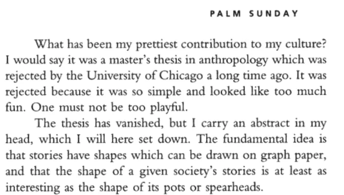
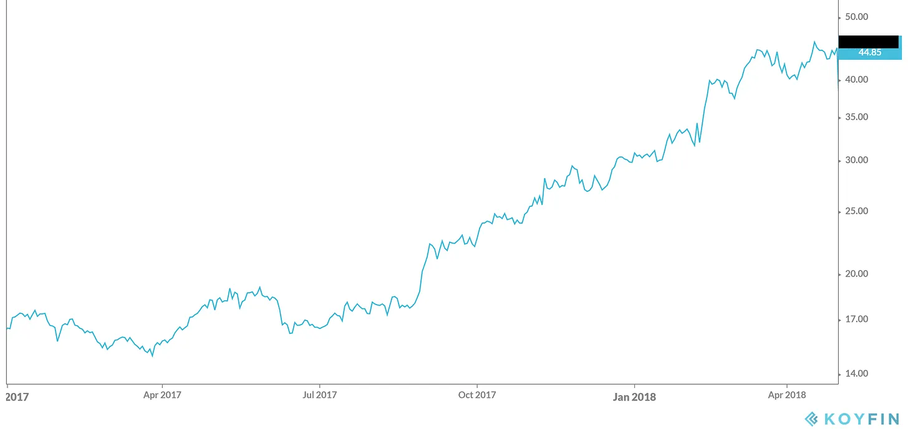

## 주요 정보

이번에는 결론 따로 하지 마세요\, 이야기가 스포일러될 테니까요\.

---

이야기에 관한 이야기부터 시작해 봅시다\.

[Bestselling author Kurt Vonnegut](https://en.wikipedia.org/wiki/Kurt_Vonnegut 'Kurt') 그는 『도살장 5』\, 『캣츠 크래들』 등 여러 작품으로 잘 알려져 있다\. 그의 자서전에서\, [he claimed that this was his greatest contribution to culture:](https://books.google.com/books?id=Zd_9o3uyoVsC&pg=PA285&dq=vonnegut+shape+story+thesis&hl=en&sa=X&ei=tasCU8yjEML-oQSXloKIBQ#v=onepage&q=vonnegut%20shape%20story%20thesis&f=false 'book')

그래서\, _이야기는 형태를 가지고 있다\,_ 그가 말한다\.

그게 무슨 뜻이지\? 커트가 설명한다 [^1]\:

그래프를 상상해 보세요\. 한쪽에는 행운과 나쁜 행운이 있고\, 다른 쪽에는 처음부터 끝까지 이야기의 진행 상황이 나타난 것 같아요\.

이 그래프 위의 어떤 이야기든 그 형태를 볼 수 있습니다\. 그리고 전 세계의 모든 이야기를 그래프로 그려보면 몇 가지 공통된 패턴이 나타납니다\.

예를 들어\, [The Godfather,](https://en.wikipedia.org/wiki/The_Godfather 'Godfather') 마이클은 처음에는 행복하지만\, 가족이 곤경에 처해 결국 나라를 떠나야 한다\. 결국 그는 돌아와 통제권을 되찾고 대부분의 반대자들을 처치하며 도시 마피아의 대부가 된다\.

이것을 그래프에 그려서 \'구덩이 속의 남자\' 이야기라고 부르겠습니다\. 인간은 잘하고 있다가 구멍에 빠졌다가 빠져나와 이전보다 더 좋아집니다\.

반면에\, [About Time,](<https://en.wikipedia.org/wiki/About_Time_(2013_film)> 'About Time') [^2] 주인공들은 사랑에 빠졌다가 서로를 잃었다가 일련의 사건 끝에 다시 만나게 됩니다\.

이것을 \'남자가 여자를 만나는\' 이야기라고 부르겠습니다\. 상상할 수 있듯이\, 많은 로맨스 영화에서 흔히 볼 수 있는 일입니다\.

그리고 이런 이야기에서는 [The Metamorphosis,](https://en.wikipedia.org/wiki/The_Metamorphosis 'Kafka') 주인공은 벌레로 변해 죽으며 상황은 점점 더 악화됩니다\. 이것은 \'비극\'이 될 것입니다\.

위의 형태 외에도\, 커트는 몇 가지 더 효과가 있을 만한 아이디어를 생각했다\. \"가난에서 부자로\" 이야기는 꾸준한 상승\, ["icarus" story](https://en.wikipedia.org/wiki/Icarus 'icarus') 상승과 하락을 포함할 수 있고\, ["oedipus" story](https://en.wikipedia.org/wiki/Oedipus 'oedipus') 추락\, 상승\, 그리고 다시 추락이 반복될 수 있습니다\.

이 아이디어를 바탕으로\, [a team of researchers from Vermont and Adelaide used machine learning to classify 1,327 famous stories](https://arxiv.org/pdf/1606.07772.pdf 'paper') 온 [Project Gutenberg](https://www.gutenberg.org/ 'proj')\. 그들은 대부분의 이야기가 실제로 몇 가지 주요 유형으로 분류될 수 있음을 발견했다\. 그들의 방법론에 대한 자세한 내용은 각주를 참조하세요 [^3]\.

여기서 \'소년이 소녀를 만난다\'는 표현을 \'신데렐라\'로 바꿨지만\, 본질적으로 보네거트가 옳았다는 걸 보여준다 [^4]\. _이야기에는 형태가 있고\, 몇 가지 표준적인 형태가 있습니다\._

이게 무슨 관련이 있죠\? 당신은 주식 팁과 스타트업 관련 험담을 받으러 왔어요 [^5]내러티브에 관한 메모는 왜 이렇게 많아\?

곧 링크를 만들겠지만\, 지금은 그 이야기 형태들을 염두에 두자\.

---

### 스톡에는 형태가 있습니다

지난달\, 우리는 당신의 투자 프레젠테이션이 형편없는 이유 중 하나에 대해 이야기했습니다\: [you aren't accounting for consensus.](/writing/relative_billionaire 'pitch')

이번 달에는 더 답답할 수 있는 또 다른 흔한 이유에 대해 이야기해 보겠습니다\.

2018년 4월 30일 기준 이 회사를 고려해 보십시오\:

X 회사는 주로 앱 구독으로 수익을 올리는 인터넷 회사로\, 확장되는 소비자 부문에서의 독점권을 가지고 있습니다\. 총 가입자는 700만 명이며\, 그중 300만 명은 메인 앱 구독자입니다\. 매출은 전년 대비 \~30\% 성장하고 있습니다\. EBITDA\(일종의 수익 지표\) 마진은 40\%입니다\. 주가는 사상 최고치를 기록했으며\, 지난 1년간 두 배 이상 상승했습니다 [^6]\.

꽤 괜찮아 보이니\, 소유하고 싶은지 더 조사해보는 것도 좋을 것 같아요\.

또한 2018년 5월 1일 기준 동일한 회사도 고려해 보세요\:

X 회사는 인터넷 회사로\, 주로 앱 구독으로 수익을 올리며 확장되는 소비자 부문에서 독점권을 보유하고 있습니다\. 총 가입자 수는 700만 명이며\, 이 중 300만 명은 메인 앱 구독자입니다\. 매출은 전년 대비 \~30\% 성장하고 있습니다\. EBITDA\(일종의 수익 지표\) 마진은 40\%입니다\. 주가는 사상 최고치를 기록했으며\, 지난 1년간 두 배 이상 상승했습니다\. _[Facebook just announced they're planning to enter the category](https://techcrunch.com/2018/05/01/facebook-dating/ 'FB')_

기업의 펀더멘털은 변하지 않았지만\, 하루 만에 22\% 가격이 하락한 것은 분명히 드러납니다 _뭔가_ 그랬다\. 그게 바로 바로 _스토리_ 투자자들이 주식에 대해 이야기하고 있다는 점입니다\.

**피치란 주식에 관한 이야기가 아니라면 무엇일까요\?**

4월 30일\, 합의된 제안 [^7] 회사는 경쟁자가 없는 상태에서 높은 마진으로 빠르게 성장하고 있었기 때문입니다\. 투자자들은 계속 주식을 사들였고\, 가격은 계속 상승했습니다\.

5월 1일\, 이야기는 갈림길에 섰다\. 페이스북이 이 회사를 짓밟을 거라고 말할 수도 있고\, 가능한 한 많이 팔아야 한다고 말할 수도 있었다\. 아니면 두려움이 과장됐고\, 페이스북의 비핵심 제품 실적이 나쁘니 가능한 한 많이 사야 한다고 말할 수도 있다\.

익숙하게 들리나요\?

이 경우 그 회사는 Match\.com\, 틴더의 모회사였고\, 그 하락 후 약 1년 후 주가가 다시 두 배로 올랐습니다\. 남자와 여자가 만나는 관계는 잘 맞았습니다\.

5월 1일\, 두 이야기 모두 똑같이 타당했고\, 똑똑한 투자자들이 그 거래 양쪽을 택했다\. 중요한 점은\, 매치의 사업에 실제 변화가 일어나기 전부터 주가가 반응했다는 것이다\. 이야기는 갈림길에 섰고\, 투자자들은 이제 서로 다른 편을 선택했다\. \"이카루스\"처럼 질 거라 생각한 이들과 달리 얻는 이들\. 이야기가 변함에 따라 주가도 변한다\.

**이것이 투자 피치에 어떤 의미가 있나요\?** 스토리텔링이 좋은 피치의 핵심임을 암시합니다\. 이야기를 잘 전달할수록 반응을 얻을 가능성이 높아집니다\. 상사와 다른 투자자들 모두에게요\. 짜증나긴 하지만\, \'최고의 아이디어\'가 매우 자주 \'최고의 이야기\'입니다\.

**아이디어가 인기를 끄는 것이 왜 중요한가요\?** 투자는 단순히 옳다는 것만이 아니라\, 다른 사람들이 당신이 옳다는 것을 깨닫게 하는 것도 중요하다는 점을 기억하세요\. 가격이 움직이지 않으면 훌륭한 회사를 가지고 있다고 해서 돈을 벌 수 없습니다 [^8]\. 합의와 옳음에 반대함으로써 돈을 벌지만\, 다른 사람들을 내 편으로 끌어들이지 못하면 영원히 합의에 반대하고 틀린 상태가 될 것입니다\. 주식시장은 단기적으로는 투표 기계이고 장기적으로는 저울을 재는 기계일 수 있지만\, 이야기를 퍼뜨리지 않으면 당신의 기계는 고장 난 것입니다 [^9]\.

**어디에 집중해야 할까요\?** 투자 기간이 단기라면\, 이야기 흐름의 전환점을 찾는 것이 일반적일 것입니다\; 즉\, 촉매제라고 할 수 있습니다\. 예를 들어\, 현재 주식이 왜 하락세에 빠져 있는지\, 왜 빠져나올 것처럼 보이는지에 대한 신뢰할 만한 근거가 필요합니다\. 장기적인 투자 전망이라면\, \'빈곤에서 부자로\' 이야기에 더 관심이 있을 수도 있습니다\.

물론\, 이야기는 양방향으로 갈 수 있습니다\. 저는 회복한 주식의 예를 보여드렸는데\, 반대로 돌아간 주식을 쉽게 고를 수도 있었습니다\. 사람들은 엔론\, 틸레이\, 러킨 등에 대해 훌륭한 이야기를 했지만\, 결국 모두 붕괴했습니다\. 세상 모든 이야기가 마법처럼 수익을 창출할 수는 없지만\(제때 퇴산한 사람에게는 많은 돈을 벌어주긴 했습니다\)\.

또한 주가를 곡선에 맞추기만 하면 돈을 벌 수 있다는 뜻도 아닙니다 [^10]\. 제가 말하고 싶은 것은 주식에 대한 인식이 내러티브 곡선을 따른다는 점이며\, 이는 종종 가격에서 드러납니다\. 어떤 이야기를 전하려는지 알면 피치가 더 좋아집니다\.

우리는 한동안 펀더멘털만이 주가를 움직이는 것은 아니라는 것을 알고 있었습니다\; 참고하세요 [Shiller's work on a history of stock forecasting theory.](https://pubs.aeaweb.org/doi/pdfplus/10.1257/089533003321164967 'shiller') 좋은 이야기를 전하는 능력은 투자 아이디어를 전달하는 데 핵심입니다\. 왜 많은 투자자들이 자신의 아이디어를 공개적으로 이야기한다고 생각하시나요\? 다른 사람들에게 당신의 이야기를 더 많이 설득할수록 투자자로서 수익을 낼 가능성이 높아집니다\.

투자자들은 서로의 이야기를 들려주고\, 자신이 진실되길 바라는 것에 베팅합니다\.

### 스타트업에는 형태가 있습니다

스토리텔링은 기술 분야에서도 중요합니다\. 중요한 것은 [startups raised millions with just a pitch deck,](https://www.businessinsider.com/pitch-decks-that-helped-hot-startups-raise-millions-2019-4 'pitch') 어떻게 해야 할지도 [Masa raised $45bn in an hour from the Saudis](https://youtu.be/Sa2_VBu0d7k?t=92 'masa')\. 전자에서는 스타트업이 벤처캐피털에 10억 달러까지 성장할 수 있다고 말했다\. 후자의 경우\, 마사는 무함마드 빈 살만을 설득해 1조 달러까지 성장시킬 수 있다고 믿게 했다\. 그들의 실적이 분명히 한몫하지만\, 투자자들의 마음속에 그리는 그림이 자금 확보에 핵심적이었다\.

아무도 패자를 지지하고 싶어 하지 않으니\, 스타트업이 자신들의 이야기를 가장 잘 보이게 하는 방식으로 전해야 합니다\. 그들은 자신들을 \'빈민에서 부자\'로 포지셔닝하려 하고\, 투자자들은 그들이 \'이카루스\'인지 판단하려고 합니다\. 벤처캐피털이 회사를 거절하면\, 암묵적으로 그 이야기가 너무 지루하다고 생각한다는 뜻입니다\. 지루한 이야기는 피하세요\.

이것은 또한 다음을 의미합니다\. **스타트업은 자신에 대해 가장 흥미로운 이야기를 전하도록 동기부여받습니다\.** 그렇게 하면서 대부분은 진실을 최대한 과장할 것입니다\. 그들은 시작보다는 끝장에 대해 더 쉽게 팔려고 합니다\. 경험 많은 투자자들은 이를 알고 있지만\, 대중은 아마 덜 잘 알고 있을 것입니다\. 이것이 사기인지 아닌지는 미묘한 경계입니다\.

이 시나리오를 상상해 봅시다\:

> 당신의 회사는 너무 일찍 트렌드에 맞춰 있었고\, 그것을 지키려다 빚을 지고 있습니다\. 대학생에게서 전화가 와서 당신의 제품이 훌륭하다고 말합니다\. 사실 너무 훌륭해서 그가 당신에게 많은 돈을 벌어줄 프로그램을 작성하고 있습니다\. 당신은 관심이 생기고 그 학생과 데모를 만나기로 동의합니다\.

> 전화 건너편에서 긴장한 대학생이 전화를 끊고\, 첫 계약이 가까워졌다는 걸 깨닫는다\. 문제는\? 그는 당신의 제품 사본조차 없고\, 작동하는 프로그램도 없다는 것이다\.

사기인가요\, 아니면 낙관적인 생각인가요\? 아마도 당신은 이 아이와 영원히 거래하지 말아야 한다고 생각하는 걸 거예요\. 만약 그랬다면\, [you just missed out on Bill Gates, and the forming of Microsoft.](http://www.computinghistory.org.uk/det/5946/Bill-Gates-and-Paul-Allen-sign-a-licensing-agreement-with-MITS/ 'MITS') 때로는 완전히 사실이 아닌 이야기도 있습니다 _아직은_ 진실이 될 수 있어\.

다른 시나리오를 상상해 봅시다\:

> 젊은 창업자를 만나 혁신적인 의료 솔루션을 제안합니다\. 보여준 프로토타입은 다듬어지지 않았지만\, 결국 대규모 사용이 가능한 완성된 제품을 만들 자신감이 있습니다\.

> 창립자는 계속해서 더 많은 홍보를 받고\, 여러 잡지 표지에 등장하며\, 약국과 큰 계약을 체결합니다\. 이사회도 유명인들로 가득한 것 같지만\, 왜 의료 경험이 있는 사람이 적은지 잘 모르겠습니다\.

이 경우 스타트업은 물론 [Theranos](https://www.businessinsider.com/theranos-former-board-members-henry-kissinger-george-shultz-james-mattis-2019-3 'Theranos')이 사건은 이번 10년간 가장 큰 사기 중 하나로 불타버렸다\. 홈즈는 너무나 환상적인 이야기를 가지고 있어 모두가 듣고 싶어 했다\; 투자자들은 그녀의 제안에 \"매료되었다\"고 보고했다\. 만약 당신이 마이크로소프트 시나리오에서 배운 교훈이 \"모든 흥미로운 이야기를 믿으라\"였다면\, 그것이 왜 문제가 될지 알 수 있을 것이다\. 때로는 아직 사실이 아닌 이야기가 영원히 동화일 수 있다\.

**사기와 낙관적 사고 사이의 경계는 매우 얇을 수 있습니다\.** 스티브 잡스는 그의 [reality distortion field](https://en.wikipedia.org/wiki/Reality_distortion_field 'rdf')혹은 누군가에게 무언가가 가능하다고 설득할 수 있는 능력 말입니다\. 당시 홈즈는 많은 스타트업 창업자들처럼 불가능을 해낼 수 있다고 믿었을 것입니다\. 우리는 지금은 결과로 판단하지만\, 스티브가 애플로 돌아온 것이 결국 성공하지 못한 시나리오를 쉽게 상상할 수 있습니다\.

또는 다른 반전이 다른 결말을 줄 수 있었던 다른 스타트업 실패작들을 생각해 보세요\. [WeWork, Pets.com, Moviepass etc](https://f3fundit.com/11-of-top-startup-failures-in-history/ 'startup') 모두 훌륭한 이야기를 가졌지만 이제는 추면을 잃었습니다\. WeWork가 그렇게 빠르게 성장하지 않았다면 더 잘했을 수도 있고\, Chewy라는 정신적 후계자가 Pets\.com 있으며\, Moviepass는 더 많은 자금이 있었다면 더 잘 운영되었을지도 모릅니다 [^11]\. 끝까지 회사 내 모든 사람들은 이야기 아크가 곧 상승세가 올 거라고 기대했을 거예요\.

**투자자뿐만 아니라\, 여러분의 스타트업 스토리는 직원\, 고객\, 경쟁사에게도 중요합니다\.**

지분은 여러분의 이야기에 중요한 지분입니다\. 스타트업 직원들은 보통 현금보다 주식으로 더 많은 보수를 받기 때문에\, 여러분의 이야기가 좋은 이야기가 될 것이라는 내기를 하는 셈입니다\. 인재 채용에서 가장 어려운 부분은 회사에 더 나은\, 더 안전한 대안을 희생할 만큼 충분한 잠재력이 있다고 설득하는 것입니다 [^12]\.

고객은 구매를 결정하기 전에 당신의 스토리를 봅니다\. 그들은 당신의 제품이 자신들에게 줄 수 있는 것\, 즉 시간 절약\, 노력 단축\, 지위 향상 등 다양한 가능성을 생각합니다\. 앞서 논의했듯이\, 아무도 패자를 지지하는 것을 좋아하지 않습니다\.

경쟁사들도 당신이 전하는 이야기를 보고 당신이 하는 행동에 맞춰 계획을 세우고 있습니다\. 만약 당신이 그들보다 더 빠르게 성장한다면\, 그들은 그 이유를 알아내려 할 것입니다\. 만약 당신이 더 나쁘게 성장한다면\, 그들은 그 기회를 이용해 타겟 청중에게 자신들의 이야기를 제안할 것입니다\.

스토리가 스타트업에 얼마나 중요한지 잘 알려져 있습니다\. 투자자를 유치하는 것 외에도\, 스타트업이 상호작용하는 다른 모든 사람들에게도 중요합니다\. [As Bill Gurley from Benchmark put it:](http://abovethecrowd.com/1999/10/18/the-rising-importance-of-the-great-art-of-storytelling/ 'Bill')

> 오늘날의 독특한 인터넷 비즈니스 환경에서 스토리텔링의 예술은 점점 더 중요해지고 있습니다\. \"네트워크 효과\"와 \"수익 증가\" 현상 때문에 많은 사람들은 선도 기업\(또는 적어도 가장 먼저 상당한 규모에 도달한 기업\)이 인터넷 시장의 대부분을 차지할 것이라고 믿습니다\.

기업들은 우리에게 그들의 이야기를 전하고\, 그것을 진실되게 만들기 위해 노력합니다\.

### 너의 모습

우리는 이야기에 관한 이야기로 시작했습니다\.

자아에 관한 이야기로 마무리하자\.

옛날 옛적에\, 한 사람이 집을 떠나 세상을 탐험했다\. 그들은 기복을 겪었고\, 가장 힘들 때는 상상할 수 없는 고통을 겪었다\. 하지만 그들은 그것을 극복하고 이전보다 더 나아졌다\.

익숙하게 들리나요\?

그런데 이게 무슨 이야기일까요\?

그럴 수도 있죠 [the story of Jesus, from Christianity](https://www.learnreligions.com/the-resurrection-story-700218 'Jesus')\.

그럴 수도 있죠 [the story of the Buddha, from Buddhism](https://tricycle.org/magazine/who-was-buddha-2/ 'Buddha')\.

그리고 그 이야기는 어쩌면 당신의 이야기일 수도 있어요\.

**우리는 모두 각자의 이야기 아크에서 주인공입니다\,** 계속해서 우리의 이야기를 위로\, 오른쪽으로 조정하려 애쓰고 있습니다\. 운\, 기술\, 노력의 조합으로 어떤 사람들은 이미 그 자리에 있다고 느낄 수도 있습니다\. 다른 이들은 끊임없는 비극에 갇혀 있다고 느낄 수도 있습니다\. 우리 자신의 이야기를 만들어가는 것은 우리에게 달려 있고\, 우리는 우리의 선택에 따른 결과를 감당하며 살아갑니다\. 인생은 불공평하지만\, 여전히 스스로 할 수 있는 일들이 있습니다\.

우리는 우리 스스로 작가이기 때문에\, 다른 사람들의 전체 이야기 흐름을 알지 못한다는 뜻이기도 합니다\. 우리는 그들이 얼마나 많은 불운을 겪었는지 모른 채 인생을 즐기는 모습을 볼 수 있습니다\. 그들이 얼마나 비참함을 막으려 했는지 모른 채 겪는 모습을 볼 수 있습니다\. 우리는 그들이 어디에 있는지와 우리가 겪었던 곳을 비교하며\, 우리의 평균 경험이 그들의 하이라이트만큼 좋지 않다는 사실에 답답함을 느낍니다\.

세상은 모두 무대지만\, 우리는 연주자가 아니라 감독이다\. 우리가 내러티브를 만드는 데 얼마나 노력할지는 오직 우리만이 결정한다\. 스스로에게 성공할 거라고 말한다고 해서 반드시 성공한다는 의미는 아니지만\, 자신의 이야기 아크가 비극으로 이어질 것이라고 믿는 것은 그것을 확실히 만드는 좋은 방법이다\.

[As Neil Gaiman put it:](https://www.youtube.com/watch?v=Xn2n7N7Q2vw 'Neil')

> 사람들은 이야기를 하고\, 그것이 우리를 인간답게 만드는 엄청난 부분입니다\. 우리는 이야기를 위해 많은 것을 하고\, 많은 것을 견뎌냅니다\. 그리고 이야기는 결국 우리가 견디고 삶을 이해하도록 돕습니다\.

이야기를 해줄 수 있고\, 그걸 진실로 만드는 건 네 몫이야\.

## 기타

1. [How SaaS securitisation could look like](http://conordurkin.com/some-thoughts-on-saas-abs/ 'SaaS')
2. [Does Commodification Corrupt? Lessons from Paintings and Prostitutes](https://scholarship.shu.edu/cgi/viewcontent.cgi?article=1732&context=shlr 'corrupt')
3. [Spatial is allowing AR/VR users to attend meetings with desktop users](https://www.wired.com/story/spatial-vr-ar-collaborative-spaces/ 'Spatial')
4. ['The argument that Apple should change its practices developed to price as it does, distribute as it does or design as it does because it was too successful or is “unfair” is getting the causality wrong.'](http://www.asymco.com/2020/06/20/subscribe-again/ 'subscribe')
5. [Weddell seals make tardis sounds.](https://www.youtube.com/watch?v=megeZ8zhKJ0&feature=youtu.be 'weddell') 고마워\@rosetazetta\. 그리고 [2 hour version](https://www.youtube.com/watch?v=4dbSA4dTICc 'seal') 이 글을 쓰면서 다 들었을 수도 있고 아닐 수도 있습니다\.

[^1]: 자서전과 강연 모두에서 나타났다 [here](https://youtu.be/GOGru_4z1Vc 'Kurt')

[^2]: 이 영화를 계속 홍보할 거예요\; 제가 가장 좋아하는 영화 중 하나예요

[^3]: 전체 논문은 [here](https://arxiv.org/pdf/1606.07772.pdf 'paper')\. 이 방법들은 주성분 분석 \/ 특이값 분해\, 계층적 군집화\, 그리고 감독 없는 기계 학습을 이용한 군집화였습니다\. 그들은 먼저 감정 분석을 적용해 이야기 전반에 걸쳐 감정적 가치를 얻었습니다\. SVD를 정확히 어떻게 사용했는지는 확실하지 않고\, 차원 축소를 적용한 후 유사도 매트릭스에서 상위 특징을 추출해 대부분의 분산을 설명할 수 있는 상위 스토리 유형을 찾는 것 같습니다\. 계층적 군집화는 이야기 유형을 클러스터링하는 표준 덴드로그램인 것 같습니다\. 지도 없는 기계 학습은 Kohonen의 Self\-Organizing Map을 사용했는데\, 이는 K의 의미와 비슷한 형태로 그룹을 클러스터링하는 알고리즘으로 보입니다\.

[^4]: 기술적으로 보네거트는 남자와 소녀를 만나는 이야기와 신데렐라를 구분하는데\, 신데렐라는 더 단계적으로 쌓이고 회복 전 급격한 낙하를 경험합니다\. 이 두 이야기는 저와 충분히 비슷해서 한데 묶었습니다\. 보네거트는 햄릿처럼 \'아무 일도 일어나지 않는다\'는 이야기에 대해 단일 평평선을 제안하기도 합니다\. 저는 그런 형태에 동의하지 않으며\, 단순화를 위해 그 부분은 생략했습니다\. 이야기 유형에 대한 다른 관점을 원한다면\, [Christopher Booker discusses seven basic plots](https://en.wikipedia.org/wiki/The_Seven_Basic_Plots)

[^5]: 주식 팁이나 스타트업 관련 험담을 위해 여기 오지 마세요\. 전자는 하지 않고 후자는 가끔만 하는 것에 실망하실 겁니다\.

[^6]: 회사 8K [here](https://d18rn0p25nwr6d.cloudfront.net/CIK-0001575189/63f15bf6-7324-446e-b762-fb1ac98ccf14.pdf 'MTCH')\, 하지만 놀라움을 망칠 거야\.

[^7]: 간단히 말해 공매도에서 말한 내용은 무시하자면\, 가격 성과는 사람들이 강세였다는 것을 암시한다\.

[^8]: 네\, 배당금이 있다는 건 알고 있어요\. [they're less important in driving returns](https://media-publications.bcg.com/pdf/VCR/2006-VCR-Spotlight-on-Growth.pdf)

[^9]: 저는 투표 기계가 무슨 뜻인지 잘 이해하지 못했어요\; 저는 그냥 투표 집계를 계속 기록해서 계속 바뀌는 기계를 의미하는 것 같아요\.

[^10]: 기술적 분석을 직업으로 하는 사람들은 이에 동의하지 않을 것입니다\.

[^11]: 이 모든 것은 가정일 뿐이며\, 여기서 결론을 내리기 어렵습니다\. Moviepass가 많은 구독자를 확보하면서 현금을 불태우는 것이 비현실적일까요\? 결국 얼마나 많은 현금을 태울 수 있느냐에 달려 있잖아요\? 만약 Softbank가 WeWork 대신 Moviepass에 돈을 줬다면 어땠을까요\?

[^12]: 전통적인 회사가 스타트업보다 안전하다는 의견에 동의하지 않는 사람도 있을 수 있습니다\. 기술직에서 일하는 것이 경력에는 안전을 주지만 직장에는 그렇지 않다는 주장도 있습니다\. 대부분의 사람들에게 해고는 여전히 힘들고\, 재정적으로 큰 타격을 줄 수 있다고 생각합니다\.
