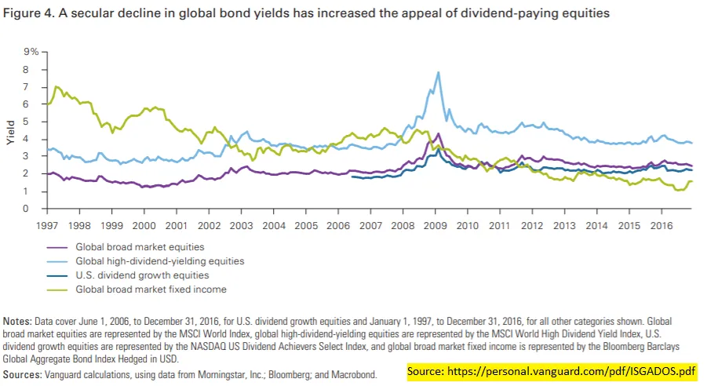
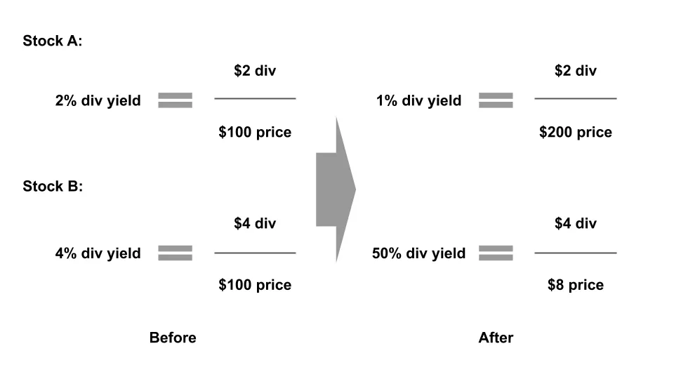
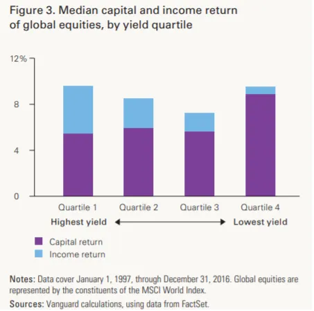

## 주요 정보

배당금 투자는 처음 생각보다 더 복잡한 점이 있습니다\.

## 배당금 수익률

에서 [footnote 8 of last week's post](/writing/stories 'footnote') 배당금이 자본 수익보다 덜 중요하다는 점을 무심코 언급했는데\, 이 주제에 더 많은 시간을 쓰고 싶지 않았기 때문입니다\.

오늘은 배당금에 대해 자세히 살펴보겠습니다\.

배당금 개요를 다룬 후 단점에 대해 논의하고\, 이야기를 복잡하게 만드는 다른 연구 링크로 마무리할 것입니다\.

언제나 그렇듯이\, 이 모든 것은 투자 조언이 아닙니다 [^1]\.

### 그 많은 현금을 어떻게 할까요

예를 들어\, 당신이 이익을 내는 상장 기업이라고 가정해 봅시다 [^2]\. 공급업체에게도\, 직원에게도\, 그리고 자신에게도 지불했으니까요\. 하지만 아직 더 많은 현금이 남아 있으니\, 그걸로 무엇을 할 수 있을까요\?

첫째\, 아무것도 하지 않는 거야\. 그냥 은행 어딘가에 그냥 두면 돼 [^3]\.

둘째\, 사업에 재투자할 수 있어요\. 제조 라인에 쓰고 싶었던 그 기계요\? 인사팀용 소프트웨어 제품\? [That Gulfstream G650 to get high?](https://www.wsj.com/articles/this-is-not-the-way-everybody-behaves-how-adam-neumanns-over-the-top-style-built-wework-11568823827 'WSJ') 아마 지금이 그것들을 살 때일지도 모른다\.

셋째\, 다른 사업을 인수할 수도 있습니다\. 아마도 저렴한 가격에 인수할 수 있는 작은 경쟁사를 찾아서 은행 동료들이 말하는 \'시너지\'를 얻어 시장 점유율을 키울 수 있을 것입니다 [^4]\.

넷째\, 일부 주식을 다시 매입할 수 있습니다\. 이렇게 하면 회사에 대한 소유권이 높아지고\, 회사가 잘 나가면 더 큰 수익 가능성을 얻을 수 있습니다\. 자사주 매입은 이 글의 범위를 벗어나며\, Cliff Asness의 초기 \(편향된\) 견해를 읽어보실 수 있습니다 [here.](https://images.aqr.com/-/media/AQR/Documents/Journal-Articles/Buyback-Derangement-Syndrome.pdf 'Cliff')

다섯째\, 투자자에게 배당금을 지급할 수 있습니다\. 투자자들이 가진 주식 한 주당 분기마다 현금을 나눠줍니다\.

항상 그렇듯이 단순화했지만\, 위의 행동들이 기업들이 자금으로 주로 하는 일들입니다\. CS의 그래프는 시간이 지나면서 이러한 행동들의 조합이 어떻게 변했는지 보여줍니다\:

오늘은 다섯 번째 행동\, 배당 지급에 집중하겠습니다\. 자본 구조의 이론적 무관성에 대해서는 생략하겠습니다 [^5]하지만 모딜리아니 밀러에 대한 복습 자료를 읽어보실 수 있습니다 [here.](https://pubs.aeaweb.org/doi/pdfplus/10.1257/jep.2.4.99 'MM')

### 배당금 평가

처음 보면 배당금이 투자자로서 좋게 들릴 것 같습니다\. 주식에서 현금을 돌려받는 것도 좋을 것 같습니다\. 이제 어떻게 평가할 수 있을지 살펴보겠습니다\.

회사 배당금이 5달러라고 하면 좋을까요\, 나쁜 일일까요\? 많은 금액처럼 들리지만\, 가격과 비교해보지 않으면 정말 알 수 없습니다\.

만약 5달러에 주식을 샀는데 5달러를 돌려준다면\, 그 금액은 높은 금액입니다\. 사실상 투자금을 회수한 셈입니다\.

만약 1만 달러에 주식을 샀는데 5달러를 돌려준다면\, 그 금액은 아마 별로 중요하지 않을 겁니다\.

그래서 우리는 다음을 알고 있습니다 **투자와 관련된 모든 것과 마찬가지로 가격도 중요합니다\.** 이를 반영하기 위해 배당수익률을 계산할 수 있는데\, 이는 단순히 배당금 금액을 가격으로 나눈 것입니다\. 배당 수익률을 서로 비교함으로써 어떤 주식이 \'높은\' 배당금을\, 어떤 주식이 \'낮은\' 배당금을 가지고 있는지 알 수 있습니다\.

참고로\, 관례상 배당금은 1200만 달러를 받습니다\. 대부분의 회사는 분기별로 배당금을 지급하므로\, 만약 한 회사가 분기당 1달러를 지급한다면\, 연간 배당금은 4달러입니다\. 세금도 무시하겠습니다 [^6]\.

배당을 지급하는 주식들 사이의 배당 수익률을 평가할 수 있게 해주는 것 외에도\, 이 수익률은 다른 증권들 사이에서도 비교할 수 있게 해줍니다\. 결국 수익률은 기대 수익률과 같으니까요\. 그래서 4\%의 배당 수익률과 1\%의 수익률을 비교해보고\, 다른 조건이 같으면 배당주가 더 높은 수익을 제공한다고 말할 수 있습니다\.

이것이 바로 우리가 이 작품에서 볼 수 있는 것입니다 [Vanguard report](https://personal.vanguard.com/pdf/ISGADOS.pdf 'Van')아래 그래프는 다음을 보여줍니다\. **지난 10\+년간 배당 수익률이 채권 수익률보다 높았습니다\.**

다시 보니 지금은 더 좋아 보입니다\. 채권보다 더 많은 현금 환급을 받는 장기간 기간인가요\? 그냥 모두 배당 수익률이 높은 주식을 찾아서 다 사야 할까요\? 무슨 함정이 있나요\?

### 총수익률\, 단순한 배당수익률이 아닙니다

첫 번째는 간단하며\, 이미 부분적으로 언급한 가격 문제입니다\. 높은 배당 수익률은 회사가 현금으로 많은 금액을 지급하여 비교적 작은 가격에 대해 비교적 큰 배당금을 받을 때 발생할 수 있습니다\. 또는 주가가 크게 하락하여 같은 비교적 큰 배당금이 상대적으로 작은 가격에 지급될 수도 있습니다\.

아래 예시에서는\, 50\%보다 1\% 분할 수익률이 훨씬 더 만족스러웠을 것입니다\. 그 이유는 그 상황이 그로 이어졌기 때문입니다\. 두 번째 경우의 가격 하락으로 인해\, 배당 수익률 \'증가\'로 인해 얻은 돈보다 훨씬 더 많은 돈을 잃게 되었습니다\.

고수익률이 지속될지조차 확신할 수 없습니다\. 왜냐하면 그 배당금이 미래에 보장되지 않기 때문입니다\. 기업들이 배당금을 삭감하는 것을 꺼리는 것은 사실입니다\. 주주들이 주식을 처분할까 두려워하기 때문입니다\. [However, that also menas that a company can cut its dividend when things are so bad they have no choice.](https://www.cnbc.com/2018/12/07/ge-makes-it-official-lowers-dividend-to-a-penny.html 'GE')

즉\, 우리는 **배당 수익률 외에도 가격 변동이라는 추가 요인을 고려해 보십시오\.** 이 자본 수익률\(가격 변동\)과 배당 수익률을 결합하면 원하는 성과 지표에 더 가까운 총수익률 수치를 얻을 수 있습니다\. 이제 언급하니 당연하게 들리지만\, 많은 투자 브로셔에서 자본 수익률 요소를 고려하지 않고 고배당주를 홍보하는 경우가 많습니다\.

자본 수익을 고려하면 무슨 일이 일어날까요\? 총수익의 구성 요소를 살펴보되\, 먼저 그것이 어떻게 보일지 추측해 봅시다\. 고배당 수익률 주식의 경우 대부분의 수익이 배당금에서 나온다고 생각할 수 있습니다\. 저수익\(또는 무수익률\) 주식의 경우 수익의 대부분이 가격 변동에서 이루어집니다\.

놀랍게도\, 우리가 발견한 것은 그렇지 않습니다\. 그 속에서 [Vanguard report](https://personal.vanguard.com/pdf/ISGADOS.pdf 'Van')저자들은 주식을 높은 배당률부터 낮은 배당률까지 4개의 버킷으로 분류했습니다\. 그 후 배당금 수익률과 가격을 비교했습니다\. 우리는 이를 확인할 수 있습니다 **자본 수익률이 총수익에 더 많이 기여했습니다\.** 고배당주도 포함해서요\.

더 흥미로운 점은\, [Miller Howard report](https://mhinvest.com/download.html?docId=2246 'Miller') 배당주를 10개의 버킷으로 나누면 대부분이 실제로 **성과가 저조했다** 지난 10년간의 S\&P 지수입니다\. 더 나쁜 점은\, 배당 수익률이 가장 높은 상위 지수가 가장 부진하다는 것입니다\. 이는 우리가 이전에 생각했던 것과는 완전히 반대되는 투자 전략을 의미합니다\.

### 상관관계 요인

두 번째 문제는 덜 명확하며\, 높은 배당 수익률과 상관관계가 있는 다른 요인들입니다\.

만약 우리가 상위 100개 주식을 높은 배당 수익률을 기준으로 선정했다고 가정해 봅시다\. 만약 그 모든 주식들이 공통점이 있다고 가정해 봅시다\. 예를 들어 [Emma Watson being on the board of directors](https://www.mugglenet.com/2020/06/emma-watson-joins-kerings-board-of-directors-to-advocate-for-sustainable-fashion/ 'Emma')아마도 배당수익이 중요한 것은 아니라\, 엠마의 스타 파워가 신비롭게 총수익에 영향을 미쳤을 수도 있습니다\.

실제로 사람들이 주식을 분류할 때 사용하는 공통적인 요소들이 있습니다\. 여기에는 가성비\, 회사 규모\, 가격 모멘텀 등이 포함됩니다\. 예를 들어\, 모든 소규모 회사를 한데 묶어 보면 소규모 기업이 대기업보다 더 좋은 성과를 낸다는 것을 발견할 수 있습니다\. 만약 충분히 강력한 증거를 찾았다면\, 소규모 기업들만으로 포트폴리오를 만드는 것도 좋습니다\.

이 요소들이 어떻게 만들어졌는지에 대한 설명은 생략하겠습니다\; 이에 대해 더 읽어보실 수 있습니다\. [Fama and French's five factor model here.](https://www.sciencedirect.com/science/article/abs/pii/S0304405X14002323 'model') 중요한 점은 배당 수익률 외에도 주식을 설명하는 다른 특징들이 있다는 것입니다\.

그 [Vanguard report](https://personal.vanguard.com/pdf/ISGADOS.pdf 'Van') 배당주를 두 가지 유형\, 1\) 높은 배당 수익률\, 2\) 높은 배당 성장률을 구분했습니다\. 그 후 이 그룹들이 위에서 언급한 공통 요인들과 얼마나 상관관계가 있는지 비교했습니다 [^7]\.

알고 보니 그룹 1이든 그룹 2든 많은 특징들이 상관관계가 있습니다\. 다시 말해\, 배당 요소를 무시하고 다른 요소들만 고려하면 배당주로부터 수익을 얻는 데 크게 도움이 될 것입니다\.

[Meb Faber went ahead to do just that,](https://www.cambriainvestments.com/wp-content/uploads/2017/10/DTAX-10.23.17.pdf 'Meb') 실제로 배당주가 아니더라도 배당주의 프로필을 복제할 수 있는 복합 포트폴리오를 만드는 것입니다\. 즉\, 그는 배당주와 같은 수익을 주는 주식을 찾았지만 실제로 배당을 지급하지 않는다는 뜻입니다\. 그의 연구 결과는 다음을 보여줍니다\. **이러한 포트폴리오의 수익률은 배당 포트폴리오를 능가합니다\.** 검은 박스 열을 오른쪽 나머지 열과 비교해 보세요\:

그리고 그 결과는 세금 신고 후 비교에서도 여전히 유효했습니다\:

## 결론과 합병증

요약하자면\,

1. 주식의 가격과 총수익률이 단순히 배당률보다 훨씬 더 중요합니다
2. 우리는 배당주를 의도적으로 제외한 대체 포트폴리오를 만들어 배당주의 긍정적인 요소를 복제할 수 있습니다\. 이는 배당주 포트폴리오보다도 더 우수한 성과를 냅니다

모든 투자와 마찬가지로 몇 가지 복잡한 점도 존재합니다\. 일부 연구자들은 연구 기간이 중요하다고 봅니다\. 연구를 10년보다 훨씬 오래 진행하면 배당금이 수익률에 미치는 중요성이 커집니다\. 다른 이들은 기업들이 현금을 생산적으로 사용할 수 있는 일이 거의 없으며\, 주주에게 반환하는 것이 주주들이 배당금을 재배당할 위치를 선택할 수 있게 하는 데 도움이 된다고 주장합니다\. 또 어떤 이들은 배당 성장이 건강한 기업의 대리 지표라고 말합니다\.

하지만 제가 본 연구들은 아직 Meb의 대안 포트폴리오 연구를 반박하지 않아서\, 저는 배당 투자에 대해 전반적으로 덜 열정적입니다\. 더 높은 수익과 세후 이점을 가진 포트폴리오를 만들 수 있다면\, 그게 더 나은 거래일 것 같습니다\.

아래 링크를 살펴보시고 설득력 있는지 확인해 보시길 바랍니다\:

1. [Is dividend investing dangerous?](https://blog.thinknewfound.com/2016/12/dividend-investing-dangerous/ 'Divd')
2. [Surprise! Higher Dividends = Higher Earnings Growth](https://www.researchaffiliates.com/documents/FAJ_Jan_Feb_2003_Surprise_Higher_Dividends_Higher_Earnings_Growth.pdf 'Divd')
3. [Dividends and the three dwarfs](https://www.researchaffiliates.com/content/dam/ra/documents/FAJ_Mar_Apr_2003_Dividends_and_the_Three_Dwarfs.pdf 'Divd')

[^1]: 저는 한 번도 투자 조언을 해본 적 없고\, 앞으로도 그럴 일 없습니다\. 저를 고소하지 마세요\, 저는 돈이 없습니다\.

[^2]: 요즘 생각보다 놀랍게도 드문 일이었지만\.\.\.

[^3]: 하지만 실제로는 그렇게 단순하지 않으며\, 기업들은 보유한 유동성 현금과 수익을 일부 반환하는 다른 화폐 수단을 관리하는 재무부가 있습니다\. 수십억 달러의 지폐를 가지고 있거나 당좌예금 계좌에 있는 사람은 거의 없습니다\.

[^4]: 시너지는 보통 수익 또는 비용 시너지 중 하나로 생각됩니다\. 수익 시너지는 더 많은 물건을 팔 수 있다는 점에서 오고\, 비용 시너지는 사람을 해고하는 데서 나옵니다\.

[^5]: 특정 가정 하에서는 회사가 어떻게 자금을 조달하는지는 중요하지 않습니다\. 그렇다면 자본 배분 정책은 본질적으로 동일합니다\.

[^6]: 배당금에 대한 세금 처리는 상황에 따라 다를 수 있습니다\. 하지만 보통 배당금으로 인한 순수익률은 상당한 세금을 내야 하므로 감소합니다\.

[^7]: 다른 분할을 원한다면 다음을 참고하세요\. [this other source doing a similar analysis](https://www.indexologyblog.com/2020/05/15/why-did-dividend-indices-underperform-during-the-coronavirus-sell-off/ 'div')
