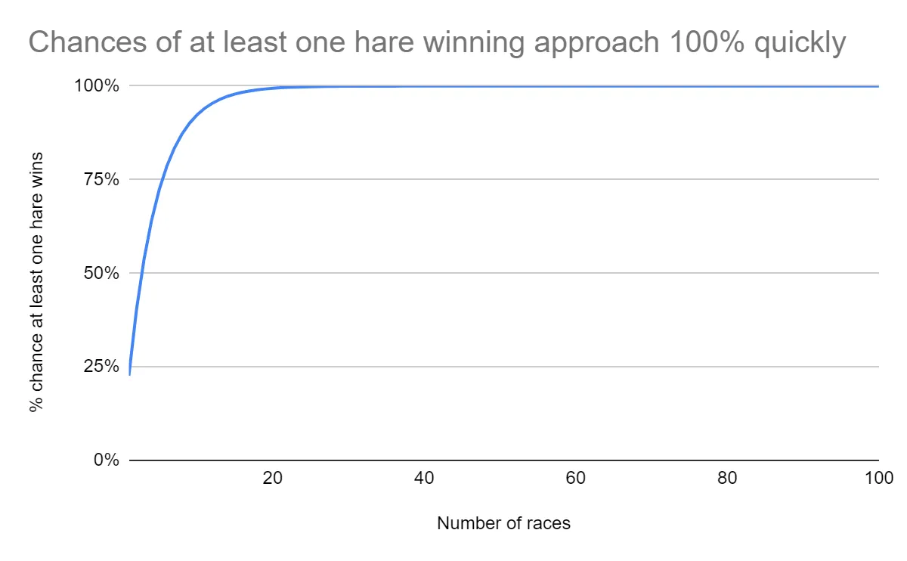

## 주요 정보

기업들은 위험을 감수할 동기가 없어 회사 내 혁신을 저해하고 스타트업이 이길 가능성을 높입니다\.

## 거북이 대 토끼

모두가 이 작품에 익숙하다고 생각하겠습니다\. [tortoise vs hare fable.](http://read.gov/aesop/025.html 'aesop') 토끼는 거북이와 경주하다가 잠들고\, 지고\, 평생 수치심 속에 살다가 폭로적인 글을 쓴다가 그때의 상황을 폭로한다 [all a shell game](https://en.wikipedia.org/wiki/Shell_game 'shell') [^1]\.

[Drawing on this post by Farnam Street](https://fs.blog/2016/07/james-march-the-trouble-with-genius/ 'FS')\, 수학을 조금 더 확장해 보자\. 그게 독자 절반을 즉시 겁먹게 하는 걸 알지만\, 아직 너무 놀라지 말자\. 최근에 1\+1을 잘못 더해서 15분을 수학 문제에 낭비한 사람으로서\, 나를 위해서라도 수학은 간단하게 유지하려고 한다 [^2]\.

1km 경주로를 생각해 봅시다\. 거북이가 1km를 달리는 데 100분\, 토끼가 1km를 달리는 데 20분이 걸린다고 가정하겠습니다\. 하지만 코로나 때문에 토끼의 수면 패턴이 엉망이 되었고\, 20분 간격마다 95\%의 확률로 잠을 자게 됩니다\. 다시 말해\, 0분부터 20분 사이에 깨어 있을 확률이 5\%\, 20분에서 40분 사이에 깨어 있을 확률이 5\%\, 그리고 40분에서 60분 사이에 깨어 있을 확률이 5\%입니다\.

토끼가 거북이를 이길 확률은 얼마나 될까요\?

중학교 확률을 기억하는 분들을 위해 설명하자면\, 다음을 통해 계산할 수 있습니다\. [binomial distribution formula.](https://online.stat.psu.edu/stat414/lesson/10/10.3 'binom') 공식은 다음과 같습니다\:

하지만 합산 기호와 느낌표를 붙이면 무섭게 보이고\, 수학은 간단하게 하겠다고 약속했어요\. 계산을 단축하는 한 가지 방법은 토끼가 잠들거나 깨어 있을 때 5개의 \'20분 블록\'이 있다는 것을 관찰하는 것입니다\. 토끼는 거북이보다 5배 빠르기 때문입니다\. 토끼가 한 번 깨어 있으면 이깁니다\. 그래서 토끼가 지는 유일한 경우는 그 모든 시간을 잠들었을 때입니다\. 이 계산은 훨씬 쉽습니다\. 왜냐하면 토끼 자신이 95\% 5배\, 즉 0\.95의 5의 거듭제곱을 곱하는 값이기 때문입니다 [^3]\.

이는 77\%가 되어\, 가정하에서는 토끼가 거북이에게 77\%의 확률을 잃고 23\%만 이긴다는 뜻입니다\.

이제 프레임을 조금 바꿔 봅시다\. 만약 100번의 경주를 뛴다면\, 토끼가 이기는 경주가 적어도 한 번은 나올 확률이 얼마나 될까요\?

토끼가 이기지 않는 경우는 단 한 가지뿐인데\, 그건 모든 경주가 거북이가 이기는 경우입니다\. 거북이 마피아가 또다시 게임을 조작하지 않았다고 가정하면\, 그 일이 일어날 확률은 77\% 자기 자신을 100번 곱하는 것으로\, 반올림은 0\%가 됩니다\.

즉\, 적어도 한 번은 토끼가 이길 가능성이 거의 확실합니다\.

수학 계산을 구글 시트에 입력해 뒀습니다 [here](https://docs.google.com/spreadsheets/d/1-_LV1ewb0D4DsERENaM_xp0oy8pHH7xWmAvNX8H9bdE/edit?usp=sharing 'sheet') 가지고 놀 수 있는 것들 [^4]\. 아래 그래프를 보면\, 토끼가 한 마리 이상 우승할 확률이 100\%에 가까워지는 경주도 그리 오래 걸리지 않는다는 것을 알 수 있습니다\. 기억하세요\, 이건 한 마리 토끼가 이기는 것이지\, 대부분의 토끼가 이기는 것이 아닙니다\.

하지만 수학보다는 핵심이 더 중요합니다\. **우리가 추론한 바는\, 어떤 일이 스스로 일어날 확률이 낮더라도 반복되는 게임은 그 사건이 한 번 일어나는 것을 보장한다는 것입니다\.** 복권에 당첨될 가능성은 낮지만\, 적어도 한 명은 당첨될 가능성이 높습니다\.

## 거북이 대 기술

이것을 기술 분야와 연관 짓자\. 기술 산업은 혁신을 자랑하지만\, 진보를 이끄는 것은 누적된 실패의 합산이라는 점을 주목해야 한다\. 이 시나리오에서 스타트업을 토끼로\, 대형 기존 기업을 거북이로 생각한다면\, 특정 스타트업이 기존 기업을 이길 확률은 낮지만\, 적어도 한 곳은 이길 가능성이 높다\.

대기업들이 막대한 수익 기회를 놓친 사례가 여러 번 있습니다\. 최근의 사례로는 마이크로소프트와 구글이 700억 달러 상당의 가치를 잃은 사례를 생각해 보세요 [(mkt cap of Zoom)](https://finance.yahoo.com/quote/ZM/ 'ZM') 그럭저럭 괜찮지만 훌륭하지는 않은 화상회의 제품을 가지고 있습니다\. 오래된 제품을 생각해보세요 [Xerox invented the mouse, graphical user interface, and the PC, but failed to follow up on them](https://www.forbes.com/sites/tendayiviki/2017/07/01/as-xerox-parc-turns-forty-seven-the-lesson-learned-is-that-business-models-matter/#eaf579075482 'xerox')\.

대부분의 회사들이 이 부분에 서툰 데에는 몇 가지 이유가 있습니다\. 첫째\, **사람들은 위험을 회피합니다\,** 즉\, 새로운 아이디어가 작동하기 위해 필요한 엄청난 실패를 용납하지 않는다는 의미입니다\. 프로젝트의 성공은 회사 단위가 아니라 개별 단위로 결정됩니다\. \"가장 가능성 높은 결과가 완전한 자원 낭비일 이 프로젝트를 지원할 수 있나요\?\"라는 말은 최고의 판매 슬로건이 아닙니다\.

문제는 천재성이 변덕스럽다는 점입니다\. 미친 결과를 원한다면 때로는 미친 사람들이 필요할 때가 있습니다\. 운\, 실력\, 혹은 둘의 조합\(더 가능성 높음\)이든\, 더 미친 프로젝트의 결과는 더 넓은 범위에 걸쳐 분포됩니다\. 아이폰 한 대에 백 가지가 있습니다 [cheetos lip balm](https://www.usatoday.com/story/money/2018/07/11/50-worst-product-flops-of-all-time/36734837/ 'cheetos') 절대 성공하지 못하는 프로젝트들\.

대부분의 사람들은 또한 다음과 같이 생각하기 때문입니다\. [outcomes rather than process,](https://www.schroders.com/id/uk/the-value-perspective/blog/all-blogs/outcomes-and-timeframes--with-annie-duke-part-3/?t=true 'annie') 프로젝트에 대한 판단은 이분법적입니다\. 성공 아니면 실패 중 하나입니다\. 그리고 기대값이 낮기 때문에 잠재적 보상이 높더라도 실패와 연관되길 원하지 않습니다\. 우리는 천재가 식별된 후에만 원하며\, 그 전에 손실을 감수할 준비가 되어 있지 않습니다\.

둘째\, 그리고 관련해서\, **인센티브 정렬이 부족합니다** 작은 프로젝트가 성공하기 위해 큰 회사에서 말이죠\. 대기업 사람들은 대부분 엑셀을 목표로 하기보다는 해고당하지 않으려 합니다\. 그럴 만한 이유가 있는데\, 대기업에서 창출되는 가치는 주로 회사에 돌아가고 당신에게는 돌아가지 않으니까요\. 반면 작은 회사 사람들은 회사가 파산하지 않도록 하는 데 집중하고 있습니다 [^5]\. 스타트업에 있는 사람들의 인센티브 정렬이 더 높아 1인당 평균 노력량이 더 높아집니다\.

기업들이 이 문제를 해결할 수 있을까요\? 가능성은 있지만\, 인센티브와 인재 관리는 악명 높은 분야입니다\. 사람들에게 시장 이상의 급여를 주거나 주는 것을 목표로 할 수 있을 것입니다 [15 percent time for special projects](https://www.fastcompany.com/1663137/how-3m-gave-everyone-days-off-and-created-an-innovation-dynamo '15')또는 직원들을 자극하기 위해 보상과 인정 프로그램을 제공하는 것도 좋습니다\. 하지만 일반 직원은 여전히 퇴근 후 넷플릭스 계획에 더 신경 쓸 가능성이 큽니다\. 특별한 실패 가능성이 높은 개인 프로젝트보다는 말이죠\. 어느 정도 자금이 있을 수는 있지만\, 그 추가 비용은 대부분의 회사가 정당화하기에는 너무 크다 [^6]

마지막으로\, **기업들은 \'집중\'하는 것을 좋아합니다\.** 보통 비용 절감이나 조직 개편을 위한 유행어입니다\. 예를 들어 [Ruth Porat took over as Google CFO.](https://www.bizjournals.com/sanjose/news/2015/07/15/google-reins-in-hiring-and-spending.html 'Ruth') 코로나 해고에서도 비슷한 상황이 벌어지고 있는데\, 대부분의 회사들이 PR 친화적인 이유로 \"무자비하게 우선순위를 정해야 한다\"고 말합니다\. 상황이 나쁘면 경영진은 좋은 것과 필수로 나누어 놓고\, 대부분의 혁신적인 프로젝트는 쓰레기더미로 떨어집니다\.

경제 상황이 좋더라도 프로젝트는 \"너무 작아서 영향력을 행사하지 못한다\"거나 \"확장되지 않는다\"는 이유로 자주 거절됩니다\. 에어비앤비를 메리어트에 제안하려고 한다고 상상할 수 있나요\? 시장 규모가 충분히 커서 시간을 투자할 만한 이유를 정당화하는 것뿐만 아니라\, 자신의 수익을 잠식하는 것이 왜 좋은 생각인지도 이해하기 어려울 것입니다\.

혁신은 쉽지 않으며\, 대부분의 곳이 결과를 판단하고 프로세스를 판단하지 않기 때문에 더욱 어렵습니다\. 만약 당신이 한 분야를 혁신하려는 스타트업이라면\, 무엇이 [base rate](https://en.wikipedia.org/wiki/Base_rate 'base') 성공은 실패에 대비해야 합니다\. 많은 실패가 있습니다\. 만약 당신이 계속 관련성을 유지하고자 하는 회사라면\, 거의 모든 인센티브 구조가 평균을 기준으로 설정되어 있다는 점을 인지하세요\. 그리고 **장기적으로 보면\, 평균은 무의미함을 의미합니다\.**

[^1]: \#Me로도 알려져 있습니다 [Tu](https://www.echineselearning.com/blog/chinese-character-tu-rabbit-beginner 'tu') 움직임\.

[^2]: 음\, 1 \- \-1이었고 머릿속으로 표지판을 틀렸으니 그렇게 나쁘진 않았어요\. 아니요\, 방어적으로 굴지 않아요\.

[^3]: 여기 숫자를 선택한 이유는 예시를 단순하게 하기 위해서입니다\. 토끼가 대부분 지고 몇 번의 간격만 있는 상황을 찾고 있었습니다\.

[^4]: 저는 확률 계산을 여러 가지 방법으로 해봤는데\, 여기 있는 계수 공식과 구글 시트의 이분법 함수를 사용해 두 함수가 동등하다는 것을 보여주기 위해서였습니다

[^5]: 요즘 스타트업에서 회사가 실패해도 직원들에게 그렇게 나쁘지 않은 일은 아닐 겁니다\. 특히 소프트웨어 엔지니어 역할이 많으니까요\. 그렇긴 해고당하는 건 여전히 힘들고\, 스타트업에서는 그런 일이 일어날 가능성이 더 높습니다\.

[^6]: 예를 들어\, 직원들이 사업에 절감되는 수익의 50\% 또는 비용 절감의 50\%를 받는 극단적인 상황을 상상해 봅시다\. 일단 측정 문제는 무시하겠지만\, 작은 변화가 수백만 달러를 절약할 수 있는 대기업에서는 충분한 동기부여가 될 것입니다\. 문제는 직원이 돈을 벌었지만 회사가 그렇지 못했다는 점에서 비롯됩니다\.
