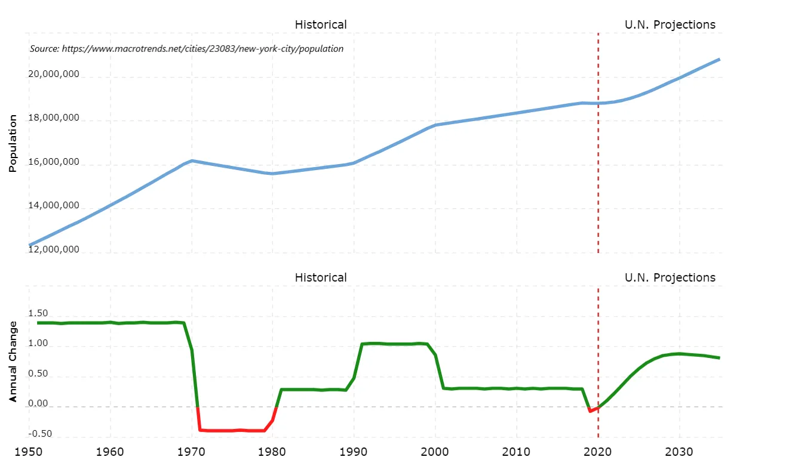

## 주요 정보

대도시의 죽음에 대한 예측은 과장된 것이며\, 대부분은 5년 이내에 회복할 것으로 예상합니다\.

## 뉴욕은 죽었고\, 뉴욕 만세입니다

최근 한 기사에서는 다음과 같이 선언했습니다 [NYC is dead forever.](https://www.linkedin.com/pulse/nyc-dead-forever-heres-why-james-altucher/ 'NYC') 인터넷 덕분에 도시 내 비즈니스\, 문화\, 식사\, 상업용 부동산\, 대학의 상실은 일시적인 상황에서 영구적인 결과로 변했습니다\. 결과적으로 이 기사는 사람들이 뉴욕을 떠나 다시는 돌아오지 않는다고 결론지었습니다\.

다른 대도시들에 대해서도 유사한 기사들이 작성되었습니다\. [such as SF.](https://www.sfgate.com/sf-locals/slideshow/I-m-finally-leaving-Stories-of-Bay-Area-203670.php 'SF') 제가 만난 몇몇 사람들도 자신이 있는 도시를 떠나고 싶다는 같은 감정을 반영했습니다\. 저는 도시 이동성에 대해 전문가가 아니며\, 이 부분은 좀 더 추측에 가깝습니다\. 대도시의 쇠퇴와 관련된 중요한 몇 가지 점을 살펴보겠습니다\.

저는 대도시들이 이 상황을 견뎌낼 것이라고 더 낙관적입니다\. 이 말을 수치로 표현하자면\, 저는 뉴욕시가 5년 후에 지금보다 인구가 더 많아질 것이라고 80\% 확신합니다 [^1]\. 참고로\, 최근까지 뉴욕은 연평균 0\.30\%의 성장률을 유지해왔습니다\.

<a href='https://www.macrotrends.net/cities/23083/new-york-city/population'>뉴욕시 대도시권 인구 1950\-2020</a>

도시를 고르는 것은 집을 고르는 것과 같습니다\. 대부분에게는 순전히 재정적인 결정이 아닙니다\. 만약 그렇다면\, 전국적으로 임대료가 훨씬 비슷할 것이고\, 원하는 아파트의 중간 임대료를 비교해 최적의 도시를 선택하는 것이 쉬울 것입니다\.

사람들은 도시를 평가할 때 각자의 고유한 우선순위를 가지고 있습니다\. 개인의 우선순위는 변할 수 있고\, 도시가 그 우선순위를 제공할 수 있는 능력도 변할 수 있습니다\. 도시가 더 이상 필요한 것을 주지 않으면\, 가능하다면\(가능하다면\) 이사를 해야 합니다\.

보통 그 사람의 우선순위가 변하는 속도가 도시의 능력 변화 속도보다 빠릅니다\. 대학 졸업 후 첫 직장으로 도시로 이사하고\, 가족을 위한 공간이 필요할 때까지 잠시 머무르는 것입니다\. 도시는 변하지 않았고\, 당신은 변했습니다\.

하지만 최근에는 도시들이 사람들을 끌어들였던 거의 모든 것을 잃었습니다\. 당신은 변하지 않고 같은 것을 원했을지 모르지만\, 도시는 변했습니다\. 기억한다면\, [pace layer](/writing/pace 'pace') 논의 중이지만\, 이 경우 \"거버넌스\"\, \"인프라\"\, \"상업\" 계층이 예상보다 훨씬 빠르게 진행되었습니다\.

이러한 변동성은 사람들의 사고방식 변화를 초래했습니다\. 원격 근무 장소에 대한 꺼려졌던 생각은 오스틴\, 텍사스에서 임대료가 얼마나 더 쓸 수 있는지에 대한 열정적인 평가로 변했습니다\. 많은 사람들에게 예전에는 상상할 수 없었던 일이 이제는 논리적인 선택이 되었습니다\.

하지만 이 두 가지 상황을 구분하는 것이 중요합니다\. 전자는 우선순위가 바뀌었고\, 이사 후 다시 도시로 돌아오지 않을 가능성이 큽니다\. 후자는 우선순위는 그대로지만\, 모든 멋진 장소는 당분간 닫혀 있습니다\. 장소가 다시 열리면 다시 돌아올 것입니다\.

마치 식당에 가는 것과 같습니다\. 더 이상 그 스타일의 음식을 좋아하지 않는다면\, 다시 돌아오지 않을 것입니다\. 좋아하는 요리가 항상 매진되면 방문 빈도는 줄겠지만 메뉴에 다시 오면 흥미를 가질 수 있습니다\.

### 도시 요인

도시를 매력적으로 만드는 몇 가지 요인들을 살펴보고\, 실제로 어떤 일이 일어났는지 살펴보겠습니다\. 저는 여기서 참고할 것입니다 [1970 paper on urban mobility](https://www.jstor.org/stable/490436?seq=5#metadata_info_tab_contents 'urban') 하지만 주로 제 의견을 덧붙입니다 [^2]\. 주요 주제는 사람들의 근본적인 욕구가 크게 변하지 않는다는 것입니다\.

주요 요인 몇 가지는 다음과 같습니다\:

- 작품
- 교육
- 사회
- 서비스
- 분위기\/문화

### 작품

많은 사람들이 일자리를 위해 이사합니다\; 저도 그랬습니다\. 그 일이 이제 어디서든 할 수 있다면\, 이사할 이유가 줄어듭니다\. 왜 기업들이 사무실로 다시 이사하고 싶어 할까요\?

냉소적으로 말하면\, 사무실이 있으면 회사가 직원들로부터 더 많은 시간을 뽑아낼 수 있습니다\. 그리고 일부 사람들은 재택근무를 하면서 더 생산적이지만\, 저는 평균적인 근로자의 생산성이 사무실을 떠난 이후로 떨어졌다고 느낍니다\. 결국 사람들을 다시 모으는 것이 더 빠르게 성장하는 한 방법입니다\.

또한 회의 사이의 무작위 대화가 실제로 중요하다는 인식도 있습니다\. 이로 인해 더 많은 기업들이 팀이 업무 외 시간\, 예를 들어 사회적 거리두기를 지키는 팀 모임 같은 방법을 찾게 되었습니다\. 사람들이 단순히 줌 해피아워에만 만족한다면\, 이런 활동이 제안되는 것을 못했을 것입니다\. 사람들은 직접 만나고 싶어 합니다\.

원격 근무가 반드시 전부 아니면 전무일 필요는 없습니다\. 만약 회사들이 직원들이 사무실에서 근무하는 날과 비는 날을 허용한다면\, 대도시는 여전히 중요합니다\. 사무실이 순환 근무를 한다면 원격 근무는 더 많은 사람들이 도시로 이주하는 결과를 낳을 수도 있습니다\. 예를 들어\, 사무실에는 A그룹\, 사무실에서는 B그룹이 한 달씩 근무하는 식입니다\. 이는 도시가 예전보다 두 배의 인력을 수용할 수 있음을 의미합니다\.

일의 종류도 중요합니다\. 더 많은 육체 노동은 원격으로 할 수 없기 때문에\, 그런 일자리는 도시에 머물며 규모의 경제를 제공합니다\. 이 부분은 서비스 분야에서 다시 다루겠지만\, 이것이 도시에 더 많은 고정성을 의미하지 않나요\?

그리고 때로는 간과되는 중요한 요소 중 하나는\, 완전 원격 근무를 허용하는 대부분의 회사들이 이사하는 도시의 생활비에 따라 급여를 조정할 의사를 명확히 밝혔다는 점입니다\. 이는 원격 근무에서 제공되는 혜택이 줄어든 간식\, 식사\, 기타 서비스의 혜택을 고려하지 않은 것입니다\. 어떤 사람들은 이를 받아들일 것이고\, 어떤 사람들은 꺼려할 것입니다\.

앞으로도 원격 근무 우선 또는 원격 전용 기업이 더 많이 생길 것이라고 생각합니다\. [Zapier, for example,](https://zapier.com/about/ 'Zapier') 한동안 원격 근무만 하고 있습니다\. 그래도 회사 행사는 여전히 대면 개최합니다\. 지금은 대부분에게 원격 근무가 일시적이라고 생각합니다\. 그리고 지속될 원격 근무 방식은 도시에 여전히 유리합니다\.

### 교육

많은 사람들이 학교 때문에 이사하기도 하는데\, 대부분은 대학 때문이에요\. 재택근무를 시작하니 지금 부모님 댁을 떠날 이유가 없어요\.

고등교육이 코로나를 견뎌내는지는 별개의 논의입니다\; 제 첫 생각은 대부분은 괜찮지만 몇 년 후 서서히 죽어갈 것이라는 것입니다\. 만약 그들이 앞으로 5년을 버텨낸다면\, 예산에 중요한 모든 활동\, 특히 대학 스포츠를 재개하기 위해 재개를 시도할 가능성이 더 큽니다\.

대학이 영원히 외진 곳으로 남는다면\(가능성은 낮지만\)\, 대학에 의존하는 곳들은 서서히 사라질 것입니다\. 하지만 이런 곳들은 정의상 교외나 농촌 지역일 가능성이 훨씬 높습니다\. 이 경우\, 교육 변화는 소도시와 대도시 모두에 나쁘거나\, 소도시에는 나쁘고 대도시에는 훨씬 덜 나쁜 것 같습니다

### 사회

많은 사람들이 도시의 사회적 환경에 대한 기대 때문에 이사합니다\. 그들은 같은 또래 사람들과 함께 있고 싶어 하며\, 새로운 친구를 만나고 싶어 하며\, 다른 사람들과 충분히 교류하고 싶어 합니다\.

이 연령대에서 벗어나는 사람들은 항상 있을 것입니다\. 가족이 생기고 사회적 우선순위가 바뀌었다는 것을 깨닫게 되면\, 바까지 10분 출퇴근하는 것보다 자녀 유치원까지 10분 통학하는 것이 더 중요합니다\.

그 노화 과정이 앞당겨져서\, 몇 년 안에 결정을 내릴 거라 생각했던 많은 사람들이 지금 결정을 내리고 있습니다\. 우리는 점점 더 많은 사람들이 대도시를 떠나는 모습을 볼 것입니다\. 그리고 지금 대부분의 사람들이 집중하는 부분은 도시에서의 총 유출 현상입니다\. 아마도 대부분의 글을 쓰는 사람들이 이 연령대에 있다는 점이 도움이 될 것입니다\.

그들보다 젊은 사람들 집단은 어떨까요\? 그들은 아직 우선순위가 바뀌기까지는 멀었습니다\. 만약 잘 된다면\, 더 낮은 임대료로 새로운 젊은 층이 도시로 이주해 활동이 감소하는 대신 다시 활발해질 수도 있습니다\.

코로나 속에서도 사람들이 해변 파티를 열고 있다는 사실은 사람들이 직접 만나는 사람들을 원하지 않는다는 가정 하에 회의적이에요\.

### 서비스

앞서 말씀드렸듯이\, 물리적 서비스는 여전히 집중될 것입니다\. 식품 유통업자라면\, 1천 명 인구에 판매하는 것과 10만 인구에 판매하는 것이 더 좋나요\?

도시가 지금의 규모를 갖게 된 것은 여러 서비스를 편리한 패키지로 묶어서 얻는데\, 그 가격은 그 지역의 임대료 가격과 비슷합니다\. 사람들은 원하는 것을 빠르고 쉽게 얻을 수 있는 편리함을 원합니다\. 의류점 근처에 식료품점을 두는 것은 도시에서 자연스럽고\, 농촌 주의 스트립몰에 식료품점을 두는 것도 마찬가지입니다\.

우리가 물건을 배달하거나 사람을 운송해야 하는 물리적 경험에 집착하는 한\, 위치는 여전히 중요합니다\.

### 분위기\/문화

도시의 분위기나 문화로 분류하기는 어렵습니다\. 하지만 다른 도시를 방문해본 적이 있다면\, 어떤 도시는 다르게 \'느낌\'을 느낄 수 있다는 것을 알 것입니다\.

문화는 역사\, 사람들\, 이야기 등 여러 가지를 통해 형성됩니다\. 도시에서 다른 사람들과 나누는 작은 상호작용에서 비롯됩니다\. 재택근무 상황에서는 도시가 이 모든 것이 변할 것이라는 것이 명확하지 않습니다\. 물론\, 문화를 구성하는 모든 사람들이 떠난다면 상황이 달라집니다\. 다른 섹션에서 언급했듯이\, 이 두 가지 모두 그렇지 않은 것 같습니다\.

## 도시는 오랫동안 지속되어 왔습니다

도시 사람들은 교외 사람들이 아무런 결과 없이 더 정상적인 삶을 누리는 모습을 보는 긴장감이 계속될 것입니다\. 많은 이들이 결국 이사를 선택하고\, 그 대가가 가치 있다고 판단할 것입니다\.

그리고 그게 문제의 핵심입니다 \- 도시에서 산다는 것은 항상 모두가 의식적이든 무의식적이든 상충해야 한다는 것이죠\. 정답이나 오답은 없고\, 그 사람의 상황에 더 적합한 답만 있을 뿐입니다\.

도시화 추세는 10년이나 100년에 걸친 추세가 아닙니다\. 이것은 계속해서 일어나온 일입니다 [for 5,000 years](http://metrocosm.com/history-of-cities/ '5k')\. 그리고 세계에서 가장 큰 도시임에도 [has changed over time](https://en.wikipedia.org/wiki/List_of_largest_cities_throughout_history 'city')흥미로운 점은 수년간 많은 도시가 여전히 큰 도시를 유지해 왔다는 것입니다\.

[^1]: 가능하다면 2025년 8월과 2020년 8월을 비교해보고 싶지만\, 아마도 2019년 12월과 2024년 12월\, 또는 2020년 12월과 2025년 12월을 비교해야 할 것 같습니다\.

[^2]: 논문을 대충 훑어봤지만 완전히 읽지는 못했습니다\. 많은 사람들이 인용하며\, 사람들이 왜 이사하는지에 대한 틀을 제공합니다\. 사람들이 이사하게 되는 이유와 새 집을 어떻게 찾고 평가하는지에 대한 논의가 있습니다\.
