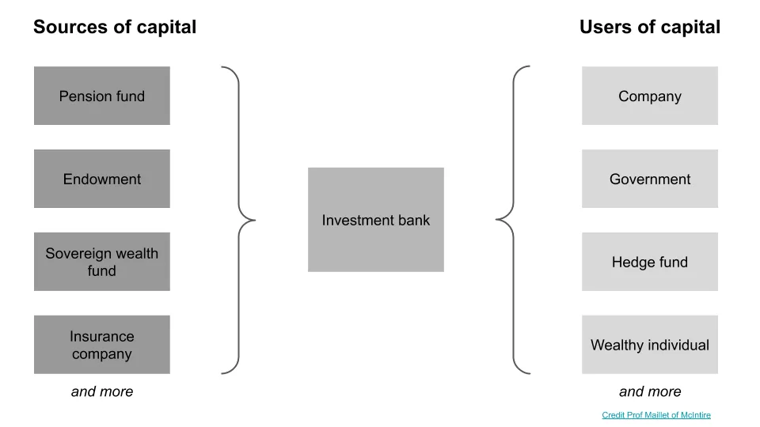

## 주요 정보

투자은행은 거의 투자에 초점을 맞추지 않고\, 금융 자본의 출처와 사용자를 연결하는 데 더 중점을 둡니다\.

## 투자은행 개요

최근에 투자은행이 실제로 무엇인지 몇몇 사람들에게 설명해야 했는데\, 여기서도 간단한 입문서를 해보려고 합니다\. 특히 기대와 현실의 불균형을 고려할 때\, 이 글이 좀 더 명확해지길 바랍니다\.

**투자은행은 일반적으로 투자에 관한 것이 아닙니다\.** 부모님은 그 점을 이해하지 못하셨지만요\. 덧붙여 말씀드리자면\, \"머천트 뱅킹\"이 언제 \"투자은행\"으로 바뀌었는지 어원을 찾으려고 했지만 아직 찾지 못했어요\. 혹시 아시면 꼭 연락해 주세요\.

JP 모건 같은 \'풀 서비스\' 은행은 거대합니다\. 네 가지 주요 사업 분야로 생각할 수 있습니다\:

이 글에서 투자은행 또는 은행업을 언급할 때\, 저는 특히 오른쪽의 파란색 사업을 말하는 것입니다\. 그리고 제 말을 편하게 하기 위해\, 주식 조사와 판매 및 거래 부문에 대한 논의는 제외하고 \'뱅커\' 칸에만 집중하겠습니다\. 주식 조사에 대해 언급한 바 있습니다 [here](/writing/sellside 'er') 로보어드바이저의 영향에 대해 논의할 때 말이죠\.

이제 우리의 범위를 알게 되었으니\, 투자은행 그룹은 무엇을 할까요\?

저는 항상 제 교수님이 사용하신 이 프레임워크를 좋아했습니다 [^1]\, 그리고 다음과 같습니다\:

은행은 중개인입니다\. 특히 금융 자본의 중개인입니다 [^2]\.

세상에는 자본을 가진 사람들이 많고\, 이를 활용하려는 사람들이 많습니다\. 예를 들어\, 연금 기금은 다각화를 원할 수 있고\, 기금은 더 높은 수익을 원할 수 있으며\, 기업은 또 다른 자산을 인수하려 할 수 있습니다\.

세상에는 자본이 필요한 사람들도 많습니다\. 예를 들어\, 한 회사는 사업 자금을 마련하기 위해 부채나 지분을 발행할 수 있습니다\.

은행의 사업은 **시장을 만든다** 두 그룹 사이에서 말이다\.

예를 들어\, 구글이 부채를 조달하려 할 때\, 은행은 얼마나 많은 부채를 조달할 수 있는지\, 누가 부채를 매입할지\, 그리고 부채가 어떤 조건으로 발행될지 결정하기 위해 협력합니다\.

일부 은행은 두 개의 큰 그룹으로 구성되어 있지만 모든 은행은 아닙니다\. **산업 관련 보도** 그리고 **제품 보장** [^3]\. 산업은 해당 산업 분야의 기업에 조언을 제공하는 것을 의미합니다\. 여기서 제품은 기업 금융 자문\, 주식 자본 시장\, 부채 자본 시장\, 레버리지 금융\, 인수합병과 같은 금융 상품을 의미합니다\.

산업 보장이 이해하기 쉽기 때문에 다양한 금융 상품에 대해 설명하겠습니다\.

**주식 자본 시장** 주식 관련 상품을 대부분 다루며\, 사모펀드\(회사가 비공개로 주식을 발행할 때\)부터 IPO\(기업이 공개적으로 주식을 발행할 경우\)까지 다양합니다\. 예를 들어\, IPO를 앞두고 있다면\, 함께 일하게 될 은행팀 중 일부가 ECM 뱅커들로 구성될 것입니다\. 이들은 영업팀과 협력하여 투자자와 소통하고 주식에 대한 수요를 파악하는 역할을 하게 됩니다\.

**부채 자본 시장** 보통 투자등급 부채 상품을 다룹니다\. \"등급\"이 무엇을 의미하는지 모른다면\, 잠시 후에 다시 설명하겠습니다\. 예를 들어\, 인수를 위한 채권 발행을 목표로 하는 회사라면\, 투자자 수요에 따라 받을 수 있는 이자율 등을 파악하기 위해 DCM 팀과 협력하게 됩니다\.

**레버리지 파이낸스** 보통 비투자등급 부채를 다룹니다\. 역사적으로 LevFin은 더 위험하고 이국적인 것으로 여겨졌으나\, [Michael Milken](https://en.wikipedia.org/wiki/Michael_Milken 'Mike') 사모펀드 레버리지 바이아웃에서 \'위험한\' 부채를 활용해 이 부문을 시작했습니다\. 그래서 투자자 유형이 다르고 원하는 조건도 다를 수 있기 때문에 별도의 팀이 있는 것입니다\. 예를 들어\, 투자등급 부채가 아닌 비투자등급 채권을 발행하는 회사가 약한 채무 계약을 대가로 더 높은 이자율을 받아들여야 할 수도 있습니다\.

**합병 및 인수** 기업들이 서로를 사고팔 때 언제 거래해야 하는지 다룹니다\. 예를 들어\, 작은 경쟁사를 인수하려고 한다면\, M\&A 은행팀과 협력해 평가를 받고 입찰 전략을 논의합니다\.

**기업 금융 자문** 재정 조언을 제공하는 팀이며\, 종종 부채 등급이나 행동주의 자문에 사용됩니다\. CFA 팀은 신용평가 기관들이 당신의 부채를 어떤 수준으로 평가할지 모델링하려고 합니다\. \"등급\"으로 돌아가서\, 모든 공공 채권 발행사는 자신들과 그들이 발행하는 채권에 \"등급\"을 부여합니다\. S\&P\, 무디스 등 몇몇 신용 등급 기관은 조건을 평가한 후 부채에 \"등급\"을 부여하는데\, 이는 부채의 위험도를 나타내는 것입니다\. 예를 들어\, 구글이 채권을 발행하면 \"저위험\" 등급을 받고\, 스타트업이 채권을 발행하면 \"고위험\" 등급을 받습니다\.

위의 모든 그룹을 다루는 가상의 예를 들어\, 당신이 또 다른 대기업을 인수하려는 대기업이라고 가정해 봅시다\.

업계 커버리지 팀과 협력하여 제품 관련 업무가 아닌 업무\, 예를 들어 거래 정당성을 입증하는 슬라이드 등을 담당하게 됩니다\. M\&A 팀은 입찰 가격과 인병 재무 전형을 평가하는 재무 모델을 구축하는 데 도움을 줍니다\.

큰 거래이기 때문에 모든 가능한 출처에서 현금을 모으는 것이 좋습니다\. 그래서 투자등급 부채\, 비투자등급 부채\, 그리고 사모 투자 투자 등 다양한 방법을 활용할 수 있습니다\. 이 과정은 DCM\, LevFin\, ECM 팀과 연결됩니다\. 부채 관련 업무를 한다면 CFA 팀도 등급을 추정합니다\.

거래가 성사되면 은행은 전체 거래 규모의 일정 비율을 가져갑니다\. 비율은 상품에 따라 다르지만\, 상상할 수 있듯이 은행가들이 더 큰 거래를 하도록 유도합니다\.

또한 대부분의 은행 자금은 실제 거래가 이루어질 때 만들어지므로\, 은행가들은 거래를 성사시키도록 동기부여가 됩니다\.

이제 은행이 무엇인지 알게 되었으니\, **은행가들이 실제로 가치를 더할까요\?**

지난 10년간 은행가들을 비난하는 것이 더 유행해졌고\, 일반 사람들은 은행가들이 대부분의 시간을 보내고 있다고 생각하게 되었습니다 [midget tossing](https://www.youtube.com/watch?v=EQlgrw31St0 'midget') 그리고 은행가라고 생각하는 평범한 임원들은 회사만큼 업계를 잘 알지 못합니다\.

모든 것과 마찬가지로\, 상황에 따라 다릅니다\. 모두가 중개인을 싫어하는데\, 자신을 위한 시장을 만들어야 할 때까지는 그렇지 않습니다\.

팔란티어 같은 \'잘 알려진\' 회사가 은행의 도움 없이도 IPO할 수 있다고 말하기도 쉽고\, 구글이 직접 부채를 발행할 수도 있다고 말할 수 있습니다\. 대기업은 보통 전직 은행가들로 구성된 재무팀을 보유하고 있으니\, 지식이 부족한 것은 아닙니다\. 특히 상장 기업이라면 투자자들과 정기적으로 연락하며 투자자 미팅을 해야 합니다\. 그리고 은행가들보다 업계 분야와 경쟁사를 더 잘 알아야 합니다 [^4]\.

\"덜 알려진\" 회사들은 그렇게 하기가 더 어렵습니다\. 만약 회사가 규모가 크지 않고 전담 팀이 없다면\, 가능한 한 많은 업무를 외주로 외주하는 것이 좋습니다\. 예를 들어\, IPO를 앞두고 어디서부터 시작해야 할지\, 누구에게 연락해야 할지조차 모를 때는 은행과 협력하는 것이 더 합리적입니다\. 또는 회사를 매각하고 싶지만 공개적으로 매물로 나오고 싶지 않다면\, 은행가들이 도움이 될 수 있습니다\.

게다가 항상 \'내 엉덩이를 지켜줘\'라는 요소가 있는데\, 은행가들이 인수에 대해 편견 없는 제3자 의견을 내는 것입니다\. 은행이 회사를 10달러로 평가했다면\, 10달러를 제안해서 과다 지불했다는 이유로 소송을 당할 가능성이 줄어듭니다\.

은행가들이 기술이나 최신 금융 혁신에 의해 중개자가 사라진다는 대중적인 이야기가 있습니다\. 은행가들이 가치를 더하기 위한 더 나은 방법을 계속 찾아야 한다는 데는 동의하지만\, 투자은행이 곧 사라질 것 같지는 않습니다\. 예측을 하자면\, 90\% 확신하자면\, \'투자은행\' 역할은 20년 후에도 여전히 존재하며\, 그 필수 서비스는 금융 중개자일 것이라고 말할 수 있습니다\. 설령 회사가 바뀌더라도 말이죠\. 냉소적으로\, 모든 부채와 주식 발행이 어떤 기술 플랫폼에서 이루어진다 해도\, 기업들은 문제가 생겼을 때 책임을 돌릴 사람이 필요합니다\.

[^1]: [Prof Maillet of McIntire](https://www.commerce.virginia.edu/faculty/pam5x 'prof')

[^2]: 가끔 인적 자본도 있지만\, 보통 의도하지 않고 드뭅니다

[^3]: 이제는 어떤 보험사들이 어떤 구조를 가지고 있는지 기억이 잘 나지 않습니다\. 대안은 두 가지 기능을 모두 수행하는 단일 산업 그룹을 갖는 것입니다\.

[^4]: 은행은 경쟁사를 보장하지만\, 실제 거래의 경우 은행가가 두 경쟁자를 동시에 보장하지 않도록 \'상합\' 절차가 있는 경우가 많습니다
