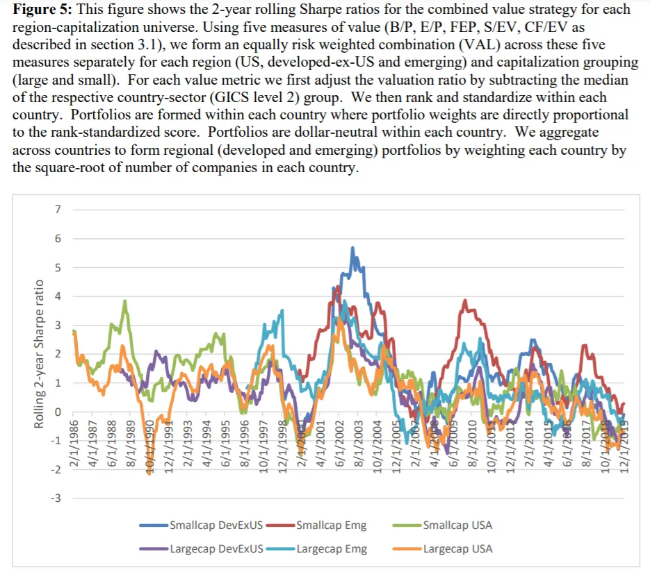
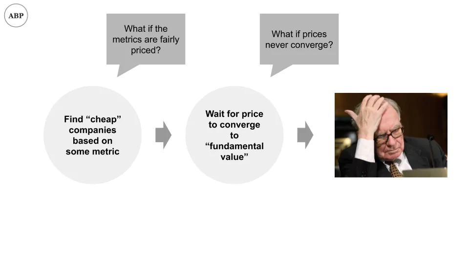
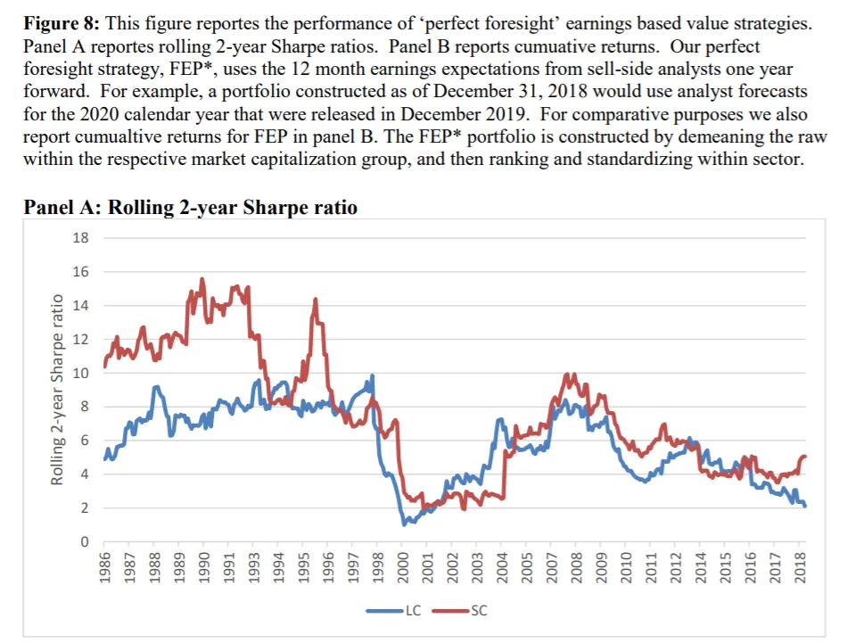

## 주요 정보

AQR은 가치투자의 성과\(부정\)\, 가치투자에 대한 흔한 비판\(무효\)\, 그리고 가치투자가 효과가 없었던 이유\(타당한가\?\)에 대한 자체 설명을 제시합니다\.

## 평가

우리가 이야기한 적 있죠 [whether investment bankers add value](/writing/ib_value 'bank') \(아마도\?\)\, [whether companies add value](/writing/company_value 'co') \(우리가 생각하는 것보다 적은\) 그리고 이번 주에는 가치 투자가 가치를 더하는지 살펴보며 가치 시리즈 \[\^1\]를 마무리할 것입니다\.

논문 [Is (Systematic) Value Investing Dead?](https://papers.ssrn.com/sol3/papers.cfm?abstract_id=3554267 'paper') 로넨 이스라엘\, 크리스토퍼 라우르센\, 유명 투자회사 AQR의 스콧 리처드슨이 가치투자가 여전히 효과가 있는지 논의합니다\. 다음은 다음과 같습니다 [an earlier paper this year](https://papers.ssrn.com/sol3/papers.cfm?abstract_id=3525096 'paper') 가치투자를 투자 요인으로 대중화한 Fama와 French 교수들은 최근 몇 년간 가치투자 수익률이 감소했다고 결론지었습니다 \[\^2\]\. 즉\, 더 이상 가치투자자가 되는 것은 좋지 않습니다\.

AQR 논문은 \(놀랍게도\) 최근 부진한 성과에도 불구하고\, **가치투자\(그들의 정의에 따르면\)는 죽지 않았습니다\:**

> 이론적\, 실증적 관점 모두에서 기본적인 정보에 대한 기대는 증권 수익의 중요한 동인이었고 지금도 그렇습니다\. 또한 가치 투자에 대한 일련의 비판을 다루고 있으며\, 이들이 대체로 실질적으로 부족하다고 판단합니다\.

논문은 먼저 가치투자가 무엇을 의미하는지 정의하고\, 비판을 다룬 뒤\, 가치투자가 더 잘 작동하도록 기준을 어떻게 추가하는지 마무리합니다\. 또한 57페이지 분량이니\, 훨씬 적은 기간 동안 요약해 보겠습니다\. 평소처럼 그 과정에서 생각을 덧붙이겠습니다\.

## 정의

가치 투자가 정확히 무엇을 의미하나요\? 만약 \'싸게 사고 비싸게 파는 것\'을 의미한다면\, 정의상 모든 사람은 가치 투자자입니다\. 무언가를 산 가격보다 적게 팔아서 돈을 벌 수 있는 것은 아닙니다 \[\^3\]\.

만약 \"회사 주가를 싸게 보이게 하는 어떤 기준에 따라 투자하라\"는 의미라면\, 훨씬 더 관리하기 쉬운 문제가 생깁니다\.

그래서 정의가 중요합니다\. 만약 \"나중에 설거지를 해요\"에서 \"나중에\"가 2주 후를 의미한다면\, 그들이 \"오늘 밤 늦게\"를 의미한다면\, 문제가 생길 겁니다\.

우선\, 우리는 \'가치\'가 무엇을 의미하는지 정의하고\, 그 정의를 사용해 주식을 \'좋은 가치\/저렴한 주식\'과 \'나쁜 가치\/비싼 주식\'으로 분류해야 합니다\.

파마와 프렌치는 처음으로 \'가치\'라는 개념을 투자 요소로 대중화했습니다\. [1992 paper](https://rady.ucsd.edu/faculty/directory/valkanov/pub/classes/mfe/docs/fama_french_jfe_1993.pdf 'paper')\. \"가치\"란 회사를 평가하는 데 사용할 수 있는 계산 가능한 지표를 의미했습니다\. 원래 논문에서는 회사의 \"장부가치\"와 \"시장 가치\"를 기준으로 사용했으며\, 회계 번호의 장부 자본가치와 회사의 상장 주식 가치 \[\^4\]의 비율을 계산했습니다\. 비율이 낮으면\(장부에 대한 낮은 대비\) 회사는 저렴했습니다\.

시간이 지나면서 사용되는 비율은 다른 일반적으로 사용되는 지표들로 확대되었습니다\. AQR 논문은 가치 정의로 다섯 가지를 사용합니다\:

1. 책에서 가격까지\, 방금 언급한 내용
2. 수익 대비 가격\, 즉 순이익이 시가총액에 대비한 비율
3. 선행 이익 대비 주가\, 즉 매도자 측 연구 분석가가 시가총액보다 미래 이익을 예측한 경우입니다
4. 기업 가치로의 판매\. 이 글에서는 기업 가치와 자본 가치의 차이를 논의할 수 없습니다\; 잘 모르신다면 동일하게 취급하시면 됩니다 \[\^5\]
5. 현금 흐름과 기업 가치 대비

이 모든 것이 이해가 안 된다면 괜찮습니다\. AQR이 공개된 비교적 객관적인 수치를 바탕으로 주식이 싸운지 아닌지를 측정하는 다섯 가지 방법을 제시한 것으로 생각해 보세요\. 우리는 그 기준에 기반해 체계적으로 가치 투자를 하기 위해 이것이 필요합니다\. 그렇지 않다면\, \'가치\'가 작동하는지 판단할 방법이 없습니다 \- 당신이 싸다고 말하는 것이 저에게는 비싸 수도 있습니다 \[\^6\]\.

**일반적인 아이디어는 \'저렴한\' 회사에 투자하고\, 가격이 회사가 \'가져야 하는\' 가치에 수렴하기 때문에 덜 싸면 이익을 얻는 것입니다\.**

작동할 것 같지 않나요\? 음\, 한번 볼게요\.

## 비판

그들이 발견한 것은 다음과 같습니다\:

> 전체 표본 기간 동안 체계적 가치 전략은 긍정적인 위험 조정 수익을 창출했습니다\. 하지만 지난 10년간 체계적 가치 전략의 성과는 현저히 감소했습니다

이들은 시간이 지남에 따라 다양한 가치 전략에 대해 샤프 비율을 제시하는 그래프에서 이를 확인할 수 있습니다\. 샤프 비율에 익숙하지 않은 분들을 위해 설명하자면\, 이를 \'초과 수익\'이라고 생각하세요\. 높을수록 좋습니다\. 아래 그래프에서 2011년 이후의 경우를 주목하세요\. **수익이 다 줄어들고 낮은 수준에 머물게 돼\. 그건 안 좋은 일이야\.**

왜 이런 일이 일어나고 있을까요\? AQR 팀은 이러한 \'체계적 가치 투자\' 전략에 대한 다섯 가지 흔한 비판을 살펴보며\, 이를 설명할 수 있습니다\. 결국 대부분의 비판을 거부하고 자신들만의 설명을 제시합니다\.

비판 \#1은 \'가치 지표\' 중 하나인 Book to Price에 관한 것입니다\. 사람들은 한동안 이 특정 지표가 구식이라고 말해왔고\, AQR도 대체로 동의합니다\. 회귀 수학은 건너뛰겠습니다 \[\^7\]\; 요약은 다음과 같습니다 **Book to Price는 잘 작동하지 않아요\,** 특히 수익 대비 주가\(Earnings to Price\)를 고려한다면 더욱 그렇습니다\. 하지만 AQR은 다음과 같은 추가 사항도 포함합니다\:

> 가치 전략에서 수익을 얻고자 하는 자산 소유자와 자산운용사에게 이는 어떤 의미일까요\? 내재 가치의 한 가지 기본 기준에만 집중하는 것은 성공적인 전략이 될 가능성이 낮습니다\. 대신 가격과 비교하기 위해 다양한 기본 지표를 활용해야 합니다

> 가치 측정에 있어 시야를 넓혀야 합니다\. 장부 가치가 가격의 유일한 기본 기준은 아닙니다

그럴 만하다고 생각하지만\, 측정 지표 추가와 \'시평선 확장\'을 논란의 여지가 없는 것으로 무시하는 것에는 이견이 있습니다\. 만약 우리가 어떤 근본적인 기준을 추가하는 것을 괜찮게 생각한다면\, 결국 가치 투자가 무엇인지 정의하는 원점으로 돌아가게 될 것입니다\. 누군가는 \'사용자 조회수와 인원 수\' 측정을 추가하고 그것이 \'가치\' 측정이라고 주장할 수 있습니다\.

비판 \#2는 최근 기업들이 주식 자사주를 더 많이 하는 점에 관한 것으로\, 이는 지표가 잘못되어 가치투자가 제대로 작동하지 않을 수 있다는 점입니다\. AQR은 다음과 같이 발견했습니다 **자사주분 양은 가치 성과에 큰 영향을 미치지 않았습니다\:**

> 주가매입강도 구획 전반에 걸쳐 가치 포트폴리오의 성과를 살펴보면\, \'고\' 자사주 매입 하위 샘플에서 가치가 덜 잘 작동한다는 혼합된 증거만을 볼 수 있습니다\.

그들이 가치투자가 낮은 주식 매입 시 잘 된다고 말하는 것이 아니라\, 주식 매입이 어느 쪽이든 별로 중요하지 않다는 뜻입니다\.

비판 \#3은 기업들이 브랜드 파워와 같은 무형의 자산 가치를 더 많이 가지고 있는데\, 이는 전통적인 대차대조표에서 과소보고된다는 점입니다\. 예를 들어\, 디즈니는 강력한 브랜드를 가지고 있는데\, 이는 회계 수치가 아니라 주가에 반영됩니다\. 만약 그렇다면\, 어떤 재무 지표를 사용하는 것이 잘못될 수 있습니다\.

AQR은 이러한 모든 효과를 조정하기 위해 크레디트 스위스의 프로세스를 차용합니다\. 자세한 내용은 생략하겠습니다 \[\^8\]\, 하지만 그들은 다음과 같이 결론 내립니다\. **이러한 무형의 요소들도 가치의 성과를 설명하지 못하는 것 같습니다\:**

> 최근 가치 전략의 부진은 재무보고 시스템의 결함을 보완하려는 가치 지표에도 확장됩니다\. 무형재의 중요성 증가나 비즈니스 모델의 변화가 가치 전략의 부진을 설명할 가능성은 낮아 보입니다\.

비판 \#4는 저금리 환경이 가치 투자를 덜 매력적으로 만들었다는 점입니다\. 이번에는 AQR이 다음과 같이 발견했습니다 **낮은 금리는 가치에 영향을 미치지만\, 약하다고 주장합니다\:**

> 그러나 가치 전략의 성과가 미국 및 국제 주식의 수익률 곡선 기울기 변화와 양의 상관관계가 있다는 증거도 있습니다\(즉\, 수익률 곡선이 평탄해질 때 가치주가 부진합니다\)\. 이 관계는 약하며 수익률의 매우 미미한 부분만 설명합니다

수익률 곡선에 익숙하지 않은 분들을 위해 말씀드리자면\, 채권이 지불하는 금리라고 생각하세요\. AQR은 위에서 암시한 것처럼 수익률 곡선을 예측할 수 있다면\, 주식보다는 채권에 직접 투자하는 것이 더 나을 것이라고 덧붙입니다\:

> 그리고 만약 수익률 곡선 형태의 변화를 예측할 수 있는 능력이 있다면 채권을 직접 거래하는 것이 합리적이지 않을까요\?

저는 이 두 가지 모두에 동의하지 않습니다\. 사람들이 주식에 머무는 데에는 여러 이유가 있습니다 \- 주식시장은 더 유행하고 더 \'명망 있는\' 분야이며 진입 가능성이 더 높기 때문입니다\. 또한\, 제가 전에 쓴 바와 같이\, [low rates imply people should take more risk](/writing/capital 'risk')가치 투자는 본질적으로 위험이 적다는 것을 의미합니다\.

비판 \#5는 가치투자에 대해 너무 많은 사람들이 알고 있어서 \'혼잡\'해져 수익률이 떨어졌다는 점입니다\. **AQR은 가치투자가 혼잡해졌다는 데 동의하지 않습니다** \(투자 전략으로서 더 널리 알려진 방법\) 그리고 증거는 정반대라고 말합니다\:

> 만약 모두가 인지하고 상당한 자본이 투입되었다면\, 자연스러운 결과는 \'가치 스프레드\'가 크게 압축되는 것입니다\. 즉\, 더 저렴한 주식이 더 비싼 주식에 비해 오늘날 덜 싸게 보일 것입니다 \\\[\.\.\.\\\] 오히려 최근 몇 년간 가치 스프레드가 넓어져 혼잡이 원인이 최근 하락의 원인은 어렵습니다\.

이것은 일화적 증거와도 연결됩니다 \- 잘 알려진 \'가치\' 투자자들이 최근 몇 년간 부진한 성과로 뉴스에 오르곤 했습니다\. 만약 그렇다면 점점 더 많은 유한책임 파트너들이 자본을 인출하기 시작했고\, 단기적으로 \'가치\'에 투입되는 자본은 더욱 줄어들 것입니다\. 보통은 이런 \'저렴함\'을 이용하려는 사람들이 오지만\, 때로는 그렇지 않을 때도 있습니다\.

## 추가 시설

이것이 AQR의 결론으로 이어집니다\. 최근 \'가치투자\'의 부진한 성과가 원인이라고 생각하는 이유입니다\:

> 가치 지수가 가장 부진할 때는 저렴한 주식의 펀더멘털 악화\(평년보다 크게 크지는 않음\)와 가격과 펀더멘털 간 격차가 벌어지면서\(평균보다 훨씬 더 커짐\) 때문입니다\.

가치투자가 어떻게 작동할 수 있는지에 대한 우리의 간단한 모델을 떠올려 보세요\. 만약 1\) 당신의 지표가 이미 모든 것을 공정하게 가격에 내놓고 있거나\, 2\) 가격이 근본적인 가치에 수렴하지 않는다면\, 투자 전략은 실패할 것입니다\.

AQR은 \(1\) 사실이 아니며\, \(2\) 원인이라는 주장을 위에서 작동합니다\. 즉\, 현재 가격이 기본적인 정보와 무관한 긴 기간 동안 움직이고 있다는 것입니다\:

> 이전 결과와 일치하듯\, 펀더멘털은 주식 수익률에 중요하지만\, 주가가 펀더멘털 정보와 덜 연결되는 시기가 있어 가치 전략이 저조한 성과를 내는 시기가 있습니다\. 이런 일은 이전에도 있었고\, 지금도 일어나고 있으며\, 앞으로도 다시 일어날 가능성이 큽니다\.

그들은 \'완전 정보\'를 기반으로 투자 포트폴리오를 만들고\, 매도자 측 연구 예측을 \'일찍\' 가져와 이를 바탕으로 \'과거 예측\'을 만들어\, 즉 2019년에 한 추정치\(이미 2018년이 알려져 있음\)를 사용해 2018년 포트폴리오를 만드는 방식으로 이를 증명합니다\.

\"완전 정보\"를 사용하기 때문에 포트폴리오는 좋은 성과를 냅니다 \- 만약 사전에 회사 실적 보고서를 알고 있다면 평균적으로 수익을 낼 수 있을 것입니다 \[\^9\]\. 이제 흥미로운 질문은\, 얼마나 많은 추가 수익을 얻을 수 있는지\, 그리고 시간이 지남에 따라 그 수익이 어떻게 변할지입니다\. AQR은 이 \"초과 수익률\"도 최근 몇 년간 감소했다고 밝혀\, 근본적인 수익 정보가 최근에는 덜 중요해졌음을 시사합니다\. 아래 그래프가 2007년 이후 하락 추세를 보이는 것을 주목하세요\:

이 설명은 그리 만족스럽지 않습니다\. 왜냐하면 \"가치의 중요성을 믿는 사람이 적어지기 때문에 효과가 떨어진다\"는 것과 같기 때문입니다\. 하지만 그 안에는 상당한 진실이 담겨 있습니다\. 앞서 언급한 글을 떠올려 보세요 [stories and stocks](/writing/stories 'story')이 글에서 저는 이야기의 중요성을 주장합니다\. 사람들이 전체적으로 \'성장\'이 더 중요하다고 결정한다면\, 이는 시장에서 자기강화적인 피드백 루프를 형성합니다\. 이것은 보통 경제 주기가 필요하지만 아직 완전히 못했습니다\.

\[\^1\] 이번 달 초부터 계획된 일이었다고 말하고 싶지만\, 우연의 일치였다\. 
\[\^2\] 본문을 단순화하자면\, 실제로 1963년 7월부터 2019년 6월 기간 후반부에 반환이 감소했지만\, [there's not enough data yet to conclude if value investing as an investment factor works or not.](https://www.institutionalinvestor.com/article/b1k3pd2z3ptx9g/Ken-French-There-Is-No-Way-to-Tell-If-Value-Premium-Is-Disappearing 'ii') 여기서 투자 계수는 특정 의미로 사용하고 있는데\, 즉 투자 포트폴리오를 가중치로 판단하는 필터 가능한 기준으로 사용한다는 점을 주목하세요\. 
\[\^3\] 내가 무슨 요점을 알면서도 억지로 인한 보험 전략으로 \@하지 마\. 
\[\^4\] 사람들은 반대로도 사용한다\. [price to book](https://en.wikipedia.org/wiki/P/B_ratio 'pb')\. 계산에 대한 자세한 내용은 링크를 참조하세요\. 
\[\^5\] \"EV는 총 주식 시가총액\, 우선주\, 소수 지분\, 총 부채의 합으로 계산됩니다\. 후자의 세 가지 구성 요소는 시장 가치가 아닌 장부 가치를 기준으로 합니다\. 이는 전 세계 기업 샘플에서 신뢰할 수 있는 시장 데이터를 얻기 어렵기 때문이며\(대부분 기업에서 장부와 시장 가치 차이는 작을 가능성이 큽니다\)\" 
\[\^6\] 물론 이것이 문제를 완전히 해결하지는 않으며\, 오늘날에도 많은 사람들이 정의와 측정에 대해 논쟁하는 이유입니다\. 하지만 문제 진술을 더 쉽게 탐구할 수 있는 한 가지 방법이므로\, 더 나은 대안이 없어 이 방법을 계속 사용하겠습니다\. 
\[\^7\] 자세한 내용은 pdf 16쪽에 있습니다\. \"표본을 가장 큰 주식에만 제한하고 단순 정렬 포트폴리오에 집중한다면\, E\/P가 있을 때 B\/P는 중요하지 않습니다\.\" 
\[\^8\] PDF 24쪽\. 마이클 모부신을 아신다면\, CS HOLT의 조정은 그의 연구와 관련이 있습니다\. \"이를 위해 우리는 크레디트 스위스 HOLT의 데이터를 사용합니다\. 구체적으로\, HOLT는 특별 항목\, 감가상각\, 이자 비용\, 임대료\, 소수 지분 및 기타 기타 독점 경제 조정을 반영한 순이익으로 계산된 인플레이션 조정 총현금 흐름을 구성합니다\(CF HOLT\)\. 
\[\^9\] 재미있게도\, 항상 돈을 버는 건 아니에요\. 초기 실적 정보를 얻기 위해 SEC를 해킹한 사례가 있었는데\, 100\% 완벽한 정보를 얻었지만\, 실제로 돈을 버는 비율은 70\% 정도였던 것 같아요\.
