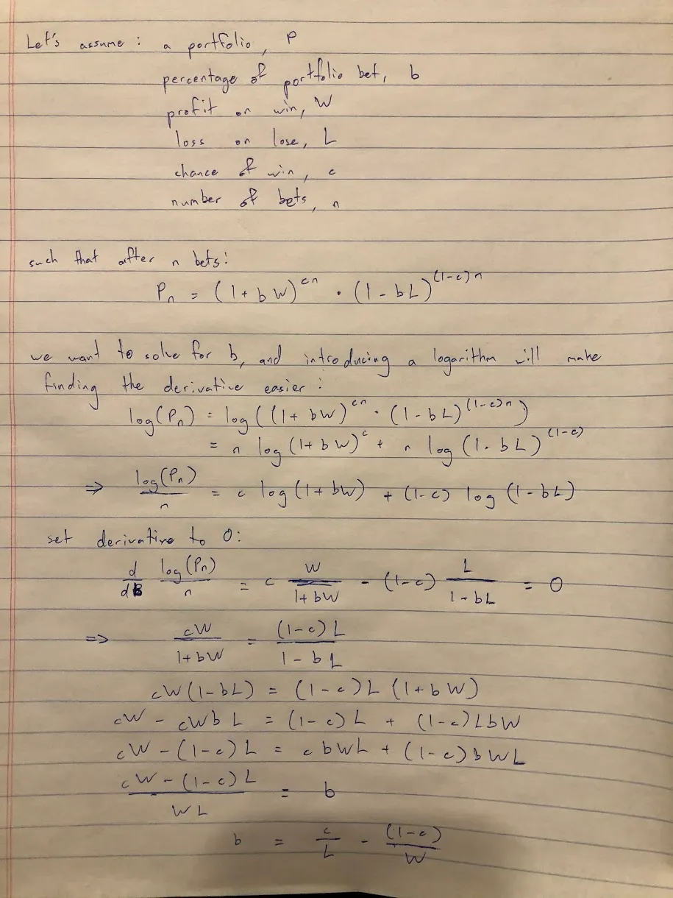

## 주요 내용

1. 켈리 기준은 포트폴리오 크기를 수학적으로 정하는 방법이지만\, 가정에 주의해야 합니다
2. HASH\.ai 에이전트 기반 시뮬레이션을 더 쉽게 만들고 있습니다\; 저는 시작 실패율을 모델링하려고 노력합니다

## 1\. 포트폴리오 크기 선정에 대한 켈리 기준

사라는 엔젤 투자자를 꿈꾸고 있습니다\. 그녀의 친구 니콜라스\, 앨리슨\, 체이스는 해충 퇴치와 관련된 마법 같은 사업 아이디어를 내고\, 사라는 그것이 대성공할 것이라고 생각합니다\.

사라는 평생 세 번치 저축을 이 사업에 투자하려던 참이었는데\, 다른 친구들이 있었다 [^1] 세스\, 마크\, 엠마\, 앰버는 토끼가 관련된 흥미로운 아이디어를 제시합니다\.

사라는 여러 선택지가 있다는 것을 깨닫고\, 무엇을 해야 할지 확신이 서지 않는다\. 그녀는 투자 분야를 면밀히 관찰하는 나이 든 친구 앤서니에게 상담하러 간다\. 앤서니는 그녀가 올바른 길을 가고 있다고 말한다 \- 포트폴리오 배분과 위험\/보상 비율이 성공적인 투자자가 되는 열쇠라고 말한다\. 그는 또한 그녀가 다음에 대해 읽어보는 것이 좋을 것이라고 덧붙인다 [Kelly criterion,](https://www.princeton.edu/~wbialek/rome/refs/kelly_56.pdf 'Kelly') 베팅 크기 계산 공식\.

켈리 공식은 벨 연구소의 존 켈리가 개발했습니다\. 몇 가지 입력을 받아 다음과 같은 결과가 나옵니다\. **어떤 것에 베팅할 수 있는 자본의 최적 비율\,** 장기적인 수익을 극대화하고 싶다는 가정 하에요\. 부록에 간소화된 도출 과정을 올렸고\, 찾으실 수 있습니다 [here](https://blogs.cfainstitute.org/investor/2018/06/14/the-kelly-criterion-you-dont-know-the-half-of-it/ 'derive') 원본 논문에서도\.

수학이 무섭다는 걸 알지만\, 예를 들어 설명해 보겠습니다\. 동전 던지기에서 얼마를 걸어야 하는지 알고 싶습니다\. 이 게임에서는 돈을 두 배로 올리거나 잃을 수 있습니다\. 숫자를 대입하면\:

네\, 제대로 읽으셨습니다\. 켈리는 아무것도 감수하지 말라고 하더군요\. 왜요\?

우위가 없고 위험과 보상이 적절히 맞춰져 있으니\, 가장 좋은 선택은 베팅하지 않는 것입니다\.

이제 같은 동전 던지기로 베팅에 11배\(1000\%\)의 수익을 주었고\, 나머지는 그대로라고 상상해 보세요\. 숫자를 입력하면\:

켈리는 총 자본의 45\%를 베팅해야 한다고 말합니다\. 이렇게 매력적인 배당률에도 불구하고 모든 돈을 걸고 있는 것은 아닙니다 [^2]\. 또한 모든 베팅을 다 잃을 수 있는 게임에서는 100\% 이길 확률이 있다고 믿지 않는 한 올인하지 않는다는 점도 알 수 있습니다\.

[Michael Mauboussin and Ed Thorp elaborate on the attractive features of the Kelly system:](http://www.capatcolumbia.com/MM%20LMCM%20reports/Size%20Matters.pdf 'Michael')

1. 파산 가능성은 \"작다\"고 합니다\. 켈리 시스템은 비례 베팅에 기반하기 때문에 모든 자본을 잃는 것은 이론적으로 불가능하지만\, 변동성은 여전히 급등할 것입니다
2. 켈리 시스템은 다른 시스템보다 자금을 더 빠르게 늘릴 가능성이 매우 높습니다
3. 당신은 가장 짧은 평균 시간 내에 정해진 당첨 금액에 도달하는 경향이 있습니다

이것이 엔젤 투자 측면에서 어떻게 도움이 될 수 있을까요\? 우리는 매우 단순화된 가정을 해야 할 것입니다 [^3]하지만 켈리가 투자당 얼마를 배분해야 하는지에 대한 아이디어를 제공할 수 있습니다\.

켈리가 세 가지 입력을 받는다는 것은 알고 있습니다 \- 우리가 믿는 승리 확률\, 손실 비율\, 그리고 이익 비율입니다\. [Correlation Ventures and Seth Levine](https://www.sethlevine.com/archives/2020/10/vc-fund-returns-are-more-skewed-than-you-think.html 'Seth') 아래에 VC의 시간에 따른 수익률을 보여주는 멋진 차트가 있는데\, 이를 제 가정의 근거로 삼겠습니다\.

단순화하기 위해\, 10배\(900\%\) 이상의 수익률을 가진 것은 승리로 간주하고\, 나머지는 모두 손실로 간주하겠습니다\. 그래프를 보면\, 우리는 약 5\%의 확률로 이긴다는 뜻입니다\. 더 단순화하면\, 손실 시 베팅의 100\%를 잃고\, 승리할 때 900\% 이익을 따낸다고 가정하겠습니다\. 이 초기 가정 하에서 우리는 다음과 같습니다\:

음\. 좋지 않네요\. 현재 가정에 따르면\, 켈리는 VC 투자가 나쁜 거래라고 말합니다\. 처음 이 글을 봤을 때 두 번 쳐다보았고\, 이 뉴스레터 이슈를 어떻게 마무리할지 궁금했습니다 [^4]\. 내가 내린 답은 부정행위였다\. 정말 많이\.

5\% 승률 대신\, 엔젤 투자자들이 자신이 평균 이상이라는 믿음을 가지고 투자에 임하고\, 투자가 적어도 돈을 돌려줄 것이라고 믿는다고 합시다\. 그들은 자신의 승리 확률이 기준 비율보다 높다고 믿습니다\. 확률에 비해 우위가 있다고 믿지 않는 한 어떤 것에 베팅하지 않습니다\.

즉\, 그래프의 \<1배 부분은 모두 무시하고\, 우리 우주는 그냥 나머지라고 가정하는 거죠\. 그 5\% 승률은 약 14\%로 뛰어오릅니다 [^5]\. 나머지 모든 것은 일정하게 유지할 것입니다\. 이 새로운 가정 하에서 우리는 다음과 같은 결과를 얻습니다\:

적어도 우리가 활용할 수 있는 부분입니다\. 지금은 가정을 참고해 주시고\, 나중에 다시 검토하겠습니다\.

수익률이 어떻게 나올지 보기 위해\, 100개의 연속 투자를 한다고 가정해 봅시다\. 우리는 1\,000개의 시뮬레이션을 실행해 보자\. 즉\, 위 가정 하에 100개 회사에 투자하는 1\,000개의 우주를 상상해 보자\. [I'm using this Colab file here if you want to follow along](https://colab.research.google.com/drive/1YeMnl2QOQdCAGGxCDr2pfDk_HFgCh02D?usp=sharing 'Colab')

예상대로\, 우리의 조작된 게임은 많은 돈을 벌고 있는 모습을 보여줍니다\:

몇 가지 주목할 점이 있습니다\. 거대한 하락\(모든 하락\)을 보세요\. 많은 포트폴리오가 끝날 때 절반 이상을 잃습니다\. 수익률은 큰 변동성 급증을 겪습니다\.

그리고 우리는 달렸어요 _천 개_ 시뮬레이션입니다\. 그래프에서 큰 수익률이 두드러지긴 하지만\, 사실 그 수가 많지는 않습니다\. 대부분의 사례는 모두 하단 근처에 빽빽이 붙어 있습니다\.

위험을 줄이기 위해 많은 사람들이 \'프랙셔널 켈리\(Fractional Kelly\)\' 방식을 채택하는데\, 이는 켈리 권장 금액의 소액 중 일부를 베팅하는 방식입니다\. 여기서도 권장 금액의 절반\(2\%\)만 베팅하는 시나리오를 시뮬레이션해 보겠습니다\.

이 두 사례의 수익률 분포를 좀 더 자세히 살펴보겠습니다\. 보기 어렵지만\, 박스 플롯은 전형적인 25분\, 중앙\, 75분위수 수익 범위를 보여줍니다\. 우리는 100달러에서 시작했습니다\:

예외적인 경우를 제외하면\, 모든 시뮬레이션의 수익률 중 25번째에서 75번째 백분위수는 훨씬 작은 범위에 속합니다\.

그리고 \'더 안전한\' 하프 켈리 접근법으로 자세히 살펴보면\, 대부분의 경우 5배 미만의 수익을 얻는다는 것을 알 수 있습니다\.

**결론은\, 엔젤 투자를 한다면 강한 확신이 필요하고\, 많은 투자를 하고 싶어 하며\, 한 번에 자본의 소량만 투자해야 한다는 점입니다\.** 그럼에도 불구하고\, 신화적인 100배 수익률 가능성은 여전히 낮습니다\. 이것은 최적의 베팅 전략 하에 있으며\, 우리는 이미 여러 방식으로 게임을 조작했습니다\:

- 우리는 많은 실패자들을 제거했습니다
- 우리는 이항 결과를 가정했습니다
- 우리는 고정된 승패 배당금을 가정했습니다
- 우리는 베팅이 연속적으로 일어난다고 가정했습니다
- 우리는 여러 베팅을 할 수 있다고 생각했다

이런 것들은 현실과는 다릅니다\; 위 내용은 지나치게 단순화한 것입니다\. 그렇긴 하지만\, **적어도 켈리를 이용해 파멸 위험을 줄일 수 있어\.**

더 깊이 파고들고 싶다면\, 바실리 네크라소프의 논문이 있습니다 [here](https://papers.ssrn.com/sol3/papers.cfm?abstract_id=2259133 'paper') 그게 훨씬 더 나은 모델을 제공하지만\, 수학적으로 이해가 안 됩니다\. 파이썬 콜라프 파일은 [here](https://colab.research.google.com/drive/1YeMnl2QOQdCAGGxCDr2pfDk_HFgCh02D?usp=sharing 'colab') 기본 시뮬레이션 가정을 바꿔보고 싶다면 [^6]\.

### 켈리 기준에 대해 더 알고 싶으시다면\:

1. [The Kelly Criterion: Multiple Investment Opportunities by Christian Aichinger](https://greek0.net/blog/2018/04/17/kelly_criterion2/)
2. [The Kelly Criterion: You Don’t Know the Half of It by Alon Bochman](https://blogs.cfainstitute.org/investor/2018/06/14/the-kelly-criterion-you-dont-know-the-half-of-it/)
3. [Python Risk Management: Kelly Criterion by Lester Leong](https://towardsdatascience.com/python-risk-management-kelly-criterion-526e8fb6d6fd)
4. [Practical Implementation of the Kelly Criterion by Andrea Carta and Claudio Conversano](https://www.frontiersin.org/articles/10.3389/fams.2020.577050/full)
5. [What AngelList Data Says About Power-Law Returns In Venture Capital by AngelList](https://angel.co/blog/what-angellist-data-says-about-power-law-returns-in-venture-capital)

## 2\. HASH\.ai 활용해 기업 생존율을 시뮬레이션하기

가정이 가득한 한 모델에서 넘어가서\, 가정이 가득한 또 다른 모델로 넘어가겠습니다\. 최근에 그 회사에 대해 들었습니다 [HASH.ai](https://hash.ai/ 'hash')이 방법은 \"몇 분 만에 다중 에이전트 시뮬레이션을 구축할 수 있다\"는 뜻입니다\. 즉\, 서로 상호작용할 수 있는 여러 객체를 만들고 그 후에 어떤 일이 일어나는지 확인하는 것입니다\. 에이전트 기반 모델링에 대해 더 읽어보실 수 있습니다\. [here](https://hash.ai/blog/what-is-agent-based-modeling 'hash')

이 도구를 가지고 직접 실험해보고 싶었습니다 [^7]앞서 우리가 가정한 몇 가지를 시뮬레이션한 것입니다\. VC 투자가 어려운 몇 가지 이유는 많은 기업이 실패하거나 기대치에 비해 성장 속도가 충분히 빠르지 않기 때문입니다\. 경제 환경에서 성장하는 기업들을 모델링해 봅시다\.

다시 한 번 단순화한 가정을 하겠습니다\:

- 우리는 연간 평균 기업 생존율을 알고 있습니다\. 저는 확률을 남용해 일일 생존율을 가정합니다
- 이를 바탕으로 일일 실패율도 추정합니다
- 또한 연간 평균 기업 매출 성장률도 알고 있습니다\. 이를 바탕으로 일일 성장률을 추정합니다

이 모든 것을 HASH\.ai 프로젝트에 넣어 템플릿 중 하나를 수정했습니다\. 많은 파일이 자바스크립트로 되어 있어서 꽤 손봐야 했고\.\.\. 저는 자바스크립트를 잘 모릅니다\. 하지만 결국 대부분 잘 작동하게 된 것 같습니다 [^8]\.

이 모델은 회사를 초록색 상자로 시뮬레이션하며\, 매일 높이가 커지며\, 높이는 회사 크기를 나타냅니다\. 언제든지 회사가 실패할 가능성이 있으며\, 상자가 불타는 것으로 나타납니다 [^9]\. 얼마나 많은 기업들이 오랜 기간 동안 살아남는지 확인할 수 있습니다\. 다음은 샘플 버전입니다\:

현재 가정 하에서는 제가 생각했던 것보다 훨씬 많은 생존자가 있었지만\, 100배 중대를 보는 데는 오랜 시간이 걸렸습니다\. 아마도 가정을 다시 조정할 수도 있을 것 같습니다\.

HASH\.ai 시간에 따른 통계 그래프도 볼 수 있습니다\. 현재 모델은 생존자와 실패자의 일정한 상태를 보여줍니다\.

다시 말하지만\, 이건 단지 재미로 한 것이었고\, 대부분의 가정은 조정이 필요합니다\. 최종 모델은 [here](https://core.hash.ai/@leonlinsx/wildfires-regrowth-3/main 'model') 만약 이것저것 가지고 놀고 싶다면\, 누군가가 더 정교한 스타트업 성장 모델을 만드는 모습을 보고 싶습니다\.

## 기타

1. [Unit economics of vending machines](https://thehustle.co/the-economics-of-vending-machines/ 'econs')
2. [Online game networking explained](https://www.pcgamer.com/netcode-explained/ 'netcode')
3. [What we can learn from War and Peace and a napkin about risk.](https://refractor.substack.com/p/the-story-range? 'refractor')
4. [American PhDs are failing at start-ups](https://marginalrevolution.com/marginalrevolution/2020/12/american-ph-ds-are-failing-at-start-ups.html 'phd')
5. [This isn't Sparta](https://acoup.blog/2019/08/16/collections-this-isnt-sparta-part-i-spartan-school/ 'sparta')

## 부록

[^1]: 사라는 친구 관계에서 정말 잘하고 있어요

[^2]: 또 다른 문제는\, 만약 이렇게 매력적인 확률을 본다면 아마도 사기를 당하고 있다는 점입니다

[^3]: 여기서 얼마나 단순화하고 있는지 다시 한 번 강조하고 싶습니다\. 우선\, 엔젤 투자의 유동성이 매우 낮다는 점이 큰 문제입니다\. 왜냐하면 시뮬레이션 후반부에서 반복적이고 연속적인 베팅 방식이 없기 때문입니다\. 또한\, 제가 수학적으로 틀릴 수도 있다는 점을 덧붙여 말씀드리자면\, 오류가 보이면 꼭 지적해 주세요\.

[^4]: 미리 계획하라고들 하죠\.\.\.

[^5]: 5\%를 \(100\% 뺀 64\%\)로 나누는

[^6]: 현재 위치에서 승리 확률을 약간 조정하면 권장 베팅 비율과 예상 수익률이 크게 달라진다는 것을 알 수 있습니다

[^7]: 플레이에 중점을 둡니다\. 최종 모델은 정말 엉성해요\.

[^8]: 원래 산불을 시뮬레이션한 모델에서 남은 나무\, 화재 등에 대한 참조가 코드에서 발견될 수 있습니다\.

[^9]: 이건 의도된 것 같아요\; 많은 기능을 바꾸는 방법을 찾지 못했거든요\.
