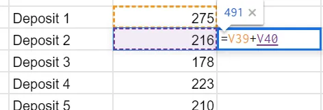
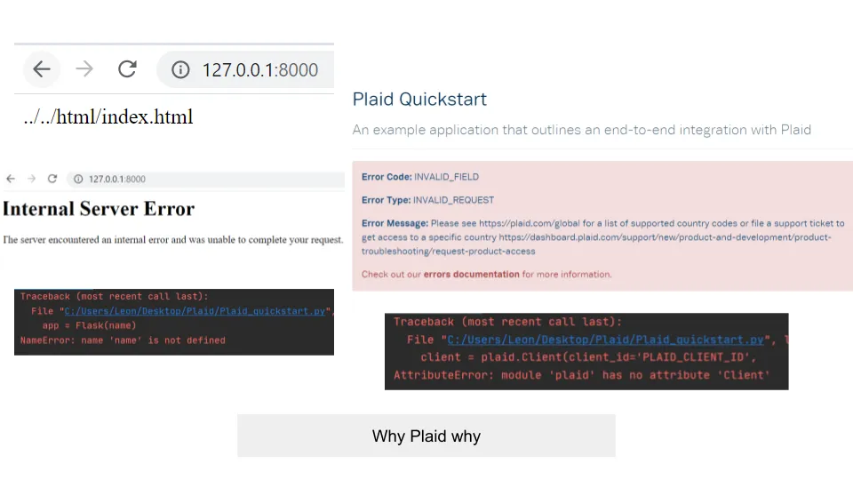
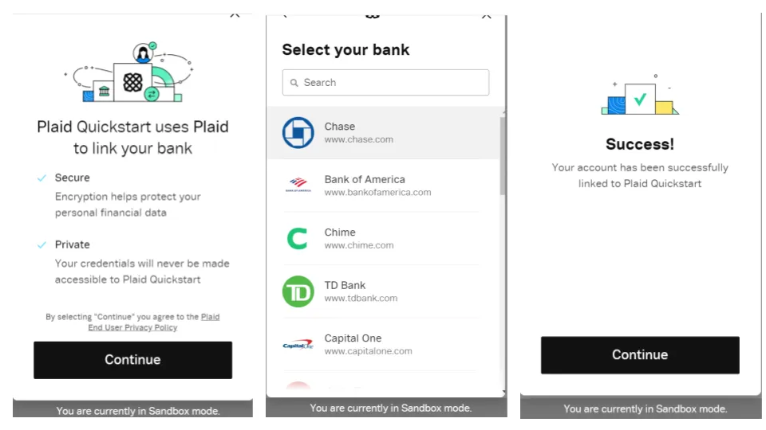
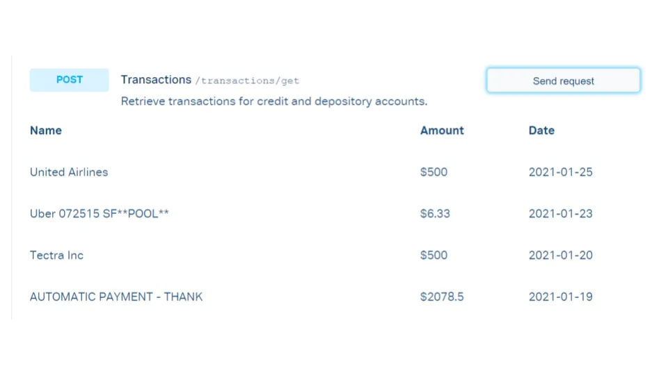
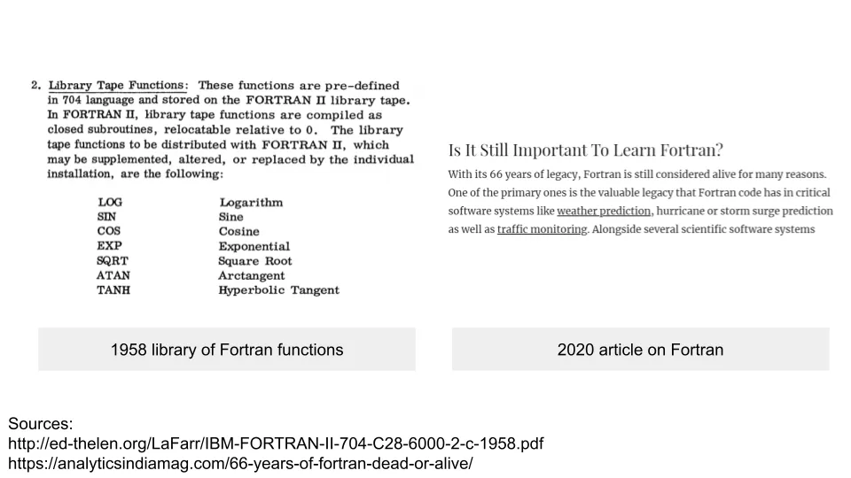

## 주요 정보

Plaid는 다른 기업들이 은행 데이터를 연결하도록 돕는 금융 기술 회사입니다\. 다른 사람들이 하기 싫어하는 지루한 일을 함으로써 모두의 삶을 더 편리하게 만들고\, 매우 끈적한 제품이 됩니다\.

## 1\. 작업의 층을 추상화하여

금융 기술 회사에 대해 이야기할 예정입니다 [Plaid](https://plaid.com/ 'plaid') 오늘입니다\. 그 전에 추상화와 응용 프로그래밍 인터페이스\(API\)에 대한 직관을 익히는 것이 도움이 될 것입니다\. 1장은 추상화\, 2장은 API에 할애하겠습니다\; 이미 그 개념들에 익숙하다면 3장으로 건너뛰세요\. 항상 그렇듯이\, 이해를 쉽게 하기 위해 기술적으로 덜 정확한 편을 택하겠습니다\.

먼저 추상화에 대해 이야기하겠습니다\:

많은 돈을 벌기 위한 획기적인 앱 아이디어가 있다고 가정해 봅시다\. 사용자가 키보드의 F2 키를 누를 때마다 무언가가 일어나고 이익을 내도록 앱을 코딩합니다\:

노트북에서 테스트해보니 모두 잘 작동하고\, 돈을 벌기 시작한다\. 너무 잘 작동해서 친구들에게 알리고\, 친구들도 참여하고 싶어 한다\. 코드를 보내고 번창하라고 말한다\.

당신의 친구 중 한 명\(짜증나는 힙스터 친구\)이 그 코드가 자기 맥에서 작동하지 않는다고 말하며\, 다음 단일 출신 단일 배럴 단일 식물 커피 한 잔을 살 돈을 벌지 못해 슬퍼합니다\. 당신은 왜 그런지 궁금해하며 코드를 문제 해결하러 갑니다\.

알고 보니 맥에는 이상한 문제가 있습니다 [Touch Bar thing](https://support.apple.com/en-gb/guide/mac-help/mchlbfd5b039/mac 'touch') 기능 키를 위한 것으로\, 당신들이 보기에는 그 유일한 목적이 삶을 괴롭히는 것 같습니다\. 맥 사용자들을 위한 특별한 코드를 추가합니다\:

지금은 그에게 잘 맞고\, 그는 다음으로 넘어간다 [suing magazines for saying all hipsters look alike.](https://www.independent.co.uk/news/media/hipster-magazine-photo-lawsuit-mit-technology-review-a8813941.html 'hipster')

또 다른 친구는 이동 중에도 돈을 벌기 위해 휴대폰도 지원할 수 있는지 묻습니다\. 또 다른 친구는 블랙베리 지원을 추가할 수 있는지 묻습니다\. 또 다른 친구는 앱이 언제 제공되는지 알고 싶어 합니다\. [KFC gaming console](https://www.bbc.com/news/business-55433318 'kfc')\.

다양한 컴퓨팅 기기에 더 많은 코드를 추가하는 작업을 바라보다 보면 점점 절망이 밀려옵니다\. 왜 돈을 버는 것이 버튼 하나 누르기만큼 쉬울 수 없는 걸까요\? **코드를 한 번 작성하고 여러 기기에서 사용할 수 있으면 됩니다\.**

위의 아이디어는 사실 컴퓨팅에서 흔히 발생하는 문제입니다\(다중 기기 지원\, 수익을 내기 위한 것이 아닙니다\)\. 모든 것을 다 하도록 설계된 소프트웨어를 작성한다면\, 모든 가능한 최종 사용자 기기를 고려해야 합니다\. 코드가 바이너리\(1과 0\)로 변환된 후에도 같은 기능을 해야 합니다\. 기기마다 고유한 특성이 있고\, 주요 기능을 작성하는 것보다 예외를 처리하는 데 더 많은 시간을 쓰게 됩니다\.

90년대 후반에 사람들은 이 문제에 대한 해결책을 깨달았습니다 \- 그 사이에 추가적인 층을 추가하는 것\, 즉 **다른 사람 문제로 돌리세요\.** [As Shimon Schocken explains,](https://www.youtube.com/watch?v=E28KczysecE 'Shimon') \"중개인\"이 있으면 작업이 훨씬 간단해집니다\. 모든 기기에 대해 코드를 작성하는 대신\, \"한 번 작성하면 어디서든 실행할 수 있다\"고 하며\, 그 중개인이 코드 호환성을 담당하게 합니다 [^1]\:

**큰 작업을 작은 작업으로 나누면 모두가 더 쉽게 할 수 있습니다\.** 당신은 문제의 일부를 추상화한 셈입니다\. 왜냐하면 \"고수준\" 코드를 작성하고 특정 구현 버그에 신경 쓰지 않으려 하기 때문입니다\. 다른 사람들은 \"저수준\" 구현 세부사항을 좋아하지만\, 그 위에 앱을 추가로 코딩하고 싶지 않을 수도 있습니다\. 각자의 능력에 따라\, 각자의 필요에 따라 각자 다르게 작성하는 식입니다\.

우리는 다시 이 추상화라는 개념으로 돌아올 것입니다\. 이는 사람들이 **작업의 특정 부분에만 집중하세요\.**

이제 당신과 친구들이 그 돈을 전 세계 은행에 넣고 싶다고 가정해 봅시다\. 은행마다 절차가 다르며\, 규칙을 따르지 않으면 퇴출당합니다\:

- 뉴욕 지점은 계좌 번호\, 비밀번호\, 주문만 입력하면 됩니다\. [banning you if you talk too much](https://www.youtube.com/watch?v=euLQOQNVzgY 'soup')
- 샌프란시스코 지점은 노트북에 최소 5개의 회사 스티커를 붙이지 않으면 서비스를 받지 않습니다
- 싱가포르 지점은 국가를 위해 결혼과 자녀를 가질 예정 시기를 알고 싶어 합니다

대부분의 그룹은 이런 규칙들을 외우는 것을 싫어하지만\, 에이프릴은 예외다\. 그녀는 난해한 선택지를 다루는 것을 즐긴다\. 그룹을 대표해 모든 은행을 자원해서 처리한다\. 거래가 어떻게 이루어지는지는 신경 쓰지 않고\, 오직 거래가 이루어진다는 것에만 신경 쓰며\, 그룹은 그녀에게 모든 것을 맡긴다\.

당신이 참여했던 환각 리트릿에서 지낸 몇몇 지인들이 당신의 계약에 대해 듣는다\. 그들은 은행과 직접 거래하는 것을 싫어하며\, 에이프릴이 도와줄 수 있는지 알고 싶어 한다\. 그녀는 소액의 수수료만 지불하면 기꺼이 도와준다\. 소문이 퍼지고\, 곧 모두가 중개인으로 에이프릴을 찾는다\.

우리는 다시 한 번 사람들이 가장 신경 썼다는 것을 보게 됩니다 **더 큰 임무의 한 부분** \- 입출금\. 사람들은 에이프릴이 왜 이걸 좋아하는지\, 어떻게 모든 걸 기억하는지는 신경 쓰지 않아\, 그냥 해내는 것만 중요해\. 에이프릴이 있으면 삶이 더 편리해져\.

마지막으로\, 에이프릴이 임대 에어비앤비의 숨겨진 서비스 비용을 횡령하지 않는지 확인하기 위해 계좌 잔액을 확인하고 싶다고 가정해 봅시다\. 당신은 최근 입금내역을 스프레드시트에 입력하기 시작합니다\:

프로그래머로서 엑셀을 싫어하고 그 기능에 익숙하지 않다\. 하지만 \"\+\" 기호를 사용해 항목을 추가하는 것은 알고 있고\, 그렇게 수동으로 잔액을 계산하기 시작한다\:

백 칸과 한 시간 후\, 거의 끝나갈 무렵 친구가 당신에게 무엇을 하고 있냐고 묻습니다\. 그들은 sum\(\) 함수가 당신이 원하는 대로 작동한다고 설명합니다\:

또한 전체 **함수의 \"라이브러리\"** 엑셀이 수학을 더 쉽게 만들어야 한다는 점\, 예를 들어 avg\(\)\, count\(\) 등\. 멋진 점은 어떤 기기를 사용하든 같은 동작을 기대할 수 있다는 거예요 \- 윈도우 노트북\, 친구의 맥\, 아버지의 휴대폰 등\. 함수가 무엇을 하는지\, 어떻게 호출하는지 알게 되면 시간을 절약할 수 있습니다\. 엑셀이 어떻게 하는지 신경 쓰지 않고\, 어디서나 항상 작동하면 됩니다\.

여러 층의 작업을 추상화하는 것들 **각 층에서 가능성과 기회를 늘립니다\.** sum\(\) 프로그래밍을 한 사람은 당신의 입금 계산에 시간을 쓰고 싶지 않을 것입니다\. sum\(\) 함수를 프로그래밍하고 싶지 않을 겁니다\. 사람들은 자신이 작업하고 싶은 부분에 집중합니다\. 모든 것을 하지 않으면 많은 것을 만들 수 있습니다\.

**추상화 개념은 프로그래밍 외에도 적용됩니다\.** 우리는 모두 문제의 \'층\'을 다루며\, 그 아래 모든 것이 신뢰할 수 있다고 믿습니다\. 여러분은 이메일에서 이 글을 읽고 있을 텐데\, 이메일 서비스가 어떻게 작동하는지는 신경 쓰지 않고\, 단지 예측 가능한 방식으로 행동하는 것만 신경 쓰고 있습니다\.

## 2\. 계약으로서의 애플리케이션 프로그래밍 인터페이스

이제 응용 프로그래밍 인터페이스\(API\)에 대해 생각할 준비가 되었습니다\. 위의 sum\(\) 같은 수학 함수 라이브러리를 프로그래밍했다고 상상해 보세요\. **다른 프로그램에서도 그 기능들을 사용할 수 있다면 편리하지 않을까요\?**

그리고 그 라이브러리를 모두가 접근할 수 있게 만들면\, 다른 사람들이 자신만의 흥미로운 것을 만드는 데 활용할 수 있습니다\. 당신은 수학 함수 개발에 집중할 수 있고\, 다른 사람들은 필요에 따라 라이브러리 기능을 호출하는 앱을 만드는 데 집중할 수 있습니다\.

As [Joshua Bloch](https://www.youtube.com/watch?v=LzMp6uQbmns 'Josh') 지적하듯\, 1952년에는 사람들이 좋아했습니다 [David Wheeler](<https://en.wikipedia.org/wiki/David_Wheeler_(computer_scientist)> 'David') [^2] 이미 이 아이디어를 제안하고 있습니다\. [having libraries of functions (sub-routines)](http://www.laputan.org/pub/papers/Wheeler.pdf 'wheeler')\:

**그 함수 라이브러리를 API라고 부르겠습니다 [^3]\.** 조슈아는 이 용어가 처음 사용되었다고 믿고 있습니다\. [a 1968 paper by Ira Cotton and Frank Greatorex:](https://www.computer.org/csdl/pds/api/csdl/proceedings/download-article/12OmNyRPgFZ/pdf 'ira')

이 용법은 우리가 예시에서 논의한 개념들과 관련이 있습니다\:

- **추상화\.** 수학 함수가 어떻게 작동하는지는 중요하지 않고\, 그저 작동하는지만 중요합니다\. 큰 작업을 나누면 모든 계층에서 흥미로운 작업의 가능성이 열립니다
- **하드웨어 독립성\.** 어떤 기기를 사용하든 API를 사용할 수 있으며\, 통합을 담당하는 API가 될 것으로 기대합니다
- **재사용성\.** 도서관은 원하는 대로 여러 사람이 사용할 수 있습니다

우리 API는 **잘 정의된 계약**필요한 입력과 예상되는 출력을 알려줍니다\. 예를 들어\, sum\(\) 함수는 항상 입력의 총합을 반환하고\, 어떤 경우에는 총합을\, 다른 경우에는 평균을 반환하지 않기를 원합니다\.

우리는 **우리 API가 계약 외에 아무것도 할 거라고 기대할 수 없어요\.** 예를 들어\, sum\(\)은 엑셀에서는 작동하지만\, make\_me\_money\(\)는 작동하지 않습니다\. 엑셀 작성자가 그 기능을 코딩하지 않는 한 말이죠\.

그리고 우리는 **API가 올바르게 프로그래밍되었음을 신뢰하세요\,** 엄격한 테스트를 거친 결과입니다\. 예를 들어\, sum\(\) 함수는 매번 같은 데이터셋에서 같은 결과를 내야 합니다\.

API가 전혀 없는 삶을 상상해 보세요\. 무언가를 프로그래밍할 때마다 처음부터 다시 시작해야 하고\, 모든 가능한 최종 사용자 시나리오도 고려해야 합니다\. 이런 식일 겁니다 [making a sandwich from scratch](https://www.smithsonianmag.com/smart-news/making-sandwich-scratch-took-man-six-months-180956674/ 'sandwich')\.

## 3\. API로서의 Plaid

API가 무엇이며 왜 중요한지 이미 확립했습니다\. 그렇다면 Plaid는 무엇을 하나요\?

모르는 분들을 위해 말씀드리자면\, Plaid는 금융 기술 회사입니다\. [supposed to be bought by Visa for $5bn](https://www.justice.gov/opa/pr/visa-and-plaid-abandon-merger-after-antitrust-division-s-suit-block 'plaid')\, 그리고 독점금지 문제로 인수를 포기했습니다\. 제 연애와 달리\, 거절당한 것이 실제로 그들을 만들었습니다 _더 보기_ 가치 있고\, 지금은 [rumoured to be raising money at $15bn.](https://www.theinformation.com/articles/plaid-shareholders-field-offers-at-15-billion-after-merger-collapse '15')

4월이 당신과 은행 사이에 끼어들던 거 기억나\? 4월을 API라고 생각해\.

**Plaid는 은행과 은행 데이터를 사용하는 다른 기관들 사이의 API 역할을 합니다\.** 그들은 고객이 뒤에서 필요한 통합 작업에 신경 쓰지 않고도 API 위에 앱을 구축할 수 있도록 합니다\. 그리고 정말 많은 작업이 필요합니다\.

예를 들어\, 사용자의 지출 이력에 접근해야 하는 예산 앱을 만든다고 가정해 봅시다\. 만약 은행과 연결하기 위해 자신의 코드를 사용한다면\, 새로운 은행이 추가될 때마다 새로운 섹션을 완전히 작성해야 할 것입니다\. 새로운 기준이 계속 바뀌기 때문에\, 아마도 앱의 주요 기능보다 그 부분에 더 많은 시간을 쓸 것입니다\.

Plaid는 항상 작동하는 API와 은행에 연결할 때 사용자가 볼 수 있는 사용자 인터페이스를 제공할 수 있습니다 [(Plaid Link).](https://plaid.com/docs/link/ 'link') 당신의 문제는 그들의 문제가 되었습니다\.

Plaid의 Quickstart 가이드를 따라 이 시스템이 어떻게 생겼는지 살펴보겠습니다 [here](https://plaid.com/docs/quickstart/ 'quickstart')\. 자신의 컴퓨터에서 데모 앱을 설정할 수 있는 파일도 제공해줍니다\.

하루 종일 문제 해결을 하고\, 여러 번 컴퓨터를 재부팅하며\, 거의 모든 프로그램을 무작정 설치한 후에야 [^4]\:

드디어 일부 기능을 작동시켜 테스트 은행 계좌와 연결했습니다\:

이 덕분에 은행 계좌 잔액 같은 더미 데이터를 볼 수 있었습니다\:

또는 최근 거래 데이터\:

만약 내가 ~~하고 싶어~~ 이 방법을 알고 있었고\, 이렇게 금융 앱을 계속 구축할 수 있었습니다\. 앱은 Plaid API를 사용해 잔액 데이터를 가져오고\, 거래를 기록하며\, 잔액을 업데이트할 수 있었습니다\. 하지만 이 시점에서 더 많은 버그를 만나고 ~~포기했다~~ 나중에 미뤄뒀다\.

제가 회사를 세운다면\, Plaid가 모든 기초 재무 작업을 대신 맡기면 얼마나 많은 시간을 절약할 수 있을지 상상할 수 있을 겁니다\. 은행 통합 문제는 그 아래층에 있는 일은 하고 싶지 않습니다\; 그건 저에게 흥미롭지 않습니다\. 차라리 그 위에 반짝이는 주식 거래 룰렛 휠을 만들어 사람들의 돈을 속이는 일을 하고 싶습니다\; 그게 바로 [doing god's work](https://dealbook.nytimes.com/2009/11/09/goldman-chief-says-he-is-just-doing-gods-work/ 'god')\.

요즘 대부분의 회사를 \'기술\' 회사로 생각하고\, 그 중 얼마나 많은 회사가 \'재무\' 데이터를 요구하는지도 생각해보면\, **플라이드의 기회가 얼마나 큰지 감이 오기 시작합니다\.** 고객 은행 계좌와 직접 통합하려는 기업이 많아질수록 Plaid의 중요성은 더욱 커집니다\.

**Plaid는 회사를 청구합니다\,** API 사용에 대해 소비자가 아닙니다 [^5]\. 그건 [seems to take](https://plaid.com/pricing/ 'pricing') 소규모 기업에는 거래 기반 수수료\, 대형 기업에는 구독료가 부과됩니다\. \"지루한\" 일을 하면서 자신들과 편리함을 위해 기꺼이 비용을 지불하는 다른 혁신가들에게 윈윈 상황을 만들었습니다\.

Plaid를 사용하기 시작하면\, **바꿀 가능성은 낮아요\,** 왜냐하면 그건 Plaid API를 사용하는 많은 코드를 다시 작성해야 하기 때문입니다 [^6]\. 이것이 Plaid가 가격 인상 능력에 어떤 의미인지 생각해 보세요\. 배관을 얼마나 자주 교체하시나요\?

비현실적으로 들린다면\, 초기 프로그래밍 언어인 Fortran을 생각해 보세요\. 그 함수 라이브러리는 [defined in **1958**](http://ed-thelen.org/LaFarr/IBM-FORTRAN-II-704-C28-6000-2-c-1958.pdf 'fortran')\, 그리고 오늘날까지도 사용되고 있습니다\. 한 번 구현되면 API는 오랜 기간 사용할 수 있습니다\:

오늘은 추상화의 직관\, API\, 그리고 Plaid가 하는 일에 대해 많이 다뤘습니다\. 주요 교훈은 다음과 같습니다 **사람들이 하기 싫어하는 일도 많고\, 그런 일들로 돈을 벌 수도 있죠\.** 뉴스레터에서는 지루한 사람들을 피하라고 하지만\, 이 경우 지루한 것을 만드는 일은 수십억 달러 규모의 사업입니다\.

### 추가 자료\:

1. [What does Plaid do?](https://technically.substack.com/p/what-does-plaid-do 'plaid') 기술적으로 작성
2. [Fireside chat with Plaid CEO Zach Perret](https://www.youtube.com/watch?v=sgnCs34mopw 'youtube') 퍼스트마크 작성
3. [APIs all the way down](https://notboring.substack.com/p/apis-all-the-way-down 'nb') 낫 보링 작성
4. [A brief, opinionated history of the API](https://www.youtube.com/watch?v=LzMp6uQbmns 'youtube') 조슈아 블로흐 작성
5. [How to build a fintech app in Python using Plaid's banking API](https://www.youtube.com/watch?v=Lv2jIOi2fao 'youtube') 에롤 아스프로마티스 지음

감사합니다 [Brian Rubinton](https://twitter.com/brianru 'b')\, [Justin Gage](https://mobile.twitter.com/itunpredictable 'j')\, 벤 모르실로\, [Denis Papathanasiou](https://github.com/dpapathanasiou 'd')\, 마이 슈워츠\, [Aditya Athalye](https://evalapply.org/ 'a')\, [Jeremy Presser](https://mobile.twitter.com/JeremyPresser 'j')\, [Ian Kar](https://mobile.twitter.com/iankar_ 'i') 이 글에 대한 조언을 구합니다

## 기타

1. [Why working from home will stick.](https://nbloom.people.stanford.edu/sites/g/files/sbiybj4746/f/why_wfh_stick1_0.pdf 'wfh') 제가 현재 생각하는 것에 따라 사무실 근무로 돌아가고\, 재택근무 시간을 늘릴 예정입니다\.
2. [What is an IP address?](https://outofips.netlify.app/ 'IP')
3. [The sting of poverty](http://archive.boston.com/bostonglobe/ideas/articles/2008/03/30/the_sting_of_poverty/?page=1 'poverty')
4. [How I blew out my knee and came back to win a national championship](https://www.jasonshen.com/2011/blew-out-knee-win-national-championship/ 'jason')
5. [Judgement is an exercise in discretion](https://aeon.co/essays/judgment-is-an-exercise-in-discretion-circumstances-are-everything? 'judge')

[^1]: 좀 더 기술적으로 말하자면\, 컴파일러가 모든 기기와 호환되어야 하며\, 코드 자체가 아니라 컴파일러보다 한 단계 위에 위치합니다\.

[^2]: 데이비드는 컴퓨터 과학 분야에서 박사 학위를 받은 최초의 인물로 알려져 있습니다\.

[^3]: 기술적으로는 당사자 간의 계약 자체가 인터페이스여야 하지만\, 초보자에게는 한데 묶어서 이해하는 게 더 쉽다고 생각합니다

[^4]: Plaid github 파일\(파이썬 파일\)이 99\% 잘못됐다고 확신해요\. index\.html 파일이 비어 있거든요\. plaid와 plaid\-python 사이에 이상한 네임스페이스 문제도 있는데\, 이해가 잘 안 됐지만 결국 고쳤어요\. 왜 Docker를 써야 하는지 모르겠어요\. 제 작업이 작동하려면 Docker가 추가로 필요했던 프로그램들 중 하나였거든요\. 업데이트\: Plaid에서 이 버그들이 수정됐다고 밝혔고\, 퀵스타트 프로세스도 달라졌어요\.

[^5]: 회사들이 그 비용을 소비자에게 전가하려 할 수도 있지만\, 여기서 중요한 점은 서비스를 직접 지불하는 고객이 금융 통합이 필요한 앱을 만드는 회사라는 점입니다

[^6]: 저도 그렇게 생각하지만\, 틀렸다면 알려주세요\.
