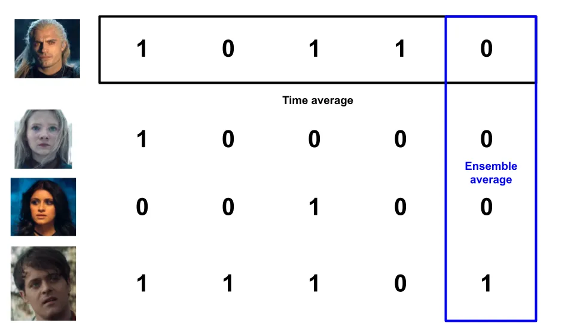
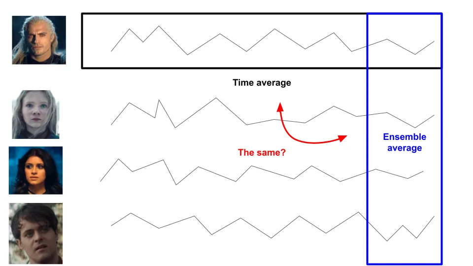

## 주요 정보

과정이 에르고딕인지 비에르고딕인지 아는 것은 얼마나 많은 위험을 감수해야 할지 결정하는 데 매우 중요합니다\. 투자와 부는 비에르고딕 과정이기 때문에\, 기대값에 대한 우리의 첫 생각이 매우 잘못되었음을 의미합니다\.

---

들어본 적 있어요 [ergodicity](https://en.wikipedia.org/wiki/Ergodic_process 'wiki') 전에 봤는데\, 직접 보기 전까지는 완전히 이해하지 못했어요 [this video](https://www.youtube.com/watch?v=VCb2AMN87cg 'youtube') 에르고디시티 TV가 작성했습니다\. 중요한 개념이지만 금융보다는 물리학에서 더 널리 알려진 것 같습니다\. 아래에서 제 자신의 말로 설명해보고 싶습니다\.

우리는 평균\, 중앙값\, 극균 등 다양한 종류의 \'평균\'에 익숙합니다 [^1]\. 오늘의 평균에 집중하고\, 무작위 사건의 기대값으로 봅시다 [^2]\. **기대값을 어떻게 정의하느냐는 매우 다른 결과를 낳아 베팅의 매력과 베팅 금액에 대한 사고방식을 바꿀 수 있습니다\.**

**에르고딕티란 앙상블 평균이 시간 평균과 같다는 뜻입니다\.** 어떤 것이 비에르고딕이라는 것은 반대로\, 앙상블 평균이 시간 평균이 아님을 의미합니다\.

네\, 여기서 앙상블과 시간이 무슨 뜻인지 잘 모르겠어요 [^3] 둘 다 아니니\, 동전 던지기 예를 들어보겠습니다\.

어떤 사람이 동전을 5번 던져서 앞면과 뒷면을 나온다고 가정해 봅시다\. 이 시뮬레이션의 시간 평균은 한 사람의 평균 앞면을 계산할 수 있습니다\. 5번 던지면 중 3번 나오므로\, 앞면은 0\.6개\(3에서 5로 나누는 값\)입니다\.

동전을 던지기 위해 몇 명을 더 모았다고 가정해 봅시다\. 아래는 편의를 위해 앞면을 1\, 뒷면을 0으로 표현한 것과 비슷한 결과가 나옵니다\:

여기서 사용할 수 있는 평균은 두 가지 유형이 있습니다\. 첫 번째는 이전의 시간 평균으로\, 여기서 우리는 **한 사람의 일정 기간 동안 평균을 내는 것입니다\.**

두 번째는 앙상블 평균으로\, 여기서 우리는 다음을 얻습니다\. **여러 사람이 한 기간 동안 평균을 내는 것입니다\.**

에르고딕티가 답하려는 큰 질문은 다음과 같습니다\: **이 두 평균이 장기적으로 같을 것으로 예상해야 할까요\?**

잠시 생각하면 이 예시에서 그렇게 해야 한다고 추론할 수 있을 것입니다\. 동전 던지는 무작위이며\, 이전 결과에 의존하지 않습니다\. 앙상블 평균은 장기적으로 시간 평균과 같습니다\. 동전 던지기가 충분히 많으면 이 평균은 0\.5가 될 것으로 기대됩니다 [^4] \.

아마도 이미 믿었을 거라는 걸 보여주는 말이 많았는데\, 왜 이게 그렇게 중요하다고 생각하는 걸까요\?

예를 바탕으로 동전 던지기에 베팅하는 사람들을 만들어봅시다\. 모두가 1달러로 시작해 이기면 50\% 이익을 얻고\, 지면 베팅의 40\%를 지불합니다\. 예를 들어\:

동전 던지기 결과 자체보다는 각자가 가질 부를 생각해 봅시다\. 만약 우리가 이것들을 그래프로 그리면\, **한 사람의 부의 시간 평균이 장기적으로 모두의 부의 집합 평균과 같을 것이라고 기대해야 할까요\?**

다르게 말하면\: **그런 내기를 하시겠습니까\?** 반복해서 제안한다면\?

이런 베팅의 기대 가치는 50\% 곱하기 \$1\.50\, 그리고 50\% 곱하기 \$0\.60이 되어 \$1\.05가 됩니다\. 기대값이 양수라면 계속 베팅해야 할 것 같습니다\. 동전 던지기를 시뮬레이션해 봅시다\.

동전 던지기 시뮬레이션을 코딩했어요 [jupyter notebook](https://colab.research.google.com/drive/1KI_PPhtXVQDfVGRFbi4pl0ZIhL2Y4x2X?usp=sharing 'colab') [^5] \. 위 시나리오를 한 사람이 동전 던지기 100회를 하면 부가 최대 4달러까지 증가했다가 결국 거의 0달러로 떨어지는 것을 알 수 있습니다\.

음\, 아마 운이 나쁜 상황일지도 모르겠네요\. 대신 100명으로 다시 해봅시다\. 여전히 동전 던지기를 100번 해봅시다\. 각 동전 던지기마다 평균 부\(앙상블 평균\)도 계산하고\, 빨간 점선으로 표현할 것입니다 [^6] \.

아래 두 그래프는 데이터상 동일합니다\; 더 나은 시각화를 위해 로그 축으로 재조정하는 중입니다\.

뭔가 이상한 일이 벌어지고 있습니다\. 우리는 한 명의 운 좋은 예외자가 1\,000달러의 재산을 쌓았고\, 평균 부\(점선 빨간 선\)가 계속 증가하는 것을 봅니다\. 하지만 주목하세요 **이들 대부분은 돈을 잃었어요\!** 이 시뮬레이션에서 100명 중 94명은 처음 받은 1달러보다 적은 금액을 얻었습니다\.

확신이 서지 않는다면\, 노트북에 천 명이 나오는 예시가 있습니다\; 또한 매개변수를 자유롭게 조정해 주세요\.

우리가 보고 있는 것은 기대값이 양수이고 앙상블 평균이 증가하고 있음에도 불구하고\, 한 사람의 평균 시간은 보통 감소하고 있다는 점입니다\. **전체 \'시스템\'의 평균이 증가하지만\, 그렇다고 해서 단일 단위의 평균이 증가한다는 의미는 아닙니다\.** 큰 예외가 평균을 왜곡하지만\, 대다수 사람들은 손실을 보고 있습니다\.

이 점은 다시 한 번 강조할 가치가 있습니다\. **이러한 베팅의 기대 가치가 긍정적이었음에도 불구하고\, 이에 참여한 100명 중 94명이 대부분의 돈을 잃었습니다\.** 이 결과들은 같은 시스템 내에서 일어나지만\, 플레이하고 싶은지 반대로 판단하게 됩니다\.

이 시나리오에서 부는 비에르고딕적인데\, 미래의 부는 과거의 부에 의존하기 때문입니다\(경로 의존성\)\. 앙상블 평균은 시간 평균과 같지 않습니다\.

**부는 일반적으로 비에르고딕 상태이기도 합니다**\, 내일 투자 포트폴리오의 수익률은 현재 규모와 배분에 달려 있기 때문입니다\.

실제로 이것이 투자에 의미하는 바는 다음과 같습니다\:

1. **기대값을 적용하는 방식을 조심하세요\,** 그것이 전체 시스템의 평균인지\, 아니면 당신 같은 개인이 평균적으로 기대해야 할 결과를 알고 싶으니까요\. 확률이 생각나면 모델링해 보고 그것이 무엇을 의미하는지 살펴보세요

2. **처음에는 매력적으로 보일 수 있는 것이 종종 끔찍한 경우도 있습니다\.** 소수의 이상치가 평균을 위쪽으로 기울이기 때문입니다 [^7]\.

3. **만약 지금 보이는 확률이 마음에 들지 않는다면\, 게임을 바꿔보세요\.** 이전 글에서 썼습니다\. [the Kelly Criterion](/writing/kelly 'kelly') 베팅 규모를 조절하는 것에 대해 이야기하며\, 이는 당신이 얻거나 잃는 금액에 영향을 미칩니다\.

요약하자면\, 에르고딕티는 여러 시뮬레이션에서의 장기 평균이 한 시뮬레이션의 평균과 같은지에 관한 것입니다\. 비에르고딕이 존재하고\, 인생의 많은 것들이 에르고딕이 아니기 때문에\, 감수하는 위험 양에 대해 매우 신중해야 합니다\.

## 추가 자료

1. [Ergodicity](https://squidarth.com/math/2018/11/28/ergodicity.html 'squid')
2. [What are we weighting for?](https://researchers.one/articles/20.04.00012 'paper')
3. [The ergodicity problem in economics](https://www.nature.com/articles/s41567-019-0732-0 'paper')

감사합니다 [Tyler Richards](http://www.tylerjrichards.com/)그리고 Recurse Center 멤버인 Vaibhav Sagar\, Sidharth Shanker\, SengMing Tan\, Alex Yeh와 관련해 의견을 듣고 싶습니다\.

[^1]: [In case you need a refresher](https://www.purplemath.com/modules/meanmode.htm)\, 평균은 모든 숫자를 합한 값으로 나누어 숫자 수를 나눈 평균값이며\, 중앙값은 중간 숫자\, 모드는 가장 흔한 숫자입니다

[^2]: 그럴지도 몰라요 [conflating mean and expected value here](https://stats.stackexchange.com/questions/30365/why-is-expectation-the-same-as-the-arithmetic-mean 'stats')이 설명을 위해 단순화할 수 있다고 생각합니다

[^3]: 흠

[^4]: 정의상 앞면과 뒷면 50\% 확률입니다

[^5]: 누군가 제 코드를 꼭 확인해 봐야 할 것 같아요\. 그리고 더 적은 줄로 코딩하는 더 우아한 방법이 있다고 생각해요\.

[^6]: 이것은 사실 이론적 앙상블 평균이 아니며\, 이론은 동전 던지기 횟수의 거듭제곱 곱으로 1\.05를 선형적으로 증가시키는 것입니다\. 여기서는 실제 결과의 평균만 계산하고 있어서\, 선이 계속 증가하지 않고\(단조롭게 증가하지는 않습니다\)

[^7]: 부는 0달러에 하한선이 있지만 상한선은 없어서 평균도 무한한 것 같아요
