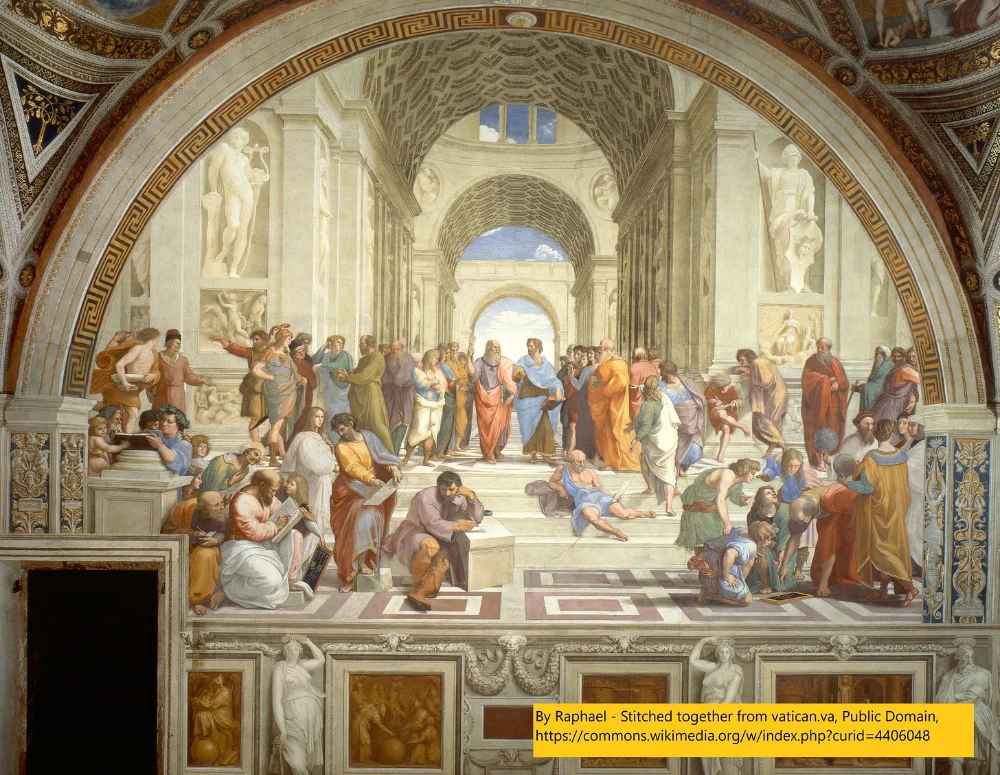
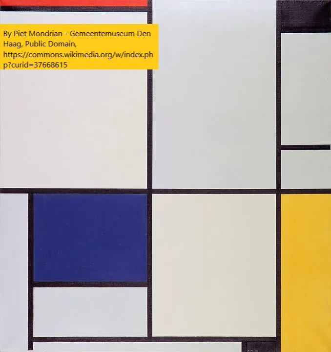
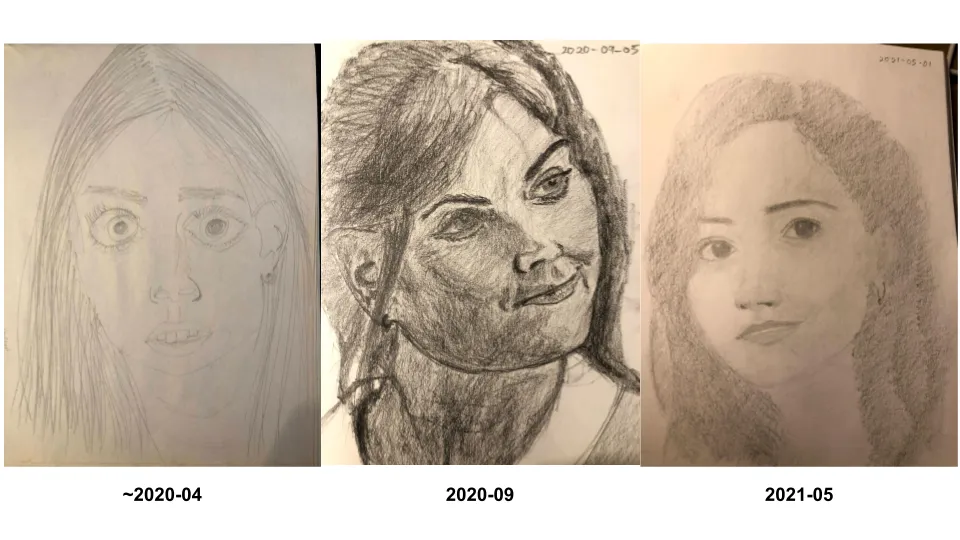

저는 박물관에서 무엇을 보고 있는지 더 잘 이해하기 위해 얼마 전부터 미술사를 배우기 시작했습니다\. 그 과정에서 미술사를 더 잘 이해하기 위해 그림 그리기를 배우게 되었습니다\. 최근 대체 불가능 토큰\(NFT\) 트렌드를 맞아\, 오늘 미술에 대해 배운 점을 공유하고\, 이후 후속 글에서 NFT에 대해 이야기하고 싶었습니다 [^1]\.

## 1\. 순수 예술이란 무엇인가\?

저는 주로 [smarthistory](https://smarthistory.org/ 'smart') 미술사를 배우기 위해서였는데\, 제 여정을 시작하게 만든 영상은 [this MoMa one on how to paint like Picasso](https://www.youtube.com/watch?v=rGZYfSzvPvs&list=PLfYVzk0sNiGEZXlIltPP7Yy_s5gTM7hf8 'moma')\.

저는 이전에 미술사에 관한 글을 썼습니다\. [Picasso](/writing/picasso 'picasso') 그리고 [Manet](/writing/art 'manet') 원하시면 확인해 보세요\.

**미술사에서 배운 가장 중요한 점은 열린 마음을 가지는 것입니다\.**

제가 말하고 싶은 건 이렇습니다\:

누군가 당신에게 와서 \"오늘날의 가짜 예술에 지쳤다\, 진짜 순수한 예술을 보고 싶다\"고 말한다면 어떨까요\?

무엇을 보여주고 싶나요\?

아마 그들에게 보여줄 거야 [The School of Athens,](https://en.wikipedia.org/wiki/The_School_of_Athens 'school') 1500년대 이탈리아 르네상스 절정기에 라파엘로가 그린 그림입니다\. 유명한 철학자들을 사실적으로 묘사하고 [linear perspective](<https://en.wikipedia.org/wiki/Perspective_(graphical)> 'perspective') 3D처럼 보이게 하기 위해 유명한 프레스코화는 르네상스를 상징하는 걸작으로 여겨집니다\.

또는 역사적 주제를 거부하며 예술에 도덕적 교훈이 붙을 필요가 없다고 생각했을 수도 있습니다\. 대신 당신은 도미니크 앙그르의 1800년대 그림을 전시하는데\, 순수한 쾌락과 환상을 담고 있으며\, 진짜 예술이 반드시 현실적일 필요는 없다고 주장합니다\. [La Grand Odalisque looks realistic on first glance, but taking a closer look shows that the spine is weirdly long, and the back leg is attached at a weird angle.](https://en.wikipedia.org/wiki/Grande_Odalisque 'wiki')

쾌락은 피상적이며\, 고야의 1800년대 같은 현대의 고통을 기념하는 것이 더 순수하다고 말할 수 있습니다 [The Third of May](https://en.wikipedia.org/wiki/The_Third_of_May_1808 'may')\. 이전 작품들보다 덜 현실적이며\, 인물들이 더 평평하고 완성도가 낮다\. 또한 더 이상 허구가 아니며\, 고야 시대의 실제 비극을 묘사하고 있다 [^2]\. 이전 전통과는 너무나도 달라서 \"현대 시대의 초기 그림 중 하나\"라고 불렸습니다\.

하지만 왜 회화를 시간 속 한 장면의 스냅샷만으로 제한하려 할까요\? 대신 여러 각도에서 본 대상을 평평한 캔버스 위에 내려놓으려 한다면 어떨까요\? 매트릭스의 불릿 타임을 생각해보면\, 그림으로서\; 그게 오브제에 더 충실하지 않을까요\? 피카소의 1900년대 같은 입체파 작품을 보여주는 것 [Girl with a Mandolin](https://www.pablopicasso.org/girl-with-mandolin.jsp 'girl') 그렇다면 2D 표면에서 여러 시점에서 3D 인물을 보여주려는 시도 덕분에 좋은 선택이 될 것입니다\.

그리고 위 모든 것이 거만하며\, 예술은 단지 캔버스 위의 색과 선일 뿐이라고 말할 수도 있습니다\. 1900년대 몬드리안을 보여주는 것은 사실주의로 스스로를 속이지 말아야 한다는 점을 보여줍니다\. 순수 예술은 플라토닉한 형태입니다 [^3]\.

더 말할 수 있는데\; 암호화폐만큼이나 예술 운동도 많아요\. 하지만 제가 말하고 싶은 핵심은 예술은 주관적이며\, 열린 마음을 유지하는 것이 필수적이라는 점입니다\. 어떤 것이 예술인지 아닌지를 논하는 것은 답할 수 없는 철학적 질문 중 하나입니다\.

많은 새로운 운동들이 그 시기에 비판받았지만\, 이후 여러 세대의 예술가들에게 영감을 주었습니다 [^4]\. 많은 아티스트들에게 경계를 넘는 것이 핵심입니다\.

무언가를 좋아하지 않는 건 괜찮아요 \- 저는 여전히 대부분의 현대 미술을 이해하지 못하거든요\. 하지만 단지 싫어한다는 이유로 무시하는 것은 세상에 대한 이해를 제한할 뿐입니다\. 그건 재미없어요\.

## 2\. 예술에서 유연함

작년에 몇 가지 이유로 그림을 배우기 시작했어요\:

- 고정관념을 멈추기 위한 끝없는 여정의 일환으로요 [^5]
- 예술가들이 어떻게 작품을 창작하는지 더 잘 이해하고\, 기술과 허튼소리를 구분하기 위해서입니다
- 오랫동안 연습할 수 있는 기술과 노후에도 계속할 수 있는 기술에 대해 생각하고 있었습니다
- 소통하고 자신을 표현할 수 있는 도구상자를 추가해 주세요

저는 이렇게 시작했습니다 [draw a box](https://drawabox.com/ 'draw')\, 그리고 다음으로 넘어갔다 [New Masters Academy](https://www.nma.art/ 'nma')\, 아직도 사용 중입니다 [^6]\. 저는 주로 연필과 만년필을 사용합니다 [^7]\.

참고로\, 만약 [aphantasia is real](/writing/aphantasia 'abp')아래 테스트에서 3\-4점을 받았으니 아마 그런 걸 가지고 있을 거예요\. 참고 자료에서 그릴 때는 장애물이 아니었지만\, 상상에서 그릴 때는 장애물이 될 수도 있어요\.

대략 1년간 매일 연습하고 600장의 종이를 찍은 후 [^8]\, 진행 상황 사진입니다\. 네\, 그들은 같은 사람이어야 합니다\:

그리고 그 과정에서 제가 배운 것은 다음과 같습니다\:

**그림 그리기는 기술이야\,** 그리고 재능은 과대평가된 거예요\. 저는 재능이 없어요\, 첫 번째 사진에서 알 수 있듯이요\. 하지만 꾸준한 연습이 결과를 내고\, 시간이 지나면서 천천히 나아질 수 있어요\. 재능이 도움이 되긴 하지만\, 그것만이 전부는 아니에요\.

**당신은 베끼는 게 아니라 그림을 그리는 거예요\.** 그림이 완성된 후에는 사람들이 참조를 못하기 때문에 독립적으로 남게 됩니다\. 더 흥미로운 작품을 위해 원하는 어떤 변화도 할 수 있고 그래야 합니다\. 이 때문에 저는 초현실적인 작품에 덜 관심이 생겼습니다\; 그냥 사진을 찍는 게 낫지 않을까요 [^9]\.

**규칙이 아니라 도구를 배우는 거예요\.** 수업은 일을 하는 방식을 가르쳐주지만\, 유일한 방법은 아닙니다\.

**작은 것들이 큰 차이를 만듭니다\.** 연필로 그리는 것은 펜으로 그리는 것과 구별됩니다\(한번 시도해 보세요\!\)\. 초상화에 작은 표시가 전체 그림의 느낌을 바꿀 수 있습니다\.

**서두르면 작업이 망가집니다\.** 작품을 서두르려고 할 때마다 결과가 좋지 않았어요\. 제가 만든 더 좋은 작품들은 모두 인내심을 가지고 여러 겹으로 쌓아갔지만\, 시간이 오래 걸린다고 해서 품질이 보장되는 건 아니에요\. 그리고 보통 좋은 작품을 완성하려면 여러 번의 스케치가 필요해요\.

위압적이었지만\, 그림을 시작하길 잘했다고 생각해요\. 전문가가 되진 못하지만\, 정말 재미있어요 [^10]\! 그리고 우리 모두는 더 재미있는 배움을 필요로 합니다\.

## 기타

1. ["San Francisco bans affordable housing"](https://johnhcochrane.blogspot.com/2021/04/san-francisco-bans-affordable-housing.html 'jc')
2. ["What I talk about when I talk about Chinese tech"](https://lillianli.substack.com/p/what-i-talk-about-when-i-talk-about 'll')
3. [Best practices for writing SQL queries](https://www.metabase.com/learn/building-analytics/sql-templates/sql-best-practices 'sql')\. 부분적으로는 메타베이스 광고이기도 하지만\, 거기서 좋은 팁들이 있습니다
4. [Angel investing, beginner's reading list](https://alltheangels.substack.com/p/-angel-investing-beginners-reading 'angel')
5. [How the BBC makes Planet Earth look like a Hollywood movie](https://www.youtube.com/watch?v=qAOKOJhzYXk 'yt')\, 유튜브

[^1]: 네\, 한 게시물에 모든 걸 끝내야 할 마감일을 놓쳤어요\. 변명하자면\, 간식을 먹느라 바빴거든요\.

[^2]: 이 그림은 스페인 반란에 대한 프랑스의 보복을 묘사한다

[^3]: 즉\, 몬드리언은 우리가 그냥 선\, 색\, 형태를 있는 그대로 보고 즐기면 된다고 생각한다\. 왜냐하면 그것이 드로잉의 본질이기 때문이다\. 무언가를 생생하게 만드는 척하는 것은 가짜다

[^4]: 도미니크 앙그르\, 모네\, 피카소 모두 논란의 대상이었죠\. 어쩌면 예술은 논란에 관한 것일지도 몰라요\.\.\.

[^5]: 솔직히 성공은 엇갈렸습니다\.

[^6]: 저는 [quickposes](https://quickposes.com/ 'qp') 제스처 연습도 해보세요

[^7]: 저는 3H부터 8B까지 다양한 Staedtler Mars Lumograph를 사용해요\(다크 펜은 자주 쓰진 않지만\)\, 반죽한 지우개\, 그루터기\, 그리고 파인 팁 Pilot Metropolitan을 사용해요\. drawabox 연습은 연필로 했는데\, 원래는 펠트 펜을 써야 해요\; 저는 연필이 더 좋아요\.

[^8]: 주로 200페이지짜리 스케치북에서 연습했고\, 그 중 3권과 조금 더 연습했어요\. 정말 관심이 많은 분들을 위해서요 [here's a link](https://drive.google.com/drive/folders/1JuCf-pNB8amh2xsFSYmXyuNWUd5oBv8j?usp=sharing 'link') 제가 그린 모든 스케치에 대해요\. 페이지 순서가 뒤죽박죽이라 스캔하는 데 어려움이 있었어요\. 매일 연습한다고 하자면\, 어떤 날은 10초 만에 뭔가를 그리기도 했고\, 또 어떤 날은 몇 시간씩 그리기도 했어요\.

[^9]: 어떤 것의 실력을 인정하면서도 예전만큼 좋아하지 않을 수 있습니다\.

[^10]: 지루한 회의 중에도 낙서를 할 수 있게 된 것과 약간의 연관성도 있습니다\.
