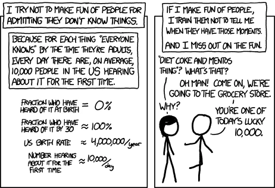

[This post](https://www.farnamstreetblog.com/2017/11/generalized-specialist/ 'FS blogpost') On Farnam Street foi uma das coisas mais interessantes que li ultimamente\. Fala sobre o **Trade\-offs entre especializar e generalizar\, e como eles não são necessariamente mutuamente exclusivos\.**

Algumas citações abaixo sobre por que a Farnam Street pensa assim\:

> Quando suas habilidades específicas são requisitadas\, os especialistas experimentam vantagens significativas\. A desvantagem é que os especialistas são vulneráveis a mudanças

> Todos os dias\, precisamos decidir onde investir nosso tempo — será que melhoramos no que fazemos ou aprendemos algo novo\?

> Especialize\-se na maior parte do tempo\, mas dedique tempo para entender as ideias mais amplas do mundo

Em outras palavras\, Farnam Street defende ser um generalista em forma de \"T\"\, onde você é ótimo em pelo menos uma coisa e depois tem amplo conhecimento de outras áreas\. É parecido com a previsão de ouriço vs raposa sobre a qual Philip Tetlock escreveu\.

Lembro de ter lido conselhos antes sobre como **Você deve buscar ser excelente em duas ou mais habilidades\.** Não lembro de onde veio [^1]\, mas o raciocínio era que há muitas pessoas que são especialistas em um\, mas ter uma combinação te torna muito mais desejável\. Por exemplo\, finanças \+ comunicação vs apenas finanças\.

Também há a ideia de que **É quase impossível chegar ao \#1 em uma área\, mas ser \#50 em dois ou mais é possível com menos esforço\, dado o retorno marginal decrescente\.** Talvez não seja o caso de alguns de vocês\, mas é algo para se pensar\.

Enquanto outros também podem dizer isso **Ser exposto a mais áreas vai inspirar a criatividade em suas competências essenciais\,** Como [Claude Shannon came up with information theory by connecting two areas previously thought separate.](/writing/claude 'shannon')

E\, pessoalmente\, eu simplesmente acho **Ser curioso e aprender sobre coisas aleatórias é divertido\,** por isso eu amo [this comic](https://xkcd.com/1053/ 'xkcd comic')\.

Isso significa que eu \'perco\' algum tempo com artigos ou obras irrelevantes que nunca vou entender\, como Shakespeare\, mas acho \(espero\?\) que o retorno geral tem sido um benefício líquido\.

Outra implicação é também **Revise suas opiniões à luz de novas evidências\.** Como Morgan Housel e outros escreveram\, assuma uma posição de [“I have an evidence-based strategy but am open to amending, and I know I’ll occasionally be wrong even when I technically should have been right”](https://www.collaborativefund.com/blog/never-do-that-again/ 'Morgan Housel on revising views')

Quando você está aprendendo por diversão\, eu tomaria cuidado para entender os limites do seu conhecimento nessa nova área\, pois é muito fácil pensar que você sabe algo quando na verdade não entende\. Ou seja\, [knowing the name of something vs understanding the concept.](https://www.farnamstreetblog.com/2015/01/richard-feynman-knowing-something/ 'Feynman on knowing') Não seja fingido\.

Como tem sido sua experiência em equilibrar especialização versus generalização\? Fique à vontade para me responder por e\-mail\.

[^1]: Me disseram que é por Scott Adams\, de Dilbert\, mas posso estar enganado\.
