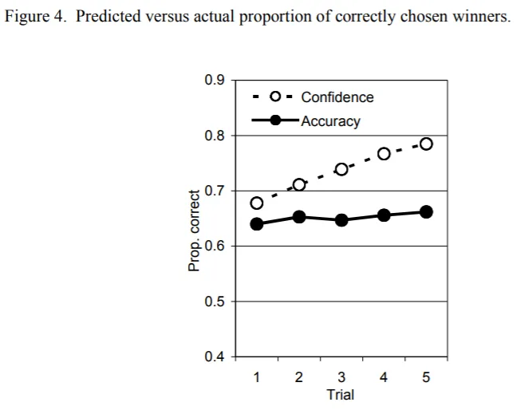

Minha própria estrutura de investimentos será para sempre um trabalho em andamento [^1]\, mas uma questão importante que terei que abordar é o propósito da informação no investimento e como tratar novas informações\. Já escrevi antes sobre a estrutura de John Huber para [sources of edge in investing](http://basehitinvesting.com/what-is-your-edge/ 'edge')\, e uma das três vantagens que ele cita é a vantagem informacional\. Teoricamente\, se você tem mais ou melhor informação que os outros\, tem uma vantagem no investimento e deve superar ao longo do tempo\.

Grande parte do tempo profissional investido é dedicada à obtenção de informações\, seja por meio [management meetings](https://www.morganstanley.com/Themes/tech-media-telecom-trends-insights-outlook 'investor conferences')\, [expert network calls](https://www.alphasights.com/ 'alphasights')\, ou o todo ["alternative data" industry](https://www.credenceresearch.com/report/alternative-data-market 'alt data') [^2]\. Negociar com base em informações privilegiadas há muito tempo é um ~~Destaque~~ Problema com os mercados [^3]\, resultando em [various attempts to curb it](https://insidertrading.procon.org/view.resource.php?resourceID=002391 'insider trading timeline') [^4]\. Então parece que as pessoas acreditam que a informação é valiosa\, e quanto mais\, melhor\.

Deixando de lado se você acredita ter mais informações do que a concorrência\, ter mais informações ajuda a tomar decisões de investimento melhores\? [This post](https://behaviouralinvestment.com/2019/01/09/can-more-information-lead-to-worse-investment-decisions/amp/ 'behavioural investment') cita estudos mostrando que [although individuals have increased confidence with increased information, their accuracy of outcomes doesn't change:](https://pdfs.semanticscholar.org/dfe1/e71649951fc8aeda52eac460976bfe02f305.pdf 'Tsai, C. I., Klayman, J., & Hastie, R. 2008')

O estudo de Tsai\, Klayman e Hastie com o gráfico acima cita duas razões principais para a divergência\:

> Os juízes mostram correção insuficiente para os efeitos da redundância de pistas à medida que a informação se acumula\. Assim\, tendem a superestimar o valor preditivo incremental de informações adicionais\.

> Os vieses de confirmação podem ser outra fonte importante de divergência entre confiança e precisão

As pessoas acham que informações adicionais serão mais úteis do que realmente são\, e também prestam mais atenção às informações que apoiam suas crenças\. Muito semelhante ao argumento sinal versus ruído\, mais famoso por Fischer Black [^5]\.

O post sobre investimento comportamental continua dizendo\:

> Para muitas decisões de investimento\, há apenas alguns poucos pontos de informação que são relevantes\, distintos e impactam materialmente a probabilidade de um resultado positivo\. Se esse for o caso\, por que há tanto desejo por mais e mais informações\?

E depois apresenta muitos bons motivos para todos caírem nessa situação [^6]\, tais como\:

> Não sabemos qual é essa informação relevante\, por isso incluímos tudo o que conseguimos encontrar\.

> Se uma decisão der errado\, pelo menos queremos mostrar que fizemos muita pesquisa para apoiá\-la\.

> Se tomarmos decisões simples baseadas em um intervalo restrito de informações\, podemos parecer preguiçosos\, ineptos e pouco sofisticados\.

E também oferece uma sugestão de como superar esse viés\:

> Todos os investidores devem pensar mais sobre qual é a informação mais relevante\, em vez de se concentrar apenas no acúmulo de mais\. Para investidores profissionais\, uma ideia simples é decidir quais informações usariam se houvesse uma restrição \(por exemplo\, de apenas 5 ou 10 itens\) e então monitorar os resultados das decisões tomadas utilizando apenas essas variáveis selecionadas\.

Como meu [about page](https://leonlins.com/about 'me') afirma\, também acredito que [most information is noise,](https://www.washingtonpost.com/business/reduce-the-noise-levels-in-your-investment-process/2013/10/31/69441cc0-3e93-11e3-b6a9-da62c264f40e_story.html?utm_term=.63b07bf44295 'ritholtz on noise') especialmente em investimentos\, quando o objetivo é ser melhor _relativo_ À concorrência\, não apenas melhor isoladamente\. Mas claro\, os incentivos na indústria são tais que praticamente todo mundo está procurando informações menos conhecidas antes que elas se tornem de conhecimento público\. Você consegue imaginar dizer a um cliente \"ah\, não prestamos atenção às notícias ou não buscamos coletar mais pontos de dados porque achamos que isso não agrega valor\"\?

Uma crítica é que \"claro\, não encontramos informações úteis regularmente\, mas quando encontramos\, podemos dimensionar nossa aposta adequadamente e é nesse momento que ganhamos grande\"\. Isso pressupõe que você administre uma carteira concentrada\, o que já descartaria a maioria dos gestores de dinheiro [^7]\. Mesmo assim\, o que te faz ter certeza de que não está confiante demais nessa informação\?

Definitivamente há informações úteis e conhecíveis\, mas isso parece ser a exceção\, e não a regra\. Enron\, Worldcom\, Tyco etc\. são famosos\, mas não são muitos\. Apesar disso\, acredito que a indústria de investimentos continuará buscando novas fontes de informação para tentar obter vantagem\. Se realmente o farão ou não\, ainda está para ser visto\, embora pareça difícil como um fundo menor competindo contra as Cidadelas do mundo com todos os dados que pode comprar\.

Com isso em mente\, uma parte do meu framework de investimentos em WIP é que preciso querer investir em algo que seja mesmo _sem vantagem de informação_\; Tenho que estar bem investindo em algo com informação _Desvantagem_\. É improvável que eu tenha encontrado algo material que ninguém mais encontrou\, e eu deveria sempre estar ciente desse viés que me deixa confiante demais\.

[^1]: Tanto uma combinação de sempre aprender algo novo quanto ~~Preguiça~~ A dificuldade de escrever tudo isso\. Pretendo postar sobre isso no futuro para aprimorar meus pensamentos\. [Just not yet](https://www.reddit.com/r/todayilearned/comments/18iyw2/til_that_st_augustine_of_hippo_a_father_of_the/ 'later')

[^2]: Por exemplo\, [credit card transactions](http://sandalwoodadvisors.com/ 'sandalwood')\, [app usage data](https://www.appannie.com/en/ 'appannie')\, ou [search data](https://www.semrush.com/ 'SEM')

[^3]: E provavelmente ainda é\, dependendo de com quem você conversa e o quão cínico ele é\. O público em geral parece fascinado por [high profile cases of suspected insider trading](https://www.goodreads.com/book/show/32284263-black-edge 'black edge')\, e além do [blatantly illegal golf course tip](https://nypost.com/2017/07/27/phil-mickelsons-pal-gets-5-years-fined-10m-for-insider-trading/ 'phil') Existe uma grande área cinzenta de interações do tipo \"vamos ligar ao telefone\" que acontecem diariamente\.

[^4]: As leis atuais são um tanto ambíguas no tratamento de uso de informação privilegiada\, mas como [Matt Levine writes](https://www.bloomberg.com/opinion/articles/2018-02-01/some-trades-are-shady-not-all-are-illegal 'levine')\, a lei é mais sobre roubo do que justiça\.

[^5]:
    O preto não dá uma definição precisa do que é o ruído\, mas o contrasta com a informação em [his paper:](https://onlinelibrary.wiley.com/doi/full/10.1111/j.1540-6261.1986.tb04513.x 'Black')

    > No meu modelo básico de mercados financeiros\, o ruído é contrastado com informação\. Às vezes\, as pessoas negociam com base em informação da maneira usual\. Elas estão certas ao esperar lucrar com essas negociações\. Por outro lado\, às vezes as pessoas negociam com barulho como se fosse informação\. Se esperam lucrar com o barulho\, estão erradas\. No entanto\, o barulho é essencial para a existência de mercados líquidos\.

[^6]: Eu incluso\. Todo mundo gosta de dizer que foca nas \"duas ou três coisas que importam\" para o que quer que seja seu trabalho\, mas de alguma forma acaba prestando atenção na décima coisa que apareceu em uma reportagem sobre o negócio

[^7]: A maioria das empresas de investimento é bastante diversificada\, por risco\, liquidez ou outros motivos\, como a necessidade de fazer _algo_\. Por definição\, se você está dimensionando uma posição grande\, não pode ter muitos deles\.
