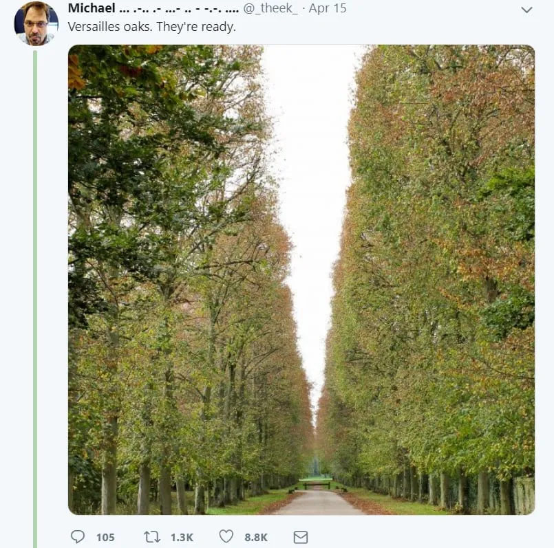

Uma vez li sobre uma pessoa tão focada em eficiência que ela apertava o mesmo número no micro\-ondas para economizar tempo no aquecimento da refeição\, por exemplo\: 1\:11\, 2\:22\, 3\:33\. Meu primeiro pensamento foi\: \'uau\, aqui tem alguém realmente intenso\, não é à toa que ela se adianta e eu estou ficando para trás na vida\'\. Meu próximo pensamento foi \'espera\, esse hábito não faz sentido\' [^1]\. E ainda assim\, agora foi citado como uma característica positiva pelo autor do artigo\. É quase como se o autor quisesse que fosse verdade\, quisesse acreditar que a ação foi calculada\.

Após o incêndio em Notre Dame\, espalhou\-se a história de que os bombeiros priorizavam salvar relíquias em vez das estruturas de madeira\, [since oak trees from Versailles were intended as replacements](https://medium.com/the-long-now-foundation/long-now-lessons-from-notre-dame-925d27441bdc 'long now')\.

Como o link mostra\, havia pouca base substancial por trás disso\. Mas as pessoas queriam que fosse verdade\, queriam acreditar que a ação foi deliberada\.

Temos um forte instinto de acreditar em narrativas [^2]\, falsas ou não\. Todos gostamos da história de como cada ação tem significado e como essa única coisa mudou a história\, mas isso raramente acontece\. Nossas ações têm consequências\, mas raramente as consequências exatas que queremos\. Não estou dizendo para evitar anedotas\, mas para ter cuidado ao ler uma história\. [The success story of another might not be applicable to you.](https://ofdollarsanddata.com/the-problem-with-most-financial-advice/ 'financial advice')

Economia é um campo em que narrativas também desempenham um papel enorme\, tornando\-o [complicated to assess policy impact](https://www.bloomberg.com/opinion/articles/2019-04-23/modern-monetary-theory-austrian-economics-deserve-skepticism 'skepticism')\. Pegue o salário mínimo ou estágios não remunerados\, por exemplo\. [Cochrane cites a few studies with some concerning findings when raising the minimum wage:](https://johnhcochrane.blogspot.com/2019/04/meer-on-minimum-wage.html 'cochrane')

> Quando o salário mínimo é aumentado\, os empregadores compensam o aumento dos custos trabalhistas reduzindo benefícios como a generosidade do seguro de saúde\.

> Quando o debate foca no número total de empregos perdidos ou conquistados\, esconde essa distribuição potencialmente desagradável dos benefícios\: um recém\-formado com um emprego de barista pode ganhar alguns dólares a mais por hora\, mas quem abandonou o ensino médio acha mais difícil conseguir e manter um emprego

> Empregos de baixa remuneração não são fáceis\, não pagam bem e raramente são divertidos\. Mas não conseguir encontrar trabalho é muito pior\.

E na mesma seção de comentários\, um leitor cita estudos contrários que apoiam o aumento do salário mínimo\. A maioria das pessoas vai escolher sua história e mantê\-la\, já que é mais simples ser consistente e confirmar seus vieses\. Acho que isso funciona para alguns assuntos\, mas para muitos outros devemos nos esforçar para entender os dois lados do argumento\, que podem ser verdadeiros em cenários diferentes\. Mas ninguém quer ouvir \'bem\, depende\; aumentar o salário mínimo poderia ajudar nesse estado\, mas não no outro\' [^3]\. Você é pago para tomar partido\.

As pessoas já estão tomando partido na tendência dos acordos de compartilhamento de renda\, vendo\-a como uma escravidão redescoberta ou um alinhamento transformacional de incentivos\. Eles se estabeleceram em duas narrativas\, apesar de provavelmente terem ouvido falar do conceito recentemente\. [This post](https://medium.com/@eriktorenberg_/life-capital-9e5028c0ea12 'life capital') discute essa nova tendência na educação\, popularizada pela escola Lambda\:

> Um Acordo de Participação de Renda é um acordo financeiro no qual um indivíduo ou organização fornece algo de valor a um beneficiário que\, em troca\, concorda em pagar uma porcentagem de sua renda por um determinado período de tempo

> O Lambda só recebe se e somente se o estudante ganhar uma certa quantia após a formatura\. Em outras palavras\, os incentivos são alinhados\.

> ISAs e outros casos relacionados de securitização de capital humano foram tentados\.

> A Purdue comercializa sua oferta ISA como uma alternativa aos empréstimos estudantis privados e aos Empréstimos Parent PLUS\. Estudantes de qualquer curso podem receber \$10\.000 por ano em financiamento ISA com taxas que variam entre 1\,73\% e 5\,00\% de sua renda mensal\.

> Existem três temas principais em particular que nos animam para o futuro dos ISAs\: agregação\, estruturas inovadoras de incentivos e criptomoedas\.

Parece que nossa narrativa sobre o ensino superior pode mudar\. Ainda não tenho uma opinião forte aqui [^4] Mas parece ser uma tendência positiva\. Não acho que alguém esteja se forçando a frequentar a Lambda\, e a taxa de colocação de emprego parece animadora\. Embora eu ache que a faculdade não deveria ser só para conseguir um emprego\.\.\.

Em que podemos acreditar então\? O que é mais provável de resistir ao teste do tempo\? Peter Kaufman escreveu sobre três baldes que ele usa para encontrar princípios duradouros\. Jana Vembunarayanan analisa isso [here](https://janav.files.wordpress.com/2016/07/threebucketframework.pdf 'jana on kaufman') [^5] \. Há vários exemplos no texto da Jana que eu contestaria\, mas abaixo estão algumas ideias interessantes\:

> Todo estatístico sabe que um tamanho de amostra grande e relevante é seu melhor amigo\. Quais são os três maiores e mais relevantes tamanhos de amostra para identificar princípios universais\? O balde número um são os sistemas inorgânicos\, que têm 13\,7 bilhões de anos de tamanho\. São todas as leis da matemática e da física\, todo o universo físico\. O balde número dois são os sistemas orgânicos\, 3\,5 bilhões de anos de biologia na Terra\. E o balde número três é a história humana\, você pode escolher seu próprio número\, eu escolhi 20\.000 anos de comportamento humano registrado\. Esses são os três maiores tamanhos de amostra que podemos acessar e os mais relevantes\.

> Uma das melhores coisas que podemos fazer pelos alunos é ajudá\-los a desenvolver mentalidades matemáticas\, acreditando que matemática é sobre pensar\, fazer sentido\, grandes ideias e conexões — não sobre memorizar métodos\.

> Buffett focou tanto no conhecimento \(o que você sabe\) quanto nas habilidades \(o que você faz\)\. A bidirecionalidade do conhecimento \\\<\-\> tornou suas representações mentais mais enriquecidas\. É por isso que ele é um dos melhores investidores do mundo\.

> Você não constrói representações mentais pensando em algo\; você as constrói tentando fazer algo\, falhando\, revisando e tentando de novo\, repetidas vezes\. Quando termina\, não só desenvolveu uma representação mental eficaz da habilidade que estava desenvolvendo\, como também absorveu muita informação relacionada a essa habilidade\.

A gravidade vai ficar por um tempo [^6]\, assim como nossa necessidade de comer e nossa necessidade de interação social\. Os princípios físicos e biológicos provavelmente são mais fáceis de identificar\, mas acho que o tamanho da amostra social é a parte difícil\. Os humanos agem racionalmente\.\.\. até que deixam de agir\. Se você tiver exemplos de princípios sociais que te surpreenderam\, me avise\.

Concordo com o ponto da Jana sobre tentar em vez de apenas pensar\, embora\, claro\, não possamos tentar tudo\. Conversar sobre ideias\, discutir com as pessoas e escrever sobre elas é uma alternativa\. Você também poderia considerar a ideia de ser um ['generalised specialist', as Farnam Street puts it](https://fs.blog/2017/11/generalized-specialist/ 'FS')\, um tema que já desenvolvi em e\-mails anteriores também\. Quero tentar de tudo\, mas tenho que perceber que geralmente não serei recompensado por ser generalista\.

## Diversos

1. ["He took great pains not to mislead or confuse children, and his team of writers joked that his on-air manner of speaking amounted to a distinct language they called “Freddish.” Fundamentally, Freddish anticipated the ways its listeners might misinterpret what was being said."](https://www.theatlantic.com/family/archive/2018/06/mr-rogers-neighborhood-talking-to-kids/562352/ 'Mr Rogers')
2. [Anyone have $2.95mm to ~~lend~~ give me for this baby t-rex auction?](https://www.ebay.com/itm/YOUNG-BABY-T-REX-TYRANNOSAURUS-DINOSAUR-FOSSIL-HELLS-CREEK-MAYBE-ONLY-1-TREX/292983172236?hash=item4437286c8c:g:WagAAOSwdX5cdXgI 'ebay t rex')\. Artigo de notícias de acompanhamento sobre a controvérsia da venda [here](https://www.thedailybeast.com/baby-tyrannosaurus-rex-goes-on-sale-on-ebay-sparking-paleontologist-rage 'paleontologist rage') [^7]
3. [Social media engagement rates](https://www.webstrategiesinc.com/blog/which-social-media-sites-get-the-most-engagement 'engagement') Para o influenciador aspirante que há em você\. [^8]
4. Se você está evitando o Facebook por causa de notícias negativas\, [reminder of the FB/Insta GOOG/youtube relationship](https://spreadprivacy.com/facebook-instagram/ 'FB') [^9]
5. Quão poderoso Thanos é agora [^10]\? Quão poderoso ele deveria ser\? [Different levels of omnipotency](https://tvtropes.org/pmwiki/pmwiki.php/Main/TheOmnipotent 'omnipotency')\, assim como diferentes níveis de infinito
6. [7 ton boulders you can move by hand](https://gizmodo.com/researchers-made-25-ton-boulders-they-can-move-by-hand-1834106230 '25 ton') [^11]\. Acho interessante a interseção entre arte e utilidade aqui\.
7. [This article on AI in China](https://chinai.substack.com/p/chinai-48-year-1-of-chinai 'AI china') merece uma seção própria\, mas acho que você está entediado de eu escrever sobre IA por 3 meses seguidos\, então vou escolher apenas os destaques\:

   > \'A China tem uma consciência bastante profunda do que está acontecendo no mundo de língua inglesa\, mas o contrário não é verdade\'\, diz Ng\.\"

   > Observadores ocidentais consistentemente exageram as capacidades de IA chinesas\.

   > Além da importância da IA para o crescimento econômico e a segurança militar\, o governo chinês vê a IA como uma ferramenta para melhorar a governança social\, o que faz das aplicações de segurança pública um grande motor do desenvolvimento da IA na China

   > É perfeitamente razoável destacar diferenças nas noções chinesas de ética em IA ou no grau de importância da privacidade para os consumidores chineses\, mas é absolutamente desumanizante dizer que os chineses não se importam com privacidade

8. [Hong Kong share pledges](/writing/stock 'pledges')

[^1]: Não consigo lembrar a origem dessa anedota e espero que não tenha sido algo que algum de vocês me disse\.\.\. de qualquer forma\, estou supondo que você percebeu o problema desse \'hack\' de economizar tempo\?

[^2]: Resumo de nove palavras de Sapiens\?

[^3]: Cada vez acredito mais que as pessoas preferem opiniões mais fortes do que equilibradas\, já que é mais fácil de vender

[^4]: Percebo que não estou seguindo meus próprios conselhos aqui

[^5]: A peça original de Kaufman é [here](http://www.eastcoastasset.com/wp-content/uploads/ecam_2014_3q_letter.pdf 'original letter')

[^6]: Alguém vai levantar o ponto sobre [edge cases](https://www.jpl.nasa.gov/edu/news/2019/4/19/how-scientists-captured-the-first-image-of-a-black-hole/ 'black holes') Mas isso é perder o ponto\.\.\.

[^7]: Parece estar dentro do direito dele vender\, mas também é enganoso na página do ebay dizer que a intenção é \'abrir isso para o mundo\' em vez de apenas tentar ganhar dinheiro com isso\. Eu provavelmente faria o mesmo na posição dele\?

[^8]: Com a maioria das taxas de engajamento desses canais caindo \<5\%\, não é de se admirar que todo mundo esteja relutante em responder a esta newsletter\.\.\. Comentário à parte\, algum de vocês é realmente famoso pelo Instagram\?

[^9]: Não sou defensor da tendência de excluir o Facebook\, mas imagino que alguns de vocês possam ser\. Acho que há valor em usá\-la\, mas\, como em quase tudo\, você precisa estar atento a como usa\. Seria muito mais difícil para mim organizar eventos sem ela\. De qualquer forma\, é útil saber quem é dono de cada coisa se você está tentando evitar uma empresa\.\.\.

[^10]: Personagem do filme dos Vingadores\, caso você não soubesse\.

[^11]: O artigo diz 25 toneladas\, mas eu verifiquei com [the artists themselves](http://www.matterdesignstudio.com/#/walking-assembly/ 'matter design studio') E o peso combinado é na verdade \~6\,5 toneladas\. Ainda assim\, é um conceito interessante\. Também serve para mostrar o quanto os escritores querem acreditar em sua própria história\.
