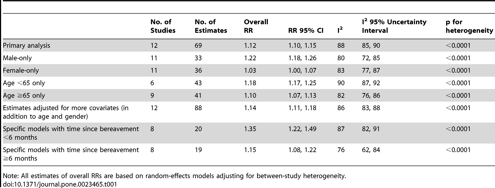

\"Aujourd\'hui\, maman est morte\. Ou peut\-être hier\, je ne sais pas\.\" As linhas iniciais de [The Stranger by Albert Camus](<https://en.wikipedia.org/wiki/The_Stranger_(Camus_novel)> 'Stranger') Me cativou quando li pela primeira vez [^1] e ainda me cativam hoje\. Eles estão entre meus começos favoritos de um livro\. Traduzido aproximadamente como \"Maman morreu hoje\. Ou ontem\, eu não sei\"\, [^2] Essas frases simples desencadeiam uma série de perguntas na mente do leitor\: \"Por que ele não sabe\? Ele está tomado pela dor\? Ou foi o contrário e ele é incapaz de sentir\? Ele é real\? Eu sentiria o mesmo\?\"

A indiferença do personagem principal Meursault à vida continua ao longo do romance\, resultando em uma leitura desconfortável\, mas envolvente\. Parafraseando Camus\, talvez a indiferença de Meursault tenha sido o que o condenou no jogo da vida\. Não encontramos muitos Meursaults\, e esperamos não nos tornar um\. Que continue sendo uma obra de ficção\.

No mundo da não\-ficção\, e no extremo oposto do espectro\, Nautilus publicou um artigo sobre [dying from a broken heart:](http://nautil.us/issue/15/turbulence/can-you-die-from-a-broken-heart 'nautilus')

> Mas será que é possível morrer de coração partido\? Acontece que pode\, por causa da \"síndrome do coração partido\"\, também conhecida como cardiomiopatia induzida por estresse\. \\\[\.\.\.\\\] Mas o luto mortal não é apenas sobre estresse\, dizem os cientistas\. Ele lança luz sobre os laços fisiológicos do amor\, cedidos a nós pela evolução\, que muitas vezes são melhor compreendidos quando quebrados\.

O artigo segue citando uma meta\-análise desse chamado \"efeito viuvez\"\. Acredito [this](https://journals.plos.org/plosone/article?id=10.1371/journal.pone.0023465 'paper') é o artigo de 2011 referenciado\, embora eu não possa confirmar\, pois o Nautilus infelizmente não incluiu fontes\. Os principais achados estão resumidos na tabela abaixo\. Se estou lendo corretamente\, a coluna RR implica o risco relativo de morte para essa linha\, por exemplo\, um homem tem 1\,22 vezes mais chance de morrer após a morte do cônjuge em comparação com o homem médio\. [^3] [^4]

Aparentemente\, isso acontece com uma frequência semi\-frequente\:

> A ideia de que o luto pode aumentar o risco de morrer faz sentido intuitivo\, especialmente entre aqueles que passam tempo com os doentes\, diz Roy Ziegelstein\, cardiologista e vice\-reitor de educação da Faculdade de Medicina da Universidade Johns Hopkins\. \"Acho que\, se você pesquisasse médicos\, eles diriam esmagadoramente que isso acontece não raramente\.\"

E o artigo dá uma explicação plausível para o motivo disso acontecer\:

> Ao contrário de um ataque cardíaco\, a síndrome do coração partido não tem origem em artérias bloqueadas\. Parece ser causada por um aumento repentino dos hormônios do estresse\, incluindo epinefrina \(mais conhecida como adrenalina\) e seu primo químico\, a noradrenalina\. \\\[\.\.\.\\\] A súbita enxurrada de hormônios basicamente choca o coração\, impedindo\-o de bombear normalmente\. Em um raio\-X ou ultrassom\, o ventrículo esquerdo do coração aparece aumentado e deformado\. \\\[\.\.\.\\\] a condição pode ser fatal se o coração deformado não conseguir bombear sangue suficiente para o resto do corpo\.

As más notícias não param por aí\:

> Quando você tem estresse crônico\, está constantemente degradando sua capacidade de se curar e combater infecções\. É por isso que o estresse crônico está associado a tantos maus resultados de saúde\.

A Mayo Clinic discute como [chronic stress can put your health at risk](https://www.mayoclinic.org/healthy-lifestyle/stress-management/in-depth/stress/art-20046037 'mayo')\, devido à superexposição ao cortisol\:

> O sistema de resposta ao estresse do corpo geralmente é autolimitado\. Uma vez que a ameaça percebida passa\, os níveis hormonais retornam ao normal\. À medida que os níveis de adrenalina e cortisol caem\, sua frequência cardíaca e pressão arterial retornam aos níveis de base\, e outros sistemas retomam suas atividades normais\. Mas quando os fatores de estresse estão sempre presentes e você se sente constantemente sob ataque\, essa reação de luta ou fuga permanece ativada\.

Mas há algumas descobertas comoventes do artigo original\:

> Embora pesquisadores médicos talvez não consigam identificar de onde vem essa onda de força de vontade \\\[para viver mais\\\]\, eles já mostraram evidências da notável capacidade das pessoas de se agarrar e deixar ir à vontade\.

E outros experimentos que sugerem como vemos nossos parceiros\. Acredito [this](https://news.virginia.edu/content/shocking-new-research-finds-friendships-are-key-good-health 'virginia') O estudo referenciado abaixo\:

> Os padrões cerebrais dos voluntários eram indistinguíveis quando a ameaça era dirigida a eles ou ao parceiro\. Isso não era verdade quando se segurava a mão de um estranho\. \"Para o seu cérebro\, um parceiro não é só metaforicamente\, mas literalmente\, parte de quem você é\"\, ele diz\.

Esse experimento UVA conclui\:

> \"O que estamos descobrindo aqui é que\, se nosso relacionamento for bom e estivermos com alguém em quem confiamos\, podemos dizer\: \'Hipotálamo\, você não precisa se esforçar tanto agora\. Sim\, há uma ameaça\, mas calme – a ameaça não é tão ameaçadora quanto se você estivesse sozinho\.\' Seu amigo vai te ajudar a lidar com essa ameaça\; portanto\, você pode trabalhar menos para lidar com ela\, e essa economia vai te manter mais saudável a longo prazo\.\"

Voltando ao artigo original\, existem três características do amor\:

> Fisher descreve três características distintas desse sistema\: uma para sentimentos de apego\, outra para sentimentos de amor romântico intenso e uma terceira para o desejo sexual\. O apego gira em torno da ocitocina\, um hormônio que desempenha um papel fundamental na formação de laços de casal\.

> O amor romântico ativa o sistema cerebral para dopamina\, um mensageiro químico que desempenha um papel importante nas vias cerebrais de prazer e recompensas\.

> O sexo também ativa o sistema dopaminérgico\, e os orgasmos enviam uma enxurrada de ocitocina para a corrente sanguínea\.

A perda desses três quando você perde um parceiro é devastadora\, o que pode explicar o \"efeito viuvida\"\. [^5]

Se você ou alguém que você conhece perdeu recentemente um parceiro\, existem recursos online sobre [how to help](https://www.huffpost.com/entry/grieving-national-widows-day_n_5908c1dee4b02655f8415065 'widows day') ou [how to handle](https://www.nytimes.com/2019/04/11/business/widows-financial-planning-retirement.html 'widows') Uma situação assim\. [^6]

Por fim\, se você ou alguém que você conhece está suicida por causa da perda de um ente querido\, por favor\, procure ajuda\! Se você acha que até ligar para a linha de prevenção ao suicídio é muito difícil\, confira o serviço de mensagens [Crisis Text Line!](https://www.crisistextline.org/ 'CTL')

[^1]: Mas em inglês\! Meu francês é tão ruim que\, quando tento me apresentar em lojas de francês\, a outra pessoa imediatamente muda para inglês sem que eu peça\.\.\.

[^2]: As pessoas debatem sobre como traduzir isso\, especialmente a primeira frase\. Um resultado de busca bem ranqueado [from the New Yorker's Ryan Bloom](https://www.newyorker.com/books/page-turner/lost-in-translation-what-the-first-line-of-the-stranger-should-be 'new yorker') prefere \"Hoje\, Maman morreu\"\. Outros usam \"Maman morreu hoje\" ou \"Mãe morreu hoje\"\. Eu prefiro \"Mamãe morreu hoje\" e acho que isso resolve a questão de \"Mãe\" ser distante demais versus \"Maman\" ser uma palavra estrangeira\, e também se lê bem\, com \"Ou ontem\" vindo logo após \"morreu hoje\"\. Mas o que eu sei\, nunca fiz literatura além do ensino fundamental\, então isso é tudo conjectura aqui\.

[^3]: Como já enfatizei antes\, não sou cientista nem estatístico e posso muito bem estar interpretando isso errado\.

[^4]: Além disso\, não consegui encontrar um período de tempo em que uma morte contou para os estudos envolvidos na meta\-análise\. Quero dizer\, presumivelmente a maioria dessas pessoas morreu até a meta\-análise ser concluída\, então qual período de corte foi usado\?

[^5]: Isso me lembra como os gregos faziam [4 different types of love](https://en.wikipedia.org/wiki/Greek_words_for_love 'greek')\. Talvez eles estivessem certos em algo\? Mas é pura especulação aqui\.

[^6]: Felizmente\, não precisei usar os conselhos desses recursos\, mas isso também significa que não tenho certeza se essas são as melhores formas atuais de lidar com o luto\. Me avise se encontrar opções melhores\.
