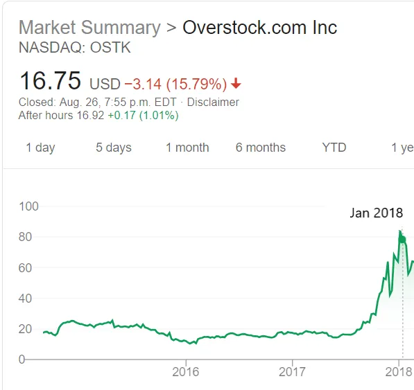
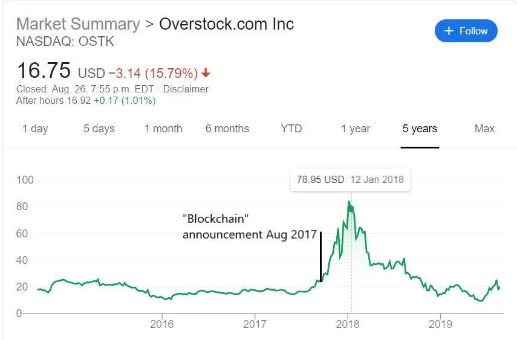
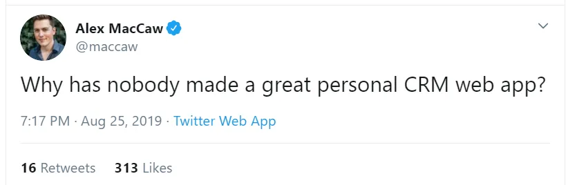
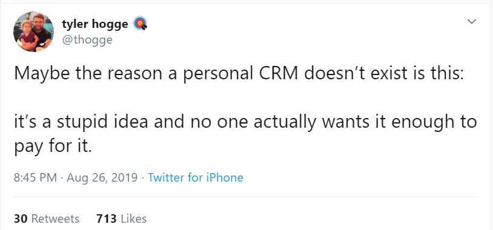

## Concluições

1. Encontrar um par negociando em uma bolha pode ser melhor do que vender a descoberto ou aproveitar o momento
2. O que é um CRM pessoal e por que as pessoas estão falando sobre ele\?
3. Não nos conhecemos muito bem\; como aumentar a autoconsciência

### Bolhas e espiões russos

Com todas as notícias sobre bolhas deste ano\, quis destacar [Byrne Hobart's post about them.](https://medium.com/@byrnehobart/so-youve-spotted-a-bubble-3f2fa5cf49a9 'Bubble') [^1] O que você deve fazer se acha que o preço atual de um ativo representa uma bolha\? Byrne apresenta três correntes de pensamento abaixo\. Como sempre\, nada disso é aconselhamento financeiro\.

> \\\[Primeiramente\:\\\] A abordagem corajosa\, estúpida e intelectualmente consistente\. Você poderia simplesmente vender a descoberto\. \\\[\.\.\.\\\] É difícil\, porém\, porque normalmente os ativos com bolhas são precificados de forma a obter retornos maiores que ativos comparáveis\, apenas retornos que não são suficientes para compensar o risco\. \\\[\.\.\.\\\] As bolhas também tendem a persistir por muito tempo\, apesar de sua instabilidade intrínseca\, porque são parcialmente auto\-perpetuadas\.

Shorting [^2] é sexy\, porque você está sendo contrária e assumindo riscos teoricamente ilimitados para provar sua superioridade intelectual para o investidor burro comum\. [There's even an oscar nominated movie about shorting the 2008 housing crisis](<https://en.wikipedia.org/wiki/The_Big_Short_(film)> 'movie')\. O problema de vender a descoberto é que o timing é fundamental\. Você pode estar certo\, mas cedo\, e ainda assim explodir\. Existem muitos vendidos a descoberto famosos que perderam bilhões para seus investidores\, como [Ackman and Herbalife](https://www.cnbc.com/2018/04/05/how-bill-ackmans-hedge-fund-empire-crumbled-in-less-than-three-years.html 'Ackman')\, [Einhorn and Netflix](https://www.forbes.com/sites/antoinegara/2019/03/05/after-horrendous-investing-run-david-einhorn-exits-billionaire-club/#3a140043498c 'Einhorn')\, ou [whoever was short squeezed by Porsche and Volkswagen in 2008.](https://www.reuters.com/article/us-volkswagen/short-sellers-make-vw-the-worlds-priciest-firm-idUSTRE49R3I920081028 'Porsche') Note que não estou dizendo que Ackman e Einhorn estavam errados sobre essas empresas\. Eles ainda podem estar certos\, mas perderam tanto dinheiro nesse meio tempo que é um ponto irrelevante\.

Vamos pegar Overstock\.com como outro exemplo\. Antes de seus [CEO resigned so he could let everyone know he'd dated a Russian spy,](https://www.forbes.com/sites/laurendebter/2019/08/22/the-exclusive-inside-story-of-the-fall-of-overstocks-mad-king-patrick-byrne/#176918ea53a5 'Forbes') [^3] Ele estava tentando salvar a empresa em 2017 ao migrar para o blockchain\. Suponha que você achasse que a Overstock também iria fracassar nisso\, e vendido a descoberto na Overstock em \$20 em agosto de 2017\:

À medida que o preço da ação sobe lentamente\, você redobra a aposta\, convencido de que não pode durar\. De alguma forma\, dura\, e você está olhando para um preço de \$60 em novembro de 2017\:

Ops\. Você não só tem uma perda de papel\, como sua exposição é múltipla do que você tinha no início e com o qual se sentia confortável\. Se você liquidasse sua posição agora\, perderia \$40 \- os atuais \$60 menos os \$20 que ganhou inicialmente\. Você tem uma vendeta agora e está determinado a vender essa ação até o fim ou ir à falência tentando\, então você segura até o próximo ano\:

Seu corretor voltou das férias e percebeu que esqueceu de emitir um [margin call](https://www.investopedia.com/ask/answers/05/shortmarginrequirements.asp 'margin') Todo esse tempo\, e agora em pânico\. Quando você está vendendo uma ação\, geralmente precisa de \~130\% do valor da ação como garantia\, como reserva de fundos [^4]\. Quando a ação estava em \$20\, ter \$26 separados não era um problema\. Agora\, porém\, você precisa de \$104 de lado\, e o corretor quer que você recompreenda a diferença de \$78 \(\$104 menos \$26\)\. Dependendo de quanto dinheiro você tinha no início\, esses \$78 adicionais \(3x a exposição inicial\!\) podem facilmente te esgotar\. Você é forçado a liquidar sua posição e compensar a diferença montando um Go Fund Me\.

E então\, claro\, isso acontece\:

O ponto chave aqui é que você estava certo – o pivô da blockchain que o Overstock tentou não funcionaria\. Mas você estava errado no timing e perdeu seu dinheiro e sua reputação\. Mesmo quando vender uma ação é \'óbvio\'\, como por exemplo [bad quality companies changing their name to get a price bump](https://www.winton.com/longer-view/the-history-of-company-names 'names')\, o [time period](https://www.sciencedirect.com/science/article/pii/S0165176519301703 'time') Exigido para que sua tese se desenvolva pode te levar à falência antes\.

Curiosamente\, vendedores a descoberto famosos [Robert Wilson and Jim Chanos have this to say about shorting:](https://blogs.cfainstitute.org/investor/2016/12/22/lessons-from-a-legendary-short-seller/ 'short')

> \"Eu diria que do começo ao fim \\\[\.\.\.\\\] talvez eu tenha empatado meus shorts\.\"

> \"Um bom portfólio curto permite que você seja mais longo\.\.\. E esse é o cerne do que fazemos\.\"

Para deixar claro\, não estou dizendo para evitar vendeios\, nem que vender seja ruim para a economia\. [There's research](https://marginalrevolution.com/marginalrevolution/2019/08/short-selling-reduces-crashes.html 'short MR') Indicando que pode ser bom\, e muitas pessoas já ganharam dinheiro com shorts\. Estou dizendo que é difícil acertar\.

Qual é uma alternativa\?

> \\\[Segundo\:\\\] A abordagem mercenária\, mas lucrativa\. \\\[\.\.\.\\\] \"Ficamos bastante felizes em fazer parte da bolha\, mas em fazer isso em posições altamente líquidas\, para que pudéssemos sair do mercado rapidamente se quiséssemos\.\"

Nesta versão\, você tenta surfar a onda o máximo de tempo possível\, antes de sair o mais tarde possível [^5]\. Isso me parece o que a maioria dos investidores profissionais está fazendo na realidade\, apesar das constantes proclamações de serem detentores de longo prazo\. Se funciona\, funciona\, e muitas pessoas bem\-sucedidas usaram essa estratégia\.

> Como é perigoso fazer isso com apenas uma\, elas escolhem várias ao mesmo tempo\, torcendo para que não todas colapsem ao mesmo tempo\. Essa diversificação permite que aumentem um pouco\, o que retorna a alavancagem\. \\\[\.\.\.\\\] à medida que o risco medido aumenta\, elas querem reduzir a alavancagem\. Mas reduzir a alavancagem significa desfazer várias operações ao mesmo tempo \\\[\.\.\.\\\] prejudica os retornos dos traders que seguiram sua estratégia e aumenta as correlações\, forçando\-os a vender mais também\.

O lado negativo é quando você chega tarde demais em algumas apostas e é forçado a desfazer suas posições devido aos parâmetros de risco que a empresa define sobre quanto você pode perder ao mesmo tempo\. É meio que uma estratégia de viver rápido\, morrer jovem\, começar outro fundo com outro nome\.

> \\\[Por último\:\\\] Nirvana\: Carga Positiva e Inclinação Positiva\. Vou humildemente submeter minha contribuição para o campo do Lewis errado\: O Big Short na verdade não foi uma troca muito boa\. Se ele estivesse realmente atento\, teria escrito A Grande Troca de Pares\. \\\[\.\.\.\\\]

Byrne usa a crise imobiliária como exemplo\. Um fator na crise habitacional foi como os empréstimos foram agrupados em grandes conjuntos\, sob a suposição de que não estavam correlacionados\. Acontece que os empréstimos subprime estavam mais correlacionados do que o esperado\, o que implica\:

> isso significa que fatias de CDOs respaldados por subprime com classificação AAA não eram dignas da classificação AAA\. Mas também significa que a parte mais arriscada\, a tranche de ações\, é menos arriscada do que parece\: alta correlação dentro de um conjunto de valores mobiliários significa que inadimplências em massa são mais prováveis\, mas também significa que zero inadimplências são mais prováveis\.

Como os títulos são mais correlacionados\, é provável que você ocorra eventos mais extremos\, não apenas na queda\, mas também na alta\. Para colocar isso na prática\,

> um investidor poderia comprar uma pequena fatia do patrimônio\, adquirir seguro contra uma grande parte da dívida classificada AAA e acabar com \\\[\.\.\.\\\]\:

> O retorno das ações compensou mais do que o custo de comprar seguro contra a fatia classificada AAA\.

> Daria um pouco de dinheiro se o mercado imobiliário subisse\, porque o patrimônio valeria mais\, enquanto o seguro AAA não valeria muito menos\.

> Daria muito dinheiro se o mercado imobiliário caísse\.

Byrne conclui dizendo que nem todas as bolhas têm situações como a terceira acima\, e pode ser difícil identificar como montar uma posição que tire proveito disso\. Se você fizer isso\, pode ser uma estratégia menos arriscada tratar uma bolha\.

### Não se preocupe\, você é um contato nível 5 no meu CRM pessoal\\\*\\\*

O crescimento de [Superhuman](https://techcrunch.com/2019/06/27/my-six-months-with-30-month-email-service-superhuman/ 'techcrunch')\, um aplicativo de e\-mail que cobra uma taxa em troca de uma experiência supostamente revolucionária\, gerou uma febre em [premium subscription services](https://techcrunch.com/2019/08/27/kleiner-perkins-bets-on-a-premium-email-service-thats-bringing-slack-groups-into-gmail/ 'kleiner')\. Recentemente\, o tech twitter reviveu a ideia de um CRM pessoal \(Customer Relationship Management\)\, ou seja\, um software que pode ajudar você a gerenciar seus relacionamentos pessoais\.

\)

A opinião estava dividida\. Algumas pessoas estavam\.\.\. mornas

Outros afirmavam que o Twitter já era um CRM pessoal

[And some people pointed out how this recurring idea continues to attract new startups](https://twitter.com/devahaz/status/1164224618602758144 'twitter')

É fácil ser desdenhoso\. Por que as pessoas iriam querer um software assustador que rastreie todos os seus relacionamentos\, salve todas as suas interações e faça todos os seus desejos de aniversário parecerem forçados e inautênticos\?

Ah\, espera\.

Quer você pense ou não [Facebook has Zucked the world](https://www.theguardian.com/books/2019/feb/07/zucked-waking-up-to-facebook-catastrophe 'FB')\, seu sucesso me mostra que as pessoas realmente querem uma forma de gerenciar seus relacionamentos pessoais\. Um CRM pessoal não é uma ideia boba e eu não descartaria isso de imediato\. A dificuldade está em como inovar nos sistemas existentes e também em fazer as pessoas pagarem por isso\.

A facilidade de manter contato com as pessoas nos fez sentir que nós _Deveria_ Mantenha contato\. Antes podíamos justificar nossa falta de contato com um \"Ah\, você nunca recebeu minha carta\? Que estranho\, deve ser o sistema postal\"\. Agora não temos mais esse luxo e temos que lutar para parecer que nos importamos com o 50º post de quinta\-feira do seu amigo no Instagram\. Estamos sobrecarregados\.

Pessoas que pedem um CRM pessoal querem algo que lembre das pessoas que conheceram\, saiba o contexto relevante que compartilharam\, te avise sobre datas importantes e lembre de avisar alguém de vez em quando\, mantendo um alto grau de privacidade e segurança\. Entendo por que outros ficam indignados com essa ideia\, já que envolve terceirizar o esforço social do indivíduo para um computador\. \"Ah\, ela é tão fofa\, ela lembrou do meu aniversário\!\" soa melhor do que \"sim\, o CRM pessoal dele me enviou um cartão\-presente para a Blockbuster\"\. Facilitar também torna tudo inautêntico\. O que significa ser humano se um computador está conduzindo todas as nossas interações sociais\?

No entanto\, um sistema que armazena informações importantes sobre amigos não é uma ideia nova\. Tenho certeza de que a maioria de nós cresceu com listas de telefones e endereços dos nossos contatos\. [David Rockefeller kept index cards of all the important people he met.](https://www.forbes.com/sites/carminegallo/2017/12/07/david-rockefellers-rolodex-offers-a-master-class-in-making-friends-and-influencing-people/#5b1525625cc4 'David') Só porque agora estamos migrando isso para a nuvem não significa o fim da verdadeira amizade\. Como com a maioria das ferramentas\, caberá a nós usar sistemas mais novos para o bem ou para o mal\.

As pessoas pagariam por isso\? As pessoas pagam pelo LinkedIn Premium\, então existem precedentes\. O complicado aqui é que\, fundamentalmente\, esse CRM é mais útil quanto mais dados ele tem\, ou seja\, quanto mais pessoas o usarem\, melhor sua experiência\. Isso [network effect](https://www.nfx.com/post/network-effects-manual 'network') Implica que cobrar dos usuários será prejudicial ao crescimento\, já que você quer barreiras mínimas à entrada\. É também por isso que a maioria das redes sociais lucra com anúncios em vez de assinaturas\.

Sou naturalmente grudado e gosto de manter contato com as pessoas [^6]\. Ter um CRM pessoal seria útil\, mas eu não estaria disposto a pagar por um\, e acho que a maioria das pessoas também não estaria\. Eles parecem ocupar um nicho que tem potencial\, mas não consegue monetizar de forma eficiente\. Embora eu ache que os CRMs pessoais continuarão existindo e sendo reinventados\, tenho 60\% de certeza de que nenhum deles pode alcançar uma escala substancial desde que focem em vender para o indivíduo [^7]\.

### Em todo lugar é o Lago Wobegon

A maioria das pessoas tenta provar que está certa – sobre sua ideia de negócio\, escolha de ações quentes ou o melhor programa de viagens no tempo de todos os tempos [^8]\. Eu te encorajaria a fazer o oposto\. Se você tem uma opinião forte sobre um tema\, deveria buscar provar que está errado [^9]\. Manter rigidamente suas crenças sem examiná\-las é o caminho fácil [confirmation bias.](https://www.psychologytoday.com/us/blog/science-choice/201504/what-is-confirmation-bias 'confirm')

Gostamos de pensar que somos bem nós\-mesmos\; nossos gostos\, desgostos e vieses\. Afinal\, quem melhor para se descrever do que você mesmo\? Assim [Atlantic article](https://getpocket.com/explore/item/people-don-t-actually-know-themselves-very-well 'Atlantic') Aponta\, no entanto\, que não somos tão autoconscientes\. Há uma discrepância entre como prevemos que devemos agir e como realmente nos comportamos\, e outras pessoas podem até ser melhores em descrever nosso comportamento real\. O artigo cita [a meta-analysis](https://psycnet.apa.org/record/2010-25587-001 'meta')\:

> Nossos resultados mostram que as validades operacionais dos traços FFM baseados nas avaliações dos observadores são maiores do que aquelas baseadas nas avaliações de autorrelato\.

FFM no acima refere\-se ao [Five Factor Model of personality](https://www.psychologistworld.com/personality/five-factor-model-big-five-personality 'FFM')\, que é [usually better regarded than the popular MBTI test.](/writing/moloch 'MBTI') A meta\-análise afirma que os outros avaliam nossa personalidade com mais precisão do que nós mesmos\. Não consigo acessar o artigo completo\, mas existe um artigo parecido [older study](https://home.ubalt.edu/NTYGMITC/641/barrick%20mount%20strauss%20big%20five%20obs%20ratings%20JAP%2094.pdf 'old test') Fazendo a mesma afirmação de que as avaliações de outras pessoas sobre você têm mais validade\.

O artigo da The Atlantic continua\:

> No estudo\, as pessoas superaram seus amigos em prever o quão ansiosos pareceriam e soariam ao fazer um discurso \\\[\.\.\.\\\] Mas não foram melhores do que seus amigos \(ou que estranhos que as conheciam apenas oito minutos antes\) em prever o quão assertivas seriam em uma discussão em grupo\. E quando tentaram prever seu desempenho em um teste de QI e em um teste de criatividade\, foram menos precisos que seus amigos\.

Os humanos geralmente são mal calibrados em nossas estimativas\, superestimando nossa capacidade em casos e subestimando nosso desempenho em outros\, dependendo de como podemos ser incentivados\. Você deve se lembrar do [Lake Wobegon effect](https://en.wikipedia.org/wiki/Lake_Wobegon#The_Lake_Wobegon_effect 'Lake') Isso descreve como todos acham que estão acima da média\. O artigo sugere algumas maneiras de alcançar mais autoconsciência\.

> Um\: Se você quer que as pessoas realmente te conheçam\, reuniões semanais não são suficientes\. Você precisa de mergulhos profundos com eles em situações de alta intensidade\.

> Dois\: \\\[\.\.\.\\\] Tenho visto um número crescente de gerentes escrevendo seus próprios manuais de usuário para ajudar as pessoas a entender o que traz o melhor e o pior deles\. Mas é ainda melhor que as pessoas que te conhecem bem escrevam seu manual de usuário para você\.

> Três\: Coloque\-se em situações onde não possa ignorar o feedback de várias fontes\.

Dessas\, a terceira parece a abordagem mais simples para começar\, desde que tanto você quanto sua fonte saibam como dar e receber feedback [^10]\. Primeiro\, pode revelar seu verdadeiro funcionamento interno\, mas duvido que muitas equipes se coloquem em uma situação realmente extrema\, comparado ao retiro mais comum de uma empresa de glamping na natureza [^11]\. Gosto da ideia de um manual do usuário no número dois e gostaria de ter um meu\, mas conseguir que as pessoas dediquem tempo para escrevê\-lo para você é difícil de vender\. Se alguém ler quiser se voluntariar\.\.\.

Saber que não nos conhecemos bem é o primeiro passo\. Infelizmente\, só porque você está ciente de um viés comportamental não significa que pode corrigi\-lo facilmente\, se é que conserta\. [Kahneman](https://en.wikipedia.org/wiki/Daniel_Kahneman 'Kahneman') passou a vida estudando vieses e diz que ainda cai na maioria deles\. Além dos três pontos mencionados acima\, tente [Steelmanning](https://rationalwiki.org/wiki/Straw_man#Steelmanning 'Steelmanning') em vez de usar o Homem de Palha sobre temas com os quais você discorda\, ou [seeking out the weak points in your beliefs rather than continuing to emphasise the strong ones](https://medium.com/the-polymath-project/the-ideological-turing-test-how-to-be-less-wrong-6803a8c290cf 'less wrong')\. Prove que está errado e você pode estar certo com mais frequência\.

## Outros

1. Outras pessoas discutem [why](https://www.perell.com/blog/why-you-should-write 'why') e [how](https://jasonzweig.com/a-few-thoughts-on-journalism/ 'how') Você deveria pensar em escrever mais [^12]

   > Escrever é como levantar peso para o cérebro\. Testar os limites das suas ideias é a maneira mais rápida de melhorá\-las e aumentar sua inteligência

   > Acho que você precisa de todas essas seis qualidades para ter sucesso no jornalismo\. \\\[\.\.\.\\\] Curiosidade\, Ceticismo\, Persistência\, Atenção aos detalhes\, Responsabilidade\, Pele grossa

2. [Violent protests increased support for liberal policy due to greater mobilisation of voters](https://scholar.harvard.edu/files/renos/files/enoskaufmansands.pdf 'violent')\. Algo para refletir à luz dos protestos recentes e se eles poderiam ser eficazes\.
3. ["Nobody ever says at a funeral, “He was too generous, too kind, and much too loving."](https://www.fastcompany.com/90348896/why-not-being-a-jerk-is-important-to-your-happiness-and-success 'jerks')
4. [SMCP came out with an overview of China Internet](https://www.scmp.com/china-internet-report 'smcp')\, e suas principais tendências foram\:

   > A indústria tecnológica \'imitadora\' da China agora está sendo imitada

   > A China está Avançando Com o 5G

   > A China está usando IA em Escala Massiva

   > O Crédito Social está se tornando uma realidade na China

   Concordo com a primeira \(e já faz um tempo\)\, mas acho que as outras três tendências podem estar exageradas\. [I've written about social credit misunderstandings before](/writing/moloch 'social')

5. [Wait but why writes about why we do what we do](https://waitbutwhy.com/2019/08/fire-light.html 'wait but why')\. Se você gostou deste assunto\, [Behave](https://www.goodreads.com/book/show/31170723-behave 'Behave') é uma visão mais abrangente sobre isso\.

**Notas de rodapé**

[^1]: Byrne\'s [WeWork analysis](https://medium.com/@byrnehobart/what-is-we-understanding-the-wework-ipo-b74f0f1f1b46 'WeWork') foi recentemente destaque em [Matt Levine's Money Stuff](https://www.bloomberg.com/opinion/articles/2019-08-19/we-looks-out-for-our-selves 'Money Stuff') também\; coisa incrível\, Byrne\!

[^2]: Para quem não trabalha com finanças\, [shorting](https://www.investopedia.com/terms/s/shortselling.asp 'short') é quando você aposta que o preço de uma ação vai cair e pega emprestado para comprá\-la agora\, por exemplo\, pegando emprestada uma ação da FB por \$180\, vendendo\-a por \$180\, e depois torcendo para que suba a \$100\, permitindo que você a recompre por \$100\. Você devolve a ação da FB e já ganhou \$80\. No entanto\, se a FB subiu para \$280\, agora você terá que comprá\-la por \$280 para devolver a ação emprestada\, o que implica uma perda de \$100\. Como os preços das ações teoricamente podem ir ao infinito\, mas podem no mínimo ir a zero\, você pode perder uma quantia ilimitada em um venda\, enquanto seu ganho potencial é limitado\.

[^3]: Este artigo é cortesia de [The Profile](https://theprofile.substack.com/p/the-profile-the-government-informant 'Profile')\, um boletim semanal de Polina Marinova que traz muitas histórias interessantes de pessoas\. Confira isso\!

[^4]: Alguém realmente precisa checar meus cálculos sobre isso

[^5]: Nunca surfei antes e isso pode ser uma analogia horrível

[^6]: Infelizmente\, não é bem o contrário\.\.\.

[^7]: O Twitter atualmente é uma empresa de US\$ 30 bilhões\, então vamos considerar US\$ 10 bilhões como \"escala substancial\"

[^8]: Para constar\, é [Doctor Who](https://en.wikipedia.org/wiki/Doctor_Who 'Dr Who')\, especialmente os episódios brilhantes [Blink](<https://en.wikipedia.org/wiki/Blink_(Doctor_Who)> 'Blink')\, [Vincent and the Doctor](https://en.wikipedia.org/wiki/Vincent_and_the_Doctor 'Vincent')\, e [Heaven Sent](<https://en.wikipedia.org/wiki/Heaven_Sent_(Doctor_Who)> 'Heaven')\.

[^9]: Sem brincadeira\, eu até considerei chamar o boletim de Prove Que Estou Errado\.

[^10]: O que por si só é uma habilidade difícil\, mas um assunto para outro dia\. Uma boa dica que aprendi há um tempo foi que\, mesmo que você ache que o feedback é falso\, ainda é importante\, pois ele representa como seus colegas realmente te veem\, e não o que você acha que eles veem em você\. E como eles te veem é o que importa no final\.

[^11]: Não estou criticando o glamping na natureza\, só que não é extremo o suficiente para desencadear o primeiro cenário\.

[^12]: Há um viés natural\, já que tanto David quanto Jason são escritores online\, mas isso não diminui os pontos deles\.
