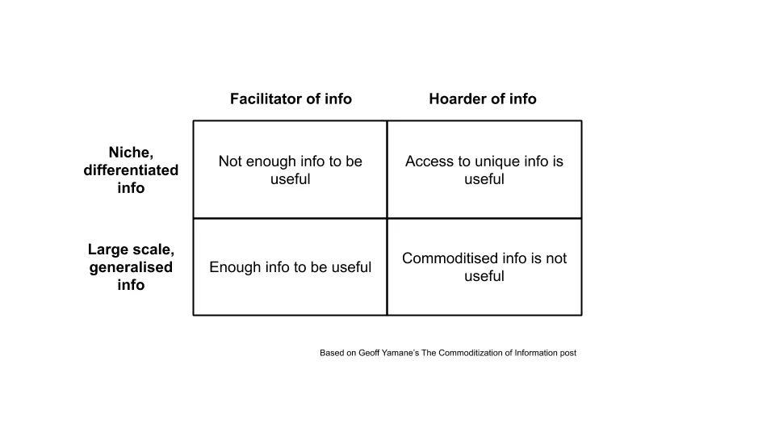

O post desta semana é um comentário sobre [Geoff Yamane's piece on information speed and investment alpha](https://geoff-yamane.com/blog/2019/9/3/the-commoditization-of-information 'Geoff')

> Estratégias de investimento \\\[\.\.\.\\\] podem ser reformuladas como avanço de informação\: retornos extraordinários quase sempre derivam de conhecer alguma verdade antes de outras\. A viabilidade dessas estratégias\, então\, está relacionada à velocidade com que a informação viaja\.

Estou dizendo o óbvio\, mas para ganhar dinheiro você precisa vender algo por mais do que comprou [^1]\. O que significa que você precisa ter exposição ao investimento \(longo ou curto\) antes que outros o façam\; antes que o preço seja corrigido para o que você acredita ser o preço verdadeiro\. O que significa que você sabia ou acreditava em algo antes dos outros\, geralmente por causa de alguma informação ou análise que viu\.

Se vencer nos investimentos depende de informações rápidas\, e a velocidade das informações muda\, isso implica que a forma de vencer nos investimentos também precisa mudar\. House of Morgan escreve sobre como executivos de empresas e banqueiros trocavam informações o tempo todo\, para que todos pudessem ganhar dinheiro com uso de informações privilegiadas antes do público\. Com uma regulamentação mais rigorosa [^2] Essa oportunidade foi removida\. Fundadores de fundos de hedge mais antigos falam sobre como você costumava conseguir a notícia antes dos outros\, estando fisicamente no local onde ela foi publicada\. Com a internet\, essa oportunidade também desapareceu\. Quando a velocidade da informação muda\, os estilos de investimento mudam\.

> Os fundos de investimento de hoje parecem ter menos alfa\, o que pode se dever ao fluxo muito rápido das informações

> As estratégias de investimento bem\-sucedidas em voga hoje parecem todas variantes de um problema de informação\.

Muitos fundos hoje são administrados por fundadores que começaram suas carreiras de investimento nos anos 80\, quando a vantagem mencionada antes era principalmente obter informações de qualidade à frente dos outros\. Esses fundos ainda adotam essa mesma abordagem atualmente\, apesar da diferença na velocidade da informação\. Fundos grandes como Citadel\, Millennium e DE Shaw negociam com divulgações trimestrais de resultados\. É plausível que isso tenha causado retornos médios mais baixos [^3]\.

> Estratégias de investimento \\\[\.\.\.\\\] parecem ser o canário na mina de carvão para a lucratividade declínioa de muitos modelos de negócios dependentes da informação\, que obtêm sua lucratividade ao acumular e explorar o valor de informações privadas ou de acesso caro

Aqui\, Geoff generaliza o argumento para além da indústria de investimentos\. Se a vantagem nos investimentos diminuiu devido à aceleração da informação\, isso significa que outras indústrias semelhantes podem ser as próximas\? Ele continua listando seguros de vida\, produtores de diamantes e produtores químicos como exemplos de indústrias que lucraram com o acúmulo de informações\. Se você é um acumulador\, a comoditização e abundância de informações devem indicar que você está passando por um mau momento\.

> As condições atuais refletem apenas a lenta comoditização tecnológica dos diferentes \'blocos de construção\' dos negócios\: capital\, logística e agora informação\.

> Negócios longos que facilitam o fluxo de informações\, negócios a descoberto cujos lucros dependem de acumulá\-la

Não tenho certeza se estou entendendo corretamente o argumento aqui e\, na verdade\, discordo parcialmente\. Se você facilita o fluxo de informações\, precisa ser um provedor escalonado para vencer\. Se você acumula informações\, precisa que essas informações sejam de nicho e diferenciadas\. Os jornais facilitaram o fluxo de informações\, mas perderam para o Facebook\, que tinha uma base de usuários diferenciada\. Fundos mútuos acumularam capital dos clientes\, mas perderam para fundos gerenciados passivamente que facilitaram a escolha de investimentos em larga escala\. Agentes de viagens facilitaram informações em pequena escala\, mas perderam para agentes de viagens online como booking\.com que se agregaram em escala maior [^4]\.

As reflexões sobre isso ainda estão em desenvolvimento\, mas algo como o seguinte\:

> Em nosso novo mundo abundante em informação\, parece mais difícil para qualquer empresa ou pessoa acumular e explorar o valor de informações proprietárias\. \\\[\.\.\.\\\] O que parece restar para os investidores são os problemas de informação que não escalam \(hiper\-local\) e aqueles que escalam \(hiper\-scale\)\.

As estratégias hiper\-locais incluem algumas formas de private equity de médio porte\, comprando negócios \'desinteressantes\'\, mas também subvalorizados\, que outros deixam passar\. Já vi várias pessoas falando sobre isso\, já que o mercado é mal atendido\. Não há uma maneira eficiente de fazer o fluxo de negócios para isso [^4] E há um grande esforço e custo para tentar isso\.

A estratégia de hiperescala envolve algum tipo de software\, um bem virtual que tem praticamente custo marginal zero\. Isso pode explicar todo o hype em torno dos policiais de software\. Não importa se você ganha 1 dólar com cada usuário\, se tiver 1 bilhão de usuários\.

Voltando aos estilos de investimento\, o que isso significa para os gestores de fundos hoje\? Em mercados menos eficientes em preços\, você vai querer possuir informações de nicho e ganhar muito em operações muito pequenas\. Em mercados mais eficientes em preços\, você vai querer facilitar a descoberta de preços e ganhar um pouco em muitas operações\.

[^1]: Você pode comprar barato\, vender caro\, ou vender caro\, comprar barato\, mas se continuar vendendo algo por menos do que o preço pelo qual comprou\, ou está lavando dinheiro ou não vai continuar no negócio por muito tempo\. Talvez ambos\.

[^2]: Veja [here](https://insidertrading.procon.org/view.resource.php?resourceID=002391 'insidertrading') por um histórico de uso de informação privilegiada\. Pelo que posso perceber\, todo mundo fazia isso até os anos 80\. Mesmo hoje\, a regulamentação sobre uso de informações privilegiadas ainda não está clara\.

[^3]: John Huber desenvolve esse conceito de borda e retornos em erosão [here](http://sabercapitalmgt.com/black-edge/ 'Huber')

[^4]: Aqui defino acúmulo como quando você possui o ativo subjacente\, e facilitação quando não é o caso

[^5]: Que eu saiba\, mas gostaria de ouvir o contrário\.
