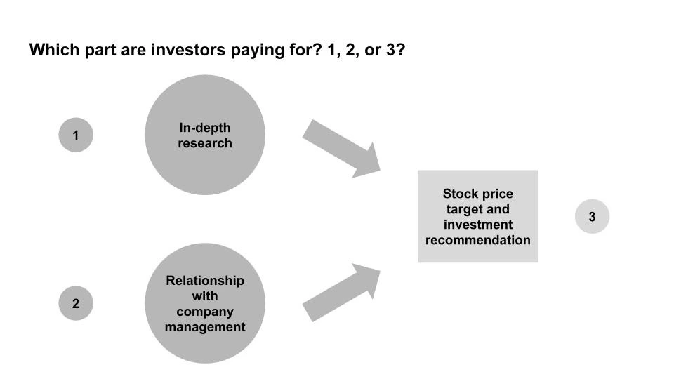

## Mensagem

Robôs estão vindo para pesquisas de ações do lado da venda e isso pode não importar

---

Se você pensar em **finanças como interação entre fontes de capital e usuários de capital\,** Bancos de investimento como Goldman\, Morgan Stanley\, JP Morgan estão no meio\, facilitando transações entre quem tem dinheiro e quem precisa dele\.

Os bancos têm banqueiros que cobrem um produto financeiro específico \(ações\, dívida\, fusões e aquisições etc\.\) ou um setor específico \(consumidor\, saúde\, tecnologia etc\.\) e organizam transações de finanças corporativas dentro de sua área de cobertura\.

Fora dessas transações\, **Os bancos geralmente possuem um grupo de pesquisa de ações\, que emite opiniões sobre ações** Baseado na pesquisa da empresa e na manutenção de um relacionamento com a administração\. Essas são as recomendações ou metas de preço de \"comprar\/manter\/vender\" que você vê relatadas nas notícias\. Note que essas são recomendações\, e o grupo de pesquisa não assume uma posição na empresa\, o que os diferencia de investidores profissionais [^1]\.

A pesquisa de ações é vendida para investidores profissionais\, que teoricamente usam essas informações para tomar decisões de investimento\. Esses investidores também fazem suas próprias pesquisas\, então não se sabe ao certo quanto eles incorporam a partir da pesquisa bancária\. Importante\, eles não pagam pesquisa de ações com base na precisão das recomendações\, fazendo isso indiretamente por meio de comissões de negociação pelo banco\.

**Portanto\, fica uma questão em aberto sobre pelo que os investidores estão pagando\: 1\) a pesquisa\, 2\) o relacionamento com a empresa\, ou 3\) a recomendação de investimento [^2]\.** Meus amigos do lado vendedor \(pesquisa\) argumentariam que é só \(1\) e \(investidor\) provavelmente é \(2\)\, e meus amigos investidores de varejo provavelmente diriam que é \(3\)\, já que não recebem \(1\) e \(2\)\.

Se você assumir que o maior valor agregado vem de \(3\)\, [this paper by Braiden Coleman, Kenneth Merkley, Joseph Pacelli on computer programmed equity research](https://papers.ssrn.com/sol3/papers.cfm?abstract_id=3514879 'Robots') Seria interessante\. **Eles estudam como os \"Robo\-Analistas\"\, programas de computador assistidos por analistas humanos que realizam análises automatizadas de pesquisa\, se comportam em comparação com analistas humanos** analisando as diferenças nas recomendações de ambos\.

A equipe identificou empresas que usavam robos\, coletou recomendações de estoque delas [^3]\, e então testamos três hipóteses sobre viés\, frequência e desempenho superior\. Eles encontram resultados consistentes com os três\, e vamos analisá\-los por sua vez\:

> Primeiro\, os Robo\-Analistas produzem coletivamente uma distribuição mais equilibrada de recomendações de compra\, manutenção e venda do que os analistas humanos\, consistente com o fato de serem menos sujeitos a vieses comportamentais e conflitos de interesse

A primeira é dizer que os robôs têm menos viés do que analistas humanos\, que também têm conflitos de interesse\. Como resultado\, os robôs recomendam ações com uma distribuição mais \"natural\" nas recomendações e nem todos são \"compras\" sem \"vendas\"\. Esses conflitos de interesse estão \"relacionados a incentivos econômicos como obter negócios de banco de investimento ou conquistar o favor da administração\.\"

[Sarbanes-Oxley was intended to reduce such conflicts of interest,](https://www.sec.gov/news/speech/spch012803cag.htm 'Sarbox') limitando o contato entre os banqueiros de investimento \(transações financeiras\) e o grupo de pesquisa de ações [^4]\. Mesmo que você assuma que é um contato limitado com sucesso\, ainda há um incentivo para publicar relatórios positivos das empresas para o analista\. Se você é CEO e tem uma avaliação de \"compra\" e \"venda\" de diferentes analistas\, com quem você é mais propenso a se dar bem\?

> Segundo\, \\\[\.\.\.\\\] Robo\-Analistas revisam suas recomendações com mais frequência do que analistas humanos e também adotam diferentes processos de produção

A segunda é dizer que os robos atualizam suas entradas com mais frequência e com dados diferentes dos humanos\, e\, portanto\, atualizam suas recomendações com mais frequência\. Para entender isso\, precisamos entender como as empresas divulgam informações financeiras\. Nos EUA\, as empresas divulgam um grande relatório anual \(10K\) e três relatórios trimestrais menores \(10Q\)\. Além disso\, elas fazem anúncios de resultados antes desses relatórios \(8K\)\, que contêm seus resultados trimestrais e podem incluir informações adicionais\.

**Os investidores geralmente negociam em 8Ks\, já que essa informação vem antes do 10Q\.** Da mesma forma\, analistas humanos também atualizam seus relatórios em resposta aos 8Ks\. Os robos\, porém\, prestam mais atenção aos 10Q e 10Ks\, e têm mais probabilidade de atualizar após esses registros\.

Se essa segunda descoberta é interessante depende do tipo de investidor que você é\. Muitos investidores negociam em torno de anúncios de resultados \(8K\)\. Como metade do investimento é um jogo de expectativas\, e a maior parte das informações que esses investidores querem saber já está em 8K\, receber menos recomendações após 8Ks e mais após 10Qs é menos útil\. Você deveria saber o quanto antes\, em vez de esperar os 10Qs mais detalhados saírem\, já que o preço se move em resposta aos 8K\.

> Terceiro\, os portfólios formados com base nas recomendações de compra dos Robo\-Analistas parecem superar os de analistas humanos\, sugerindo que seus buy calls são mais lucrativos

A terceira conclusão é o \"e daí\" do artigo\, afirmando que **As duas descobertas acima são importantes porque você obtém retornos melhores ao seguir Robôs do que analistas humanos\.** Isso acontece com recomendações de \"compra\"\, mas não para \"vender\"\, e eles acreditam que é porque os humanos têm menos probabilidade de rebaixar as \"compras\" e os robôs estão corrigindo demais e emitindo muitos \"vendas\"\.

Tenho uma ressalva sobre a metodologia deles\, que vou colocar na nota de rodapé [^5]\. No geral\, porém\, se você acredita que recomendações de ações são importantes\, como muitos investidores de varejo parecem pensar\, **Este artigo defende que você também deve seguir os analistas de robo\, já que eles são menos tendenciosos\, atualizam com mais frequência e podem aumentar o desempenho\.**

O que isso implica para a indústria de pesquisa de ações depende de onde você acredita que está o valor agregado para os compradores do serviço\. Se for \(1\) ou \(3\)\, este artigo é uma má notícia\, mas menos se for \(2\)\. Tenho 60\% de confiança de que veremos um aumento nos robos\, e isso ainda assim não fará diferença para a maioria dos analistas de pesquisa\.

## Outros

1. [Is the momentum factor in stocks explained by randomness?](https://breakingthemarket.com/randomness-in-momentum-everywhere/ 'Random')
2. [The 4 major parts of shipping and maintaining a software application, and the products, methods, and services developers use](https://technically.dev/posts/what-your-developers-are-using.html 'dev')
3. [Buying your way into nobility](https://www.bloomberg.com/news/articles/2020-02-02/even-if-you-weren-t-born-into-nobility-you-can-buy-your-way-in 'Nobility')
4. ["Romeo and Juliet is not a love story. It is a six-day relationship between adolescents and an infatuation that leads to a tribal war."](https://aeon.co/essays/how-emotionally-focused-couple-therapy-can-help-love-last? 'EFT')
5. [Interactive documentary of Jheronimus Bosch's artwork "the Garden of Earthly Delights"](https://archief.ntr.nl/tuinderlusten/en.html# 'Art')

[^1]: Dependendo da política de conformidade da empresa\, o próprio analista de pesquisa de ações pode ter uma posição\, mas isso é extremamente improvável e acho que pode até ser banido\. De forma confusa\, o banco como um todo pode e provavelmente tem uma posição por meio do grupo de gestão de ativos\, que é uma linha de negócios separada da pesquisa de ações\.

[^2]: Com a nova regulamentação do MiFID\, a estrutura de incentivos para pesquisa de ações também está mudando\, resultando em mudanças de comportamento dos bancos\. Além disso\, não estou defendendo que analistas de pesquisa de ações sejam ruins no que fazem\; algumas pessoas como Mary Meeker ganharam fama por bom trabalho como analista de pesquisa

[^3]: Eles focaram nas recomendações \"porque são a produção mais frequentemente reportada entre as empresas de Robo\-Analistas e também representam a produção na qual investidores de varejo mais focam\"

[^4]: Também incluía regras como exigir \"relatórios de pesquisa incluem gráficos de preços que acompanham os movimentos de preço da ação ao longo de um período histórico em relação à recomendação do analista\"\. Tendo removido essas páginas ao compilar materiais para a gestão da empresa quando eu trabalhava no setor bancário\, e não prestando atenção nelas no lado da compra\, fico me perguntando quão eficaz foi a regulação bem\-intencionada

[^5]: Eles constróem a carteira \"adicionando essas ações à carteira relevante no fechamento da negociação do dia seguinte\" após a emissão da recomendação\. Em outras palavras\, o robo emite uma recomendação\, há um dia de negociação e então coloca a ação no fechamento\. O preço já não teria sido afetado pela recomendação\? Se não\, fico me perguntando quanto é um momentum
