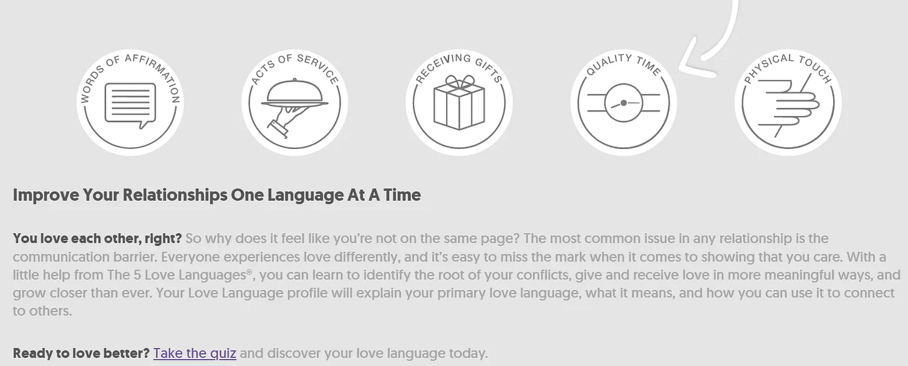

[About Time](<https://en.wikipedia.org/wiki/About_Time_(2013_film)> 'About') é um dos meus filmes favoritos de todos os tempos\, e não só porque traz Rachel McAdams em mais um filme de viagem no tempo [^1]\. Uma das mensagens que ele te dá no final do filme é valorizar cada momento da vida\. O que\, apesar de vir de uma comédia romântica\, é na verdade um aprendizado importante em que acredito\.

Se devemos valorizar cada momento\, e o conceito de tempo de qualidade então\? [Ryan Holiday recently wrote about how he disagrees with the concept entirely:](https://forge.medium.com/theres-no-such-thing-as-quality-time-58db618c099d 'Ryan')

> É uma daquelas frases que jogamos casualmente\: \"Quero passar mais \'tempo de qualidade\'\"

> O lado perfeccionista do nosso cérebro \\\[\.\.\.\\\] quer que tudo seja especial\, que seja \"certo\"\. Mas esse é um ideal que \\\[nós\\\] nem sempre conseguimos corresponder

> O resultado\? Um sentimento inevitável de decepção

> A razão é que não existe algo como \"tempo de qualidade\"\.

Tempo de qualidade é um conceito que existe há algum tempo\, com o interesse crescendo com o tempo\.

É [even one of the love languages.](https://www.5lovelanguages.com/ 'love')

Isso significa que estamos vivendo em uma ilusão coletiva\, tentando perseguir algo que não existe\? Ryan acha que sim\, citando Jerry Seinfeld\:

> \"Eu acredito no comum e no mundano\. Esses caras que falam sobre \'tempo de qualidade\' — sempre acho um pouco triste quando dizem\: \'Temos tempo de qualidade\.\' Eu não quero tempo de qualidade\. Quero tempo de lixo\. É disso que eu gosto\.\"

Concordo principalmente com Ryan e Seinfeld\. **O tempo gasto pode ser de alta qualidade\, mas buscar tempo de qualidade em si é inútil\. Isso se deve a uma combinação de 1\) expectativas e 2\) aleatoriedade\.**

Desejamos momentos de qualidade e criar memórias de qualidade\. É tentador pensar que podemos criar tempo de qualidade apenas designando assim\, como por meio de férias\. Isso geralmente acaba saindo pela culatra devido a **Nossas expectativas elevadas sendo prejudicadas pela realidade\.** Se esperamos que nossas férias sejam perfeitas\, qualquer erro estraga a experiência\.

Em contraste\, você provavelmente terá uma surpresa positiva quando tem expectativas baixas\, o que provavelmente acontece durante um \"dia normal\"\. É difícil igualar a perfeição\, e fácil superar o normal\. Por causa disso\, **É mais provável que momentos de qualidade venham do acaso\.**

Se você não consegue criar tempo de qualidade\, e é mais uma questão de eventos aleatórios\, isso significa que você quer aumentar a frequência com que tais eventos acontecem\. Você não pode aumentar a probabilidade\, mas pode aumentar a duração para que tais eventos ocorram\. Em outras palavras\, **Você quer aumentar a quantidade de tempo\, e não o tempo de qualidade de engenharia\.**

Ryan insinua indiretamente que a duração é a chave\, citando outro orientador sobre como encontrar esse tempo comum\:

> \"Você tem que encontrar os momentos entre os momentos\.\"

> Às vezes\, esses momentos constrangedores e intermediários permitem conversas que nunca teriam acontecido de outra forma\. Até alguns dos meus melhores textos e pensamentos vieram quando fiquei preso em um lugar onde não queria estar\, ou fazendo algo que não queria fazer\.

> Quando você não tem desculpas para estar ocupado \\\[\.\.\.\\\] é obrigado a se virar com o que está na sua frente

Você quer o máximo de tempo possível com seus entes queridos\, pois isso permite mais oportunidades para a aleatoriedade criar situações que se tornam memoráveis\. Se você não está reservando tempo para que o acaso aconteça\, fica mais difícil encontrar aquele relacionamento de qualidade que você procura\. **Você não precisa de tempo de qualidade\, só precisa de tempo\.**

Às vezes\, você não consegue encontrar o que procura procurando\.

[^1]: Sim\, eu sei que recebeu críticas mistas\. Pode lutar comigo\. Rachel também esteve em Time Traveller\'s Wife \(mais ou menos\) e Meia\-Noite em Paris \(ótimo\, e não confundir com um americano em Paris\, se não\, você vai assistir metade do filme se perguntando quando a parte musical vai começar\. Não que isso tenha acontecido comigo\, claro\)
