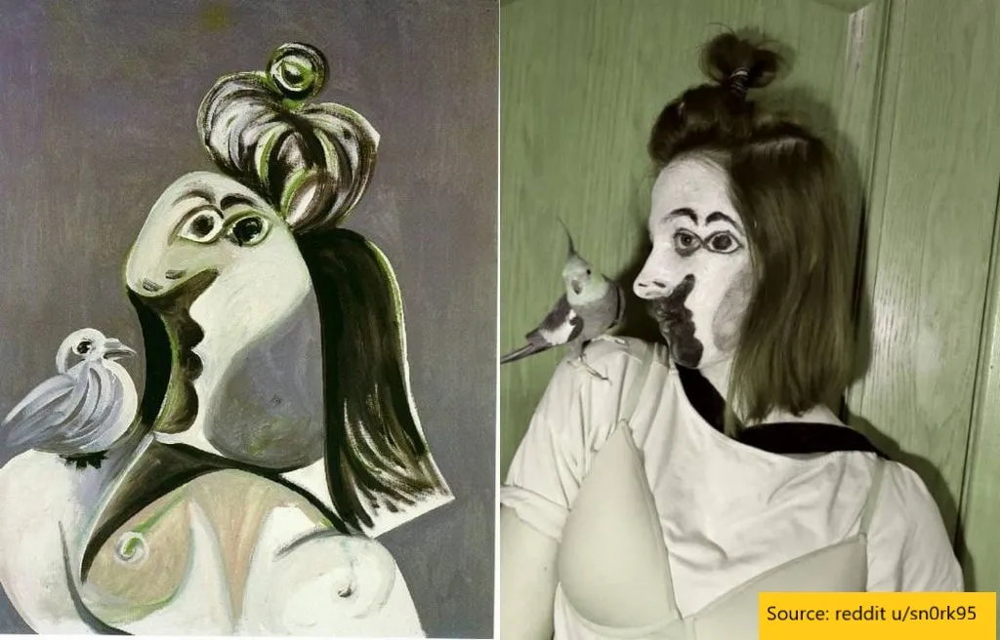

## Mensagem

Compreender Picasso exige conhecer seu contexto\, evolução do pensamento e desafios do status quo

## Picasso ao longo do tempo

O museu Getty desafiou o público [to recreate famous works of art recently,](https://blogs.getty.edu/iris/getty-artworks-recreated-with-household-items-by-creative-geniuses-the-world-over/ 'Getty') o que resulta em textos engraçados como este no Reddit [^1]

O estilo da imagem original à esquerda é distinto\, e a maioria de vocês imaginaria que é algo de Picasso\, mesmo que nunca tenha visto antes \(eu não tinha visto\)\. [You'd be right](https://www.wikiart.org/en/pablo-picasso/woman-with-bird-1970 'Woman with bird')\.

Claro\, junto com o post vieram os comentários habituais como \"por que isso é arte\"\, \"uma criança poderia desenhar isso\, é terrível\"\, \"evasão fiscal para as elites\" que acompanham a maioria das obras modernas\. Algumas dessas são perguntas válidas\, e talvez algumas de arte sejam de fato um [money laundering](https://www.natlawreview.com/article/art-and-money-laundering 'money') ou [tax evasion scam](https://newrepublic.com/article/147192/modern-art-serves-rich 'tax') [^2]\, mas vamos dar uma olhada mais de perto sobre por que Picasso é reverenciado\. Lembre\-se de que não sou um especialista em arte\, e estou aprendendo conforme avanço\, de fato\, enquanto escrevo este post\. Para manter o assunto\, vou falar apenas sobre Picasso\, porém [Georges Braque](https://cubismsite.com/georges-braque-cubism/ 'Braque') é um personagem chave e influenciador na época também\.

## Primeiros dias

A maior parte da arte é melhor compreendida com contexto\, então vamos começar pelo histórico de Picasso\. [Picasso was born in 1881 to two artistic parents,](https://mymodernmet.com/pablo-picasso-periods/ 'Met') numa época em que o realismo na arte ainda era popular\. Isso incluía obras\-primas como \"Retrato da Mãe do Artista\" ou \"Ciência e Caridade\" abaixo\, obviamente pintadas por alguém talentoso\. Essas obras foram pintadas para capturar uma cena em um momento específico\, como se você estivesse olhando para ela de uma perspectiva específica\. Note os detalhes realistas nas texturas e cores\, a ilusão de profundidade e aparência 3D\, e também como o lançamento das sombras indica de onde vem a luz\. É como se tivéssemos tirado uma foto de um ângulo\.

Em \"Ciência e Caridade\"\, repare como as amassadas dos lençóis sugerem quais partes estão à frente e quais atrás\. A sombra do travesseiro engana você fazendo você pensar que a cabeça está fazendo uma marca\. As pinceladas nas cerdas do homem dão uma textura diferente aos cachos da criança\.

Pode\-se pensar que Picasso olhou para as pinturas acima\, decidiu que tudo era difícil demais e passou o resto da vida se rebelando contra [tiger parenting](https://www.apadivisions.org/division-7/publications/newsletters/developmental/2013/07/tiger-parenting 'tiger') produzindo pinturas cada vez mais estranhas que não fazem sentido\. Assim como eu desisti de conseguir pagar uma casa\, talvez Picasso tenha desistido de quadros bonitos porque não conseguia aguentar\.

Também estaria errado [^3]\, já que ambas as pinturas acima são na verdade também de Picasso\. Além disso\, foram feitas quando ele tinha menos de vinte anos\. Claramente\, Picasso sabia pintar\, e pintar tão bem quanto qualquer um dos mestres antigos\. Da próxima vez que ouvir alguém dizer que Picasso não tinha talento\, pode apontar para [his earlier work](https://mymodernmet.com/picasso-early-work/ 'early')\.

Agora dê uma olhada em outro Picasso\, pintado após os dois acima\:

Qual é a diferença\? Por exemplo\, a cor mudou\, a ponto de até alguém daltônico como eu conseguir perceber a diferença\. Isso levou a uma grande mudança de humor\, e toda a pintura parece escura\, triste\, dolorosa\. A imagem também é menos realista do que antes e com menos detalhes\, embora ainda possamos reconhecer que é uma pessoa com um violão\.

O que permaneceu igual\? Ainda vemos a cena de um ponto de vista\, e só vemos uma possível perspectiva do sujeito na pintura\. Há menos profundidade\, mas ainda podemos ver que algumas coisas estão na frente de outras\. É como se tivéssemos tirado uma foto de um ângulo e colocado alguns filtros ruins\.

[Kelly Richman-Abdou believes the shift in styles was due to depression caused by a friend's suicide;](https://mymodernmet.com/pablo-picasso-periods/ 'Met') Vou deferir ao conhecimento dela\. Picasso agora está experimentando\, se afastando do realismo\, explorando o que há mais na arte do que apenas duplicar uma imagem\.

## Cubismo

Em 1907\, Picasso pinta uma peça escandalosa\, inspirada em Cézanne e na arte africana\, ["Les Demoiselles d'Avignon."](https://www.pablopicasso.org/avignon.jsp#prettyPhoto 'Avignon') Essa obra\, de prostitutas em um bordel de Barcelona\, seria o início do cubismo\, [one of the most influential movements in art and a new way of representing reality.](https://www.tate.org.uk/art/art-terms/c/cubism 'Tate')

O que está acontecendo aqui\? Picasso claramente não busca mais o realismo em seus desenhos\. Grande parte da imagem também parece 2D e plana\, já que ele não se importa mais em dar a ilusão de espaço tridimensional\.

Ainda mais interessante é o rosto no canto inferior direito\. É inspirado na arte africana\, mas também há obviamente algo estranho nele\. Os elementos do rosto não se alinham onde você espera\, as sombras estão deslocadas\, quase como se você estivesse olhando para a pessoa de vários pontos de vista e tentando colocar tudo isso em uma superfície plana\. Que é exatamente o que Picasso está tentando fazer\.

Lembra do começo\, quando falamos sobre desenhos realistas\, onde as texturas e cores eram realistas\, as imagens pareciam ter profundidade e como tudo era visto de uma única perspectiva\? Picasso pegou tudo isso e inverteu\, criando algo abstrato\, plano e visto de múltiplos pontos de vista\.

> \'Uma cabeça\'\, disse Picasso\, \'é uma questão de olhos\, nariz\, boca\, que pode ser distribuída de qualquer forma que você quiser\'\.

Obras como \"Garota com um Bandolim\" acima não têm uma única perspectiva\. Em vez disso\, imagine se você pintasse um nariz visto de um ponto\, depois se movesse alguns metros para a esquerda e pintasse um olho visto daquele ponto\. Depois\, se movendo acima da pessoa para pintar os lábios vistos de cima\. Você terá uma mistura bizarra de elementos\, sombras sendo projetadas por todo lado\, e nada fazendo sentido\, [as shown in this video by MoMa](https://www.youtube.com/watch?v=rGZYfSzvPvs 'Moma')\.

Compare isso com uma pintura realista típica\, e você entende por que o cubismo era tão novo e extravagante\. [Given how colour photography was taking off](https://www.history.com/news/8-crucial-innovations-in-the-invention-of-photography 'photo')\, pode\-se imaginar por que os pintores queriam buscar algo que a fotografia não conseguia fazer\. Se você tem uma ferramenta que representa a realidade perfeitamente\, qual é então o objetivo da arte\? Picasso e seus pares tentam passar a mensagem de que há mais na arte do que apenas recriar uma cena\.

## Colagens

Mais ou menos na mesma época\, Picasso e [Georges Braque](https://cubismsite.com/georges-braque-cubism/ 'Braque') também comece [popularising collages.](https://cubismsite.com/picasso-collage/ 'collage') É um dos primeiros tipos de arte que usa múltiplos meios\, tendo não só tinta\, mas outros objetos colados na tela\. Você pode ver como a progressão de ter múltiplas perspectivas faz com que ele queira [to put a collection of things together in search of meaning for a coherent whole.](https://www.artsy.net/article/matthew-the-birth-of-collage-and-mixed-media 'artsy')

Em \"Natureza\-Morta com Cadeira Amadeirada\"\, Picasso tem uma corda real na borda da pintura\, que também tem uma impressão de cana de cadeira \(aquele material marrom no canto inferior esquerdo usado nas cadeiras\)\, e pintou uma cena bizarra por cima\. Ele está fazendo uma colagem de pelo menos três tipos diferentes de coisas\.

Por que isso é estranho\? Antes disso\, lembre\-se que todo mundo só pintava coisas\. Se você quisesse aquela imagem de cadeira com vara\, pintaria\. Qual o sentido da sua arte se você simplesmente pegou uma impressão e colou na sua tela\? E então\, usando corda como moldura por cima\, em contraste com as molduras luxuosas que você esperaria\, Picasso está rejeitando o status quo da arte\.

É um pouco difícil ver o que ele estava tentando pintar por cima\, e [this video](https://www.khanacademy.org/humanities/art-1010/cubism-early-abstraction/cubism/v/picasso-still-life-with-chair-caning 'video') faz um bom trabalho ao te mostrar\. Se você olhar de perto\, há um cachimbo no canto superior esquerdo\, um copo no meio e uma faca\, uma fruta e um guardanapo à direita\. Todos esses foram divididos em múltiplas vistas\, como mencionado antes\, para nos fazer pensar \"Como seria se eu visse uma mesa de café de ângulos diferentes\, tudo ao mesmo tempo\?\"

## Surrealismo e muito mais

Depois disso\, Picasso se afasta das múltiplas perspectivas para pintar as coisas do jeito que ele as visualiza\, em um sentido abstrato\. Ele pega peças de todos os lugares e as junta de diferentes maneiras\, brincando com os elementos que compõem o objeto\. [He moves towards the surreal, unconcious, dreamlike styles that we saw in that first image.](https://focusonpicasso.com/product-category/surrealism-period/ 'surreal') Hoje em dia\, há pouco apego à realidade [^4]\.

> \"Eu pinto objetos como penso\, não como os vejo\"\.

De então até sua morte\, Picasso continua a criar arte\, [mixing his styles and continuing to experiment.](https://en.wikipedia.org/wiki/Pablo_Picasso#Later_works_to_final_years:_1949%E2%80%931973 'Picasso') Estima\-se [he did >13k paintings in his lifetime, which excludes tens of thousands more prints and illustrations.](https://www.picassomio.com/art-articles/picasso-how-many-artworks-did-picasso-create-in-his-life-time.html 'Total') Embora alguns tenham sido criticados durante sua vida\, mais tarde seriam vistos como precursores de outros movimentos artísticos\.

## Considerações finais

O que aprendemos nesta breve história\?

1. Picasso era um pintor talentoso e sabia o que estava fazendo quando começou a quebrar as regras
2. Você pode traçar a lógica em sua progressão e por que seu trabalho evoluiu da forma como evoluiu
3. Produziu um enorme volume de trabalho\, tentando continuamente coisas diferentes\. Hoje ele é conhecido por suas melhores peças\, não pelas piores

Picasso demonstrou que a arte tem apelo além da estética\. Você pode não achar as pinturas bonitas \(eu não acho\)\, mas esse não é o ponto\. Ao fazer isso\, ele levou a arte a novos limites\.

Isso importa hoje\? Quem se importa se ele misturou diferentes pontos de vista\, usou múltiplas mídias ou criou colagens\? Picasso influenciou alguma coisa\?

Vou deixar você decidir\.

[^1]: [Source is here](https://www.reddit.com/r/pics/comments/fvx8ko/recreation_of_pablo_picassos_painting_a_woman/ 'Reddit')\. Reddit é um fórum online\, para quem não sabe\.

[^2]: Olhando para você\, Rothko\. Ok\, tudo bem\, eles também são bons\, só não gosto deles\. Arte é subjetiva\, blá blá blá\.

[^3]: Bem\, pelo menos no que diz respeito ao Picasso\. A definir no que toca à moradia\.

[^4]: Algumas pessoas não classificariam Picasso como surrealista\. Não sei o suficiente para comentar aqui\; as fotos parecem surreais
