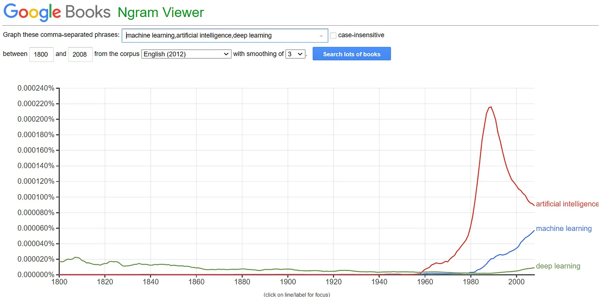
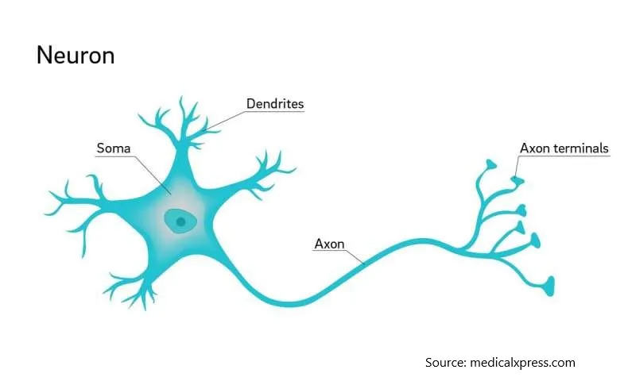
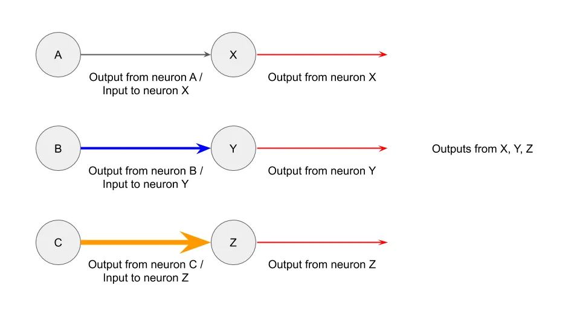

## Mensagem

Aprendizado de máquina é menos assustador do que você imagina\, e mais comum do que você imagina\.

## Magia de aprendizado de máquina

Hoje em dia ouvimos falar de aprendizado de máquina \(ML\)\, deep learning ou inteligência artificial o tempo todo [^1]\.

Do interesse na busca\:

Para menções em livros\:

Para manchetes de jornais sobre robôs tomando conta dos nossos empregos\:

Há um interesse crescente em ML\, e parece que dia sim\, dia não\, surge uma nova startup arrecadando \$100 milhões com base em sua nova tecnologia de ML\.

No entanto\, a maioria das pessoas se sente intimidada pelo ML\, equiparando\-o a uma mágica que só startups de ponta fazem\. Não ajuda o fato de a matemática poder ser intimidadora\:

Hoje quero ajudar você a ter uma melhor intuição sobre ML\, primeiro olhando para uma empresa que usa ML e depois explicando o básico de como funciona uma rede neural\. Meu objetivo ao final é que você se sinta menos assustado sempre que alguém usar o termo \"ML\" como se fosse legal demais para a escola\.

## Estudo de caso de aprendizado de máquina

Imagine que eu viesse até você procurando investimento em uma empresa que use ML\. Aqui está a proposta\:

\"A Companhia M usa ML e [optical character recognition (OCR)](https://en.wikipedia.org/wiki/Optical_character_recognition 'OCR') para comparar dados de entrada com centenas de milhões de registros em frações de segundo\. Ela já possui parcerias com a Amazon\, o governo dos EUA e a Fedex\. A Empresa M já ampliou para permitir \>100 bilhões de transações por ano e expandiu a cobertura para todos os EUA\.\"

Parece empolgante\, né\? Eu escolhi alguns idiomas\, mas não está tão longe disso [actual press releases by other companies:](https://www.eu-startups.com/2020/01/anyline_raises_over_10_million_and_zooms_to_us/ 'eu')

\"A Anyline\, uma startup líder em Reconhecimento Óptico de Caracteres \(OCR\) que utiliza IA para reconhecimento de texto\, arrecadou €10\,7 milhões em financiamento Série A\. A startup austríaca\, que já trabalha com grandes nomes como Toyota\, IBM\, Canon\, a ONU e PepsiCo\, usará os fundos para abrir seu primeiro escritório nos EUA em Boston\"

Mas voltando à empresa M\. A parte do OCR se refere a eles olharem para uma imagem e reconhecerem o que ela diz via ML\. Parece que eles fazem isso de forma eficiente\, precisa e em escala\. As parcerias deles também parecem respeitáveis\. Você provavelmente acha que eles são um unicórnio promissor liderado por formados em Stanford que começaram a programar enquanto usavam fraldas\.

Você investiria\?

Se você disse sim\, acabou de investir no [United States Postal Service](https://www.enterpriseai.news/solution_content/hpe/governmentacademia/machine-learning-applications-for-the-modern-enterprise/ 'USPS')\.

Não\, sério\, os correios usam ML há muito tempo\. [They started trialing it in 1997, and by 2014 were already mostly recognising addresses via ML algorithms.](https://www.buffalo.edu/content/dam/www/research/pdf/Postal-Automation-Highlights_20160516.pdf 'ML') Não é bem o estereótipo de startup que você estava imaginando\.

Meu ponto aqui não é criticar a Anyline\, ou startups semelhantes\. Tenho certeza de que eles estão resolvendo problemas difíceis e não são puro hype [^2]\. Na verdade\, quero que você perceba que **O ML está sendo usado em cenários que parecem mundanos\, e já faz algum tempo\.** Da próxima vez que alguém te apresentar ML\, tenha isso em mente\.

## Intuição de aprendizado de máquina

Agora que sabemos onde o ML é usado\, vamos ver como o ML pode funcionar\. Vou usar um [neural network](http://news.mit.edu/2017/explained-neural-networks-deep-learning-0414 'NN') para isso\, porém\, existem muitas outras formas de rodar o ML\.

Redes neurais são modeladas a partir dos neurônios do cérebro\, então será útil entender como essa conexão funciona\. Veja como é um neurônio\:

Enquanto ainda estamos [aren't quite sure how the brain works, a leading theory is that the neurons can take inputs, do some computation, and then send outputs.](https://www.quantamagazine.org/neural-dendrites-reveal-their-computational-power-20200114/ 'neural') [^3] Uma forma simplificada de representar a interação de dois neurônios poderia ser assim\. Imagine que o círculo é o corpo principal\, e essa linha é o axônio conectando outros neurônios\:

E se você tivesse três pares de neurônios\, poderia ser assim\:

E se os neurônios pudessem interagir entre si\, poderia ser assim [^4]\:

Vamos manter essa imagem em mente\, enquanto pensamos em como isso pode se relacionar com computadores e ML\.

Vamos pegar uma equação matemática simples\, como 2 x 3 \= 6\. Vamos definir \"2\" como dados de entrada\, \"x 3\" como a função que queremos executar e \"6\" como dados de saída\. Isso nos dá algo assim\:

E se você tivesse mais de um dado de entrada\? Você poderia fazer \(2 \+ 5\) x 3 \= 21\. Isso nos dá algo assim\:

E\, mais uma vez\, podemos combinar múltiplas funções interagindo em múltiplas entradas\, assim\:

Você pode ver como isso se parece com o diagrama de interação neurônica acima\, daí o nome \"rede neural\"\.

Vamos além\. Imagine que você tem valores em A\, B e C\, assim como antes\. Desta vez\, os valores representam [pixel values.](https://homepages.inf.ed.ac.uk/rbf/HIPR2/value.htm#:~:text=For%20a%20grayscale%20images%2C%20the,is%20taken%20to%20be%20white. 'pixel') Neste caso\, estamos falando de 3 pixels\.

Você pode fazer algum tipo de função matemática nesses pontos de dados e obter resultados em X\, Y\, Z\. Vamos ignorar exatamente qual função matemática estamos usando por enquanto [^5]\, mas retorna apenas 0 ou 1 dos pontos de dados\. Além disso\, também nos dará apenas um único \"1\"\, com o restante sendo \"0\"\. As saídas aqui representam o alfabeto previsto\, se um \"1\" for retornado nesse círculo\.

Isso se parece\:

Neste exemplo\, podemos ver que um \"1\" foi retornado para a saída originalmente denotada como X\. \"0\" foi retornado para as outras saídas\. Isso nos diz que X é o valor previsto\, baseado nas entradas dos 3 pixels \(0\, 100\, 255\) que lhe demos\.

Você pode imaginar estender tal estrutura para todas as letras do alfabeto\, e para quantos pixels de entrada você precisar\. A intuição é semelhante\, só que mais etapas estão envolvidas\. Por exemplo\, se você quisesse prever qualquer uma das 26 letras com base em uma imagem de 1000 pixels\, precisaria de 1000 entradas à esquerda e 26 saídas à direita\. Das saídas\, apenas 1 teria \"1\" e o restante seria \"0\"\.

Você não está limitado a apenas duas camadas de entrada e saída\. Você também pode incluir mais \"camadas ocultas\" que recebem a entrada pela esquerda e depois retornam uma saída para a direita\. Desde que você configure suas funções para que retornem \"1\" e \"0\" na última camada\, está tudo certo\. Pode haver qualquer número de camadas ocultas\, e cada camada pode ter qualquer número de elementos\, sem precisar ser igual à entrada ou à saída\.

E é isso\! Você já viu como um processo pode converter entradas de dados \(como valores de pixels de imagens\) em saídas \(alfabetos e endereços\)\. Agora você entende como a maioria das redes neurais funciona\. Muitas implementações de ML usam redes neurais\, o que significa que você também conhece o conceito subjacente que impulsiona essas empresas de ML\.

Claro\, a configuração em si é mais complicada e exige muito mais tempo e expertise [^6]\. Ignorei toda a matemática\, estatística e programação que tornam o ML realmente mais difícil de implementar na vida real\. No entanto\, espero que a intuição que você tem agora te deixe menos intimidado sempre que alguém usar \"ML\" como palavra da moda no futuro\.

[^1]: Vou usar aprendizado de máquina \(ML\)\, deep learning \(DL\) ou inteligência artificial \(IA\) de forma intercambiável ao longo do post\, mas tecnicamente são coisas diferentes\, [some being a subset of the other.](https://towardsdatascience.com/clearing-the-confusion-ai-vs-machine-learning-vs-deep-learning-differences-fce69b21d5eb 'ML') Para fins do post\, isso não importa muito\.

[^2]: Bem\, alguns provavelmente são completos vigaristas

[^3]: Não sou cientista\, me corrija se eu estiver errado aqui\.

[^4]: Mostrei todas as entradas em um neurônio como uma cor e tamanho para facilitar a compreensão\, especialmente ao traduzir para a matemática da rede neural\. Você pode pensar nos agrupamentos de outras formas\, como todas as saídas de um neurônio como uma só cor\.

[^5]: O que está acontecendo aqui é que há uma primeira função realizada dos parâmetros multiplicados pelas entradas\, e então um [logistics function](https://en.wikipedia.org/wiki/Logistic_function 'log') aplicado para limitar a saída de 0 a 1\. A ideia é treinar os dados repetidamente no conjunto de dados de treinamento de modo que a primeira função dos parâmetros forneça um erro de predição baixo quando comparado com um conjunto de dados de validação\.

[^6]: Por exemplo\, como você sabe qual função usar\? Como você configura isso em um programa\? Como você verifica se as previsões estão precisas\? Simplifiquei a maioria das questões técnicas\, mas se você quiser aprender mais\, [Andrew Ng's coursera is a good place to start](https://www.coursera.org/learn/machine-learning 'coursera')\. Aviso que é muito mais complexo e difícil\.
