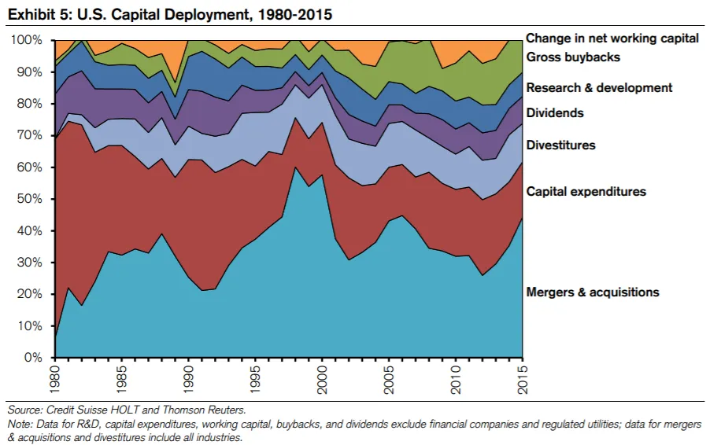

## Mensagem

Investir por dividendos tem mais nuances do que pode parecer à primeira vista\.

## Retorno sobre dividendos

Em [footnote 8 of last week's post](/writing/stories 'footnote') Fiz um comentário casual sobre dividendos importarem menos do que retorno de capital porque não queria gastar mais tempo investigando o assunto\.

Hoje\, vamos realmente analisar os dividendos\.

Faremos uma visão geral dos dividendos\, depois discutiremos as desvantagens e terminaremos com links para outras pesquisas que complicam a história\.

Como sempre\, nada disso é conselho de investimento [^1]\.

### O que fazer com todo esse dinheiro

Suponha que você seja uma empresa de capital aberto que gera lucro [^2]\. Você pagou seus fornecedores\, pagou seus funcionários e pagou a si mesmo\. Mas ainda tem mais dinheiro sobrando\, então o que fazer com isso\?

Primeiro\, você não pode fazer nada\. Só deixar em algum banco [^3]\.

Dois\, você poderia reinvestir no negócio\. Aquela máquina que você queria para sua linha de fabricação\? Aquele produto de software para sua equipe de RH\? [That Gulfstream G650 to get high?](https://www.wsj.com/articles/this-is-not-the-way-everybody-behaves-how-adam-neumanns-over-the-top-style-built-wework-11568823827 'WSJ') Talvez agora seja a hora de comprá\-los\.

Terceiro\, você pode comprar outros negócios\. Talvez exista um concorrente menor que você possa adquirir barato e conseguir todas aquelas \"sinergias\" que seus amigos bancários falam para aumentar sua participação de mercado [^4]\.

Quatro\, você pode recomprar algumas das suas ações\. Isso aumenta a participação que você tem da sua empresa\, o que implica que você terá mais potencial de valorização se a empresa for bem\. Recompras estão fora do escopo deste artigo\, você pode ler uma opinião inicial \(tendenciosa\) sobre elas por Cliff Asness [here.](https://images.aqr.com/-/media/AQR/Documents/Journal-Articles/Buyback-Derangement-Syndrome.pdf 'Cliff')

Quinto\, você pode pagar um dividendo aos investidores\. Para cada ação que os investidores têm\, você entrega um dinheiro em dinheiro a cada trimestre\.

Simplifiquei\, como sempre\, e as ações acima são as principais coisas que as empresas fazem com seu dinheiro\. Um gráfico do CS mostra como a combinação dessas ações mudou ao longo do tempo\:

Hoje vamos focar na ação cinco\, o pagamento de dividendos\. Vou pular a discussão sobre a irrelevância teórica das estruturas de capital [^5]\, mas você pode ler um resumo sobre Modigliani Miller [here.](https://pubs.aeaweb.org/doi/pdfplus/10.1257/jep.2.4.99 'MM')

### Avaliação de dividendos

À primeira vista\, um dividendo parece bom para você como investidor\. Receber algum dinheiro de volta das suas ações parece interessante\. Vamos ver como poderíamos avaliá\-lo\.

Se eu dissesse que um dividendo da empresa é de \$5\, isso seria bom ou ruim\? Parece muito dinheiro\, mas realmente não sabemos a menos que comparemos com o preço\.

Se você tivesse comprado as ações por \$5 e elas estivessem te devolvendo \$5\, isso seria alto\. Você efetivamente recebeu o valor do seu investimento ali mesmo\.

Se você comprou as ações por \$10 mil e elas te devolviam \$5\, isso provavelmente não seria significativo\.

Então sabemos que **O preço importa\, como em tudo relacionado a investimentos\.** Para incorporar isso\, podemos calcular um rendimento de dividendos\, que é simplesmente o valor do dividendo dividido pelo preço\. Comparando os rendimentos de dividendos entre si\, podemos descobrir quais ações têm dividendos \"altos\" e quais têm dividendos \"baixos\"\.

Como observação\, por convenção\, aceitaríamos uma quantia de 12 meses de dividendos\. A maioria das empresas paga dividendos trimestralmente\, então se uma empresa paga \$1 por trimestre\, o dividendo anual deles é de \$4\. Também ignoramos os impostos [^6]\.

Além de nos permitir avaliar rendimentos de dividendos entre ações que pagam dividendos\, esse rendimento também nos permite comparar entre outros títulos\. O rendimento é como o retorno esperado\, afinal\. Então poderíamos comparar um rendimento de dividendos de 4\% com um título que paga 1\%\, e dizer que tudo o mais é igual para a ação dividendo que nos dá uma renda maior\.

Que é o que vemos aqui [Vanguard report](https://personal.vanguard.com/pdf/ISGADOS.pdf 'Van')\, com o gráfico abaixo mostrando que **Os rendimentos de dividendos foram maiores que os dos títulos nos últimos 10\+ anos\.**

Olhando melhor\, isso parece ainda melhor agora\. Um período prolongado em que você recebe mais dinheiro de volta do que títulos\? Será que todos nós deveríamos simplesmente encontrar as ações com maior rendimento de dividendos e comprar todas\? Qual é a pegadinha\?

### Retorno total\, não apenas retorno de dividendos

A primeira é simples\, e algo que já abordamos parcialmente\, a questão do preço\. Um rendimento de dividendos alto pode vir da empresa pagar muito em dinheiro\, resultando em um dividendo relativamente grande em um preço relativamente pequeno\. Ou também pode vir do preço das ações cair bastante\, resultando naquele mesmo dividendo relativamente grande em um preço relativamente pequeno\.

No exemplo abaixo\, você teria ficado muito mais satisfeito com o rendimento de 1\% do div do que com o de 50\%\, por causa das circunstâncias que levaram até lá\. Devido à queda de preço no segundo caso\, você na verdade perdeu muito mais dinheiro do que ganhou com o \"aumento\" do rendimento de dividendos\.

Você nem pode ter certeza de que o alto rendimento vai durar\, já que esse valor do dividendo não é garantido para o futuro\. É verdade que as empresas não gostam de cortar seus dividendos porque temem que os acionistas se descarreguem de suas ações\. [However, that also menas that a company can cut its dividend when things are so bad they have no choice.](https://www.cnbc.com/2018/12/07/ge-makes-it-official-lowers-dividend-to-a-penny.html 'GE')

Isso significa que temos que **Considere um fator adicional além do rendimento de dividendos\, que é a variação de preço\.** Ao combinar esse retorno de capital \(variação de preço\) com o rendimento de dividendos\, obteremos um valor total de retorno mais próximo da medida de desempenho que queremos\. Isso parece óbvio agora que mencionamos\, mas você verá frequentemente muitos folhetos de investimento promovendo ações com altos dividendos\, sem considerar o componente de retorno de capital\.

O que acontece quando consideramos o retorno de capital\? Vamos olhar para os componentes do retorno total\, mas primeiro faça uma suposição de como isso pode ser\. Podemos pensar que\, para as ações de alto rendimento de dividendos\, a maior parte do retorno é feita do dividendo\. Para as ações de baixo \(ou nenhum\) rendimento\, a maior parte do retorno é feita de variações de preço\.

Surpreendentemente\, não é isso que encontramos\. Nesse mesmo caso [Vanguard report](https://personal.vanguard.com/pdf/ISGADOS.pdf 'Van')\, os autores organizaram as ações em 4 segmentos\, do rendimento de dividendos alto ao baixo\. Eles então compararam o retorno dos dividendos versus o preço\. Vemos que **O retorno de capital contribuiu mais para o retorno total\,** Mesmo incluindo as ações com altos dividendos\.

Ainda mais interessante\, um [Miller Howard report](https://mhinvest.com/download.html?docId=2246 'Miller') mostra que\, quando você divide ações de dividendos em 10 grupos\, a maioria delas na verdade é **Desempenho abaixo do esperado** o índice S\&P nos últimos 10 anos\. O pior é que o grupo de topo com maiores rendimentos de dividendos é o que tem desempenho mais abaixo do esperado\. Isso implica uma estratégia de investimento completamente oposta ao que pensávamos antes\.

### Fatores correlacionados

O segundo problema é menos óbvio\, e é o de outros fatores correlacionados com altos rendimentos de dividendos\.

Vamos supor que tivéssemos selecionado as 100 principais ações com base no alto rendimento de dividendos\. Se descobríssemos que todas essas ações tinham algo em comum\, digamos [Emma Watson being on the board of directors](https://www.mugglenet.com/2020/06/emma-watson-joins-kerings-board-of-directors-to-advocate-for-sustainable-fashion/ 'Emma')\, talvez não seja o rendimento dos dividendos que realmente importe\, mas o poder de estrela de Emma afetando misteriosamente os retornos totais\.

Na verdade\, existem alguns fatores comuns que as pessoas usam para classificar ações\. Esses incluem algum valor pelo preço\, tamanho da empresa e momentum de preço\. Por exemplo\, você pode querer agrupar todas as pequenas empresas e descobrir que as pequenas empresas superam as grandes\. Se você encontrou evidências fortes o suficiente para isso\, talvez queira criar um portfólio apenas de pequenas empresas\.

Vou pular a explicação de como esses fatores foram criados\; você pode ler mais sobre isso em [Fama and French's five factor model here.](https://www.sciencedirect.com/science/article/abs/pii/S0304405X14002323 'model') O importante a notar é que temos outras características que descrevem uma ação\, além do rendimento de dividendos\.

O [Vanguard report](https://personal.vanguard.com/pdf/ISGADOS.pdf 'Van') Distinguiu entre dois tipos de ações de dividendos\: 1\) alto rendimento de dividendos e 2\) alto crescimento de dividendos\. Eles então compararam a correlação desses grupos com alguns dos fatores comuns que mencionamos acima [^7]\.

Acontece que muitas das características estão correlacionadas\, seja do grupo 1 ou do grupo 2\. Em outras palavras\, se você ignorasse o fator dividendo e considerasse apenas esses outros fatores\, conseguiria muito para captar o retorno das ações dividendas\.

[Meb Faber went ahead to do just that,](https://www.cambriainvestments.com/wp-content/uploads/2017/10/DTAX-10.23.17.pdf 'Meb') criando portfólios compostos que pudessem replicar os perfis das ações de dividendos\, sem realmente serem ações de dividendos\. Isso significa que ele encontrou ações que davam o mesmo retorno que ações de dividendos\, mas que na verdade não pagavam dividendos\. Seus achados mostram que **Os retornos desses portfólios superam o portfólio de dividendos\.** Compare a coluna da caixa preta com o restante à direita\:

E esses resultados se mantiveram quando ele comparou após as declarações de imposto também\:

## Conclusão e complicações

Em resumo\,

1. O preço e o retorno total de uma ação claramente importam\, mais do que apenas o rendimento de dividendos
2. Conseguimos duplicar os fatores positivos das ações de dividendos criando uma carteira alternativa que intencionalmente exclui ações de dividendos\. Isso tem um desempenho ainda melhor do que a carteira de dividendos

Como em todo investimento\, há algumas complicações\. Alguns pesquisadores descobrem que o período de tempo dos estudos é importante\. Ao conduzir o estudo por um período muito maior que 10 anos\, a importância dos dividendos para o retorno aumenta\. Outros argumentam que as empresas têm poucas ações produtivas para tomar com seu dinheiro\, e devolvê\-lo aos acionistas beneficia os acionistas que agora podem escolher onde redistribuir seus dividendos\. E alguns dizem que o crescimento dos dividendos é um indicador de uma empresa saudável\.

No entanto\, os que vi ainda não refutaram a pesquisa alternativa de portfólio do Meb\, por isso ainda estou menos entusiasmado com investimento em dividendos no geral\. Se você conseguir criar um portfólio com retorno maior e vantagem pós\-impostos\, parece que deve ser o melhor negócio\.

Vou deixar você explorar os links abaixo e ver se os acha persuasivos\:

1. [Is dividend investing dangerous?](https://blog.thinknewfound.com/2016/12/dividend-investing-dangerous/ 'Divd')
2. [Surprise! Higher Dividends = Higher Earnings Growth](https://www.researchaffiliates.com/documents/FAJ_Jan_Feb_2003_Surprise_Higher_Dividends_Higher_Earnings_Growth.pdf 'Divd')
3. [Dividends and the three dwarfs](https://www.researchaffiliates.com/content/dam/ra/documents/FAJ_Mar_Apr_2003_Dividends_and_the_Three_Dwarfs.pdf 'Divd')

[^1]: Eu nunca dei e nunca vou dar conselhos de investimento\. Não me processe\, eu não tenho dinheiro\.

[^2]: Um acontecimento surpreendentemente menos frequente do que se poderia imaginar hoje em dia\.\.\.

[^3]: Na realidade\, não é tão simples assim\, e as empresas têm departamentos de tesouraria que gerenciam quanto dinheiro líquido têm em relação a outros instrumentos monetários que geram algum rendimento\. Ninguém realmente tem bilhões em notas de papel espalhadas\, ou mesmo em contas correntes\, aliás\.

[^4]: Sinergias geralmente são vistas como sinergias de receita ou de custo\. Sinergias de receita vêm da capacidade de vender mais coisas e sinergias de custo ao demitir pessoas\.

[^5]: Sob certas suposições\, a forma como uma empresa é financiada não importa\. Se for esse o caso\, então as políticas de alocação de capital são essencialmente as mesmas\.

[^6]: O tratamento fiscal dos dividendos pode variar dependendo da sua situação\. Geralmente\, porém\, seu retorno líquido de dividendos é reduzido porque você precisa pagar um imposto considerável sobre essa renda\.

[^7]: Para uma divisão diferente\, veja [this other source doing a similar analysis](https://www.indexologyblog.com/2020/05/15/why-did-dividend-indices-underperform-during-the-coronavirus-sell-off/ 'div')
