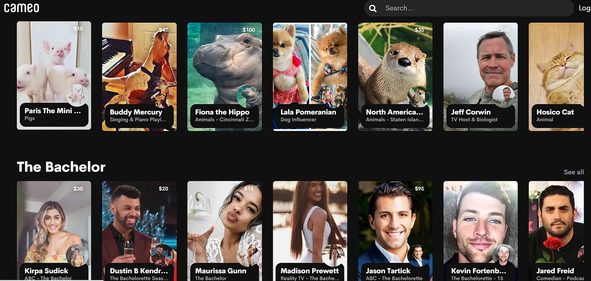

## Concluições

A Cameo é uma empresa que aproveitou a longa cauda\, percebendo que um pequeno gesto de uma celebridade menor pode fazer uma grande diferença para um fã\.

## 1\. Camafeu e a longa cauda longa

[Kevin Kelly,](https://kk.org/biography 'Kevin') cofundador da revista Wired\, cunhou a expressão [1,000 true fans](https://kk.org/thetechnium/1000-true-fans/ '1000') Muitos anos atrás\. [Li Jin](https://li.substack.com/people/1021248 'Li') recentemente desenvolvi essa ideia com ela [100 true fans](https://a16z.com/2020/02/06/100-true-fans/ '100') artigo\. Se você não leu nenhum dos dois\, a ideia é que uma quantidade alcançável de fãs leais \(100 ou 1\.000\) é suficiente para os criadores ganharem a vida\. Por exemplo\, alguém que tivesse 1\.000 fãs pagando 100 dólares por ano teria o suficiente para se virar na maioria das cidades\; o mesmo vale para um criador que tinha 100 fãs pagando 1\.000 dólares por ano\. E conseguir 1\.000 fãs não parece tão improvável\.

Ambos os artigos atestam que a internet reduziu custos para os criadores\, **permitindo que uma longa fila de talentos fosse descoberta e apoiada\.** Somos todos estranhos\, e agora é mais rápido\, barato e fácil encontrar pessoas com ideias semelhantes produzindo coisas que queremos ver\. Sua virtuosidade em agir como um cachorro não vai mais permanecer desconhecida\; [it might even make you a six figure income](https://www.dailydot.com/irl/onlyfans-puppy-jenna-phillips-tiktok/ 'dog') [^1]\.

Se a maioria dos criadores nessa nova economia realmente conseguirá alcançar essa meta real de 1\.000 fãs ainda está para ser visto\. Veremos muitas histórias de sucesso de artistas independentes\, mas sinto que não veremos todas as pessoas que desistiram pelo caminho\. Se você já tentou aumentar seu número de seguidores nas redes sociais\, sabe que é mais difícil do que parece\. Hoje em dia\, **Qualquer um pode ser uma estrela\, mas nem todo mundo será uma estrela\.**

Vou entrar na onda de escritores nomeando frameworks\, e chamar isso **o efeito cauda longa longa\,** considerando que é a única precedência para o termo [is a children's book.](https://www.amazon.com/Long-Tail-Joy-Cowley/dp/0780248880 'tail') O que o efeito da longa cauda diz é que a cauda longa é mais longa e estranha do que as pessoas esperam\, mesmo que já esperem o estranho\. O que isso implica é que\, se você quer escolher um vencedor nessa nova economia\, é melhor escolher uma plataforma do que escolher um criador\. Embora a chance de sucesso para qualquer criador seja baixa\, a chance de sucesso para a plataforma que consolida os criadores é alta\.

Portanto\, em vez de discutir mercados deprimentes de atuação canina\, hoje quero analisar as plataformas que os impulsionam\. Em particular\, quero analisar mais de perto [Cameo,](https://www.cameo.com/ 'cameo') um marketplace que oferece mensagens de vídeo personalizadas de celebridades\. Por um preço barato de \$30\, você pode conseguir uma mensagem de vídeo personalizada de Kirpa Sudick\, Kevin Fortenberry\, ou três \(\!\!\) vídeos de Paris\, o mini porquinho [^2]\. Normalmente\, as pessoas fazem com que eles desejem feliz aniversário para familiares e amigos\, formatura ou alguma outra celebração\, [to the delight of the recipients.](https://www.youtube.com/watch?v=VeYm5TZknsc 'reaction')

Eu mencionei Cameo pela primeira vez [about a year ago](/writing/cameo 'Cameo') enquanto tentava fazer as pessoas se sentirem culpadas para me comprarem uma participação especial da Jenna Coleman [^3]\, e eles são um bom exemplo de beneficiários da longa cauda\. O mercado funciona porque o retorno individual para essas celebridades por si só é baixo\, mas o retorno combinado de todas elas é alto\. Paris\, a mini porquinha sozinha\, provavelmente não vai produzir o suficiente para seu dono\, mas combinando ela com Fiona\, a Hipopótamo\, ou Lola\, a Preguiça\, você pode realmente ter um negócio viável para a plataforma que oferece o serviço\.

Marketplaces têm sucesso agregando demanda e oferta\, então vamos começar analisando os Cameo\'s\.

### A oferta e a demanda de Cameo mostram o ajuste ao mercado de produtos

A Cameo não parece ter um lema da empresa\, e o que deveria ser é **\"O trash de um homem é tesouro de outro\.\"** Sim\, eu sei que eles nunca vão usar oficialmente\, mas isso é consequência direta da longa cauda\. Você pode não se importar com o participante \#23 em [the Asian Bachelor,](https://www.youtube.com/watch?v=ag1IisyP1ak 'Asian') [^4] Mas alguém\, em algum lugar por aí\, tem\. Muito\. Isso alegraria o dia deles\, e eles estão dispostos a pagar\.

Essa assimetria na experiência do usuário é o motivo pelo qual a Cameo está em uma posição tão boa\. [Customer delight?](https://en.wikipedia.org/wiki/Customer_delight 'customer') [Creating minimum viable happiness?"](https://medium.com/@sarahtavel/the-hierarchy-of-marketplaces-introduction-and-level-1-983995aa218e 'Sarah') Se você comprar para a tia May uma participação especial da estrela de cinema favorita dela\, é só disso que ela vai falar por anos\, e talvez ela finalmente pare de te importunar sobre casar\.

Eu imaginaria que essas participações especiais também sejam simples para celebridades filmarem\, já que tudo o que precisam fazer é ler um roteiro e ficar olhando para o celular por alguns minutos\. Considerando a facilidade\, não é à toa que tantos tenham participado\. [Since the talent also sets the price](http://www.chicagomag.com/Chicago-Magazine/January-2020/Cameo-Steven-Galanis/ 'price')\, isso implica que as celebridades cobram o que acham que lhes dá equilíbrio entre reservas e faturamentos\. Elas poderiam aumentar suas tarifas se estivessem superlotadas\, e diminuí\-las caso contrário\. Mercado eficiente em ação aqui\.

Uma rápida olhada no site mostra que os preços variam principalmente de \$30 a \$100\, o que não me surpreende\. Se você já foi a uma comic con antes\, fotos ou autógrafos geralmente são vendidos [somewhere in that range](https://planetcomicon.com/autographphoto-op-price-chart/ 'range')\, implicando que há demanda comprovada nessa faixa de preço\. **O que a Cameo fez foi permitir a longa cauda\.** Agora você pode ter uma experiência substituta na Comic Con a qualquer hora e em qualquer lugar\. [By Grabthar's hammer, what a savings.](https://www.youtube.com/watch?v=kgv7U3GYlDY 'galaxy quest')

Um incentivo adicional para as celebridades estarem no Cameo é a oportunidade de construir a marca para si mesmas\. Elas não só ganham dinheiro com o vídeo\, mas permanecem na consciência de seus verdadeiros fãs\. O maior medo da fama é serem esquecidos\, e o Cameo reduz essa preocupação\. Os fãs famosos também são incentivados a compartilhar o vídeo\, tornando\-os mais propensos a ressurgir nas conversas\. Como o Cameo coloca\, [the talent is getting paid to promote their own content.](https://www.producthunt.com/stories/inside-cameo-the-rocketship-making-influencers-money 'Cameo')

Oferta também traz mais oferta\. Quando você vê sua colega estrela de Bachelorette \(que foi eliminada antes de você\) recebendo uma reação viral dos fãs dela em vídeo [^5]\, você provavelmente está um pouco com inveja\. Quando você descobrir que ela também foi paga por aquele vídeo de 1 minuto\, provavelmente você mesmo vai se inscrever na plataforma\. Isso não elimina a necessidade da equipe de vendas da Cameo contratar celebridades\, mas facilita o trabalho deles [^6]\.

Mas isso é suficiente\? A Cameo decolou trabalhando com a longa cauda\, e continuará precisando do apoio desse grupo por muito tempo\. No entanto\, faz sentido que eles queiram começar a mirar em estrelas maiores também\, devido aos preços mais altos que podem ser cobrados e à maior publicidade\. Em vez de prejudicar a longa cauda das celebridades\, isso realmente os ajuda\. Agora eles podem dizer que estão na mesma plataforma que Fulano\, um ponto de prestígio\. Os fãs da longa cauda também estão procurando especificamente por eles\, então mais celebridades não deveriam canibalizar os ganhos de outros que já estão na plataforma\.

Será que eles conseguem chegar a um ponto de virada em que mais celebridades se sintam confortáveis em entrar\? Acho que isso é como o desconforto do AirBnB ou Uber quando começaram\, e que a ideia vai se normalizar com o tempo\. Eles já conseguiram pessoas como Elijah Wood \(famoso por O Senhor dos Anéis\)\, Sarah Jessica Parker \(famosa por Sexo e a Cidade\) ou Snoop Dogg \(famoso por fumar maconha\) na plataforma\, então não parece tão difícil continuar expandindo lá\.

Estabelecemos o argumento para a demanda e o caso para a oferta\, vendo que há um claro [product market fit.](https://a16z.com/2017/02/18/12-things-about-product-market-fit/ 'pmf') E quanto à economia da própria plataforma\?

### A Cameo possui alta taxa de aceitação\, estrutura de custos semi\-escalável e grande mercado endereçável

Para entender melhor a economia das plataformas\, eu gostaria de olhar para três coisas [^7]\:

- O [take rate](/writing/rake 'take')\, ou taxa que a Cameo cobra
- A provável estrutura de custos do Cameo
- Tamanho total do mercado endereçável \(TAM\)

Cameo tem um [75/25 revenue split](https://www.producthunt.com/stories/inside-cameo-the-rocketship-making-influencers-money 'rev')\; A Cameo fica com 25\% de cada \$1 reservado\. Essa é uma taxa de aceitação relativamente alta e\, segundo uma pesquisa superficial\, maior do que o que [celeb agents get (10%)](https://www.backstage.com/magazine/article/pay-agent-8943/ 'agent') ou o quê [celeb managers get (20%)](https://www.billboard.com/articles/business/6605758/what-artists-managers-really-earn-its-not-cheap-to-be-available-24-7 'manager')\, embora\, claro\, os serviços oferecidos sejam diferentes\. Eu preferiria que eles fizessem [lower their take rate](http://abovethecrowd.com/2013/04/18/a-rake-too-far-optimal-platformpricing-strategy/ 'take')\, mas isso sempre foi um viés pessoal meu quando penso em marketplaces\.

Será que um agente ou talento poderia configurar isso sozinho e desintermediar o Cameo\? Potencialmente\. Celebridades poderiam ter feito ofertas em suas contas do Instagram ou Snapchat o tempo todo\, mas a maioria não fez\. Provavelmente é uma combinação de privacidade\, normas sociais e complicações\. A celebridade não quer entregar suas informações pessoais de contato\, o que implica que o shoutout precisa ser feito na plataforma\. No entanto\, isso significa que o feed da celebridade estará cheio de vídeos cameo\, o que provavelmente não é desejável\. Ter que configurar todos os pagamentos e acompanhar os pedidos também é irritante\.

A Cameo oferece uma forma mais fácil de ganhar dinheiro sem precisar se anunciar\? Com certeza\. Depois que eles se inscreverem\, as celebridades não precisam fazer nada além de fazer o pedido e gravar o vídeo com seus celulares\. **Promoção\, privacidade\, pagamentos – toda essa dor é cuidada pela Cameo\.**

A estrutura de custos da Cameo me preocupa\. Como o produto é entregue digitalmente\, eles provavelmente têm custos marginais baixos\, alguns pontos percentuais no processamento de pagamentos e algum valor desconhecido\, porém baixo\, na infraestrutura de dados [^8]\. Isso é ótimo\, e o que mais me interessa é a base de custos semi\-fixa\.

Há cerca de um ano [^9]\, [Cameo claimed to have 120 employees, of which 80 were dealing with talent.](https://www.producthunt.com/stories/inside-cameo-the-rocketship-making-influencers-money 'talent') São muitas pessoas fazendo cargos de vendas ou suporte\. Isso também mostra o problema de servir essa longa cauda – são muitos deles\. Você teria que assumir que essa função de custo cresce mais devagar que a taxa de crescimento dos talentos para que o negócio seja viável\. Você pode conseguir terceirizar o suporte ao cliente\, mas o suporte a talentos provavelmente ainda será feito internamente\.

Yelp e Angi homeservices são outras empresas que também atendem ao long tail \- Yelp vendendo anúncios para restaurantes\, e Angi sendo um mercado para empreiteiros de serviços residenciais\. Se a Cameo acabar tendo uma estrutura de custos semelhante\, isso significa que \~50\% da receita deles vai acabar em vendas e marketing [^10]\. Isso é grande\, e pode ser o ponto chave que decide se Cameo é lucrativo ou não\.

Por fim\, qual é o tamanho do mercado\? O tamanho do mercado geralmente é mais arte do que ciência\, especialmente quando você começa a fazer modelagem top\-down\. Se você fizesse o tamanho completo [$700bn US entertainment market](<https://www.selectusa.gov/media-entertainment-industry-united-states#:~:text=The%20U.S.%20media%20and%20entertainment,the%20largest%20in%20the%20world.&text=The%20U.S.%20industry%20is%20expected,Outlook%20by%20PriceWaterhouseCoopers%20(PwC).> 'pwc') e disse que a Cameo poderia pegar alguns pontos\-base disso\, isso já é um bilhão em receita\, embora com pressupostos altamente agressivos\. Dado [Cameo's raised venture funding at a $300mm valuation,](https://techcrunch.com/2019/06/25/cameo/ 'Cameo') Eu imaginaria que algum VC já fez as contas para justificar que eventualmente atingiram uma avaliação unicórnio\.

Sinto que a matemática acima assume uma base grande demais\, então vamos ver o que as comic cons fazem em vez disso\. Supostamente [NY Comic Con does $100mm in revenue](https://fortune.com/2019/10/06/new-york-comic-con-organizer-reedpop-is-perfecting-the-business-of-pop-culture/#:~:text=Over%20the%20past%20six%20years,further%20expanded%20into%20international%20markets. 'NYCC')\, então parece razoável supor que a Cameo um dia possa ter o mesmo alcance que uma convenção de uma única cidade\. Isso é cerca de 1\% da população dos EUA pagando \$30 por uma Cameo\, o que não me parece tão absurdo\. Você provavelmente receberia uma porcentagem menor da população\, mas uma média maior paga\.

Se esse tipo de negócio é recorrente ou mais pontual também é algo a se considerar\. Acho que há interesse suficiente para que participações especiais sejam encomendadas

No geral\, a taxa de aceitação parece lucrativa\, a estrutura de custos potencialmente preocupante\, e o TAM dos EUA razoável para sustentar uma avaliação considerável para a Cameo\.

### Participação especial para o futuro

Se eu fosse Cameo\, aqui estão algumas coisas que me preocupariam no futuro\:

- Concorrência imitadora\, tanto de redes sociais novas quanto existentes
- Qualidade de cameo
- Expansão além dos EUA

Como mencionado anteriormente\, parece que o Insta ou o Snap perderam essa tendência de mercado\, por quererem preservar a experiência existente do feed dos usuários\. As pessoas pagarão ainda mais por interação com suas celebridades\, como visto por [virtual gifting in China](https://www.wowza.com/blog/live-streaming-in-china 'china')\, streaming de videogame na Twitch\, ou OnlyFans nos EUA\.

Considerando que Insta e Snap têm opções de e\-commerce\, parece possível que eles também lancem um recurso de participação especial\. Você acessaria a página de uma celebridade para pedir uma participação especial\, receberia essa participação de volta como vídeo público ou privado\, e poderia compartilhar com amigos\, tudo na mesma plataforma\. Como fãs dedicados provavelmente já seguem suas celebridades favoritas nas redes sociais\, isso é menos atrito para eles comparado a acessar o site da Cameo\. O que a Cameo pode fazer aqui é tornar a experiência mais fácil para celebridades fazerem participações especiais\, e continuar crescendo para que eles ofereçam mais reservas\.

A Cameo não sofre do problema de compatibilidade entre oferta e demanda que [most marketplaces face](https://www.slideshare.net/jbreinlinger/marketplace-pricing-and-feedback 'feedback')\. Como os usuários sabem o que buscam\, você não precisa de sistemas sofisticados de avaliação ou recomendação de usuários para alinhar o talento à demanda\. Isso é uma possível economia de custos que pode ser usada adquirindo mais talentos\.

O Cameo também não parece ter opções de seleção eficazes no momento\, então isso é uma possível novidade\. Ordenar por mais caro ou mais solicitado provavelmente pode aumentar o total de reservas\. A preocupação novamente provavelmente é como o talento vai se sentir quando puder ver sua popularidade relativa\. Há um motivo pelo qual o Masterclass não divulga informações sobre a popularidade das classes deles\.

Não tenho certeza se criar um perfil de usuário para reservar Cameos vale a pena\. Claro\, você pode vincular isso ao Facebook para facilitar a criação de uma conta\, mas parece que fazer contas de convidado também funcionaria\. Acho que há algum benefício em sugerir mais participações especiais que o usuário possa gostar\, baseado nas anteriores que fizeram\.

A expansão internacional parece um passo óbvio\, com a Europa provavelmente como a geografia mais natural para a próxima\. A dificuldade provavelmente é montar a equipe de vendas naquele local e conseguir as primeiras celebridades locais\. Não vejo grandes problemas de localização aqui\, mas posso estar enganado\. Diferente de alguns marketplaces que só têm efeitos de rede locais\, o Cameo parece ter efeitos de rede mais amplos\, já que conseguir uma celebridade do Reino Unido gera demanda de um cliente americano que assiste a programas britânicos\. Em certa medida\, isso também vai beneficiar a expansão em países não anglófonos\, já que provavelmente ainda haverá demanda por participações especiais internacionais de celebridades da população local\. [Lotta avengers fans in China.](https://www.wikiwand.com/en/List_of_highest-grossing_films_in_China 'China')

### Reflexões finais de participação especial

Se você já viu um daqueles memes de casas de quarentena de celebridades\, Cameo é o produto que dá vida a isso\. O fã comum agora tem a possibilidade de comprar um tempo com sua celebridade favorita\.

A Cameo teve sucesso inicial através da longa cauda\, percebendo que um pequeno gesto de uma celebridade menor pode ter um impacto desproporcional em um indivíduo\. Há claramente demanda pelo produto\, e a oferta provavelmente está limitando o crescimento do mercado por enquanto\. O TAM deles parece grande\, a taxa de aceitação pode ser reduzida e a estrutura de custos pode ser um problema\. Olhando para o futuro\, a expansão internacional parece um próximo passo óbvio\, desde que consigam manter a qualidade do produto e não vejam imitadores\.

## 2\. \& 3\. A longa e longa cauda nas finanças e na vida pessoal

Normalmente também faço uma parte de finanças e uma de crescimento pessoal\. Considerando o tamanho da seção técnica acima e [the GPT-3 article on AI from last week](/writing/dr_gpt 'GPT')\, vou manter a seção deste mês sobre ambos breve\.

A longa cauda longa também é um fenômeno nas finanças\, e o exemplo mais fácil disso é [Robinhood](https://robinhood.com/us/en/ 'Robinhood')\, a startup que oferece negociação sem comissão\. A opinião está dividida sobre se isso é algo bom ou se a Robinhood está roubando dos pobres para alimentar os ricos por meio do pagamento pelo fluxo de ordens [^11]\. De qualquer forma\, a ascensão da Robinhood e dos concorrentes permitiu que um grupo novo\, maior e mais estranho de traders crescesse\. E\, assim como antes\, eu escolheria a plataforma para ser a vencedora\, em vez de qualquer indivíduo isolado\.

E o que a longa cauda implica para sua vida pessoal é que\, independentemente do seu interesse\, você provavelmente vai conseguir encontrar um grupo que te acolha\. Especialmente neste momento mais isolado\, encontrar uma pequena comunidade para você vai te fazer se sentir menos sozinho\, seja em algum nicho [subreddit](https://www.reddit.com/ 'reddit') ou [discord chat group.](https://discord.com/new 'discord') Você é um floco de neve único\, como todo mundo\.

## Outros

1. [The Tesseract: Economics of an Information Space](https://geoff-yamane.com/blog/2020/6/30/the-tesseract-economics-of-an-information-space 'Geoff') e como as redes definem o mundo digital
2. ["This is a few short stories about things that never change in a world that never stops changing."](https://www.collaborativefund.com/blog/same-as-it-ever-was/ 'Morgan')
3. [Varieties of Motte and Bailey](https://stefanfschubert.com/blog/2020/6/4/varieties-of-motte-and-bailey 'Motte')
4. [Using algorithms to improve your touch typing](https://www.keybr.com/ 'keybr')
5. Brinquei com o chatbot [Replika](https://replika.ai/ 'Replika') Alguns anos atrás\, parece que eles fizeram algumas melhorias e fizeram um relançamento desde então\.

[^1]: Eu avisei que seria estranho\. Além disso\, parece que ela ganha seis dígitos por _mês_\. 1\.000 verdadeiros fãs do Only\, de fato\. Suspiro\.

[^2]: Não\, não faço ideia de quem são essas pessoas ou animais de estimação\, mas imagino que algumas pessoas os adorem\. Paris é um negócio cruel\.

[^3]: Infelizmente\, sem sucesso\. Pode\-se esperar\. Eu me contentaria com David Tennant\.

[^4]: Isso não é algo real\, caso as pessoas estivessem se perguntando

[^5]: Ou é ele\? Nunca lembro qual tem todos os caras e qual tem todas as garotas\.

[^6]: Cameo também tem um [talent to talent referral system](https://www.producthunt.com/stories/inside-cameo-the-rocketship-making-influencers-money 'PH')\, onde o talento recebe uma participação de 5\% \(da participação da Cameo\) nas contratações para os novos talentos indicados\.

[^7]: Tecnicamente\, TAM não faz parte da economia\, mas eu o agrupei aqui por conveniência

[^8]: Sei que algumas pessoas não gostam do tratamento da receita líquida e diriam que o corte de 75\% é COGS\, mas isso não importa muito para a estrutura de custos abaixo dessa linha\, que é mais importante na minha opinião\.

[^9]: Posso dizer o quanto fico irritado sempre que os artigos não têm uma data óbvia de \"publicação\"\?

[^10]: Com base nos registros do Yelp [here](https://www.yelp-ir.com/financials/sec-filings/default.aspx 'yelp') ou os registros da ANGI [here](http://ir.angihomeservices.com/quarterly-earnings 'ANGI')\. Não lembro se eles consideram os custos de suporte dentro da linha de S\&M ou fora dele\, então esse número de 50\% pode ser ainda maior\.

[^11]: Pessoalmente\, acho que as preocupações são infundadas\, veja [Matt Levine](https://www.bloomberg.com/opinion/articles/2018-10-16/carl-icahn-wants-to-fight-dell-again 'Matt') ou [Patrick McKenzie](https://www.kalzumeus.com/2019/6/26/how-brokerages-make-money/ 'Pat') Para mais detalhes
