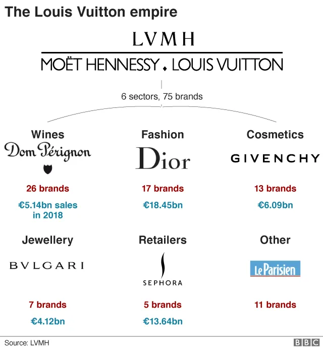
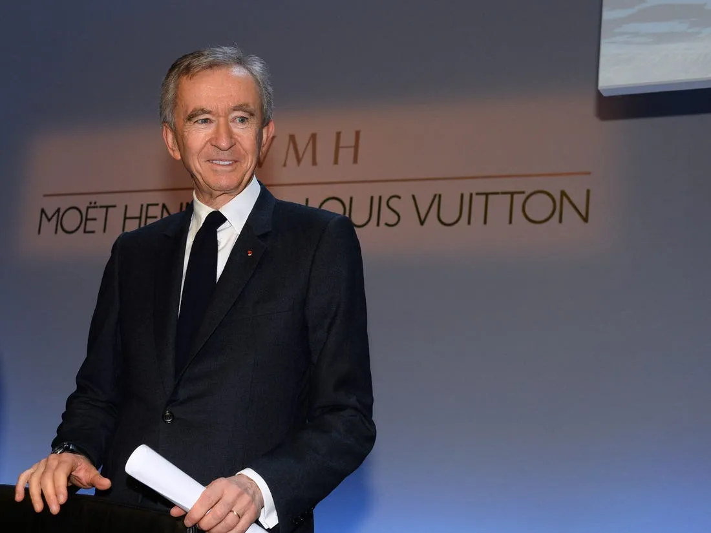

## Mensagem

Como CEO da LVMH\, Bernard Arnault acredita que marcas estrelas exigem criatividade para as ideias\, mas controle sobre a execução\, combinado com uma mistura de passado e presente

## Topo da rede de luxo

[LVMH](https://en.wikipedia.org/wiki/LVMH 'LVMH') é a empresa\-mãe de muitas marcas de luxo que conhecemos\. [Formed in 1987](https://www.thefashionlaw.com/lvmh-a-timeline-behind-the-building-of-a-conglomerate/ '1987') por meio da fusão da \"Louis Vuitton\" com a \"Moët et Chandon and Hennessy\"\, agora abriga mais de 70 marcas nos setores de vinhos\, moda\, joias e mais\. Comparado ao seu concorrente mais próximo\, a Kering [^1]\, [LVMH makes more than 2x the amount of revenue.](https://www.themds.com/companies/kering-versus-lvmh-it-bags-and-influencers-vs-heritage-and-size.html 'rev')

E no topo de tudo isso está [Bernard Arnault](https://en.wikipedia.org/wiki/Bernard_Arnault 'Bernard')\, que é o chefe do grupo desde 1990\. Isso deu muito bom para ele\, tornando\-o um dos homens mais ricos do mundo\.

[Brett Bivens tweeted this HBR interview of Bernard a while back](https://twitter.com/brettbivens/status/1251505408960794624?s=20 'Brett')\, e hoje quero ampliar esse artigo com mais algumas fontes\. Vamos entender melhor **como Bernard vê a criatividade – onde ele permite o caos e onde restringe o controle\.**

Bernard frequentemente conta a história de sua primeira visita aos EUA\. Ele perguntou a um taxista o que ele sabia sobre a França\. [The driver couldn't name France's president, but could name Dior.](https://www.ft.com/content/21f64410-9117-11e9-aea1-2b1d33ac3271 'FT') Desde então\, Bernard sempre se lembrou **O poder que uma marca pode ter\.**

Bernard construiu sua marca comprando\. De sua [first takeover of the textile company Boussac](https://www.forbes.com/sites/susanadams/2019/10/31/the-100-billion-man-how-bernard-arnault-stitched-together-the-worlds-third-biggest-fortune-with-louis-vuitton-dior-and-77-other-brandsand-why-hes-not-done-yet/#22a97e114efb 'Boussac') para [the many deals done since taking over LVMH,](https://www.thefashionlaw.com/lvmh-a-timeline-behind-the-building-of-a-conglomerate/ 'LVMH') Bernard trouxe a LVMH ao seu status atual com uma série de aquisições\, às vezes de forma controversa [^2]\. Há um motivo para ele ser conhecido como o \"lobo de caxemira\"\.

No entanto\, o francês está longe de ser apenas um financiador\. Bernard também tem opiniões fortes sobre criatividade\, principalmente aplicada à indústria da moda\. Minha leitura revelou alguns temas recorrentes\, e vou revisá\-los por minha vez\:

1. Caos vs controle
2. Ideias vs execução
3. Passado vs presente

### 1\. Não comprometa a criatividade no processo de design

Bernard entende a importância de deixar seus designers fazerem seu trabalho\, dando\-lhes a liberdade de serem criativos na fase de ideação\:

> Todo o nosso negócio é baseado em dar aos nossos artistas e designers total liberdade para inventar sem limites\.

> O ponto importante é que você não pode comprometer a criatividade em seu nascimento\.

Isso contrasta com o [A/B testing](https://www.crazyegg.com/blog/ab-testing/ 'AB') que a maioria das empresas de tecnologia faz hoje\, o que Bernard afirma não ser apropriado para seu negócio\:

> Algumas empresas são muito focadas em marketing\; elas seguem o consumidor\. E têm sucesso com essa estratégia\. Elas saem\, testam o que as pessoas querem\, e então criam\. Mas essa abordagem não tem nada a ver com inovação \\\[\.\.\.\\\] Você não pode cobrar um preço premium por dar às pessoas o que elas esperam\, e nunca terá produtos que se destaquem dessa forma—os tipos de produtos que as pessoas fazem fila pelo quarteirão\. Nós temos isso\, mas só porque damos liberdade aos nossos artistas\.

> Não lançaremos um produto se os testes mostrarem claramente que será um fracasso\, mas também não usaremos testes para modificar produtos\.

Isso lembra a frase de Steve Jobs\: \"os clientes não sabem o que querem até que você mostre isso para eles [^3]\.\" Se nos lembrarmos\, a moda está no topo de [the pace layer diagram](/writing/pace 'pace')\, faz sentido que Bernard pense assim\, dado o ritmo acelerado das mudanças na indústria\. Ele está sempre procurando algo novo para a temporada e precisa ditar o gosto do consumidor\, em vez de se deixar guiar por ele\.

No entanto\, Bernard traça limites nos processos de produção e operações\. Aqui\, ele busca controlar o máximo possível da ação\. Você pode ser criativo nas ideias\, mas não na execução\:

> \\\[LVMH\\\] só contrata gerentes tão respeitosos com o processo criativo que suportarão o caos necessário\. No entanto\, quando se trata de colocar sua criatividade nas prateleiras\, o caos é banido\. A empresa impõe disciplina rigorosa aos seus processos de fabricação\,

> Nossos produtos têm uma qualidade incrivelmente alta\; eles precisam ter\. Mas a produção deles é organizada de forma que também temos uma produtividade incrivelmente alta\.

E ele também faz o que fala\, literalmente\. [Bernard does weekly store visits, and will flag concerns to his brand CEOs:](https://www.forbes.com/sites/susanadams/2019/10/31/the-100-billion-man-how-bernard-arnault-stitched-together-the-worlds-third-biggest-fortune-with-louis-vuitton-dior-and-77-other-brandsand-why-hes-not-done-yet/#22a97e114efb 'Bernard')

> Todo sábado\, ele ronda suas lojas\, reorganizando as vitrines de bolsas e fazendo sugestões para os atendentes\.

Esta é a primeira dualidade\: controle versus criatividade\. Aqui\, Bernard permite a criatividade nos estágios iniciais\, quando a inovação é necessária\, e controla os estágios posteriores\, onde a consistência é necessária\.

### 2\. Favorecer a criatividade funcional

Não deixe que a seção acima te engane a pensar que LVMH é um refúgio para a artista torturada e incompreendida que precisa de um espaço para se expressar\. Embora Bernard dê liberdade aos artistas\, ele também acredita que a criatividade não é um fim em si para LVMH\. Bernard ainda é um empresário e quer que suas obras sejam vendidas\.

Ele acredita que as melhores pessoas criativas não querem apenas suas criações como peças de exposição em museus\, mas que sejam usadas\:

> As pessoas criativas mais bem\-sucedidas \\\[\.\.\.\\\] querem ver suas criações na rua\. Elas não inventam só para inventar\. Sim\, elas têm muitas ideias empolgantes\, e muitas dessas ideias chocam\; elas parecem loucas no começo\, completamente loucas\. Mas os verdadeiros artistas que fazem do LVMH um sucesso\, eles não querem que o processo termine aí\. Eles querem que as pessoas usem seus vestidos\, borrifem seu perfume ou carreguem a bagagem que desenharam\.

> O crescimento é uma função do alto desejo\. Os clientes devem querer o produto

Bernard trata como seu trabalho para tornar a criatividade funcional\, transformando ideias malucas em produtos incrivelmente quentes\:

> O que me divirto é tentar transformar a criatividade em realidade de negócios em todo o mundo\. Para isso\, você precisa estar conectado a inovadores e designers\, mas também tornar suas ideias vivíveis e concretas

> Criatividade \- sim\, mas executada de um jeito que as pessoas gostem e possam usar

E isso é motivado por sua crença de que a execução importa\:

> Você precisa de ideias\, mas a ideia é só 20\%\. Execução é 80\%

Essa é a segunda dualidade\: ideias versus execução\. Bernard reconhece claramente a importância das ideias\; toda essa conversa acima sobre liberdade criativa deixa isso claro\. Além disso\, Bernard reconhece que\, embora eles façam arte\, LVMH não está na indústria da arte\. Arte que não vende não é bem\-vinda\.

### 3\. Unir tradição e modernidade

Bernard também acredita que a criatividade exige referenciar o passado\, mas também olhar para o futuro\. Em sua visão\, os melhores produtos são aqueles que podem atrair ambos os aspectos simultaneamente\:

> O processo LVMH tem um objetivo\: marcas estrela\. Segundo Arnault\, marcas estrelas nascem apenas quando uma empresa consegue produzir produtos que \"falam com a idade\"\, mas que parecem intensamente modernos\. Esses produtos vendem rápido e furiosamente\, tudo isso enquanto gera lucros\.

> Quando vejo um produto de algumas das nossas melhores marcas\, ele precisa ser atemporal\, mas também ter algo da máxima modernidade\.

> Então\, a herança é a principal característica de uma marca estrela\? Eu diria que são necessárias quatro características\. Uma marca estrela é atemporal\, moderna\, de rápido crescimento e altamente lucrativa [^4]

Como resultado\, a maior parte da receita vem de produtos clássicos\, já que a LVMH modera a frequência com que novos produtos são lançados no mercado\. Isso parece um pouco contraditório e provavelmente é semelhante à maioria das empresas de consumo\, por exemplo\, uma empresa de bebidas que sempre lança novos sabores\, mas ainda assim ganha a maior parte do dinheiro com o sabor original\. Tenho alguma dificuldade em consolidar essa ideia com a visão dele de que a criatividade é importante\. Talvez seja porque eles têm tão poucas chances de testar novos produtos\?

> Não colocamos toda a empresa em risco lançando produtos totalmente novos o tempo todo\. Em qualquer ano\, na verdade\, apenas 15\% do nosso negócio vem dos novos\; o restante vem de produtos tradicionais e comprovados — os clássicos\.

Sua ênfase na tradição provavelmente vem tanto dessa estatística acima\, quanto de sua experiência tentando lançar uma marca do zero\:

> no começo\, pensamos\: \"Ok\, temos um gênio aqui com Christian Lacroix\"\, mas aprendemos que gênio não é suficiente para ter sucesso\. Foi um choque\, para ser honesto\, descobrir que nem mesmo grandes talentos conseguiriam lançar uma marca do zero\. Uma marca precisa ter uma herança\; não há atalhos\.

O que explica por que ele tenta manter as pessoas durante as aquisições\. Isso é surpreendente\, já que um dos principais motivos para economia de custos após a aquisição é a demissão de pessoas da empresa que você acabou de adquirir\.

> A qualidade também vem de contratar pessoas muito dedicadas e depois mantê\-las por muito tempo\. Tentamos manter as pessoas das marcas\, especialmente os artesãos \\\[\.\.\.\\\] A maioria das empresas limpa a casa quando adquire uma nova marca\. Não fazemos isso porque percebemos que prejudica muito a qualidade\. Quando você limpa a casa\, você convida as pessoas que mais respeitam a marca e contribuem para sua longevidade — sua atemporalidade\, sua autenticidade\.

Esta é a terceira dualidade\: passado vs presente\. Bernard acredita que os consumidores olham para o passado\, mas querem viver no presente\.

## Construindo uma marca para o longo prazo

Abordamos 3 dualidades com as quais Bernard lida\, decorrentes da experiência que teve construindo a marca\. Ao permitir criatividade com controle\, execução de ideias e mesclar tradição e modernidade\, Bernard acredita que está construindo a LVMH para o longo prazo\:

> [When we discuss a brand, I always tell them my real concern is what the brand will be in five or ten years, not the profitability in the next six months.](https://www.forbes.com/sites/luisakroll/2017/09/26/business-icon-bernard-arnault-reveals-his-most-important-mentor-biggest-mistake-in-qa/#4e8836af2ccc 'Forbes')

E isso até agora tem funcionado para ele\, pelo menos com base no preço das ações e na participação de mercado da LVMH\:

Quanto da estrutura dele é aplicável a outros negócios\? Concordo em grande parte com a ênfase na criatividade\, mas também na excelência operacional\. Conforme a nota recente sobre [why companies are bad at innovating](/writing/turtle 'turtle') Porém\, não sei se a maioria das empresas está disposta a aceitar a volatilidade que implica aceitar mais criatividade\. Não sei se a dualidade passado\/presente é facilmente implementada\, além de alguma campanha de marketing só para enfeite\.

Com tudo que Bernard conquistou\, você pensaria que ele estaria pronto para se aposentar\. Mas ele não terminou de construir impérios\. Mesmo agora\, Bernard ainda acredita [it's day 1:](https://www.forbes.com/sites/quora/2017/04/21/what-is-jeff-bezos-day-1-philosophy/#1867a2be1052 'Day')

> Ainda somos pequenos\. Estamos só começando\. Isso é muito divertido\. Somos os número um\, mas podemos ir além\.

## Fontes

1. [HBR interview](https://hbr.org/2001/10/the-perfect-paradox-of-star-brands-an-interview-with-bernard-arnault-of-lvmh 'HBR')
2. [FT interview](https://www.ft.com/content/21f64410-9117-11e9-aea1-2b1d33ac3271 'FT')
3. [Forbes interview](https://www.forbes.com/sites/luisakroll/2017/09/26/business-icon-bernard-arnault-reveals-his-most-important-mentor-biggest-mistake-in-qa/#4e8836af2ccc 'Forbes')
4. [NYT interview](https://www.nytimes.com/2019/11/25/fashion/bernard-arnault-tiffany-lvmh.html 'NYT')
5. [Reuters coverage of LVMH/Tiffany deal](https://www.reuters.com/article/us-tiffany-m-a-lvmh-deal/how-lvmhs-whirlwind-courtship-sealed-16-billion-tiffany-deal-idUSKBN1XZ2F7 'LVMH')

[^1]: [Kering owns Gucci, Saint Laurent, Bottega Veneta, Balenciaga, Alexander McQueen, Brioni, and more](https://www.kering.com/en/talent/who-we-are/our-houses/ 'Kering')

[^2]: Ele [firing of workers at Boussac](https://www.nytimes.com/1989/12/17/magazine/a-luxury-fight-to-the-finish.html 'Bossac')\, [ouster of LVMH leadership](https://www.forbes.com/sites/susanadams/2019/10/31/the-100-billion-man-how-bernard-arnault-stitched-together-the-worlds-third-biggest-fortune-with-louis-vuitton-dior-and-77-other-brandsand-why-hes-not-done-yet/#22a97e114efb 'LVMH')\, e a oferta hostil por Hermes atraíram muitas críticas\, para citar algumas\.

[^3]: Supostamente mal compreendido\, segundo [this article](https://www.businessinsider.com/steve-jobs-quote-misunderstood-katie-dill-2019-4 'katie')

[^4]: Bernard também diz que\, às vezes\, há algo inexplicável\: \"Muitas marcas têm potencial para serem estrelas\, mas são mal administradas\. Que pena para elas\. Mas há mais marcas que são tão bem gerenciadas quanto possível\, e elas nunca serão estrelas\. Elas nunca terão sucesso no mundo todo\. Elas não têm aquele algo—aquela magia que você realmente não consegue explicar\.\"
