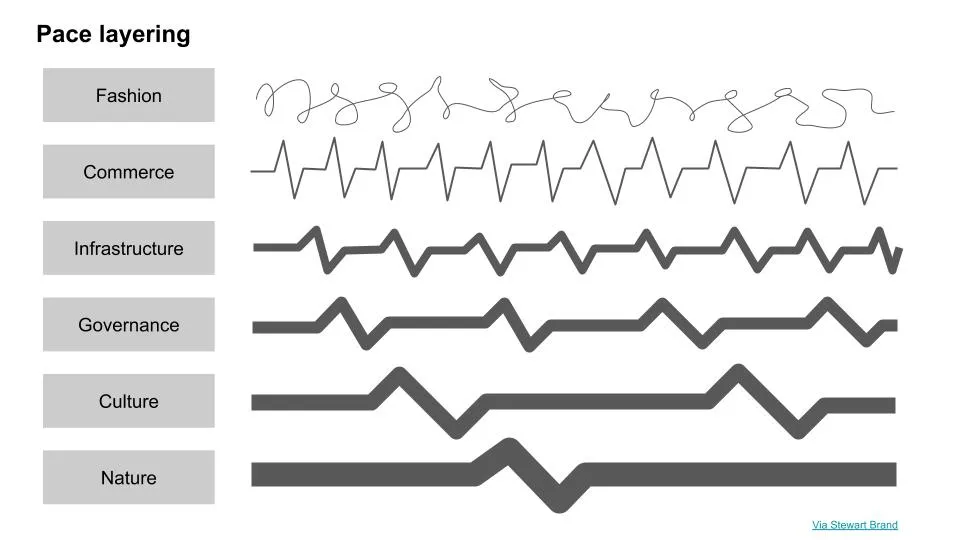

## Mensagem

As previsões de morte de grandes cidades estão exageradas e espero que a maioria se recupere em cinco anos\.

## Nova York está morta\, viva Nova York

Um artigo recentemente proclamou que [NYC is dead forever.](https://www.linkedin.com/pulse/nyc-dead-forever-heres-why-james-altucher/ 'NYC') Por causa da internet\, a perda de negócios\, cultura\, gastronomia\, imóveis comerciais e faculdades na cidade passou de uma situação temporária para um resultado permanente\. Como resultado\, o artigo conclui que as pessoas estão deixando Nova York e nunca mais voltando\.

Artigos semelhantes já foram escritos sobre outras grandes cidades\, [such as SF.](https://www.sfgate.com/sf-locals/slideshow/I-m-finally-leaving-Stories-of-Bay-Area-203670.php 'SF') Algumas pessoas com quem conversei também refletiram o mesmo sentimento de querer deixar a cidade onde estão\. Não sou especialista em mobilidade urbana\, e isso será mais especulativo\. Vamos dar uma olhada em alguns pontos que importam sobre a morte das grandes cidades\.

Estou mais otimista de que grandes cidades vão sobreviver a isso\. Como forma de quantificar essa afirmação \- tenho 80\% de confiança de que Nova York terá uma população maior em 5 anos do que tem hoje [^1]\. Para contextualizar\, até recentemente Nova York vinha crescendo 0\,30\% ao ano\.

<a href='https://www.macrotrends.net/cities/23083/new-york-city/population'>População da Área Metropolitana da Cidade de Nova York 1950\-2020</a>

Escolher uma cidade é como escolher uma casa\. Não é uma decisão puramente financeira para a maioria\. Se fosse\, os aluguéis seriam muito mais parecidos em todo o país\, e seria fácil escolher a cidade ideal para morar comparando o aluguel mediano de um apartamento da sua escolha\.

As pessoas têm suas próprias prioridades únicas ao avaliar cidades\. As prioridades da pessoa podem mudar\, assim como a capacidade da cidade de fornecer essa prioridade\. Quando as cidades não oferecem mais o que você precisa\, você se move \(se puder\)\.

Normalmente\, o ritmo com que a prioridade da pessoa muda é mais rápido do que o ritmo em que a capacidade de uma cidade muda\. Você se muda para uma cidade para seu primeiro emprego depois de se formar na faculdade\, e depois fica lá por um tempo até precisar de mais espaço para uma família\. A cidade permaneceu a mesma\, você mudou\.

Recentemente\, porém\, as cidades perderam quase tudo que atraía as pessoas para elas\. Você pode ter permanecido o mesmo e querido as mesmas coisas\, mas a cidade mudou\. Se você se lembra do nosso [pace layer](/writing/pace 'pace') discussão\, neste caso as camadas de \"governança\"\, \"infraestrutura\" e \"comércio\" avançaram mais rápido do que o esperado\.

Essa volatilidade levou a uma mudança de mentalidade por parte das pessoas\. O que antes era uma consideração relutante sobre locais de trabalho remoto se transformou em uma avaliação entusiasmada de até onde vai o dinheiro do aluguel em Austin\, Texas\. Para muitas pessoas\, o que antes era impensável agora é a escolha lógica\.

É importante distinguir esses dois tipos de situações\. No primeiro\, suas prioridades mudaram\, e provavelmente você não voltaria para uma cidade depois de sair\. No segundo\, suas prioridades permaneceram as mesmas\, mas todos os lugares legais estão fechados por enquanto\. Quando reabrirem\, você estará de volta\.

É como ir a um restaurante\. Se você não gosta mais desse estilo de comida\, não vai voltar\. Se seu prato favorito estiver esgotado o tempo todo\, você visitaria menos\, mas ainda assim se interessaria se ele voltasse ao cardápio\.

### Fatores urbanos

Vamos analisar alguns fatores que tornam as cidades atraentes e ver o que aconteceu\. Vou me basear nisso [1970 paper on urban mobility](https://www.jstor.org/stable/490436?seq=5#metadata_info_tab_contents 'urban') Mas principalmente adicionando meus próprios comentários [^2]\. O tema principal é que os desejos básicos das pessoas não mudam tanto assim\.

Alguns dos principais fatores\:

- Obra
- Educação
- Social
- Serviços
- Vibe\/cultura

### Obra

Muitas pessoas se mudam por causa do emprego\; Eu também\. Se esse trabalho agora pode ser feito em qualquer lugar\, há menos motivo para se mudar\. Por que as empresas iriam querer voltar para escritórios\?

De forma cínica\, ter um escritório permite que uma empresa extraia mais tempo de seus funcionários\. E embora algumas pessoas estejam mais produtivas no trabalho agora que trabalham de casa\, sinto que a produtividade de um trabalhador médio diminuiu desde que saiu do escritório\. Recuperar as pessoas eventualmente é uma forma de crescer mais rápido\.

Também há a sensação de que essas conversas aleatórias entre as reuniões são realmente importantes\. Isso levou mais empresas a encontrar maneiras de fazer suas equipes interagirem fora do trabalho\, como um passeio em equipe com distanciamento social\. Se as pessoas se contentassem apenas com happy hours no Zoom\, não veríamos essas atividades sugeridas\. As pessoas querem ver os outros pessoalmente\.

O trabalho remoto também não precisa ser uma questão de tudo ou nada\. Se as empresas acabassem deixando as pessoas fazerem alguns dias no escritório e outros fora dele\, então grandes cidades ainda importam\. O trabalho remoto pode até resultar diretamente em mais pessoas se mudando para as cidades\, caso os escritórios tenham um cronograma rotativo\. Por exemplo\, um mês no grupo A no escritório\, um mês grupo B no escritório\. Isso implica que a cidade pode ter o dobro de trabalhadores do que costumava ter\.

O tipo de trabalho também importa\. Mais trabalho físico não pode ser feito remotamente\, então esses empregos ficam na cidade\, onde há economias de escala\. Voltaremos a isso em serviços\, mas isso não deveria significar mais aderência para as cidades\?

E um fator importante\, às vezes ignorado\, é como a maioria dessas empresas que permitem opções totalmente remotas deixou claro que pretende ajustar os salários de acordo com o custo de vida da cidade para onde você se muda\. Isso sem considerar as vantagens reduzidas que você tem ao trabalhar remotamente – lanches\, refeições\, outros serviços\. Algumas pessoas vão aceitar isso\, outras vão recuar\.

Acho que veremos muito mais empresas que fazem apenas remotamente ou apenas remotamente\. [Zapier, for example,](https://zapier.com/about/ 'Zapier') Tem sido apenas remota há um tempo\. Ainda realizam eventos presenciais da empresa\. Por enquanto\, ainda acho que o trabalho remoto é temporário para a maioria\. E os estilos de trabalho remoto que vão permanecer ainda são benéficos para as cidades\.

### Educação

Muitas pessoas também se mudam para estudar\, mais comumente para a faculdade\. Como eles passaram para o remoto\, não há motivo para sair da casa dos seus pais agora\.

Se o ensino superior sobreviverá à covid é uma discussão à parte\; meu pensamento inicial é que a maioria ficará bem\, mas vai sangrando lentamente até a morte daqui a alguns anos\. Assumindo que eles sobrevivam pelos próximos 5 anos\, é mais provável que continuem tentando reabrir para poder retomar todas as atividades importantes para o orçamento\, sendo o esporte universitário um dos principais exemplos\.

Se as faculdades permanecerem remotas para sempre \(improvável\)\, os lugares que dependem das faculdades desaparecerão lentamente\. Esses lugares são muito mais propensos a serem áreas suburbanas ou rurais\, por definição\. Neste caso\, parece que qualquer mudança na educação é ruim tanto para cidades pequenas quanto grandes\, ou ruim para cidades pequenas e muito menos ruim para as grandes

### Social

Muitas pessoas também se mudam por causa das expectativas que têm sobre o ambiente social da cidade\. Elas querem estar perto de pessoas da mesma idade\, fazer novos amigos e ter bastante interação com os outros\.

Sempre haverá pessoas que saem desse grupo demográfico\. Depois que você tem uma família e percebe que suas prioridades sociais mudaram\, ter um trajeto de 10 minutos até o bar é menos importante do que ter um trajeto de 10 minutos até a pré\-escola do seu filho\.

Esse processo de envelhecimento foi adiantado\, então um grande grupo de pessoas que achava que tomaria essa decisão em alguns anos está tomando agora\. Deveríamos ver um número crescente de pessoas continuando a sair das grandes cidades\. E é aí que a maioria das pessoas está focando agora\, o fluxo grosseiro de uma cidade\. Provavelmente ajuda o fato de que a maioria das pessoas que escrevem tem essa faixa etária\.

E quanto ao grupo de pessoas mais jovens que eles\? Ainda estão longe de mudar suas prioridades\. Se der certo\, podemos ter um novo grupo de jovens se mudando para a cidade com aluguéis mais baixos\, causando um ressurgimento da atividade em vez de um declínio\.

O fato de as pessoas estarem fazendo festas na praia durante a covid me deixa cético quanto a qualquer previsão que presuma que as pessoas não querem sair com outras pessoas pessoalmente\.

### Serviços

Mencionei antes que os serviços físicos ainda serão concentrados\. Se você é distribuidor de alimentos\, prefere vender para uma população de 1 mil em vez de uma população de 100 mil\?

As cidades chegam ao tamanho que têm agrupando muitos serviços em um pacote conveniente\, onde o preço é principalmente o valor do aluguel naquela região\. As pessoas querem a conveniência de conseguir tudo o que quiserem o mais rápido e fácil possível\. Ter um supermercado perto da loja de roupas faz sentido em uma cidade\, assim como fazer sentido tê\-los juntos em um shopping rural faz sentido\.

Enquanto continuarmos apegados às experiências físicas\, à necessidade de entregar itens ou transportar pessoas\, a localização ainda importa\.

### Vibe\/cultura

É difícil classificar cidades com base no clima ou cultura delas\. Se você já visitou outras cidades antes\, sabe que algumas cidades simplesmente \"sentem\" de forma diferente de outras\.

A cultura é construída por meio de muitas coisas\, incluindo história\, pessoas\, histórias\. Ela é construída a partir das muitas pequenas interações que você tem com outras pessoas na cidade\. Em uma situação de trabalho remoto\, não me parece óbvio que tudo isso vai mudar para uma cidade\. Claro\, isso muda se todas as pessoas que compõem a cultura se mudarem\. Como mencionado nas outras seções\, isso não parece ser o caso\.

## As cidades duram muito tempo

Haverá tensão contínua por causa dos moradores da cidade ao verem os suburbanos desfrutarem de uma vida mais normal\, aparentemente sem consequências\. Muitos até escolherão se mudar\, finalmente decidindo que a troca vale a pena\.

E esse é o cerne da questão – viver na cidade sempre será uma troca\, feita consciente ou inconscientemente por todos\. Não existe uma resposta certa ou errada\, apenas a mais adequada para a situação daquela pessoa em particular\.

A tendência da urbanização não dura uma década\, nem sequer um século\. É algo que continua acontecendo [for 5,000 years](http://metrocosm.com/history-of-cities/ '5k')\. E embora a maior cidade do mundo [has changed over time](https://en.wikipedia.org/wiki/List_of_largest_cities_throughout_history 'city')\, o que também é interessante é como tantas cidades permaneceram grandes ao longo dos anos\.

[^1]: Eu compararia agosto de 2025 vs agosto de 2020\, se possível\, mas provavelmente teríamos que comparar dezembro de 2019 vs dezembro de 2024 ou dezembro de 2020 vs dezembro de 2025\.

[^2]: Eu li o artigo por cima e não o li completamente\. É citado por muitos e fornece uma estrutura para explicar por que as pessoas se mudam\. Há uma discussão sobre o que leva as pessoas a se mudar\, e depois como encontram e avaliam um novo lar\.
