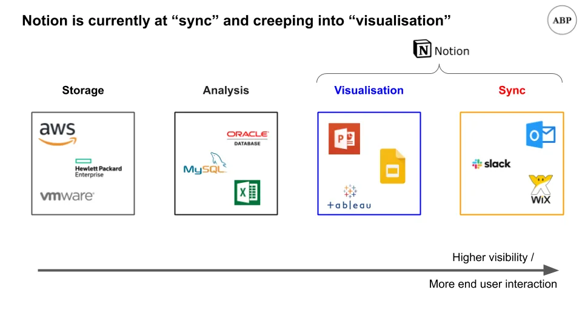
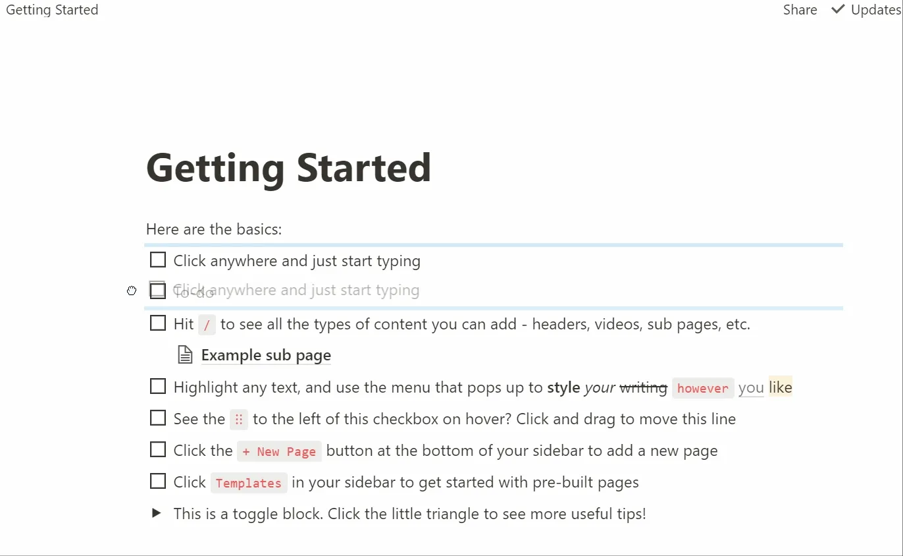
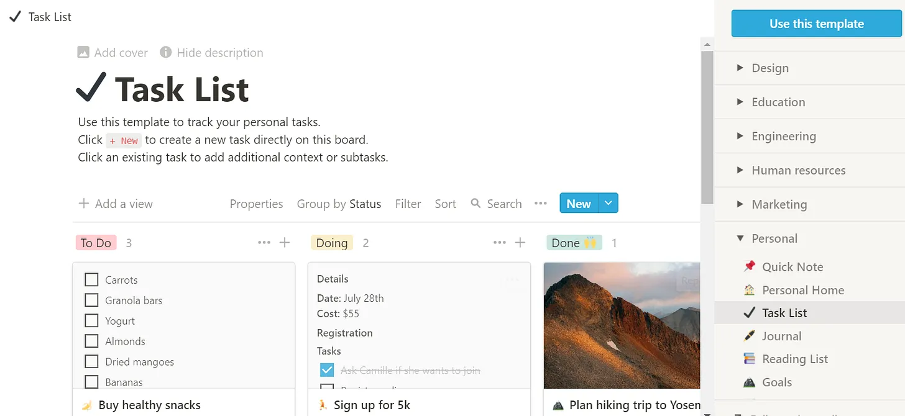

## Mensagem

1. Notion é uma abordagem visual para organização e colaboração da informação
2. Os maiores pontos fortes do Notion são formulários flexíveis\, construção baseada em visuais e opções de templates
3. Os maiores problemas do Notion provavelmente são relacionados à qualidade\, e eu dou algumas ideias de marketing e produtos para resolvê\-los

## Espaço de trabalho Notion para o seu local de trabalho

No filme [Inception by Christopher Nolan,](https://en.wikipedia.org/wiki/Inception 'Inception') Os personagens principais vagam por camadas aninhadas de sonhos para cumprir uma tarefa\. As ações deles dentro dessa camada afetam a camada em si\, e também as camadas acima ou abaixo dela\. Às vezes você se interessa pelo que está acontecendo nessa camada\, às vezes por afetar outras camadas\.

Quero que você tenha essa estrutura em mente \- **de camadas\, interação dentro das camadas e interação entre as camadas\.** Voltaremos a isso em breve [^1]\.

Recentemente\, startups de produtividade como Notion\, Coda e Roam têm levantado rodadas com avaliações altas para seu tamanho\. [The hustle has Notion at a $2bn valuation, Coda at $600mm, and Roam at $200mm](https://thehustle.co/09142020-roam-research/ 'Hustle')\. Considerando o quão jovens essas empresas são [^2]\, essas são avaliações otimistas de venture sobre o potencial dessas empresas\.

Hoje quero olhar mais de perto [Notion](https://www.notion.so/ 'Notion')\. Vamos lá [^3]\:

1. Qual é o propósito de Notion
2. Guia de recursos de exemplo
3. Sugestões para a equipe do Notion

Assim\, ao final disso\, você terá uma ideia do porquê dessas startups existem\, como elas são e como podem mudar no futuro\.

Vamos começar\.

## 1\. Notion é uma abordagem baseada em imagens para organização e colaboração da informação

Para entender melhor o Notion\, precisamos obter mais contexto sobre a história da nossa interação com a informação e a evolução da computação\.

Podemos pensar grosseiramente nos humanos como uma função\. Pegamos dados como entrada\, processamos e damos alguma resposta como saída\. Esses dados de saída então influenciam outros que eles mesmos os processam e reagem de acordo\.

Costumávamos armazenar dados fisicamente\, e você precisava ir a uma biblioteca ou profissional pessoalmente para conseguir algum pergaminho da verdade [how likely Jack Sparrow would have visited Singapore](https://www.reddit.com/r/AskHistorians/comments/gd7cww/in_pirates_of_carribbean_jack_sparrow_says_youve/ 'Reddit') [^4]\.

Com os computadores\, passamos a armazenar dados digitalmente\, permitindo até mesmo que múltiplos colaboradores estejam em um documento ao mesmo tempo\. **Não estamos mais presos à localização física dos dados ou da pessoa\, o que abre oportunidades de interagir com informações em escala global\.** Antes\, havia pouca chance de eu trabalhar com alguém em Uganda\, dada a velocidade da transferência de informações\. Agora\, não só podemos trabalhar juntos\, como podemos até trabalhar no mesmo documento simultaneamente\.

Demorou um pouco para chegar até aqui\, pois exigiu mudanças de mentalidade\, tecnologia e design para possibilitar nossos hábitos de trabalho atuais\.

Uma grande mudança foi o **[graphical user interface](https://www.youtube.com/watch?time_continue=39&v=BFlop4sP8Os&feature=emb_title 'GUI')\.** Antes disso\, [people were interacting with computers via a command line interface,](https://www.wired.com/1997/12/web-101-a-history-of-the-gui/#:~:text=In%201979%2C%20the%20Xerox%20Palo,first%20prototype%20for%20a%20GUI.&text=When%20Jobs%20saw%20this%20prototype,expensive%3B%20no%20one%20bought%20it. 'CLI') Muito parecido com o que está abaixo\.

Como você pode ver\, não é a forma mais intuitiva de trabalhar com um computador\. Vou dizer que deixei esse erro ali como um momento de aprendizado\; a verdade é que esqueci a sintaxe correta\. A interação na linha de comando pode ser poderosa\, mas representa uma grande barreira de entrada para a maioria dos usuários\. Ao redesenhar o uso em torno de uma experiência visual\, [Apple achieved a breakthrough](https://en.wikipedia.org/wiki/History_of_the_graphical_user_interface 'Apple') na criação de computação para o mercado de massa [^5]\. O progresso da computação teria sido significativamente retardado se ainda trabalhássemos apenas na linha de comando\.

Uma segunda grande mudança foi a internet\, que surgiu em duas ondas\. Antes disso\, as pessoas armazenavam trabalhos em mídias físicas como disquetes [^6]\. Se você quisesse compartilhar algo\, ainda teria que transportar seu armazenamento temporário fisicamente para a outra pessoa\.

**O e\-mail ajudou a mudar isso\,** eliminando gradualmente a necessidade de hardware e aumentando a conveniência e a velocidade da transferência de dados\. Em vez de enviar um pen drive com uma versão finalizada e editada da sua proposta\, seu chefe agora pode enviar dez e\-mails separados e não vinculados com comentários sobre a formatação do tamanho da nota de rodapé\.

Nos últimos 10 anos\, o aumento da largura de banda da internet também possibilitou nossa **Vá para a nuvem\.** Em vez de trocar e\-mails\, agora todos podem colaborar em tempo real no mesmo documento\, aumentando ainda mais a conveniência e reduzindo problemas de controle de versões\. Agora posso ficar de pijama assistindo [Dark](<https://en.wikipedia.org/wiki/Dark_(TV_series)> 'Dark') Enquanto respondia aos comentários de forma meio desanimada em um Google Doc\. Não que eu fosse responder\, claro\.

A internet e a nuvem forneceram a base para o crescimento de todos os [Software as a Service (SaaS)](https://www.bmc.com/blogs/saas-vs-paas-vs-iaas-whats-the-difference-and-how-to-choose/ 'SaaS') Empresas que vemos hoje\. Ao considerar como certo que outra pessoa fornecerá a infraestrutura \(IaaS\) ou plataforma \(PaaS\) necessária para suportá\-las\, as empresas de software podem se concentrar em atender às necessidades de um segmento específico\.

Com o [low cost of capital](/writing/capital 'low')\, altas margens potenciais e base de receita fixa\, não é de se admirar que tenhamos visto tantas empresas de software tentando digitalizar funções que antes eram físicas\. Temos wikis de empresas substituindo compêndios\, quadros kanban substituindo post\-its e aplicativos de anotação substituindo periódicos\. A maioria de nós precisa lidar com pelo menos 10\, se não mais\, plataformas de software diferentes enquanto trabalha\.

É aí que entra a Notion\. **[Notion wants to be your all-in-one workspace,](https://www.notion.so/product 'Notion')** O principal lugar onde você escreve\, planeja e organiza seu trabalho\. Todo aquele software separado que acabamos de mencionar\? A Notion quer agrupar todos eles e oferecer uma experiência de usuário consistente com flexibilidade suficiente para atender à maioria das suas tarefas\.

Quer uma wiki da empresa\? Você pode criá\-la no Notion\.

Quer um quadro de tarefas\? Você pode criá\-lo no Notion\.

Quer uma página para anotação\? Você entendeu a ideia\.

Caso você ache que estou inventando isso\, [here's a quote from cofounder Ivan Zhou:](https://www.invisionapp.com/inside-design/ivan-zhou-notion-interview/ 'ivan')

> estamos nessa oscilação de pêndulo de um produto\, o Microsoft Office\, para muitos produtos SaaS\. E agora o pêndulo está voltando para algo mais compacto novamente\. Quero que a Notion \\\[\.\.\.\\\] pegue essa onda\. Pode ser um produto tão poderoso quanto essas cinco ferramentas SaaS diferentes\.

Esse já é um mercado grande e viável para servir\, mas vamos especular sobre o potencial do Notion e como ele pode crescer ainda mais\. É hora de trazer a analogia do Inception desde o início e aplicá\-la a como as camadas de dados existem em uma empresa\.

Uma empresa precisa coletar e armazenar dados\. Vamos chamar isso de **camada de armazenamento de dados\,** e agrupe todas as empresas relacionadas à infraestrutura aqui para simplificar\. Por exemplo\, se você é varejista\, está armazenando registros de transações para poder atender os pedidos depois\, e usaria o Amazon Web Services \(AWS\) para isso [^7]\.

Uma empresa também precisa analisar os dados que coletou\. Vamos chamar isso de **camada de análise de dados\,** e agrupe todas as ferramentas que podem interagir com bancos de dados para fazer cálculos aqui\. Por exemplo\, você pode querer descobrir quantos clientes conseguiu este mês\, e usaria SQL para consultar essas informações do seu banco de dados\, além do Excel para refinar ainda mais sua pesquisa\.

Uma empresa também precisa ver os resultados dessa análise\. Vamos chamar isso de **camada de visualização de dados\,** E agrupe todos os softwares relacionados a apresentações aqui\. Por exemplo\, você pode usar o Google Slides para apresentar um gráfico dos dados que você acabou de puxar\, mostrando que seus clientes cresceram 50\% semana a semana\.

Ainda há uma última camada principal por cima de tudo isso\. Vamos chamar isso de **camada de sincronização de dados\,** E é onde ocorre a coordenação das informações\. Não adianta se sua equipe for a única que sabe o desempenho do negócio\, então você precisa de uma forma de comunicar essa informação e colocar todos na mesma página\. Por exemplo\, você pode enviar uma mensagem para toda a empresa no Slack fazendo um resumo dos últimos indicadores financeiros\.

À medida que os dados fluem pela empresa nessas camadas\, **ela se torna mais visual e visível\,** resultando em mais pessoas conseguindo interagir com ele\. As ferramentas na camada de sincronização de dados\, por serem as mais \"voltadas para o usuário final\"\, geralmente têm uma abordagem de design mais visual\, tornando\-as mais fáceis de aprender para leigos\. Por exemplo\, o e\-mail é fácil\, [hadoop](https://en.wikipedia.org/wiki/Apache_Hadoop 'hadoop') é difícil\.

A estrutura acima nos dá uma ideia melhor de onde está o valor agregado do Notion\. **O Notion está atualmente na camada de sincronização de dados e está entrando na camada de visualização de dados\.** Eu já havia dito anteriormente que este era um mercado grande\, então vamos justificar isso antes de explorar oportunidades de expansão\.

A camada de sincronização de dados está tentando resolver um **Problema de coordenação da informação em todas as escalas**\, desde pequenos grupos na empresa até partes interessadas externas\. O objetivo é garantir que todos estejam alinhados em relação a uma questão\. Ter um aplicativo de mensagens permite que sua equipe concorde sobre os próximos passos\, e ter um site público permite que seus clientes obtenham informações sobre seu negócio\. Slack é uma empresa de limite de mkt de 15 bilhões de dólares focada em mensagens\; Wix é uma empresa de limite de milhões de 13 bilhões de dólares que constrói sites\. Podemos listar mais empresas para wikis\, quadros de tarefas\, anotações\, mas acho que isso é suficiente para mostrar que há uma oportunidade multibilionária aqui\.

Quanto à visualização de dados\, [Tableau was bought for $15bn](https://techcrunch.com/2019/06/10/salesforce-is-buying-data-visualization-company-tableau-for-15-7b-in-all-stock-deal/ 'Tableau')\, então acho que podemos dizer que também há uma oportunidade multibilionária aqui\. Considero o Notion apenas na metade dessa camada\, pois os recursos atuais estão longe de alcançar a paridade com os pares\, como o guia posterior mostrará\.

Alguns de vocês talvez tenham notado que deixei de fora o Office e o G Suite ao discutir as camadas acima\. Isso porque acredito que\, para a maioria dos usuários do Office\/G Suite\, ter alguma capacidade de fazer cálculos de dados é necessário para o trabalho\. Por isso\, adquirir as capacidades da camada de análise de dados é crucial para se tornar tão integrado à força de trabalho quanto essas ferramentas estão atualmente\. O desempenho do Notion aqui é ruim\, mas isso também significa alto potencial de expansão\.

Qual o tamanho do mercado que isso desbloquearia\?

A Microsoft reporta a receita do Office como parte do segmento \"Produtividade e Processos de Negócios\"\, agrupando Office Comercial\, Office Consumer e algumas outras empresas menores\. Em seus [recent annual report](https://www.microsoft.com/investor/reports/ar19/index.html 'ar')\, eles geraram US\$ 41 bilhões de receita para todo o segmento\, com US\$ 16 bilhões em receita operacional\, com uma margem de 39\%\. Agora\, claro\, isso não é toda receita de escritórios\, mas provavelmente é o maior subsegmento [^8]\.

O Google reporta a receita do G Suite como parte do segmento \"Google Cloud\"\, superando o Google Cloud e outros serviços corporativos nesse item também\. Em seus últimos anos [10K](https://abc.xyz/investor/static/pdf/20200204_alphabet_10K.pdf?cache=cdd6dbf 'Google') Eles mostraram US\$ 9 bilhões para o segmento\. O Google Cloud provavelmente é a maior parte da receita aqui\, e eu acho que a G Suite fica entre US\$ 1 bilhão ou mais\.

Claramente\, o mercado de \"Word\, Powerpoint\, Excel\" é de vários bilhões em tamanho medido pela receita\, e provavelmente muito maior\. O tamanho do mercado é o motivo **Eu argumentaria que o Notion teria mais capacidade analítica** Com o tempo\. Você quer cobrir o máximo possível do seu caso de uso para clientes\.

Imagine se você começasse seu dia no trabalho primeiro checando o quadro de tarefas a fazer\, depois os comentários de uma proposta e\, em seguida\, atualizando uma página de anúncios gerais com novas tarefas para atribuir aos colegas\. **Tudo isso pode ser feito no Notion agora\.**

À tarde\, você extraia alguns dados de churn de clientes\, filtrava e reduzia para mostrar o que precisava\, e depois resumia em alguns gráficos para compartilhar com sua equipe\. Em grande parte\, **isso não pode ser feito no Notion agora\, mas imagine se pudesse\?** Você poderia passar quase todo o seu tempo dentro de um único aplicativo\. Essa é uma forma de o Notion potencialmente ser um grande sucesso\, substituindo o Office e o G Suite por um único software\. Se eu estivesse em desenvolvimento corporativo na Microsoft ou Google\, estaria observando o Notion de perto e pensando em investir ou comprar neles\.

Se pensarmos na analogia de Inception\, não estamos apenas interessados em quanto espaço o Notion ocupará dentro de suas camadas atuais\, mas também em como ele interagirá ou até mesmo assumirá outras camadas\. Se sua análise\, visualização e sincronização de dados pudessem ser feitas com o Notion\, isso tornaria grande parte do software que usamos agora redundante\.

Provavelmente há um [pace layer](/writing/pace 'pace') Comparação a fazer aqui também\, com as camadas visuais superiores e rápidas se movendo mais rápido e dominando o ciclo de atenção\.

Quando eu estava pensando neste artigo\, inicialmente queria fazer um modelo financeiro para a Notion\, [like the one I did for newsletters](/writing/community 'news')\. No entanto\, dada a falta de dados\, eu estaria fazendo suposições demais\. Li que eles já são lucrativos com uma taxa de receita de [$30mm](https://www.forbes.com/sites/davidjeans/2020/04/01/buzzy-work-app-notion-hits-2-billion-valuation/#15da831578ec '30')\, e consigo vê\-los fazendo 10 vezes essa receita com uma margem de 40\%\, enquanto ainda crescem em dois dígitos\. Teremos que esperar por mais dados\, mas não é à toa que as pessoas estejam animadas [^9]\.

Essa é justificativa suficiente para a avaliação do Notion\, e voltaremos a algumas ideias mais malucas de como aumentar o mercado endereçável\. Por enquanto\, vamos fazer uma visão geral das funcionalidades do produto\.

## 2\. Os maiores pontos fortes do Notion são formas flexíveis\, construção baseada em visuais e opções de templates

Entrar no Notion é simples\, mas começar não é\, o que é um problema que voltarei mais adiante na seção de sugestões\. Você pode fazer login com sua conta Google e então escolher se está montando um espaço de trabalho para você ou para uma equipe\.

Depois disso\, você verá uma página \"Como Começar\"\, com dicas de como começar a trabalhar no Notion no meio\. À esquerda\, você verá que você começa com alguns modelos pré\-definidos\, como uma lista de tarefas ou uma lista de leitura\.

**A unidade básica do Notion é um bloco\.** Pense em como uma célula no Excel é fundamental para trabalhar lá\. Blocos no Notion são assim\, mas com muito mais recursos\. Os blocos são personalizáveis tanto no que exibem quanto em como são exibidos\. O segredo é que o Notion é um aplicativo visual e baseado em design\, então você deve conseguir organizar os blocos e alterá\-los conforme suas necessidades\.

Você pode transformar um bloco em várias coisas\, como uma lista de tarefas\, um calendário ou uma tabela\. Esses são blocos\, então você pode mover o link criado na sua página original\.

**Você pode encaixar um bloco\/página embaixo de outro\,** facilitando a criação de uma rede conectada de todo o seu trabalho\. Se você é do tipo que gosta de mapas mentais e de fazer conexões entre tudo com que interage\, esse estilo de design é para você\.

Além da possibilidade de criar páginas independentes a partir de blocos\, outro recurso que gostei foi o **Bloco de alavanca**\. Se você gosta de agrupar e desagrupar linhas no Excel [^10]\, você vai gostar desse recurso de mostrar resumo e depois visões detalhadas\.

Já falamos sobre como o Notion tem **blocos modulares que permitem interagir visualmente com a página que está construindo\.** No passado\, se você queria mudar a aparência de uma página web\, era limitado pelos recursos que seu editor web oferecia\. Por exemplo\, o Substack tem opções limitadas de formatação de texto\. Para conseguir mais do que isso\, você teria que programar o HTML\/javascript\/CSS você mesmo\.

Com o Notion\, você ganha uma enorme quantidade de funcionalidades e flexibilidade\, permitindo que programadores que não sejam de front end construam mais\. **Isso também gerou uma grande seleção de modelos\, já que os usuários se orgulham de compartilhar o que trabalharam\.** Por exemplo\, se você fosse voltar a estudar\, poderia usar um modelo pré\-pronto para planejar todos os seus trabalhos acadêmicos\.

**Modelos de Notion são atualmente uma grande força\, e também potencialmente uma grande fraqueza\.** Vamos abordar primeiro o ponto forte e depois a fraqueza na seção de sugestões\. A vantagem de ter templates é que\, uma vez que alguém descobre o que quer e seleciona o modelo\, se atualizar é rápido\, já que a maior parte da funcionalidade desejada já deve estar criada\. Por exemplo\, não há necessidade de criar páginas e seções do zero se você quiser criar um quadro de tarefas\, já que já existe um modelo para ele\.

Abaixo\, encontro um modelo de lista de tarefas no Notion\:

E então consigo adicionar minhas próprias tarefas rapidamente\. Perceba que dentro de uma tarefa\, posso criar subtarefas aninhadas\, o que ajuda na organização\.

É isso para a visão geral do Notion\, e você pode acessar o site deles [youtube page](https://www.youtube.com/c/Notion/featured 'youtube') Para ver mais sobre o que você pode criar no Notion\. Agora quero falar sobre os problemas do Notion e terminar com algumas sugestões de moonshot para a empresa\.

## 3\. A Notion provavelmente enfrentará problemas de qualidade de seleção e deve investir no ecossistema para preveni\-los

Aqui estão alguns dos problemas que vejo com o Notion\, que vão desde estratégias maiores até pequenos detalhes de design\.

### Problema 1\: Modelos também são uma barreira para a adoção e para o início

Se os templates são um ponto forte do Notion\, quanto mais templates houver\, melhor\. Já vimos muitas pessoas promoverem templates próprios\, algumas até cobrando por isso\. Vamos supor que o Notion tenha começado um volante aqui\, e que [the quantity of templates is not going to be a problem](https://www.notion.so/Notion-Template-Gallery-181e961aeb5c4ee6915307c0dfd5156d#90f6a0e426e1403093bb2a54ea33140d 'Notion')

**O que será um problema então é a escolha do modelo\.** Isso também está ligado ao problema de começar que eu identifiquei no início do guia\. No momento\, as pessoas precisam 1\) descobrir o que querem\, e 2\) encontrar o modelo certo que atenda às suas necessidades\. No estado atual do Notion\, ambos ainda são difíceis e vão desestimular o uso\.

**Para o primeiro\, entender o que é possível é uma tarefa em si mesma\.** Não me surpreenderia se houvesse pessoas que usaram o Notion para planejar como quiseram usar o Notion\, e acabaram presas nesse ciclo de produtividade de tentar constantemente encontrar o design ideal sem fazer nenhum trabalho real\.

**Para o segundo\, filtrar a qualidade dos templates disponíveis também é uma tarefa\.** Para novos usuários\, encontrar uma boa opção sem muito contexto é difícil\. Seleção em excesso é um problema melhor do que pouca escolha\, mas também significa que alguma forma de curadoria será necessária\. [You're already seeing unofficial template directories](https://templates.notion.vip/ 'vip') Provando isso\.

Também é interessante notar que a maioria de nós não usa tantos modelos em nossas ferramentas atuais de Word\/Excel\/Powerpoint\. Não é por falta de opções\, já que esses modelos são padrão\. Na verdade\, percebemos que preferimos a flexibilidade disponível ao começar do zero\. Talvez\, com o tempo\, as pessoas usem menos modelos e criem mais páginas sozinhas à medida que se acostumam com o Notion\.

É como arte\, onde você começa desenhando a partir de referências \(modelos\)\. Depois que você desenvolver suas habilidades\, vai querer começar a criar suas próprias composições\. O Notion precisa ser capaz de suportar casos de uso para toda essa jornada\.

### Problema 2\: Design visual exige vê\-lo em ação antes que as pessoas \"entendam\"

Já argumentamos que o Notion é uma ferramenta visual\. Isso significa que\, em vez de descrevê\-lo\, **Você tem que mostrar isso para as pessoas** antes que entendam o potencial\. Imagine se este artigo tivesse sido escrito sem imagens\; provavelmente você ainda não faria ideia do que Notion trata\.

Em termos de comunicação\, isso significa que ter imagens é o mínimo\, e gifs ou vídeos são muito superiores ao texto simples\. Não sei você\, mas eu fico irritado de ter que assistir vários vídeos sobre um problema\, comparado a só ler sobre isso\. Esse problema não é um fator decisivo\, mas vai atrasar a adoção pelo grande público\.

### Problema 3\: Falta de funcionalidade central de análise de dados

Já mencionei isso antes\, sobre como o Notion não chega perto do Excel em termos de recursos\. Como [RadReads](https://radreads.co/notion-formulas/ 'Rad') Aponta que o Notion funciona como um banco de dados\. Ele não é feito para ser Excel\, e por isso só oferece visualizações funcionais de seções inteiras\. Por exemplo\, você não pode fazer um cálculo só em duas células\, tem que aplicar isso à coluna inteira [^11]

Se você olhar a imagem acima onde estou tentando somar dois números\, também pode ver como a fórmula parece pouco elegante\. Fórmulas no Notion parecem ter vindo de uma mentalidade de programação\, com funções recebendo variáveis como entradas em uma linha longa\. Isso contrasta completamente com a abordagem de design visual do Notion e foi uma surpresa para mim\.

Para deixar claro\, chegar perto do Excel em recursos vai ser extremamente difícil\. Não espero que a equipe da Notion priorize isso\, mas pelos pontos mencionados em uma seção anterior ficou claro o quão grande é a oportunidade que eles têm aqui\. Se você puder fazer sua análise de dados\, apresentação e colaboração tudo dentro da mesma ferramenta\, isso é enorme\. O fato de terceiras estarem criando [chart plugins](https://www.notion.vip/charts/ 'charts') Mostra que haverá mercado\.

Esse problema também ilustra o equilíbrio que a Notion terá que fazer à medida que cresce\, se deve atender mais usuários casuais ou avançados\. Usuários avançados estarão dispostos a pagar mais\, mas há mais usuários casuais para pagar\.

### Outros problemas

Os abaixo são mais detalhistas\, então vou listar todos juntos\. Ideia [used to have a feature roadmap](https://twitter.com/NotionHQ/status/766137732980613120?s=20 'Road') mas já desapareceu\, então vou assumir [they're prioritising their top feature requests](https://www.notion.so/How-do-I-request-features-19830881751e4f68bcd674212c6c317c 'feature')

**A busca é lenta\:** Por algum motivo\, a função de busca é _Realmente_ Devagar\. Não sei o que está acontecendo com isso\, mas é um peso para todo o design da \"rede conectada\"

**Inúmeros cliques\:** Isso pode ser porque sou um usuário novo e percebi que precisava clicar para criar para muitas das coisas que queria\. Mais atalhos e navegação por teclado seriam bem\-vindos\.

**Espaço em branco estranho\:** Isso é uma preferência pessoal de design\. Todas as páginas\/blocos no Notion têm bastante espaço em branco à esquerda e à direita do bloco\. O usuário deve pensar que nada aconteceria se clicasse ali\, já que afinal está vazio\. Em vez disso\, a área de seleção de um bloco vai além da área visual\, então você acaba clicando no bloco\, conforme o gif abaixo\.

Já abordamos alguns problemas\, vamos analisar algumas ideias\. Vou dividi\-las em ideias de comunidade\/marketing mais práticas e ideias de produto mais improváveis\.

### Ideia de marketing 1\: Invista na qualidade dos templates

Se os modelos são críticos para o Notion agora\, a empresa deve garantir sua qualidade\. Algumas táticas\:

- Tenha um sistema de classificação\, embora isso esteja sujeito a muitas ressalvas
- Organize uma competição modelo como [Kaggle](https://www.kaggle.com/ 'Kaggle') ou [ProductHunt](https://www.producthunt.com/ 'PH') onde os melhores modelos são recompensados
- Compre os melhores modelos online e disponibilize\-os para todos

### Ideia de marketing 2\: Invista em conteúdo comunitário

A Notion se espalhou principalmente pelo boca a boca\, e com base em alguns artigos\, eu presumiria que o marketing já está fazendo trabalho semelhante aqui\. Dito isso\, continuar investindo em pessoas que criam modelos\, organizam eventos e escrevem sobre o Notion vale a pena considerar\.

Se a Notion conseguir investir ou patrocinar defensores\, isso vai garantir muito alcance por um custo relativamente baixo\. Em outras palavras\, se acabarmos numa situação em que as pessoas podem ganhar a vida ensinando outras pessoas a usar Notion\, é aí que você sabe que tem um produto de mercado adequado\.

### Ideia de marketing 3\: Invista em treinamento

Existem indústrias inteiras baseadas em certificação AWS\, treinamento em SQL e como construir um modelo financeiro no Excel\. Da mesma forma\, a Notion deveria começar a criar certificações para que as pessoas se tornem especialistas no produto\. Eles podem complementar as certificações com educação\, seminários\, horários de atendimento e mais\. Parte disso já está sendo feita de forma não oficial pela comunidade\, e faz sentido que a Notion forneça ainda mais financiamento e suporte aqui para expandir a especificação de vaga \"profissional da Notione\"\. Um objetivo final pode ser que as empresas comecem a contratar campeões especializados internos da Notion para gerenciar sua configuração de Notion\.

Agora\, vamos para as ideias mais improváveis\.

### Ideia do produto 1\: Análise de dados

Já falei sobre isso acima ao falar sobre Excel\.

De forma mais geral\, se eu estivesse rodando produto na Notion\, eu olharia para todas as coisas que eles permitem que sejam incorporadas\. Eu pensaria tanto como falhas para a Notion quanto como oportunidades de expansão\. Você poderia até usar isso como o roadmap do produto com visão grandiosa\. Por exemplo\, todas as capacidades do Google Drive podem ser duplicadas um dia\. Isso vai levar anos\, e o objetivo final é que você não precise sair do Notion por nada\.

### Ideia do produto 2\: E\-mail

Ficamos presos ao conceito de correspondência tendo que ir e voltar\, devido ao conceito físico de enviar cartas\. Nem toda comunicação precisa ser feita dessa forma\. Se o Notion conseguir reduzir a necessidade de e\-mail ou chat\, e agrupar tudo isso nas páginas do Notion\, isso é uma grande mudança nos hábitos de trabalho\, espero que para melhor\.

### Ideia do produto 3\: Mais código

O Notion atualmente é baseado em visual\, mas existe um mundo inteiro de código escrito\, seja pull de dados SQL ou Machine Learning Jupyter Labs\. Integrar essas capacidades expandiria muito o uso do produto\.

Voltando ao framework das camadas de dados\, se você conseguir oferecer algo que toque todas as partes do fluxo de dados\, exceto armazenamento\, terá um produto de alta visibilidade e alto contato\, com o qual bilhões de usuários poderão interagir\. Com um produto SaaS assim hospedado na nuvem\, **você nem vai precisar de um sistema operacional\.** Sim\, isso significa que isso pode se tornar uma ameaça para os US\$ 46 bilhões de receita de computação pessoal da Microsoft\, ou para a participação de mercado da Apple\. Se tudo o que você precisa é de um navegador de internet para acessar as ferramentas que usa no trabalho\, toda a camada do sistema operacional se torna uma mercadoria\.

## Noção de ideia\; Ideia de noção

Notion é uma abordagem visual baseada em design para repensar como trabalhamos\. Atualmente\, ele está principalmente na camada de \"sincronização de dados\" da organização e está progredindo na camada de \"visualização de dados\"\. Talvez um dia também fique na camada de \"análise de dados\"\, e passemos todos os nossos dias exclusivamente no Notion [^12]\.

Também é interessante pensar nos tradeoffs do Notion\. As empresas geralmente enfrentam um trilema de crescimento\, lucratividade e qualidade\. No caso do Notion\, elas supostamente já atingiram a lucratividade\, e dada a força da adoção precoce\, o crescimento provavelmente não será um problema nos próximos três anos\. **A etapa de determinação da taxa é então a qualidade** do produto\, o que explicaria por que a Notion lança características mais lentas que os concorrentes\.

O que o Notion permite que você crie\, que tipo de personalização está disponível e quanto controle você tem sobre o design final\? Ultrapassar os limites dessas questões permitirá que o modo de trabalho do Notion se infiltre em mais áreas da nossa vida\.

Atualmente\, a Notion busca reduzir o custo do compartilhamento de informações e pode um dia fazer muito mais\. Está começando promovendo a ideia de que a forma como trabalhamos vai mudar\.

Há uma citação sobre ideias em A Origem\:

> Qual é o parasita mais resistente\? Bactérias\? Um vírus\? Um verme intestinal\? Uma ideia\. Resiliente\.\.\. altamente contagiosa\. Uma vez que uma ideia toma conta do cérebro\, é quase impossível erradicá\-la\. Uma ideia totalmente formada \- totalmente compreendida \- que fica\; bem ali em algum lugar\.

Vou deixar vocês com isso\, e a ideia do que a Notion poderia se tornar\. Vamos ver se isso pega\.

_Crédito a [Hadar Dor](http://hadardor.com/ 'Hadar')\, [Ryan Rodenbaugh (who also writes an Asia tech newsletter)](https://eastmeetswest.substack.com/ 'Ryan')\, [Valentin Hernandez](https://www.linkedin.com/in/valentinhernandez/ 'Valentin')\, [Nathan Lui](http://nathanlui.com/ 'Nathan')\, [Theodore Wu](https://www.linkedin.com/in/theo/ 'Theo')\, [Nadia Eldeib](https://twitter.com/nseldeib 'Nadia') para recursos no Notion\, [Packy McCormick for corrections](https://notboring.substack.com/ 'packy')\. E sim\, [I’ve recreated this article in Notion as well](https://www.notion.so/Inception-Nolan-and-Notion-3478471a315945a9a0f87a79974714e1 'Notion')_

[^1]: Admito que metade da razão pela qual estou fazendo essa referência é para poder inserir um pôster de Marion Cotillard\, mas você verá depois que a analogia realmente faz sentido\. Bem\, pelo menos para mim\.

[^2]: Eu já [Notion founded in 2013, ](https://www.crunchbase.com/organization/notion-so 'Notion') [Coda in 2014](https://www.crunchbase.com/organization/coda-add7 'Coda')\, e [Roam in 2017](https://pitchbook.com/profiles/company/343764-28#funding 'Roam')\, mas também ouvi versões beta iniciais lançadas antes dessas datas\.

[^3]: Me sinto mais confortável analisando negócios na internet versus software\, mas vamos ver onde isso nos leva\. Como sempre\, sinta\-se à vontade para comentar\, especialmente se discordar\. Também note que\, devido à falta de tempo\, não fiz uma análise completa do Roam ou Coda antes de escrever isso\.

[^4]: O comentário principal diz que não é provável\, para constar\.

[^5]: Sim\, eles roubaram a ideia da Xerox\; Vou dar crédito a eles aqui pela execução da ideia\. A Apple executou bem a ideia\; A Xerox executou a ideia\. Sim\, vou me retirar\.

[^6]: Estranhamente\, lembro de ter ficado tão orgulhoso disso [zip drive](https://en.wikipedia.org/wiki/Zip_drive 'zip') que meu pai me deu porque era mais novo\, mais chique e tinha _Mais armazenamento\!\!_ Do que outras pessoas\. Ou quando as pessoas comparavam o tamanho dos pen drives\.

[^7]: Como em todas as outras camadas\, esta é uma versão simplificada da realidade\. Muitas empresas abrangem múltiplas camadas com múltiplas ofertas de produtos\.

[^8]: Não consegui encontrar mais detalhes sobre itens específicos\, mas eles podem realmente existir em algum lugar dos registros\, me avise se você souber\. A MSFT afirma assinantes do Office Consumer de 43mm em sua chamada de resultados [here](https://view.officeapps.live.com/op/view.aspx?src=https://c.s-microsoft.com/en-us/CMSFiles/TranscriptFY20Q4.docx?version=0d57e08d-7bdf-419e-da08-e83b4800706a 'MSF')\. Em [$100 per year](https://www.microsoft.com/en-us/microsoft-365/buy/compare-all-microsoft-365-products?tab=1 'pricing') isso representa 400 milhões de dólares em receita do consumidor\, e provavelmente muitas vezes mais do que o comercial de escritório\.

[^9]: Notion\'s [pricing page](https://www.notion.so/pricing 'pricing') não mostra o preço corporativo deles\, mas eu imaginaria que seja algo na faixa de \$20 por usuário por mês\, já que isso é próximo do que [G suite is charging](https://support.google.com/a/answer/1247360?hl=en 'GOOG')\. Como na maioria dos negócios de software\, uma vez superados o grande obstáculo inicial de vender para a empresa\, a receita deve ficar complicada depois disso\, já que é complicado mudar de assunto\. Isso implica que a Notion pode aumentar o preço a cada poucos anos para qualquer cliente específico\. Acho difícil modelar qualquer suposição de taxa de crescimento agora\, a menos que você esteja disposto a aceitar uma faixa ampla na avaliação final que pode ser de magnitudes diferentes entre o baixo e o alto da faixa\.

[^10]: Comentário à parte\: na maioria dos casos\, nunca \"esconda\" linhas ou colunas na sua planilha\. Agrupe e desagrupe\, em vez disso\. Esconder dificulta perceber que há dados adicionais\, e isso reduz a facilidade de uso para a próxima pessoa\. Analistas de banco de investimento\, estou falando com vocês\.

[^11]: Nesse aspecto\, é um pouco mais parecido com SQL\.

[^12]: Para deixar claro\, não acho que isso seja provável\. Não abordei isso em profundidade\, mas dado o grande volume de software especializado disponível\, acho que construir uma ferramenta de uso geral que possa criar todos eles acaba significando criar uma linguagem de programação\. O que não é o ponto\.
