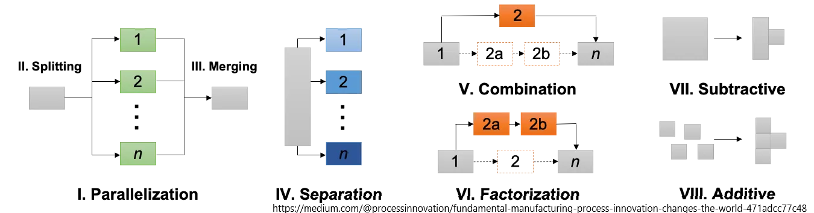
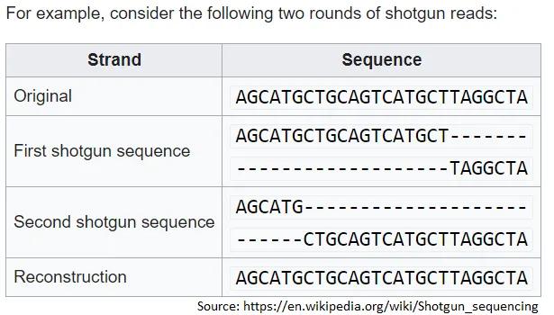

## Mensagem

Michael Filler e Matthew Realff propõem que todos os processos vêm de 8 tipos diferentes de etapas\. Ao entender quais etapas estão disponíveis\, você pode reorganizá\-las para obter melhorias de processos\. A melhoria de processos é subestimada por sua natureza intangível\.

## Processo vs produto

Se você fosse questionado para comparar o objeto à esquerda com o objeto à direita\, quais pontos você faria\?

Uma das primeiras coisas que você notaria seria o material\. A esquerda é feita de pedra\, a direita de bronze\.

Você também pode mencionar que a ponta de flecha de pedra provavelmente não é tão afiada quanto a de bronze\, é menos durável e assimétrica\.

O que você deduziu\, mas provavelmente não disse explicitamente\, é que o processo de fabricação também é diferente\. Pedra precisa de corte\, mas bronze requer fusão\.

Focando neste tema do processo\, [Michael Filler and Matthew Realff propose that Fundamental Manufacturing Process Innovation (FMPI) is central to progress.](https://medium.com/@processinnovation/fundamental-manufacturing-process-innovation-changes-the-world-471adcc77c48 'FMPI') Vamos ver o que eles querem dizer com FMPI\, por que é importante e alguns exemplos\.

Os autores propõem que há melhorias nos processos que resultaram em grande progresso visível para a humanidade\. No entanto\, as pessoas ignoram as mudanças no processo intangível e focam excessivamente nas mudanças no produto físico\. No nosso exemplo da ponta de flecha acima\, as pessoas focam no resultado entre pedra e bronze\, sem olhar para a melhoria do processo de corte versus fundição [^1]\. Essas inovações de processos de alto impacto são o que eles chamam de FMPI\.

É difícil perceber melhorias no processo porque são intangíveis e exigem que você veja a situação de um ponto de vista diferente\. Você está abstraindo os detalhes e tentando encontrar relações de alto nível para representar o que está fazendo\. É um pouco como a teoria dos grupos em matemática tentando abstrair da aplicação prática\.

Pesquisar sobre o FMPI é importante porque\, se você conseguir quantificar os vários métodos que levaram ao progresso para a humanidade\, terá uma estrutura alternativa para melhorar\. Por exemplo\, saber que as linhas de montagem obtêm mais eficiência ao incorporar um processo em peças sequenciais é útil para ver onde mais você poderia aplicar a mesma técnica\.

A implicação prática disso para sua vida diária é revisar todos os processos recorrentes dos quais você participa\. Seja no trabalho ou em um hobby\, tente ver se existe uma forma de reorganizar as etapas para que seus processos sejam mais eficazes\:

- Se houver um processo repetitivo envolvendo transferir dados de um software para outro\, [zapier](https://zapier.com/ 'zapier') talvez seja possível automatizar isso
- Se você sempre tem que ensinar outras pessoas a fazer as coisas\, [scribe](https://cursive.io/scribe 'scribe') Talvez consiga reduzir sua carga de trabalho
- Se você sempre fez algo por padrão\, talvez se filmar e revisar visualmente todos os passos do processo ajude

Abaixo\, vamos analisar as diferentes etapas nas melhorias de processos e ver exemplos de inovações que foram decorrentes do FMPI\.

### FMPI ocorre por meio de oito esquemas

Eles definem processo como uma série conexa de etapas\, que transformam um estado inicial em outro estado\. Rearranjar as etapas pode resultar em melhoria do processo\. \'Etapas\' são os blocos de construção dos processos\, e rearranjar etapas pode tornar processos mais eficazes\.

Os autores propõem 8 tipos \(esquemas\) de melhorias de processo\:

Paralelização \(tipo 1\) refere\-se a múltiplas instâncias do mesmo passo sendo realizadas simultaneamente\.

Se você tem paralelização\, isso implica que você pode dividir passos \(tipo 2\) e mesclar passos \(tipo 3\)

Se você divide um passo e envia as peças para diferentes etapas a jusante\, isso é conhecido como separação \(tipo 4\)

Você pode combinar vários passos \(tipo 5\) ou fatorar um passo em vários \(tipo 6\) [^2]

Por fim\, você pode remover coisas sendo subtrativo \(tipo 7\) ou adicionar coisas sendo aditivo \(tipo 8\)

Usando várias variações dos 8 tipos acima\, você pode mudar a forma como faz as coisas para melhor\. Vamos analisar exemplos mais concretos\.

### A fabricação de circuitos integrados requer paralelização\, subtração e adição

O trabalho de Jean Hoerni e Robert Noyce na Fairchild Semiconductor no final dos anos 1950 mostrou que [a transistor could be made within silicon, and that circuitry could be built on top of the surface](https://www.computerhistory.org/revolution/digital-logic/12/329 'wafer') [^3]\. Poder ter múltiplos transistores em uma superfície foi um exemplo de paralelização \(tipo 1\)

O processo de fabricação também inclui muitas etapas de subtração \(tipo 7\) e adição \(tipo 8\)\. No diagrama abaixo\, de [Electronics Tutorial](https://www.electronics-tutorial.net/CMOS-Processing-Technology/planar-process-technology/ 'Elec')\, você pode ver a remoção de silício \(SiO2\) e a adição de material dopante para criar propriedades semicondutoras para o material\.

### O sequenciamento de DNA foi melhorado por meio de paralelização

Na década de 1970\, o sequenciamento de DNA era lento e trabalhoso\, já que se pensava que era preciso trabalhar sequencialmente em toda a cadeia de DNA\. Joachim Messing e Peter Seeburg desenvolveram um [shotgun approach](https://en.wikipedia.org/wiki/Joachim_Messing 'DNA')\, que quebra o DNA em fragmentos aleatórios para permitir um sequenciamento mais rápido\. Ao fazer múltiplos fragmentos sobrepostos\, isso permitiu a paralelização \(tipo 1\) no processo de sequenciamento\, aumentando muito a velocidade\, diminuindo o custo e diminuindo a quantidade de DNA necessária [^4]\.

### A impressão 3D é uma mudança de mentalidade da subtração para a adição

A maioria das técnicas convencionais de fabricação envolve a subtração \(tipo 7\) do material de uma forma bruta do material\. Por exemplo\, se você quiser criar uma mesa\, está cortando uma árvore e depois serrando as partes que não precisa\.

Como você pode imaginar\, isso gera desperdício de material\. Para muitas empresas\, tentar otimizar a quantidade de produto intermediário que podem obter do produto bruto é essencial para a lucratividade\. Por exemplo\, [fabric optimisation](https://www.resourceefficient.eu/en/technology/design-efficiency-%E2%80%93-zero-waste-patterns 'shirt') na indústria do vestuário\, pode resultar em [30% cost savings](https://fashioninsiders.co/toolkit/how-to/cutting-fabric-for-production-versus-sampling/#:~:text=In%20clothing%20manufacturing%20fabric%2C%20costs,%2D30%25%20in%20a%20fabric. 'fabric') [^5]

Em contraste\, [3D printing](https://3dprintingindustry.com/3d-printing-basics-free-beginners-guide '3D') é aditivo \(tipo 8\)\. Isso significa que há muito menos desperdício na produção\, já que você imprime quase exatamente o que precisa de baixo para cima\. [Besides the cost savings, this also allows creation of more complicated structures in fewer steps.](https://bitfab.io/blog/additive-manufacturing/ 'bit')

### Perguntas abertas sobre FMPI

Os autores afirmam que as melhorias de processo acima foram fundamentais para a redução de custos nesses setores\, como visto abaixo\.

Além de permitir um caminho para que as tecnologias escalem\, o FMPI possui as seguintes características\:

- Comportamento em curva S com adoção lenta inicialmente\, adoção generalizada quando os problemas são resolvidos\, e depois saturação do mercado
- Contribuindo para os benefícios ao construir sobre melhorias antigas\. Por exemplo\, adicionar mais camadas aos chips de circuito integrado foi possível devido a melhorias anteriores nos processos
- Introduzindo diferentes vieses na produção\. Por exemplo\, a otimização e o alto custo fixo da produção de circuitos integrados significam que estamos \"presos\" ao uso do silício como material base\, em vez de explorar outras opções

Eles terminam com algumas perguntas em aberto\:

- Com que frequência ocorrem os FMPIs e qual é a faixa de impacto deles\?
- Quais setores se beneficiam mais do FMPI e quais se beneficiam menos\?
- Eles propuseram 8 tipos de FMPI\, mas será que existem mais\?
- Como podemos prever o FMPI\?
- Como podemos incentivar o FMPI\?

[^1]: Eles propõem 3 razões para isso\: a\) O processo tem uma natureza passageira e é mais transitório que o produto b\) A melhoria do processo tem uma grande amplitude de aplicação e é facilmente ignorada por profissionais especializados \(não sei o que quis dizer aqui\) c\) O processo é considerado apenas uma reorganização de etapas\, uma atividade trivial

[^2]: A fatoração me parece muito uma separação\, e acho que a diferença que eles querem fazer é que a separação vai para diferentes etapas a jusante\. A fatoração vai para a mesma etapa

[^3]: Não tenho certeza dos detalhes específicos da produção de chips semicondutores\, veja [here](https://www.mepits.com/tutorial/384/vlsi/steps-for-ic-manufacturing 'IC') ou [this youtube video](https://www.youtube.com/watch?v=oBKhN4n-EGI 'yout') Para mais detalhes\. Acho que todo o processo de produção é chamado de processo planar\, já que a pastilha de silício precisa ser plana\, e então você empilha o circuito por cima dele fazendo a camada de óxido de silício\, adiciona uma camada de fotorresisto\, adiciona uma máscara\, expõe à UV para remover seletivamente a máscara\, permitindo gravar o óxido e depois dopar seletivamente o silício exposto\.

[^4]: Você pode encontrar mais detalhes no artigo deles [here](https://academic.oup.com/nar/article-abstract/9/2/309/2359970 'paper')\. Está além do que eu sei\, então não vou adicionar mais detalhes aqui\. Uma versão mais fácil de entender do processo shotgun é [here](https://www.yourgenome.org/facts/what-is-shotgun-sequencing 'genome')

[^5]: Isso envolve usar um computador \(ou um humano\, suponho\) para gerar um molde de tecido que maximize o uso do seu tecido\, organizando o molde de forma que ele \"cubra\" o material sem muitos espaços\.
