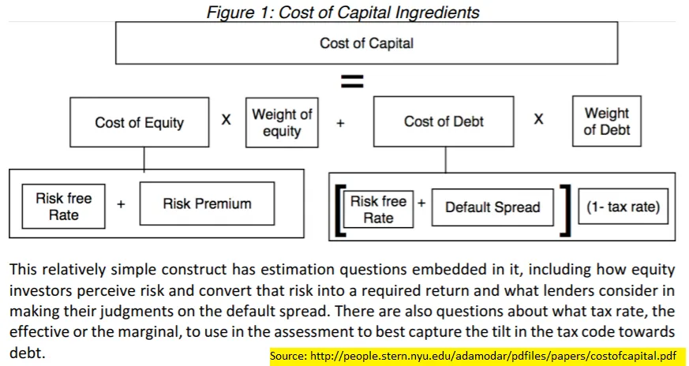
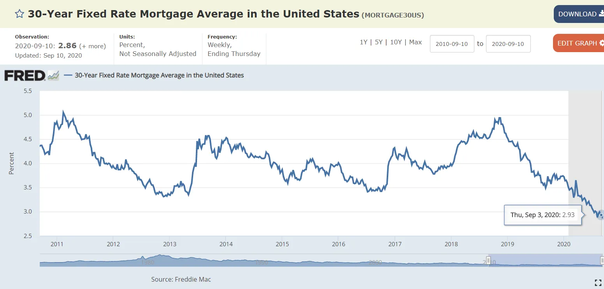
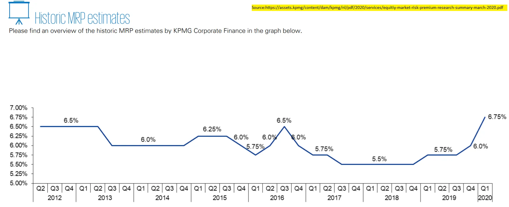
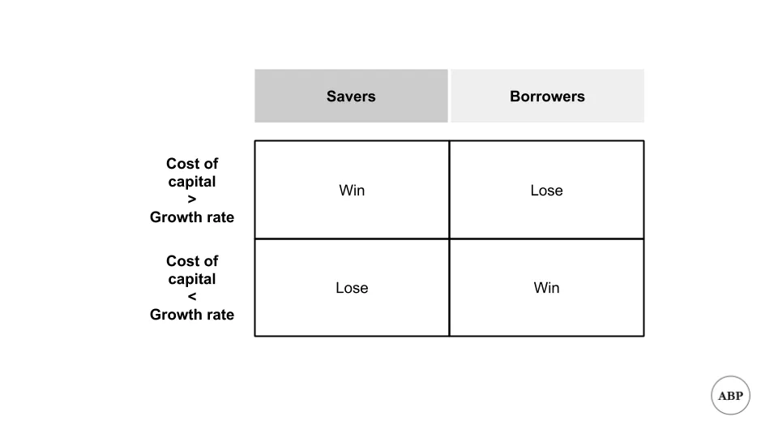
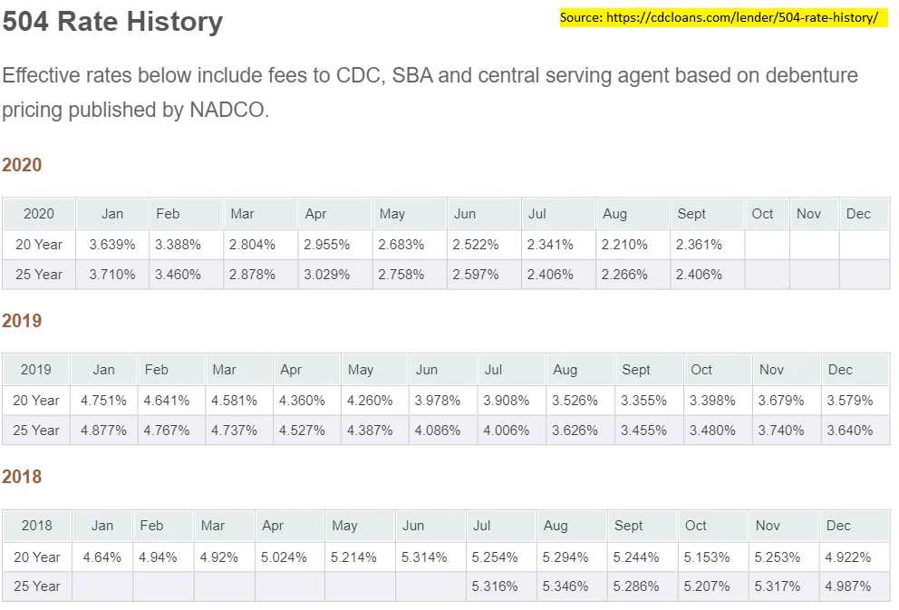

## Mensagem

A redução do custo de capital agora implica uma transferência de riqueza dos poupadores para os tomadores\, e que é ideal que uma pessoa assuma mais riscos hoje do que antes\.

## Implicações do baixo custo de capital

Quero dar uma olhada **Custo de Capital** hoje\. Tenho me perguntado quais são as implicações do nosso atual ambiente de baixo custo\, além disso [Michael Pettis](https://carnegieendowment.org/chinafinancialmarkets/82610 'Pettis') Recentemente escrevi um bom artigo sobre taxas de juros versus crescimento\, então vamos analisar esse tema mais de perto\. Também não terei todas as respostas\, então comentários são definitivamente bem\-vindos\, respondam diretamente ou na caixa de comentários do post\.

Para quem não sabe o que é custo de capital\, não se preocupe\. Vou fornecer uma breve explicação do conceito\, antes de fazer os seguintes pontos\:

1. O custo de capital é menor agora do que historicamente
2. Como resultado\, há uma transferência de riqueza dos poupadores para os mutuários
3. Isso também implica que mais riscos devem ocorrer

### Custo de capital é o custo combinado de financiar sua ideia

Imagine que você teve uma ideia\. Pode ser uma nova ideia de negócio\, um plano de expansão ou até algum investimento que você estava pensando\. O que importa é que isso exige dinheiro \(capital\) e\, com sorte\, te retorne mais dinheiro do que você investiu\.

Como você consegue esse dinheiro\? Existem duas principais fontes de capital\: dívida e patrimônio [^1]\.

Quando você recebe dinheiro em troca de dívida\, concorda em pagar parte da dívida ao longo do tempo\. Podemos calcular um custo disso\, baseado na taxa final de retorno\. Por exemplo\, se você pagou \$10 sobre \$100\, isso é um custo de 10\% [^2]\.

Quando você recebe dinheiro em troca de ações\, não precisa pagar em dinheiro\, mas abre mão da propriedade\. O valor que você abre mão depende do retorno esperado que os investidores têm\. Podemos calcular um custo implícito disso\. Por exemplo\, se um investidor investiu esperando um retorno de 20\%\, isso é um custo de 20\% [^3]\.

Os custos combinados dessas duas principais fontes de capital se combinam para obter seu custo de capital\. Esse é o custo médio que você terá ao tentar a ideia\. Por exemplo\, se seu custo de capital for 5\%\, você está \"perdendo\" 5\% a cada ano\.

Também se segue que você quer ganhar mais do que seu custo de capital\. Se você está perdendo 5\% ao ano\, precisa ganhar mais de 5\% para obter um retorno positivo\. Se seu negócio retorna 1\% ao ano enquanto custa 5\%\, você perde dinheiro com o tempo\.

Essa foi uma explicação simplificada\, mas deve dar intuição suficiente para o restante do artigo\. Se você tem interesse em ler mais\, o rei da avaliação\, o Prof\. Damodaran da NYU\, [has a paper explaining this in detail](http://people.stern.nyu.edu/adamodar/pdfiles/papers/costofcapital.pdf 'Cost')\, que inclui gráficos como os abaixo\, que estendem rigorosamente a estrutura que discutimos acima\.

Em outras palavras\: queremos ganhar dinheiro\. Precisamos de dinheiro\. Esse dinheiro tem um custo\, que é o custo do capital\.

### 1\. O custo de capital está menor agora

Primeiro\, vamos estabelecer o argumento de que agora é menos custoso conseguir dinheiro do que antes\. Para isso\, vamos analisar alguns gráficos ao longo do tempo das taxas\.

Estes são os últimos 10 anos do rendimento TIPS de 10 anos\, [pulled from the Fed](https://fred.stlouisfed.org/series/DFII10 'Fed') [^4]\. Para quem não conhece as DICAS\, elas são um [inflation linked, "safe" type of debt](https://www.investopedia.com/terms/t/tips.asp 'tips')\. Como podemos ver\, os rendimentos estão atualmente negativos\, tendo tendido a cair ao longo do tempo\.

Estes são os últimos 10 anos do custo da hipoteca de taxa fixa de 30 anos\, [also pulled from the Fed](https://fred.stlouisfed.org/graph/?g=NUh 'Fed') [^5]\. Podemos ver que o custo de empréstimos para uma casa também caiu\.

E se você acha que estou escolhendo a dedo ao olhar apenas para 10 anos\, vamos olhar para os últimos 54 anos e olhar para a taxa do tesouro de 10 anos\. Você pode ver o pico nas taxas antes [Volcker killed inflation](https://en.wikipedia.org/wiki/Paul_Volcker 'Volcker')\, e a tendência de queda contínua desde então\.

Neste ponto\, acho que já mostramos o custo de **dívida** diminuiu\. E quanto ao custo do patrimônio\?

Tive mais dificuldade para encontrar o custo médio do patrimônio\, mas sabemos que o custo do patrimônio está relacionado ao custo da dívida\, além de algum retorno adicional pelo risco associado ao patrimônio [^6]\. Mostramos que o custo da dívida diminuiu\, então\, se conseguirmos encontrar a tendência no retorno adicional \(o prêmio de risco de ações\)\, entenderemos melhor a tendência\.

[Damodaran has a table in pg 142 of this report](https://poseidon01.ssrn.com/delivery.php?ID=425124115112025116020118020011112064052051040011030092064114074119081098025103109118097012061055040113125093125106096026106103051022049037045010068078022028103006044010102031118000094024104112069074071073106074113116005029084117013074087122064008&EXT=pdf 'Damodaran') mostrando um leve aumento no prêmio de risco ao longo do tempo\. Para uma versão mais visual\, [KPMG has the numbers below.](https://assets.kpmg/content/dam/kpmg/nl/pdf/2020/services/equitiy-market-risk-premium-research-summary-march-2020.pdf 'KPMG') Eles não se atam exatamente\, mas são relativamente consistentes\.

Houve um leve aumento nos últimos meses\, mas os prêmios de risco de ações no geral não subiram tanto quanto o custo da dívida diminuiu\. Isso implica que\, no geral\, o custo de **Patrimônio** ou ficou estável\, ou piorou\.

A partir do exposto\, mostramos que o custo do capital diminuiu\. Isso implica que levantar dinheiro agora\, seja por meio de dívida ou de patrimônio\, é mais barato do que antes\.

### 2\. Redução do custo de capital implica transferências de riqueza dos poupadores para os mutuários

Vamos introduzir uma complicação\. Acima dissemos que uma empresa deve buscar crescer mais do que seus custos\. As pessoas estenderam esse conceito para países\, alegando que a dívida é sustentável quando a taxa de crescimento do PIB \(retorno\) é maior que a taxa de juros \(custo do capital\)\. Para isso\, frequentemente citam o trabalho do famoso economista Thomas Piketty\, [Capital in the Twenty-First Century](https://en.wikipedia.org/wiki/Capital_in_the_Twenty-First_Century 'Capital')\.

[Michael Pettis argues here](https://carnegieendowment.org/chinafinancialmarkets/82610 'int') que estender o arcabouço aos países não faz sentido\. Em vez disso\:

> No nível macroeconômico\, a relação entre taxas de juros e PIB revela muito mais sobre transferências de renda e a distribuição de renda dentro de uma economia do que sobre a sustentabilidade geral da dívida dessa economia\. Nesse sentido\, as condições operam de forma bastante diferente para os países do que para indivíduos ou empresas

Vamos analisar o que ele quer dizer\, já que isso não é imediatamente óbvio\. Pettis está dizendo que uma implicação de custos serem menores que o crescimento é que **A economia move dinheiro das pessoas que fornecem capital para quem está tomando emprestado\.**

Se você tinha dinheiro e estava emprestando\, está emprestando pelo custo de mercado\. Se você investiu na economia em geral\, está obtendo crescimento de mercado\. Se esse custo for menor que a média de crescimento \(taxa de retorno\)\, você obteve um ativo de rendimento menor comparado ao que tinha maior rendimento antes\. O inverso é o contrário\, se o custo for maior que a taxa de crescimento\.

Isso tem implicações diferentes no crescimento futuro\, bem como na desigualdade de riqueza\. Os ricos economizam mais\, então custos reduzidos resultam em uma transferência de riqueza dos ricos para os pobres\. Isso é compensado pelo aumento da especulação sobre ativos\, que desloca a riqueza para o outro lado\. O efeito líquido disso depende do tamanho relativo de cada um\. Pettis não faz esse ponto\, mas **Acredito que a parte da especulação compensou mais do que o primeiro efeito\, e isso é uma causa do aumento da desigualdade de riqueza\.**

### 3\. Redução do custo de capital implica que deve ocorrer mais risco

É aí que fico mais especulativo\. Um custo de capital mais baixo em relação ao crescimento também implica que **A tolerância ao risco de todos deveria aumentar\.** Se o custo de oportunidade de fazer as coisas for menor\, a quantidade ótima de risco a ser assumida é maior\. Por exemplo\, se antes custava 5\% ao ano pegar dinheiro emprestado para o seu negócio\, e agora custa 1\%\, você deve pegar mais empréstimos e abrir mais negócios\.

Os dados reais são mais ruidosos\. O [Fed data on business applications](https://fred.stlouisfed.org/series/BUSAPPSAUS 'Biz') parece validar minha suposição [^7]\, mas também li [that the quality of businesses has declined](https://www.census.gov/newsroom/blogs/research-matters/2018/02/bfs.html 'decline')\. Com base no [inflation of valuations for private companies trying to raise money](https://news.crunchbase.com/news/its-not-just-you-seed-rounds-are-actually-getting-bigger/ 'inflatoin')\, ainda acredito que mais pessoas estão assumindo riscos a um custo menor\, mas me avise se discordar\.

Maior tolerância ao risco também implica **Mais especulação sobre ativos investidos\.** Acredito que essa é uma das razões pelas quais continuamos vendo o preço das ações públicas subir\, à medida que as pessoas buscam retorno e impulsionam o mercado de ações para cima\.

Como todos os ativos estão conectados\, essa tendência não se limita ao capital próprio público\. Todas as classes de ativos devem ver os preços subirem e os retornos caírem à medida que os custos diminuem\. Devemos ver mais fundos anjo\, investimentos de risco ou aquisições de private equity\. As notícias atuais parecem confirmar isso\.

Isso parece ótimo\, afinal todo mundo gosta que as coisas subam\. Consigo pensar em pelo menos duas ressalvas\, e ainda estou tentando pensar em mais\.

A primeira é que a maior tolerância ao risco vem com o compromisso de **Mais fraude\.** Se todos conseguirem arrecadar dinheiro\, a chance de contras deve aumentar\. Quando as pessoas veem que há baixa desvantagem em algo e alta vantagem\, a melhor escolha é fazer mais disso\. Haverá mais pessoas tentando se aproveitar dessa situação e enganar os outros\. Acredito que é por isso que vemos mais empresas fraudulentas como Luckin Coffee\, Nikola ou seja lá o que a Kodak está fazendo este mês\.

A segunda é que ouvi dizer que o custo de capital reduzido é **Distribuída de forma desigual entre setores\.** Supostamente\, empréstimos para pequenas empresas ainda são caros\. Não sou especialista nisso\, e os dados iniciais que analisei [here](https://cdcloans.com/lender/504-rate-history/ 'rate') parece mostrar o contrário\, mas consigo ver isso como um fenômeno plausível\. Por exemplo\, sempre me incomodou que as taxas de empréstimos pessoais ainda sejam positivas\, comparadas às taxas negativas em média [^8]\.

A lição geral\, então\, é que todo indivíduo agora deveria **aumentar a tolerância ao risco e participar de atividades mais arriscadas**\, já que o custo base deles diminuiu\. Se isso significa mais investimento em ações públicas\, classes alternativas de ativos ou no novo negócio do seu amigo\, cabe a você decidir\. Como sempre\, isso não é um conselho de investimento\, e estou interessado em ver contra\-argumentos ao que foi dito acima\.

[^1]: Existem muitas variações de títulos de dívida\, ações e híbridos\, como conversíveis \(parte dívida\, parte patrimônio\)\. Para facilitar a discussão\, vamos nos limitar apenas aos dois

[^2]: Não vou entrar em rendimentos versus taxas de juros para simplificar\, leia [here](https://www.fidelity.com/learning-center/investment-products/fixed-income-bonds/bond-prices-rates-yields 'fidelity') Para começar\, para aprender mais\.

[^3]: Se eles obtêm esse retorno é outra questão\. Lembre\-se que estamos lidando apenas com expectativas\, não com retornos reais\. Para tornar o exemplo mais concreto\, imagine se o investidor tivesse um obstáculo maior no custo do retorno do patrimônio\, digamos 100\%\. Se ele ainda quisesse investir em você\, teria que exigir uma avaliação menor\, para conseguir um múltiplo de saída versus entrada maior\. Ou exigiria mais participação pelo mesmo valor de dinheiro\.

[^4]: Conselho de Governadores do Federal Reserve System \(EUA\)\, Título Indexado à Inflação do Tesouro a 10 Anos\, Maturidade Constante \\\[DFII10\\\]\, recuperado do FRED\, Federal Reserve Bank de St\. Louis\; https://fred.stlouisfed.org/series/DFII10\, 14 de setembro de 2020\.

[^5]: Freddie Mac\, Média Hipotecária de Taxa Fixa de 30 Anos nos Estados Unidos \\\[MORTGAGE30US\\\]\, recuperado do FRED\, Federal Reserve Bank de St\. Louis\; https://fred.stlouisfed.org/series/MORTGAGE30US\, 14 de setembro de 2020\.

[^6]: Mais precisamente\, [the risk free rate plus beta times the equity risk premium](http://pages.stern.nyu.edu/~igiddy/articles/wacc_tutorial.pdf 'ERP')

[^7]: U\.S\. Census Bureau\, Business Applications for the United States \\\[BUSAPPSAUS\\\]\, recuperado do FRED\, Federal Reserve Bank de St\. Louis\; https://fred.stlouisfed.org/series/BUSAPPSAUS\, 14 de setembro de 2020\.

[^8]: Entendo por que isso acontece\, você tem que ajustar o risco do indivíduo e tal blá\. Ainda estou irritado porque quero dinheiro grátis\.
