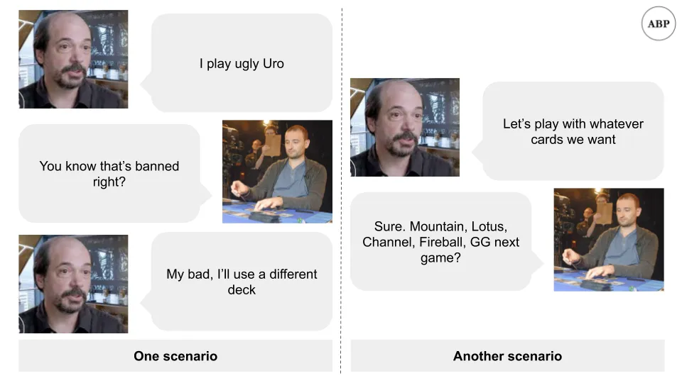
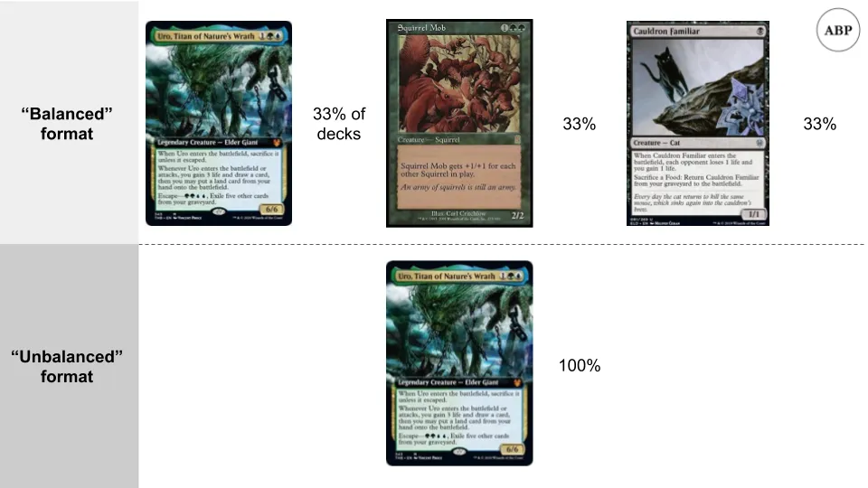
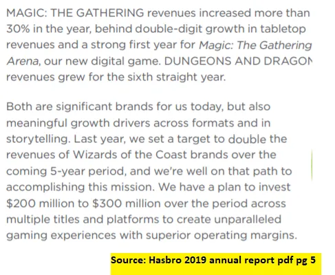

## Mensagem

Magic\: The Gathering é um negócio lucrativo de jogos de cartas que enfrentou controvérsias autoimpostas devido à monetização agressiva demais

## Cartas\, Comandante\, Rachadura de papelão

Quanto pode custar o papelão\?

Se for o cartão [Black Lotus](https://mtg.gamepedia.com/Black_Lotus 'black') Do jogo de cartas colecionáveis [Magic: The Gathering,](https://en.wikipedia.org/wiki/Magic:_The_Gathering 'MTG') Você pode conseguir comprar um por \$27\.000\.

E isso pode até ser uma pechinca considerando\, considerando uma cópia vendida por [$166,000 at auction](https://www.ebay.com/itm/1993-Magic-The-Gathering-MTG-Alpha-Black-Lotus-R-A-BGS-9-5-GEM-MINT-PWCC-/143136537077?_trksid=p2047675.m43663.l10137&nordt=true&rt=nc&orig_cvip=true 'ebay') [^1]\. São \$166 mil por um pedaço de papelão do tamanho de uma carta de baralho\.

Lá atrás\, em outra vida\, eu costumava jogar muito Magic\, o jogo de cartas colecionáveis às vezes chamado de \"Cardboard Crack\" sem ironia devido à sua natureza viciante [^2]\. Não acompanho a cena há uma década\, mas uma controvérsia atual despertou minha curiosidade\.

Junto com o recente post de Byrne Hobart sobre a importância de [games vs metagames](https://diff.substack.com/p/the-gamerarbitrageur-to-generalist? 'Diff') [^3]\, talvez eu esteja destinado a escrever sobre isso este mês\. Hoje vamos abordar\:

1. Introdução à magia e contexto para as reclamações da comunidade
2. O que é metagame e sua relevância em Magic
3. A controvérsia atual em \"Commander\"\, um metajogo popular de Magic

Vamos dar uma olhada nas cartas\, [Commander,](https://magic.wizards.com/en/content/commander-format 'Commander') e [cardboard crack.](https://cardboard-crack.com/ 'crack')

## 1\. Introdução à Magia

Para entender a controvérsia\, precisamos de mais contexto\. Magic é um jogo de cartas colecionáveis [^4]\, onde os jogadores fazem um baralho de cartas e duelam uns contra os outros\. As cartas têm efeitos\, e o objetivo é reduzir os pontos do oponente a zero [^5]\. Você se reveza tirando cartas\, jogando e ativando seus efeitos para alcançar esse objetivo [^6]\.

As cartas são lançadas no **Mercado primário** por [Wizards](https://magic.wizards.com/en 'Wizards')\, uma subsidiária de empresas de capital aberto [Hasbro](https://investor.hasbro.com/investor-relations 'Hasbro')\. Magos costumam projetar\, imprimir e vender novas cartas em um \"conjunto\"\. A maioria das cartas é vendida em lojas locais na forma de \"booster packs\"\. Esses pacotes contêm cartas aleatórias do novo conjunto\, o que significa que você não sabe o que está ganhando antes de abri\-las [^7]\.

Por exemplo\, você pode comprar um pacote esperando conseguir uma carta rara ["Uro, Titan of Nature's Wrath"](https://scryfall.com/card/thb/229/uro-titan-of-natures-wrath 'Uro') e\, em vez disso\, consegue ["Bronzehide Lion."](https://gatherer.wizards.com/Pages/Card/Details.aspx?multiverseid=476461 'Lion')

Como muitas pessoas preferem comprar um cartão sem depender da sorte\, também existe um **mercado secundário\.** Os traders compram cartas e as revendem com uma margem de lucro\. Com o tempo\, isso até evoluiu para basicamente um [stock market for the cards](https://www.mtgstocks.com/news 'MTG')\, com seu próprio clube de especuladores\. Como mencionado anteriormente\, algumas dessas cartas podem ser extremamente caras\.

Notavelmente\, a Wizards geralmente não vende cartas individuais sozinha\, para evitar parecer [predatory.](https://mtg.gamepedia.com/Predator 'predator') Eles poderiam manipular o mercado se quisessem\, já que tudo o que precisam fazer é imprimir mais papel\. Normalmente não fazem isso\, por medo de que isso possa arruinar a comunidade\. Por exemplo\, imagine as reclamações se a Wizards vendesse diretamente um bom cartão por \$500\. Lembre\-se disso\; voltaremos a isso\.

**A demanda pelas cartas vem dos jogadores que querem usá\-las** em seus decks\. Existe tanto uma cena competitiva oficial com prêmios em dinheiro\, quanto uma cena casual onde as pessoas jogam apenas por diversão\. A popularidade das cartas em competições é um dos fatores que impulsionam o uso no jogo casual\. Por exemplo\, se Uro se tornasse popular em competições e fosse conhecida como uma carta poderosa\, mais pessoas poderiam querer usá\-la em seus decks [^8]\. Como na maioria dos mercados\, isso faz com que o preço do cartão suba\.

**Outro motivo pelo qual um cartão pode aumentar de preço é a oferta** \(que [shock](https://gatherer.wizards.com/pages/card/details.aspx?name=Shock 'shock')\)\. Mencionei que a Wizards imprime cartas em um conjunto regularmente\. Os conjuntos são impressos por um tempo\, antes de ser hora de outro conjunto assumir\. Isso cria escassez para uma carta que pode estar em um conjunto e depois nunca mais aparecer\.

Por exemplo\, uma carta pode estar em Alpha definido e não em Beta definido [^9]\. A carta Black Lotus de antes é uma dessas cartas que era [printed early on but never again,](https://mtg.gamepedia.com/Reserved_List 'mtg') resultando no preço alto no mercado secundário\.

Semelhante a como o esporte \"corrida\" tem diferentes \"eventos\"\, como os 100m\, 200m ou 400m\, **o jogo de Magia também tem [different formats](https://mtg.gamepedia.com/DCI#Tournament_formats 'format')** decidido pelos Wizards\. Não precisamos saber os detalhes\, só que uma grande diferença são os tipos de cartas que você pode usar\. Isso geralmente depende de quando foram lançadas recentemente e se estão \"banidas\" ou não\.

Por exemplo\, você pode jogar com os 8 conjuntos mais recentes e um baralho de 60 cartas em um formato\, e qualquer carta possível em um baralho de 100 em outro\. Como isso afeta o quão bem combinados são os jogos\, as pessoas jogam baralhos do mesmo formato umas contra as outras\. É considerado ruim jogar o baralho de um formato diferente sem avisar o oponente\, e torneios oficiais indicam o formato esperado\. Isso determina o **Metajogo** Para esse formato\, um conceito que exploraremos em breve\.

A cena casual também se desenvolveu **formatos \"favoritos dos fãs\"\, sendo o mais popular o \"Commander\"\.** De novo\, os detalhes de Commander não importam\, pense nele como um conjunto de regras \"meta\" que as pessoas escolhem seguir ao montar seus decks e jogar umas contra as outras [^10]\. Assim como seu pai pode ter estabelecido regras caseiras no Monopoly dizendo que o jogador mais velho pode usar o dinheiro do banco\, a comunidade de jogadores decidiu regras a seguir para um formato\.

As regras dos comandantes são regidas por uma comunidade ["rules committee,"](https://mtgcommander.net/index.php/faq/ 'RC') que supostamente é independente de Wizards\. O comitê leva em conta o feedback dos jogadores ao decidir quais cartas permitir em Commander\, para cada novo conjunto impresso\. Geralmente são as cartas mais novas que causam problemas\, já que as cartas mais antigas por definição existem há mais tempo para as pessoas jogarem\, e qualquer interação que quebrasse o jogo deveria ter sido descoberta\.

O comitê não aplica as regras\, já que isso seria impossível para jogos casuais\, mas serve como uma diretriz padrão que os jogadores seguem\. Por exemplo\, pode dizer que \"Uro\" é banido\. Se você jogasse uma partida de Commander contra um estranho aleatório e usasse Uro\, ela provavelmente não gostaria de continuar\. No entanto\, você também poderia simplesmente concordar em jogar com as cartas que quiser\, incluindo Uro\.

Agora sabemos o que é Magic – um jogo de cartas colecionáveis onde novas cartas são impressas regularmente\, os preços das cartas são definidos pelo mercado e diferentes restrições de formato resultam em metajogos diferentes\. Vamos expandir esse último conceito\.

## 2\. Mágica do Metajogo

Imagine que você é Wizards e está criando uma carta\. Tem um [balance](https://gatherer.wizards.com/Pages/Card/Details.aspx?multiverseid=413544 'balance') que você tem que atacar se quiser que a carta seja jogada e desejável\. Se você deixar os efeitos muito fracos\, ninguém vai querer\. Se você deixar forte demais\, todo mundo vai usá\-la\.

Para um exemplo extremo\, imagine se você fizesse uma carta que dissesse \"Se você comprar esta carta\, você vence o jogo\.\" Todo mundo jogaria\, mas os jogos não seriam mais divertidos\.

Por isso\, você precisa criar cartas novas que sejam legais\, mas não tão legais a ponto de \"quebrarem\" o formato em que são jogadas\. Se você começar a notar cartas que aparecem em todos os decks\, isso é um sinal de que você pode ter ido longe demais [^11]\.

Os decks e cartas ideais formam o \"metagame\" dos formatos Magic\. Se você joga competitivamente\, quer as cartas que oferecem as melhores chances de ganhar\. Os jogadores descobrem isso por meio de teoria e experimentação\. Você não pode apenas saber quais cartas são boas\, mas quais são boas **Para o formato em que você está jogando [^12]\.**

Em um meta equilibrado\, haverá alguns decks que são \"melhores\" que os outros\, mas nenhum dominante individualmente\. Por exemplo\, seu deck esquilo pode vencer meu deck de goblins\, mas acabar sendo derrotado por um deck de fada em média\.

Em um meta desequilibrado\, haverá apenas um deck que é \"melhor\" que todos os outros\. Por exemplo\, seu deck elemental pode ter chances favoráveis contra qualquer outro deck\. Quando isso acontece\, é racional para [everyone to start playing that deck if they want to win.](https://magic.gg/news/2020-season-grand-finals-metagame-breakdown 'mtg') Como você pode imaginar\, **Isso fica chato rápido\.**

Quando isso acontece\, uma solução é banir as cartas que são \"excessivamente poderosas\"\. Como mencionado anteriormente\, para os formatos oficiais\, os Magos indicam quais cartas não podem mais ser usadas\. Para o formato não oficial \"Commander\"\, o comitê de regras da comunidade escolhe as cartas\. **Bans são uma forma de equilibrar\.**

É aqui que começa a controvérsia atual\.

## 3\. Amizade é mágica

Na maioria das vezes\, as novas cartas impressas fazem parte de um multiverso maior de Magic\, sendo a propriedade intelectual de Magic e originalmente criada para Magic\. Magic é principalmente baseada em fantasia\, levando a cartas como anjos e dragões\:

Mais recentemente [^13]\, a Wizards tem feito mais parcerias externas\. Isso geralmente envolve criar uma carta personalizada baseada em outras IP\. Por exemplo\, [a My Little Pony series](https://magic.wizards.com/en/articles/archive/news/magic-extra-life-2019-10-03 'pony') Para arrecadar dinheiro para caridade\:

Ou um [Godzilla themed series as alternate art for some cards:](https://articles.starcitygames.com/news/all-19-godzilla-series-monster-cards-revealed/ 'zilla')

Agora\, coloque\-se no lugar do Comitê de Regras do Comandante\. Quando esses cartões forem lançados\, você deve permitir que estejam nesse formato\?

Além dos argumentos estéticos [^14]\, a razão pela qual você não pode dizer sim facilmente é que essas cartas especiais frequentemente têm **efeitos especiais que podem desequilibrar o jogo\.** Por exemplo\, que [Princess Twilight Sparkle](https://shop.tcgplayer.com/magic/ponies-the-galloping/princess-twilight-sparkle 'pony') A habilidade faria com que ela fosse [one powerful pony.](https://www.reddit.com/r/CompetitiveEDH/comments/dczkyh/twilight_sparkles_metarending_magic/ 'pony')

Historicamente\, Wizards evitou ambiguidades fazendo algumas coisas\:

1. Tornando cartas especiais \"divertidas\" com borda prateada\. Ao emitir uma regra geral de que cartas prateadas com borda eram banidas para jogos \"normais\"\, os Magos podiam imprimir o que quisessem sem afetar o metajogo
2. Fazer as cartas especiais terem o mesmo efeito que cartas com borda preta e \"legais\"\, só que com arte alternativa\. Como essas cartas são impressas como parte dos conjuntos normais e balanceadas para o jogo\, isso não deve ter um efeito significativo no metajogo

**Aqui está a controvérsia\.** A Wizards acabou de lançar um [limited edition set of new cards in partnership with TV show The Walking Dead.](https://secretlair.wizards.com/us/product/612738/secret-lair-x-the-walking-dead 'dead') Essas cartas únicas só ficam disponíveis por um tempo antes da Wizards parar de imprimi\-las\. Importante\, elas têm borda preta \(\"legal\"\)\, mas não estão disponíveis em nenhum outro lugar além da compra deste box set\. Como era de se esperar\, o box set tem preço premium\.

**Esses cartões deveriam ser legais\?** O site oficial da Wizards diz\:

> NOTA\: Essas são cartas novas\, não reimpressões nem parte de um conjunto principal\. Portanto\, não são legais no Standard\, mas são perfeitas para o Commander\!

Para esclarecer o que foi dito acima\, a Wizards está explicitamente denunciando o formato casual \"Commander\"\, projetando cartas especificamente para ele e vendendo as cartas diretamente por um preço premium em uma tiragem limitada\.

Você pode entender por que isso aconteceu [made many players upset, ](https://twitter.com/wizards_magic/status/1312987380115148805?s=20 'twitter') [calling for the cards to be banned immediately.](https://www.reddit.com/r/magicTCG/comments/j1glk8/petition_for_the_commander_rules_committee_to_ban/ 'ban')

Espera\, você diz\, eu pensei que o _Comitê de Regras_ decidiram quais cartas eram permitidas ou não\? De fato\, alguns jogadores mantinham a esperança de que o Comitê agisse de forma independente e declarasse as cartas criminosas em Commander\.

[Unfortunately not.](https://mtgcommander.net/index.php/2020/10/02/rc-statement-on-secret-lair-the-walking-dead/ 'dead')

Você provavelmente tem alguma pista dos incentivos conflitantes aqui\. Vamos dar uma olhada mais de perto no [main complaints first](https://twitter.com/ghirapurigears/status/1313145100319494145?s=20 'twitter') [^15]\:

**1\. Disponibilidade de cartões\.** As cartas nunca serão reimpressas por questões de licenciamento\, ao contrário de outras cartas que poderiam ser reimpressas em coleções futuras\. Isso limita artificialmente a oferta e as pessoas que podem conseguir as cartas\.

**2\. Vendas claramente predatórias\.** As cartas não são \"legais\" nos formatos oficiais\, apenas no formato casual Commander\. Se quiser usar as cartas\, terá que comprá\-las por um preço premium\, devido à oferta limitada\.

**3\. Preocupação de que isso seja o início de uma tendência\.** As pessoas aceitam pacotes de booster\, já que percebem que a Wizards precisa ganhar dinheiro\. No entanto\, e se a Wizards começasse a vender cartas diretamente por preços altos\? Se vendessem uma carta \"poderosa\" por \$500 e nunca a baníssem\, os jogadores teriam que comprar a carta para se manterem competitivos\. O metagame seria arruinado\.

E agora vamos analisar a justificativa de Wizard\:

Ah\, espera\, imagem errada\:

Sim\, não consegui nada\, é uma forma bem clara de ganhar dinheiro\. Quando você considera o objetivo da Hasbro \(empresa\-mãe da Wizards\) de [doubling Wizards revenue over the next five years,](https://investor.hasbro.com/static-files/88b2a83b-2368-463a-9489-6cf31dc209ac 'wizards') Não é à toa que a equipe da Wizards esteja incentivada a explorar maneiras de vender mais cartas a um preço mais alto [^16]\. Maior volume\, preços mais altos\, múltiplo de avaliação maior\. Se as pessoas estão dispostas a pagar \$100 pelo preço de mercado por uma carta\, por que não simplesmente imprimir as cartas e vendê\-las diretamente em vez de usar boosters packs\?

Magos poderiam 1\) ter feito as cartas com borda prateada e \"ilegais\"\, ou até 2\) feito versões artísticas alternativas de outras cartas \"legais\"\. Eles não fizeram 1\) porque cartas com borda prateada vendem menos que cartas com borda preta\, e não fizeram 2\) por algum motivo mágico que não entendo\, mas provavelmente dinheiro

Para piorar\, as cartas têm como alvo o formato Commander\, porque ele se tornou um dos\, se não o [most popular format.](https://www.dicebreaker.com/categories/trading-card-game/how-to/magic-the-gathering-popular-formats 'mtg') Um grande fator que contribuiu para a popularidade de Commander\? Wizards quebrou o metajogo para formatos \"oficiais\"\, imprimindo cartas muito desequilibradas\, tornando os jogos entediantes\.

Não invejo a posição do comitê de regras aqui\. Eles poderiam ter banido as cartas\, mas isso seria um jogo descarado [betrayal](https://gatherer.wizards.com/pages/card/Details.aspx?multiverseid=3633 'betrayal') de Wizards\. No pior cenário\, Wizards poderia ter anulado o Comando e retomado o controle de Commander\, tornando\-o um formato \"oficial\" em vez de fã [^17]\.

Os jogadores não aceitaram isso passivamente\, [complaining vocally on public threads,](https://www.reddit.com/r/magicTCG/comments/j204ww/has_anyone_completely_lost_confidence_in_wotc_and/g73xmqe/?context=1 'complain') [listing demands to be met before they return to the game](https://www.reddit.com/r/magicTCG/comments/j67brt/for_those_who_are_choosing_to_no_longer_spend/ 'game')\, e até [creating a new format, "Captain."](https://twitter.com/PlayCaptainMTG/status/1313164508068810752?s=20 'captain') Resta saber se algum desses fatores realmente terá impacto na impressora de dinheiro que é a Magic [^18]\.

Acontece que [selling paper is hard work.](https://www.youtube.com/watch?v=1QQBB3cwNM0 'prices') A controvérsia destaca algumas coisas que se aplicam de forma mais geral\:

1. Os usuários vão entender se você monetizar\, mas ficar chateados se for agressivo demais\. Pense [a rake too far](http://abovethecrowd.com/2013/04/18/a-rake-too-far-optimal-platformpricing-strategy/ 'rake')
2. A resposta a um erro pode ser mais importante do que tentar evitá\-lo\. Pense em desculpas reais versus apenas palavras vazias
3. Grupos comunitários ligados a uma organização oficial serão obrigados a deferir à organização\. Pense em responsabilidade versus autoridade e em quem realmente tem o quê

Talvez a verdadeira magia seja todos os amigos que fizemos pelo caminho\.

## Outros recursos para aprender mais

1. Kendra Smith escreveu um ótimo artigo com mais história do MTG sobre por que isso é controverso [here](https://www.coolstuffinc.com/a/kendrasmith-09302020-the-problem-with-the-walking-dead-secret-lair 'kendra')
2. \@ghirapurigears tuitou um tópico com mais detalhes sobre as reclamações [here](https://twitter.com/ghirapurigears/status/1313145100319494145?s=20 'twitter')
3. O youtuber Mitch dá uma boa resposta a outros argumentos que a Wizards fez [here](https://www.youtube.com/watch?v=degV1Masii8 'commander')

[^1]: Estou simplificando para o texto principal\, mas o estado das cartas é uma possível razão para essa disparidade de preço\. Cartas de coleção são avaliadas pelo estado e pelo quão \"usadas\" são por serviços como [Beckett Grading Services](https://www.cardboardconnection.com/collectopedia/card-grading-companies/beckett-grading-services-bgs#:~:text=Fees%20for%20BGS%20and%20BVG,card%20for%20especially%20large%20batches. 'beckett')\. O Lotus de \$166 mil estava em condição quase perfeita e de uma tiragem inicial\.

[^2]: Existe até um webcomic com o nome dessa frase [here](https://cardboard-crack.com/ 'crack')\. Além disso\, só para deixar claro\, nunca fui muito bom em Magic\. Achei o Draft Limitado mais divertido depois de alguns anos\, já que mesmo assim decks Construídos eram caros para mim\.

[^3]: \"O jogo é limitado\, e o metajogo não é\, mas se você não é bom no jogo principal\, o conhecimento sobre o meta é basicamente inútil\.\"

[^4]: Na verdade\, é o _Primeiro_ Jogo de cartas colecionáveis\, criando o formato\. O original\, pode\-se dizer\.

[^5]: Obviamente\, essa é uma explicação simplificada\, e você pode ler mais sobre as regras [here](https://magic.wizards.com/en/game-info/gameplay/rules-and-formats/rules 'rules')\. Existem diferentes tipos de cartas\, algumas temporárias e outras permanentes\. Nem todas afetam diretamente os pontos do oponente \(total de vida\)\. Já em 2005 havia pelo menos [28 ways to win a game of Magic](https://magic.wizards.com/en/articles/archive/arcana/let-me-count-ways-2005-08-15 'MTG')

[^6]: A menos que você esteja jogando contra um deck de ovos\, caso em que você só assiste enquanto seu oponente faz tudo por horas e pode muito bem [walk away while they're playing](https://www.reddit.com/r/spikes/comments/1ai0my/modern_lets_talk_about_eggs/ 'eggs')

[^7]: Wizards também vende muitos decks prontos\, mas deixei isso de fora no texto principal para simplificar\. Além disso\, posso estar enganado\, e não acho que comprar decks só para conseguir uma carta tenha sido algo comum desde o desastre do deck Jitte \/ Rats\, embora a promoção do Nexus of Fate também tenha sido problemática\. Mas não acompanho Magic há séculos\.

[^8]: Um exemplo real nesse caso\. Uro desde então [been banned](https://gamerant.com/magic-the-gathering-uro-ban/ 'ban') por ser poderoso demais\. Banido de quê exatamente\? Faz sentido banir uma carta das competições\, mas como você pode impedir alguém de jogar em formatos casuais\? Essa é uma pergunta relacionada à controvérsia\, então continue lendo\.

[^9]: Alpha e Beta são conjuntos reais em Magic\, mas desta vez é um exemplo falso\. Acho que quaisquer cartas em Alpha também foram impressas em Beta\, e [some new cards were actually added in Beta](https://mtg.gamepedia.com/Beta 'beta')

[^10]: Algumas das mudanças incluem jogar contra mais de um jogador\, ter mais cartas no seu deck\, ter cartas restritas a um certo tipo e ter uma carta especial \- seu \"Comandante\"\. Commander também era conhecido como Elder Dragon Highlander\, devido à sua origem em pessoas jogando com certas cartas dragão como seus comandantes\.

[^11]: A Wizards afirmou publicamente que segue um [FIRE philosophy](https://magic.wizards.com/en/articles/archive/card-preview/fire-it-2019-06-21 'mtg') \- Eles querem que Magic seja divertido\, convidativo\, rejogável\, empolgante\.

[^12]: Se você se lembra\, isso é parecido com o [relative vs absolute skill](/writing/relative_billionaire 'relative') Ponto sobre o qual escrevi há um tempo\. Não importa se seu deck é bom no absoluto\, mas como ele se compara aos decks típicos que você provavelmente enfrentará em competição\, o \"meta\"

[^13]: Na verdade\, essa não é a primeira vez que a Wizards faz propriedades intelectuais externas\, tendo criado conjuntos como As Mil e Uma Noites ou Três Reinos que são baseados exatamente no nome deles\. Estou deixando isso de fora no texto principal para simplificar\.

[^14]: Considerando isso [alters](https://magicalter.com/ 'alter') são uma coisa e [harmless offering](http://www.mtgmintcard.com/articles/writers/freyalise/holistic-wisdom-10-cutest-cards-ever 'harm') é uma carta legal\, não acho que a reclamação de que diferentes IPs vão arruinar o jogo seja tão forte quanto os argumentos que vou detalhar depois\. Mas isso importa para um grupo vocal de jogadores\.

[^15]: Houve muitas reclamações\, e quero focar nas que pareceram argumentos mais fortes e sobre as quais mais pessoas expressaram sua opinião\.

[^16]: Satisfações do tópico no reddit [here](https://www.reddit.com/r/magicTCG/comments/j6rwjc/hasbro_goal_double_wotc_revenue_will_this_destroy/ 'reddit')

[^17]: Como mencionado antes\, nada impede os jogadores de simplesmente ignorar o comitê de regras e banir as cartas entre amigos\. A comoção se deve em parte ao fato de os jogadores perceberem que o comitê de regras está agindo contra os interesses dos jogadores e também ignorarem as questões principais ao desviá\-las no anúncio\. Todo mundo sabe que isso é uma forma direcionada de ganhar dinheiro

[^18]: Para deixar claro\, não estou recomendando que as pessoas curtam o Hasbro\, ou algo do tipo\. Não tenho expertise suficiente para prever aqui\, e diria que provavelmente há 80\% de chance de a Magic sobreviver a isso e continuar crescendo\, expandindo para múltiplas IPs populares\. Muita gente rica disposta a pagar por papel\.
