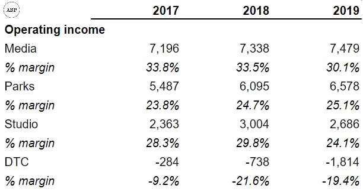
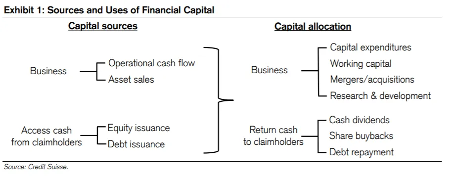
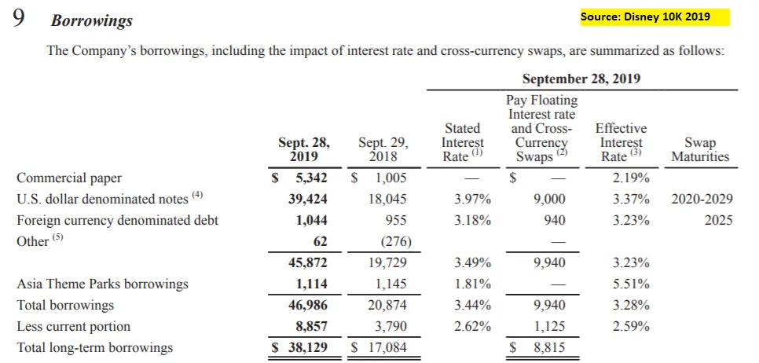

## Mensagem

Third Point argumenta que a Disney deveria parar de pagar seus dividendos e investir em streaming\; Semper Augustus discorda\.

## Ativismo na Disneyland

O fundo de investimentos ativistas Third Point publicou recentemente um [letter to Disney,](https://www.valuewalk.com/2020/10/third-point-walt-disney-company/ 'disney') sugerindo que a empresa mude sua estratégia de negócios [^1]\. Isso levou a [a rebuttal by another investment firm](https://valueinvestingworld.substack.com/p/chris-bloomstrans-letter-to-the-walt 'Semper')\, Semper Augustus \(obrigado a Joe Koster\)\. É menos comum que empresas de investimento apresentem contra\-argumentos contra um ativista\, então vamos analisar ambos os lados [^2]\.

Para contextualizar\, vamos repassar brevemente o ativismo e os negócios da Disney\, para quem não conhece nenhum dos dois\.

### Visão geral sobre ativismo

Fundos ativistas como o Third Point [usually take a small stake in a company, before publicly agitating for company management to take actions which the activists believe will increase company value](https://en.wikipedia.org/wiki/Activist_shareholder 'activism')\. Essas ações podem incluir o pagamento de um dividendo\, a venda de unidades de negócio ruins ou a substituição da gestão da empresa\. O valor da empresa aqui normalmente é definido como um aumento no preço das ações\. O ativismo ganhou popularidade na última década\; quando eu trabalhava no banco\, até trabalhei defendendo uma empresa contra uma luta por procuração ativista \(o que deu muito mal\, mas isso é outra história\)\.

Fundos e investidores famosos incluem Carl Icahn\, Pershing Square\, de Bill Ackman\, e Greenlight Capital\, de David Einhorn\. Como ativistas querem ser ouvidos\, geralmente têm maior destaque do que outros fundos hedge\. Isso os ajuda quando recebem destaque e são incentivados a buscar publicidade\.

O sucesso para um investidor ativista é assim\: comprar ações de uma empresa\, dizer à empresa o que fazer\, a empresa faz\, o preço das ações sobe\, todos estão felizes\, o ativista vende ações e ganha lucro\. A maioria dos ativistas é detentora de curto prazo\, embora existam exceções\.

O fracasso pode ser qualquer parte dessa etapa falhando\. Por exemplo\, uma empresa pode não te ouvir\. E mesmo que te escute\, talvez o preço da ação não muda\.

Agora que temos uma compreensão aproximada do ativismo\, vamos olhar para a Disney\.

### Visão geral da Disney

Nunca cobri a Disney quando estava investindo long\/short\; um colega fez\. Portanto\, vamos dar uma olhada em [the financials](https://thewaltdisneycompany.com/app/uploads/2020/01/2019-Annual-Report.pdf 'ar') E aprender juntos como o negócio é administrado\. Vou olhar o relatório anual de 2019 para simplificar\, então todo o impacto da covid ainda não está incluído\. Voltaremos a isso\.

A Disney reporta quatro segmentos principais\: Redes de Mídia\, Parques\, Entretenimento de Estúdio e Atendimento Direto ao Consumidor \(DTC\)

Minhas primeiras impressões sobre o que foi dito acima são\:

- A receita da Media Networks está crescendo em dois dígitos\, mas o crescimento da receita operacional é de apenas 2\%\, sugerindo desalavancagem
- A Parks\, por outro lado\, está crescendo 6\% no rev\, mas está obtendo alavancagem operacional para aumentar a receita operacional em 11\%\.
- O estúdio aumentou o volume de rotações\, mas diminuiu a receita operacional\; isso é inesperado
- A DTC cresceu \>100\% com a rotação\, e sua perda operacional também cresceu \>100\% [^3]\. É incomum ver uma empresa grande crescer tão rápido\, talvez estejam indo muito bem\? A Disney\+ foi tão bem\-sucedida\?

Se olharmos para as margens operacionais desses segmentos\, elas são bem semelhantes\, entre 20 e 30\%\. Isso me surpreendeu\, eu teria pensado que haveria um segmento de alta margem \"subsidiando\" um de baixa margem\, por exemplo\, minha primeira hipótese seria que os parques têm baixa margem\.

Se os perfis de margem forem realmente semelhantes\, a administração deve ser indiferente a investir em qualquer um deles\; talvez preferindo Mídia devido à margem um pouco maior [^4]\.

A Disney dedica 17 páginas em seu relatório anual para descrever seus negócios [^5]\, então vou resumir para evitar que todos vocês pulem antes mesmo de começarmos\.

- A mídia inclui redes nacionais a cabo e emissoras de TV como Disney e ESPN [^6]\. A receita vem das taxas de afiliados que as pessoas pagam por seu conteúdo \(programação\) e publicidade em suas próprias redes
- Parques incluem parques temáticos como a Disneyland e licenciamento de sua propriedade intelectual para produtos de consumo\. Rev vem da venda de ingressos e dos royalties de licenciamento\. Há uma menção interessante a como \>75\% dos gastos de capital da Disney foram com o negócio dos parques\, o que vou lembrar
- O estúdio inclui filmes como Fox\, Marvel\, Lucasfilm\. Rev vem das taxas de licença dos filmes para os cinemas
- A DTC inclui serviços de streaming Disney\+\, e também coloca TV internacional aqui\. Rev vem das taxas de publicidade da TV internacional e das taxas de assinatura para streaming

Lendo esta seção também responde a algumas perguntas que eu tinha\:

Havia um **Aquisição em 2019\,** o que resultou em \"rev extra\" tanto para o segmento de Mídia quanto para o DTC\. Isso explica por que o crescimento do DTC foi tão alto\, e também a aceleração na Rev de Mídia\. Agora eu me lembro disso [Disney bought 21st Century Fox.](https://www.vox.com/culture/2019/3/20/18273477/disney-fox-merger-deal-details-marvel-x-men 'Fox')

Se fosse eu no banco\, teria passado horas tentando fazer análises financeiras pro forma para ajustar isso e conseguir um crescimento \"normalizado\"\, vendo os dois negócios separadamente\.

Não trabalho mais com bancos e ~~não me importo~~ Vou deixar como um exercício para o leitor\, então vamos seguir em frente\. Mas isso também implica que a taxa de crescimento da mídia é menor do que eu imaginava\. Não me surpreenderia se fosse mais parecida com a taxa de crescimento de 2018 de \~3\%\.

Também achei inicialmente que o DTC estava mostrando sucesso no Disney\+\, mas não é o caso\. Também percebi que o Disney\+ foi lançado em novembro\, então não está contribuindo para a receita\, já que o ano fiscal da Disney termina em setembro\.

**Os parques também têm margens maiores do que eu imaginava** Porque eles agrupam a rev de licenciamento de IP nesse segmento\. Presumo que isso seja para evitar mostrar um segmento de baixa margem\, o que é um comportamento típico para muitas empresas\, mas não tenho contexto aqui\.

Então\, meus pensamentos revisados são\:

- A mídia \(toda a TV rev\) é grande\, mas cresce lentamente
- Parks é grande\, mas cresce lentamente e exige muito investimento de capital
- O estúdio é menor\, mas crescendo rápido\, devido à popularidade dos filmes da Marvel\, imagino
- O DTC é menor e não consigo identificar a taxa de crescimento\, mas também imagino que seja rápido\, já que o Disney\+ é novo

Uma grande complicação é o impacto da Covid no negócio\. [For the first nine months of its fiscal year:](https://thewaltdisneycompany.com/the-walt-disney-company-reports-third-quarter-and-nine-months-earnings-for-fiscal-2020/ 'dis')

- A mídia caiu um pouco trimestre a trimestre \(qoq\)\, mas subiu no acumulado do ano \(acumulado no ano\)
- Os parques morreram\, com queda de 85\% no QQ e 29\% no ano acumulado
- O Studio também morreu\, com queda de 55\% no qoq e surpreendentemente 3\% de subida no ano acumulado
- Os números do DTC não são comparáveis por causa da aquisição\, mas imagino que a taxa de crescimento ainda seja rápida

Coloquei as finanças da Disney em um modelo simples [here](https://docs.google.com/spreadsheets/d/1h6yW8z2AcCCm-vn6bEkk0g5_nN-bzLge1lkok94PFaI/edit?usp=sharing 'goog') Caso algum de vocês queira brincar com os números\. Note que as suposições são apenas números falsos e não diligências\.

Agora vamos dar uma olhada no que os investidores estão dizendo\.

### Os argumentos de Third Point e os contra\-argumentos de Semper Augustus

Meu plano original era apresentar os argumentos e contra\-argumentos para ambos os investidores\. Acontece que\, na verdade\, só há um ponto principal [^8]\, então vamos direto ao ponto\, pulando os discursos iniciais habituais dos dois escritórios sobre como o escritório deles e a Disney são incríveis\.

[Third Point:](https://www.valuewalk.com/2020/10/third-point-walt-disney-company/ 'third')

> acreditamos que a empresa deve suspender permanentemente seu dividendo anual de US\$ 3 bilhões e redirecionar esse capital inteiramente para a produção de conteúdo e aquisição dos negócios DTC da The Walt Disney Company\, centrados na Disney\+\.

Pesquisei no Google e percebi [Disney suspended their dividend](https://www.barrons.com/articles/disney-suspends-first-half-dividend-amid-covid-19-disruption-51588715645 'divd') devido à Covid\. A sugestão da Third Point é interessante\, já que eles dizem que querem que a Disney dê menos dinheiro aos acionistas \(como eles mesmos\) e reinvista no segmento DTC em rápido crescimento que vimos antes\. **Normalmente\, você veria ativistas argumentando o contrário\.**

O terceiro ponto detalha\:

> Esses dólares incrementais\, com base em nossa análise\, gerariam retornos múltiplos do rendimento atual de dividendos da ação\, ao atrair assinantes de alto valor vitalício \(\"LTV\"\) para sua plataforma DTC\.

Eles argumentam que o valor total de um assinante de streaming é alto\, e por isso a Disney deveria investir mais em conteúdo para **Consiga mais assinantes** ou seja\, um dólar devolvido a um investidor como dividendo vale menos do que se a Disney usasse esse dólar para criar conteúdo e conseguir mais assinantes

> Além de atrair mais assinantes para a plataforma\, a maior velocidade da produção dedicada de conteúdo trará vários benefícios adicionais espalhados pela sua base atual\, incluindo engajamento elevado\, menor rotatividade e maior poder de precificação\. Para colocar isso em perspectiva\, melhorar a rotatividade do Disney\+ para os níveis de rotatividade doméstica de \~2\%\, líderes da indústria da Netflix\, mais que dobraria o LTV bruto dos assinantes\.

Tática comum de comparar uma empresa com um exemplo \"de primeira linha\"\, dizendo que se a empresa conseguir desempenhar o mesmo desempenho do exemplo\, [dreams come true](https://disneyparks.disney.go.com/in/#:~:text=Disney%20Parks%20%7C%20Where%20Dreams%20Come%20True 'dis')\. Neste caso\, eles dizem que mais inscritos vão continuar assinados\, assistir a mais programas e a Disney poderá cobrar mais deles\.

> Igualmente importante\, acelerar significativamente o investimento com conteúdo DTC ampliará ainda mais a divisão entre a The Walt Disney Company e seus pares tradicionais da mídia – WarnerMedia\, Discovery\, ViacomCBS\, NBCUniversal da Comcast e Fox – nenhum dos quais tem capacidade financeira para executar um plano tão ousado

Não tenho contexto suficiente aqui\, já que não sei quanto esses colegas estão gastando\. Me surpreende que nenhum deles tenha dinheiro suficiente para gastar em programação\.

> Observamos inúmeros precedentes de transições bem\-sucedidas de modelos de negócios não lineares que deram bons resultados para os acionistas\. Entre essas transformações de negócios\, Adobe e Microsoft se destacam como exemplos particularmente relevantes \\\[\.\.\.\\\] Além disso\, as ações foram recompensadas com múltiplos significativamente mais altos\, refletindo a qualidade superior de suas novas fontes recorrentes de receita por assinaturas

E incluem um gráfico mostrando o aumento múltiplo\. Múltiplo é uma forma de avaliar uma empresa\, mostrando quanto as pessoas estão dispostas a pagar pela sua ação\. Quanto mais alto\, geralmente melhor\. [^9]\.

> Por fim\, acreditamos que a Disney deve manter o foco na transição para uma fonte de receita DTC baseada em assinaturas e evitar a tentação de maximizar lucros de curto prazo por meio de estratégias transacionais de precificação VOD\.

Também é interessante que eles não estejam pedindo para a Disney monetizar agressivamente \(fazendo os consumidores pagarem por cada filme [^10]\)\, e em vez disso\, faça a assinatura o mais custo\-benefício possível\.

Meu primeiro pensamento é **Esse é um pedido ativista incomum e interessante\.** Em vez de querer retorno de curto prazo pedindo mais dividendos\, a Third Point está pedindo o oposto\. Eles nem querem que a empresa pressione a monetização e parecem preferir esperar por uma mudança de modelo de negócio de longo prazo\.

[Now what does Semper have to say:](https://valueinvestingworld.substack.com/p/chris-bloomstrans-letter-to-the-walt 'semper')

> No entanto\, contesto a recomendação de \"suspender permanentemente o dividendo anual de 3 bilhões de dólares da Disney e redirecionar o capital inteiramente para a produção de conteúdo e aquisição dos negócios DTC da Disney\, centrados no Disney\+\.\" Esta carta\, no entanto\, não sugerirá que você reintroduza o dividendo na taxa anterior\, mas sim que use esse tempo como uma oportunidade para avaliar todas as setas de alocação de capital disponíveis em seu aljava\.

Então eles estão dizendo para não aceitar a sugestão do Third Point imediatamente\, **mas para considerar todas as alternativas\.** Quais seriam esses\?

> Aposentando parte da agora pesada dívida adquirida para financiar a aquisição da Twenty First Century Fox

> Faça qualquer aquisição adicional

> Recompra de ações ordinárias no mercado aberto

> Aumentar os gastos com conteúdo\, capital\, pesquisa e desenvolvimento ou publicidade nos parques ou nos estúdios e negócios de mídia\.

Essas são opções bastante comuns de alocação de capital\. Na verdade\, as três primeiras são coisas que eu normalmente esperaria que um ativista pedisse\, e antes de ler a carta do Third Point\, eu já imaginava que eles diriam algo assim\. Aqui está uma imagem rápida para refrescar sua memória sobre alocação de capital\, de Michael Mauboussin\:

Voltando ao Semper\:

> Parece que a indústria do entretenimento está em uma corrida armamentista nuclear com a compreensão de que quem produz mais conteúdo vence\. Isso não me parece o jeito da Disney\.

Semper prefere que a Disney foque na qualidade do que na quantidade\.

> Sim\, se a contagem de assinantes crescer mais rápido do que as expectativas no curto prazo\, o preço das ações provavelmente será recompensado no curto prazo\. Em um aumento suficiente da ação\, apostaríamos no Third Point e esse tipo de especulador de curto prazo\, definindo sucesso como uma expansão do múltiplo preço\-lucro\, estarão fora de cima\.

Essa é uma crítica comum aos ativistas – que eles são apenas portadores de curto prazo\. Geralmente concordo que ativistas\, em média\, são de curto prazo\, embora eu tenha visto evidências contrárias [^11]\.

### Estou inclinado para o Third Point aqui

Com a enorme ressalva de que eu não cubro a Disney e nunca abordei\, estou inclinado para o Terceiro Ponto aqui\. O que é surpreendente\, já que normalmente acho a maioria dos argumentos ativistas fraca\. Alguns motivos\:

- Não sou muito fã de dividendos\; veja [here](/writing/dividend 'divd') por quê
- Conteúdo em streaming provavelmente será uma tendência de alto crescimento nos próximos X anos \(5\? 10\? 20\?\)\, então gastar mais aqui provavelmente será um retorno alto
- Concordo que não está claro quanto é esse retorno\, e que a matemática dos assinantes da Third Point é totalmente inventada\, mas eu imaginaria que será um retorno maior do que o pagamento do dividendo
- Cobrar mais por filmes em regime de pay per view também me parece bobo quando você está tentando construir um negócio de streaming\. Lembra do que acabei de escrever [Magic and overcharging](/writing/mtg 'Magic')
- O argumento do Semper se resume a\: Espera\, vamos ver tudo o que podemos fazer aqui\. O que é\, bem\.\.\. verdade\? Quer dizer\, não dá para discordar\, só que não é realmente forte\. Tenho certeza que a Disney analisaria todas as opções antes de decidir reinvestir o dividendo\, então não é um argumento impactante para mim
- Não sei a estrutura completa da dívida da Disney\, mas os 10 mil mostram que as taxas atuais não são realmente ruins \(veja a imagem abaixo\)\. Não tenho certeza se pagar a dívida de forma agressiva faz muito sentido
- Especialmente no nosso atual cenário de baixa taxa\, se a Disney precisasse de dinheiro para financiar uma aquisição ou recompra de ações\, eu imaginaria que seja fácil para eles pegar empréstimos baratos

Novamente\, ressalvo que isso não é um conselho de investimento e que eu conheço menos o setor\, mas essa é minha opinião atual\. Como mencionado\, você pode fazer uma cópia do modelo financeiro que elaborei [here](https://docs.google.com/spreadsheets/d/1h6yW8z2AcCCm-vn6bEkk0g5_nN-bzLge1lkok94PFaI/edit#gid=0 'goog') brincar com os números\. As suposições que coloquei ali são números falsos\, então por favor\, não se aprofunde neles [^12]\.

Fique à vontade para responder e me contar o que acha\!

[^1]: Eu coloquei um link para um site de terceiros para o texto da carta\, e você também pode encontrá\-lo [here](https://thirdpointlimited.com/portfolio-updates 'third') no site oficial da Third Point\, se tiver interesse\. Esse link não parece ser permanente para a carta\, por isso o link de terceiros\.

[^2]: Mas não é inédito\. Bill Ackman vs Carl Icahn no Herbalife é um exemplo famoso\.

[^3]: O 100\% na tabela representa crescimento de \>100\%\, semelhante ao \>\(100\)\% que representa uma queda superior a 100\%

[^4]: Essa é uma visão simplista\, já que pode haver outros custos não considerados na renda operacional reportada aqui\. O tratamento fiscal para as empresas ou a despesa com juros pode ser diferente\, só para dar exemplos\.

[^5]: É a primeira parte do seu [annual report](https://thewaltdisneycompany.com/app/uploads/2020/01/2019-Annual-Report.pdf 'ar')\, se você quiser dar uma olhada mais de perto

[^6]: Acho que as pessoas sabem que a ESPN é a maior fonte de dinheiro para a Disney por alguns outros números divulgados publicamente\, mas não vou investigar mais a menos que seja necessário\.

[^7]: A Disney adquiriu a Twenty First Century Fox \(TFCF\)\, que também lhes deu uma participação na Hulu\. \"Em 20 de março de 2019\, a Empresa adquiriu o capital em circulação da TFCF\, uma empresa global diversificada de mídia e entretenimento\.\" e \"O preço de compra da aquisição totalizou 69\,5 bilhões de dólares\, dos quais a Companhia pagou 35\,7 bilhões em dinheiro e 33\,8 bilhões em ações da Disney\.\" e \"Como parte da aquisição da TFCF\, a Empresa adquiriu 30\% de participação da TFCF na Hulu\, aumentando nossa participação para 60\%\. Como resultado\, a Empresa começou a consolidar a Hulu\" a partir da página 98 do PDF 10K de 2019\.

[^8]: O argumento principal do Terceiro Ponto começa no terceiro parágrafo\, e não tenho certeza se isso foi intencional para _Terceiro_ Ponto\.

[^9]: Novamente\, uma visão simplista\. Se eu quisesse investigar mais\, eu verificaria os múltiplos mostrados para essas empresas\, como eles são calculados e como eles têm evoluído ao longo do tempo\. Sem dúvida\, MSFT e ADBE se saíram bem com seu pivot e foram recompensados por isso\. Ao mesmo tempo\, 2010 parece ser logo após a crise de 2009\, então os múltiplos provavelmente estavam deprimidos\. Os múltiplos em 2020 provavelmente também estão mais altos que o normal\. Então\, parte da expansão múltipla veio da transição do modelo de negócio\, parte dela foi por comparar um ponto alto com um padrão baixo\.

[^10]: A Disney tentou isso com Mulan e\, pesquisando no Google\, as pessoas acham que não deu certo\.

[^11]: Geralmente apresentado pelos próprios ativistas\, que mostram uma tabela do tipo \"Ah\, eu tenho tal ação por 10 anos\" e então a ação acaba sendo da Amazon ou algo que todo mundo gostaria de ter como detentor a longo prazo\. Para deixar claro\, não estou dizendo ativistas _não dá_ Sejam detentores de longo prazo\, só que o modelo de negócio\, por natureza\, incentiva ações de curto prazo\.

[^12]: Para deixar claro\, se eu fosse realmente modelar a Disney\, teríamos que entrar em muito mais detalhes\, como estimar o número de assinantes e construir cada segmento de negócio de baixo para cima\. O modelo é simplificado\, com suposições fictícias\; a intenção é permitir que as pessoas tenham uma visão geral rápida do negócio e dos motoristas
