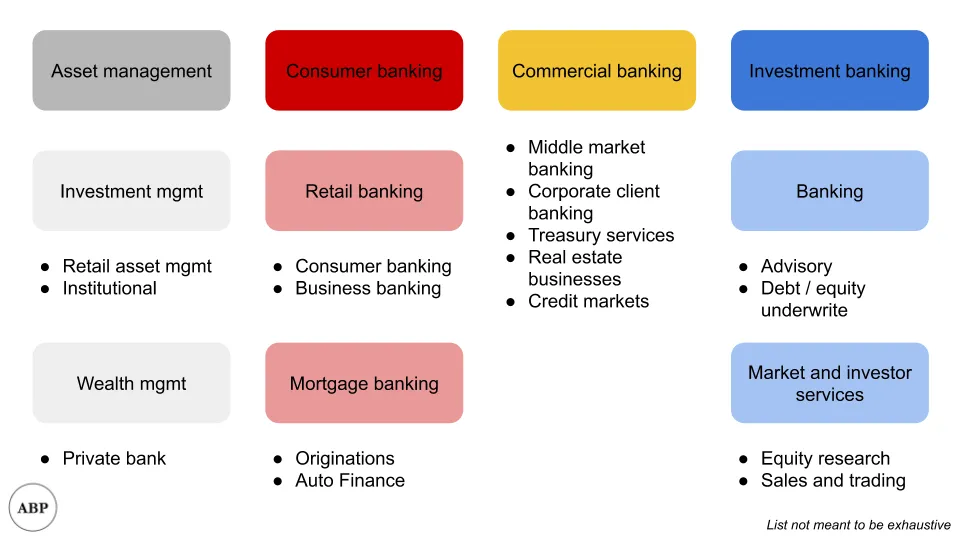

## Mensagem

O banco de investimento raramente se trata de investir\, e sim de conectar fontes e usuários de capital financeiro\.

## Visão geral do banco de investimento

Tive que explicar para algumas pessoas sobre o que realmente é o banco de investimentos recentemente\, e achei que valia a pena fazer um breve resumo aqui também\. Especialmente considerando a incompatibilidade entre expectativas e realidade\, espero que isso ajude a esclarecer as coisas\.

**O banco de investimento geralmente não é sobre investir\,** apesar dos meus pais nunca parecerem ter entendido isso\. Observação\: Tenho tentado descobrir a etimologia de quando \"merchant banking\" virou \"investment banking\"\, mas até agora não tive sorte\. Se você souber\, por favor\, entre em contato\.

Um banco de \"serviço completo\" como o JP Morgan é enorme\. Você pode pensar nisso como quatro principais linhas de negócio\:

Quando me refiro a banco de investimento ou bancos neste artigo\, estou falando especificamente do negócio azul à direita\. E para facilitar minha vida\, vou focar apenas na caixa \"Banker\"\, excluindo a discussão sobre pesquisa de ações e os braços de vendas e negociação para simplificar\. Mencionei pesquisa de ações [here](/writing/sellside 'er') Antes\, ao discutir o impacto dos roboadvisors\.

Agora que conhecemos nosso escopo\, o que o grupo de banco de investimento faz\?

Sempre gostei desse framework que um professor meu usava [^1]\, e é assim\:

Bancos são intermediários\. Especificamente\, intermediários do capital financeiro [^2]\.

O mundo tem muitas pessoas com capital\, querendo usá\-lo\. Por exemplo\, um fundo de pensão pode estar buscando diversificar\, um fundo patrimonial pode querer retornos maiores\, ou uma empresa pode querer adquirir outro\.

O mundo também tem muitas pessoas que precisam de capital\. Por exemplo\, uma empresa pode emitir dívidas ou ações para financiar suas operações\.

O negócio do banco é **Faça um mercado** entre os dois grupos\.

Por exemplo\, se o Google está tentando aumentar dívidas\, o banco trabalha com ela para descobrir quanto pode levantar\, quem vai comprar a dívida e em quais termos ela será emitida\.

Alguns\, mas não todos\, bancos são estruturados em dois grandes grupos\, **Cobertura do setor** e **Cobertura do produto** [^3]\. Indústria referindo\-se ao fornecimento de aconselhamento para empresas nesse setor segmentado\. Produto aqui referindo\-se a um tipo de produto financeiro\, como consultoria em finanças corporativas\, mercados de capitais de ações\, mercados de capitais de dívida\, financiamento alavancado e fusões e aquisições\.

A cobertura do setor é mais fácil de entender\, então vou apenas explicar os diversos produtos financeiros\.

**Mercados de capitais acionários** lida com a maioria dos produtos relacionados a ações\, desde colocações privadas \(quando uma empresa quer emitir ações privadas\) até IPOs \(quando uma empresa emite ações publicamente\)\. Por exemplo\, se você for fazer um IPO\, parte da equipe bancária com quem você vai trabalhar incluirá banqueiros ECM\. Eles trabalharão com vendas para conversar com investidores e avaliar a demanda pelas suas ações\.

**Mercados de capitais de dívida** Normalmente lida com produtos de dívida de grau de investimento\. Se você não sabe o que significa \"grau\"\, voltaremos a isso em um minuto\. Por exemplo\, se você é uma empresa que busca emitir dívida para uma aquisição\, vai trabalhar com uma equipe de DCM para entender quais taxas de juros etc\. você poderá obter\, com base na demanda dos investidores\.

**Financiamento alavancado** geralmente lida com dívidas não de grau de investimento\. Historicamente\, o LevFin era considerado mais arriscado e exótico\, até [Michael Milken](https://en.wikipedia.org/wiki/Michael_Milken 'Mike') Impulsionou o setor com o uso de dívidas \"arriscadas\" em aquisições alavancadas por private equity\. Por isso\, há uma equipe diferente para isso\, pois os tipos de investidores podem ser diferentes e desejar termos diferentes\. Por exemplo\, uma empresa que emite dívida não\-investment grade em vez de investment grade pode ter que aceitar taxas de juros mais altas\, em troca de cláusulas de dívida mais fracas\.

**Fusões e aquisições** Acorda quando as empresas querem comprar ou vender umas às outras\. Por exemplo\, se você estivesse procurando comprar um concorrente menor\, trabalharia com uma equipe de M\&A para obter uma avaliação e discutir a estratégia de licitação\.

**Consultoria em finanças corporativas** é uma equipe que fornece aconselhamento financeiro e frequentemente é usada para avaliações de dívida ou consultoria de ativismo\. A equipe do CFA tenta modelar o que as agências de classificação vão avaliar sua dívida\. Voltando à \"classificação\"\, todas as emissoras de dívida pública têm uma \"classificação\" associada a elas e à dívida que emitem\. Existem algumas agências de classificação de crédito\, como S\&P\, Moody\'s\, etc\.\, que avaliam os termos e depois dão à dívida uma \"classificação\"\, que deveria representar o quão arriscada a dívida é\. Por exemplo\, o Google emitindo dívidas receberia uma nota de \"baixo risco\"\, enquanto uma startup emitindo dívidas receberia uma nota de \"alto risco\"\.

Para dar um exemplo hipotético que aborda todos os grupos acima\, suponha que você fosse uma grande empresa buscando adquirir outra grande empresa\.

Você trabalharia com a equipe de cobertura do setor para trabalhos não específicos de produto\, como slides relacionados ao setor\, para justificar o acordo\. A equipe de M\&A ajudaria a construir um modelo financeiro para avaliar preços de licitação e financeiros pro forma de fusões\.

Como é um grande negócio\, você quer levantar o dinheiro de todas as fontes disponíveis\, então vai usar dívida de grau investimento\, dívida não\-grau de investimento e\, por que não uma colocação privada também\. Isso envolve as equipes DCM\, LevFin e ECM\. Como você está fazendo coisas de dívida\, também vai incluir a equipe do CFA para estimar as classificações\.

Quando o negócio é fechado\, o banco fica com uma porcentagem do tamanho total do negócio\. As porcentagens variam dependendo do produto\, mas\, como você pode imaginar\, isso incentiva os banqueiros a fazer negócios maiores\.

Também vale notar que a maior parte do dinheiro bancário é ganha quando um negócio real acontece\, então os banqueiros são incentivados a fazer negócios acontecerem\.

Então\, agora que sabemos o que é o banco\, **Os banqueiros realmente agregam valor\?**

Na última década\, tornou\-se mais comum odiar os banqueiros\, com a pessoa comum pensando que os banqueiros passam a maior parte do tempo [midget tossing](https://www.youtube.com/watch?v=EQlgrw31St0 'midget') E o executivo médio de uma empresa que pensa que banqueiros não conhece seu setor tão bem quanto a empresa\.

Como em tudo\, depende\. Todo mundo odeia intermediários até que precise tentar criar um mercado para si mesmo\.

É fácil dizer que uma empresa \"conhecida\" como a Palantir poderia fazer um IPO sem muita ajuda bancária\, ou que o Google poderia emitir dívida diretamente\. Grandes empresas normalmente têm equipes financeiras inteiras de ex\-banqueiros\, então não é como se faltassem conhecimento\. Elas também estão em contato regular com investidores\, especialmente se forem uma empresa pública e precisarem fazer reuniões com investidores\. E\, esperançosamente\, deveriam conhecer seu setor e concorrentes melhor do que os banqueiros [^4]\.

É mais difícil para empresas \"menos conhecidas\" fazerem isso\. Se você não é uma empresa tão grande e não tem uma equipe dedicada\, vai querer terceirizar o máximo possível desse trabalho\. Por exemplo\, se você vai fazer um IPO e nem sabe por onde começar e com quem procurar\, trabalhar com um banco faz mais sentido\. Ou se quiser vender sua empresa\, mas não anunciar publicamente que está à venda\, os banqueiros também podem ser úteis\.

Além disso\, sempre existe o fator \"me cobrir\"\, quando os banqueiros formam uma suposta opinião imparcial de terceiros sobre a aquisição\. Se o banco avaliou a empresa em 10 dólares\, há menos chance de ser processado por alguém dizendo que você pagou a mais ao oferecer 10 dólares\.

Existe uma narrativa popular de que os banqueiros são desintermediados pela tecnologia ou pela mais recente inovação financeira\. Embora eu concorde que os banqueiros precisam acompanhar e continuar encontrando melhores formas de agregar valor\, não vejo bancos de investimento desaparecendo tão cedo\. Se eu tivesse que fazer uma previsão\, diria com 90\% de certeza que o papel de \"banco de investimento\" ainda existe daqui a 20 anos\, com seu serviço essencial ainda sendo intermediário financeiro\, mesmo que as empresas mudem\. Cinicamente\, mesmo que todas as emissões de dívida e ações ocorram em algum tipo de plataforma tecnológica\, as empresas ainda precisam de alguém para culpar quando algo der errado\.

[^1]: [Prof Maillet of McIntire](https://www.commerce.virginia.edu/faculty/pam5x 'prof')

[^2]: Às vezes também é capital humano\, mas isso geralmente é não intencional e é mais raro

[^3]: Na verdade\, não lembro mais quais têm qual estrutura\. A alternativa é ter um único grupo de cobertura do setor que faça ambas as funções\.

[^4]: Os bancos cobrem concorrentes\, mas geralmente há algum tipo de processo de \"conflito\" para tentar impedir que um banqueiro cubra dois concorrentes ao mesmo tempo\, especialmente para negócios reais
