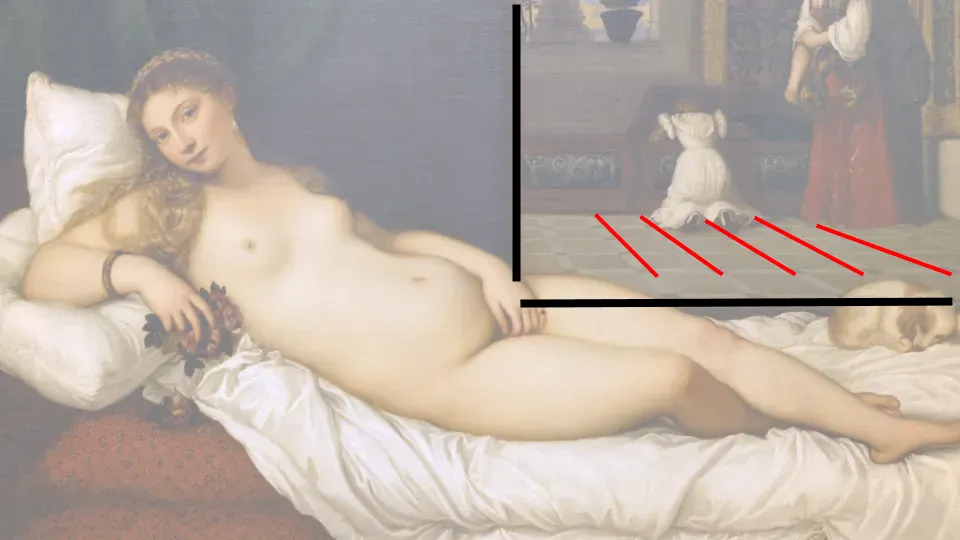

## Mensagem

Comparar as obras de Ticiano\, Dominique\-Ingres e Manet mostra como os artistas influenciaram uns aos outros e se rebelaram contra a tradição ao longo do tempo\.

## Analisando Ticiano\, Ingres e Manet

Dezembro é uma época conveniente para fazer reflexões\. Como nos anos anteriores\, farei uma reflexão mais abrangente sobre o ano no post mensal\. Vou dedicar as jornadas semanais destacando novos temas que aprendi este ano\.

Primeiro\, história da arte\. Comecei a passar mais tempo aprendendo sobre arte este ano\, por alguns fatores\:

- A Covid cancelou muitos dos meus hobbies
- Sempre tive curiosidade sobre arte e acredito que ela ainda tem relevância hoje em dia
- A arte é muito melhor quando você tem contexto para a peça

Eu encontrei [Smarthistory](https://smarthistory.org/) ser um site acessível\, porém abrangente\, e tenho estudado muitas das páginas\. Ler sobre as intenções por trás de peças famosas tornou a compreensão das obras mais fácil e agradável\. Por exemplo\, finalmente entender do que se trata Picasso [in an earlier article I wrote](/writing/picasso 'picasso')

Com isso em mente\, vamos analisar três peças com um tema semelhante e ver como o contexto histórico pode nos dar uma melhor compreensão do que o artista tentou fazer\.

Acima vemos três nus reclinados\, um tema popular entre artistas há muito tempo [^1]\. Em ordem horária\, temos um Titiano do século XVI\, um Dominique\-Ingres do início do século XIX e um Manet do final do século XIX\. Todos esses artistas eram famosos naquela época\, e ainda são hoje\. \"Vênus\" era relativamente pouco controversa em sua época\, mas as outras duas \"La Grande Odalisque\" e \"Olympia\" atraíram muito mais críticas\. Por quê\?

Para responder a essa pergunta\, será útil entender o [hierarchy of art genres](http://www.visual-arts-cork.com/history-of-art/hierarchy-of-genres.htm 'hierarchy') Que as pessoas seguiram por séculos\:

Por muito tempo\, o tipo de arte tinha um certo \"rango\"\, e as pessoas automaticamente julgavam uma pintura de naturezas\-mortas como menos importante do que uma pintura de uma cena religiosa\. Não é totalmente surpreendente\, considerando que a igreja foi uma grande patrona da arte na época\.

Vamos dar uma olhada mais de perto em Vênus e no pensamento que Ticiano colocou por trás da composição\. [Venus was probably intended as a marriage gift](https://smarthistory.org/titian-venus-of-urbino/ 'venus') ao casal para exibição privada [^2]\, o penteado era típico das noivas daquela época\, e as rosas associadas ao amor\. Intitulada Vênus\, também deveria ser uma pintura mitológica\, colocando\-a firmemente no topo da arte daquela época\.

Para tornar a pintura visualmente mais interessante\, Ticiano também contrastou a curva do corpo contra as linhas retas do fundo\. Note também como as linhas pretas também direcionam nossa atenção para a figura\. As linhas vermelhas no fundo não são totalmente paralelas por intenção\, pois isso cria [perspective](https://www.tate.org.uk/art/art-terms/p/perspective 'perspective') para a imagem e faz parecer mais 3D\.

Agora vamos olhar para Odalisca \(que significa concubina\) e ver o que permaneceu igual e o que mudou\. A pose é semelhante\, e o uso do tom de pele em Odalisca e Vênus faz com que ambas pareçam realistas\.

Dominique\-Ingres adicionou mais detalhes ao primeiro plano\, como as penas de pavão ou as gemas\. Note também que ele não usa tantas linhas retas para contraste ou perspectiva\. Em vez disso\, a pintura é toda sobre as curvas\:

Se você ficar olhando para o corpo por tempo suficiente\, também começará a sentir que algo está estranho\. O corpo se alongou durante a pose\, com certeza\, mas não parece bastante _também_ Longo\? As proporções da figura não estão exatamente corretas\. Se você olhar para a perna esquerda da figura\, também perceberá que onde ela se conecta no corpo também está errada\. Ingres fez isso intencionalmente para dar ao espectador uma noção mais aguçada da forma da figura\, em comparação com o que seria possível com corpos \"realistas\"\.

Por fim\, Ingres intitulou a obra \"La Grande Odalisque\"\, e não em homenagem a alguma figura mitológica\. Isso teria tornado a pintura \"menos importante\" e era sua forma de fazer uma declaração contra a rígida hierarquia artística de sua época\.

Agora\, finalmente\, vamos olhar para o trabalho de Manet\. Você pode facilmente ver as referências a Vênus aqui\, desde poses semelhantes\, almofadas e até aquela linha vertical ao fundo para chamar contraste e atenção\.

Ao mesmo tempo\, esta também é uma pintura muito diferente\. A maioria das pessoas diria que tanto Vênus quanto Odalisca pareciam mais \"finalizadas\" e \"realistas\"\, enquanto Olímpia parece incompleta\. Não é terrível\, mas também não é tão \"bonita\" quanto as pinturas anteriores\.

As curvas da figura não são tão longas ou graciosas quanto as de Odalisca\, e não há linhas que impliquem perspectiva 3D\, o que faz a imagem parecer plana\. Enquanto Vênus foi nomeada em homenagem a uma deusa e Odalisca mostrava uma cena de uma terra de fantasia\, Olímpia parece muito real\, muito moderna\.

De fato\, foi essa realidade que levou a ["Sticks and umbrellas were brandished in \[her\] face," and criticism that the painting was “a degraded model picked up I know not where.”](https://www.artforum.com/print/197503/manet-a-radicalized-female-imagery-36081 'art') Assim como Ingres antes dele\, Manet agora está completamente rebelando contra a tradição\, dizendo que a hierarquia artística é um absurdo e que era a era do mundo moderno\. A arte não estaria mais focada em pintar a história\; ela pintaria o presente\.

O trabalho de Manet extraía influências do passado\, mas também rejeitava muitos aspectos centrais\, escandalizando o mundo da arte\. Como resultado\, ele influenciou movimentos inteiros e é hoje conhecido como um dos primeiros artistas verdadeiramente modernos\, inspirando impressionismo\, realismo e muito mais\.

Eu intitulei o post sobre Manet\, mas é realmente sobre arte em geral\. A arte é uma área em constante evolução\, e o que antes era popular pode perder popularidade antes de ser revivido\. Descobri que entender a história por trás do motivo pelo qual os artistas tomaram as decisões que tomaram ajuda a apreciar melhor diferentes obras e traçar paralelos entre períodos históricos\. Se nada mais\, isso me tornou mais mente aberta\.

## Notas de rodapé

[^1]: Fica a dúvida do porquê\.

[^2]: \"O tema da Vênus adormecida era central para epitálmios \(canções ou poemas celebrando o casamento\) populares na Antiguidade Grega e Romana\, e revividos na Itália renascentista\.\" de Smarthistory
