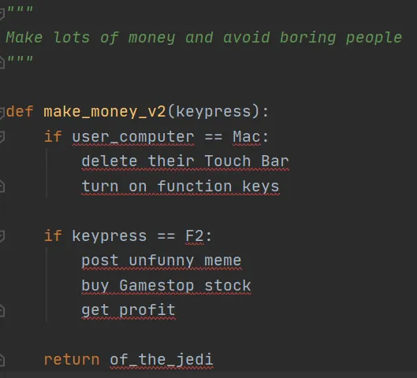
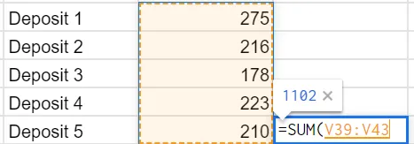
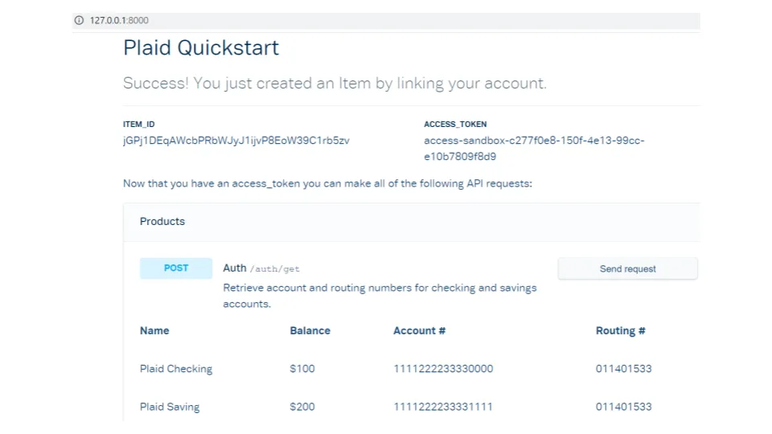

## Mensagem

A Plaid é uma empresa de tecnologia financeira que ajuda outras empresas a se conectarem com dados bancários\. Ao fazer as coisas chatas que outros não querem fazer\, a vida fica mais conveniente para todos e se torna um produto altamente pegajoso\.

## 1\. Abstrair camadas de trabalho

Vou falar sobre a empresa de tecnologia financeira [Plaid](https://plaid.com/ 'plaid') hoje\. Antes disso\, ajudaria ter um pouco de intuição sobre abstração e Interfaces de Programação de Aplicações \(APIs\)\. Vou dedicar a seção 1 à abstração e à seção 2 às APIs\; pule para a seção 3 se você já estiver familiarizado com esses conceitos\. Como de costume\, vou pender por ser menos preciso tecnicamente para facilitar a compreensão\.

Vamos primeiro discutir abstração\:

Suponha que você tenha uma ideia inovadora de app para ganhar muito dinheiro\. Você programa seu app de modo que\, toda vez que alguém aperta a tecla F2 do teclado\, algo aconteça e ela obtenha lucro\:

Você testa isso no seu laptop\, tudo funciona bem e começa a ganhar dinheiro\. Funciona tão bem que você conta para todos os seus amigos\, que também querem participar\. Você envia o código para eles e diz para eles seguirem em frente e prosperar\.

Um dos seus amigos \(o hipster irritante\) te diz que o código não funciona no Mac dele\, e ele fica triste por não conseguir dinheiro para sua próxima xícara de café single de origem single barrel single plant de planta única\. Você se pergunta por quê e vai tentar resolver o código\.

Acontece que os Macs têm essa coisa estranha [Touch Bar thing](https://support.apple.com/en-gb/guide/mac-help/mchlbfd5b039/mac 'touch') para teclas de função\, cujo único propósito\, pelo que você pode perceber\, parece ser tornar a vida miserável\. Você adiciona um código especial para usuários de Mac\:

Funciona para ele agora\, e ele segue em frente para [suing magazines for saying all hipsters look alike.](https://www.independent.co.uk/news/media/hipster-magazine-photo-lawsuit-mit-technology-review-a8813941.html 'hipster')

Outro amigo pergunta se você também pode suportar celulares\, para ganhar dinheiro em qualquer lugar\. Outra pessoa pergunta se você pode adicionar suporte ao Blackberry\. E ainda outro quer saber quando o app estará disponível para o [KFC gaming console](https://www.bbc.com/news/business-55433318 'kfc')\.

Ao encarar essas tarefas de adicionar mais código para todos os diferentes dispositivos de computação disponíveis\, começa a se desesperar\. Por que ganhar dinheiro não pode ser tão fácil quanto apertar um botão\? **Você só quer escrever seu código uma vez e então poder usá\-lo em vários dispositivos\.**

A ideia acima é\, na verdade\, um problema comum em computação \(suporte a múltiplos dispositivos\, não o que dá dinheiro\)\. Se você escreve um software que faz tudo\, vai precisar considerar todos os possíveis dispositivos de usuário final\. Depois que seu código for traduzido para binário \(1s e 0s\)\, ele precisa continuar fazendo a mesma coisa\. Cada dispositivo tem suas peculiaridades\, e você vai passar mais tempo lidando com exceções do que escrevendo a funcionalidade principal\.

No final dos anos 90\, as pessoas descobriram uma solução para isso – adicionar uma camada extra no meio\, ou seja\, **Faça disso um problema de outra pessoa\.** [As Shimon Schocken explains,](https://www.youtube.com/watch?v=E28KczysecE 'Shimon') Ter um \"intermediário\" agora simplifica sua tarefa\. Em vez de escrever código para todos os dispositivos possíveis\, você \"escreve uma vez\, executa em qualquer lugar\" e deixa esse intermediário cuidar de tornar seu código compatível [^1]\:

**Dividir uma tarefa grande em tarefas menores facilita para todos\.** Você abstraiu parte do problema\, já que quer escrever código \"de alto nível\" e não se preocupar com bugs específicos de implementação\. Outros podem até gostar dos detalhes de implementação \"de baixo nível\"\, mas não querem programar os apps por cima disso\. De cada um conforme sua habilidade\, de acordo com suas necessidades e tudo mais\.

Voltaremos a essa ideia de abstração\, que permite às pessoas **Foque apenas em partes específicas de uma tarefa\.**

Agora\, suponha que você e seus amigos queiram colocar todo esse dinheiro em bancos ao redor do mundo\. Os bancos têm procedimentos diferentes e vão te expulsar se você não seguir as regras deles\:

- A unidade de Nova York só quer que você diga seu número de conta\, senha e pedido\, [banning you if you talk too much](https://www.youtube.com/watch?v=euLQOQNVzgY 'soup')
- A unidade de San Francisco não vai te atender a menos que você exiba pelo menos 5 adesivos da empresa no seu laptop
- A unidade de Singapura quer saber quando você está esperando se casar e ter filhos pelo bem do país

A maioria do grupo odeia decorar todas essas regras\, mas April é uma exceção\. Ela adora lidar com opções esotéricas\, se oferecendo para lidar com todos os bancos em nome do grupo\. Sem se importar com como as transações acontecem\, mas apenas com o fato de que elas acontecem\, o grupo deixa que ela cuide de tudo\.

Alguns conhecidos de um retiro psicodélico que você participou ficam sabendo do seu acordo\. Eles também não gostam de lidar diretamente com seus bancos e querem saber se April pode ajudá\-los também\. Ela fica feliz em fazer isso\, desde que paguem uma pequena quantia\. A notícia se espalha\, e logo todo mundo começa a ligar para April como intermediária\.

Vemos novamente que as pessoas mais se importavam com **Uma parte de uma tarefa maior** \- Os depósitos e saques\. As pessoas não se importam por que April gosta disso ou como ela lembra de tudo\, só que ela consegue fazer\. Ter uma April torna a vida mais conveniente\.

Por fim\, suponha que você queira checar o saldo da sua conta\, só para confirmar que April não está desviando dinheiro para pagar taxas de serviço ocultas no AirBNB alugado dela\. Você começa a digitar os depósitos recentes em uma planilha\:

Sendo programador\, você despreza o Excel e não está familiarizado com seus recursos\. Você conhece o símbolo \"\+\" para adicionar coisas\, e começa a calcular seu saldo manualmente dessa forma\:

Cem células e uma hora depois\, você está quase terminando\, quando um amigo pergunta o que está fazendo\. Ele então explica que a função sum\(\) faz o que você quer\:

Eles também contam sobre todo o processo **\"Biblioteca\" de Funções** Que o Excel precisa ajudar a tornar a matemática mais fácil\, como o a\.vg\(\)\, contagem\(\)\, etc\. O legal é que você pode esperar o mesmo comportamento para essa função\, independentemente do dispositivo que você está usando – seu laptop com Windows\, o Mac do seu amigo\, o celular do seu pai\. Quando você sabe o que a função faz e como ligar para ela\, pode economizar tempo\. Você não se importa com o modo como o Excel faz\, só que ele funciona em todos os lugares\, o tempo todo\.

Abstraindo diferentes camadas de trabalho **Aumenta as possibilidades e oportunidades em cada camada\.** A pessoa que programou o sum\(\) não quer gastar o tempo somando seus depósitos para você\. Você também não quer programar a função sum\(\)\. As pessoas focam na parte que querem trabalhar\. Não fazer tudo permite que as pessoas criem muitas coisas\.

**O conceito de abstração também se aplica fora da programação\.** Todos nós trabalhamos em uma \"camada\" de um problema\, confiando que tudo abaixo dele é confiável\. Você está lendo isso no seu e\-mail\, sem se importar com o funcionamento dos serviços de e\-mail\, apenas se eles se comportam de maneiras previsíveis\.

## 2\. Interfaces de Programação de Aplicações como contratos

Agora estamos prontos para pensar em Interfaces de Programação de Aplicações \(APIs\)\. Imagine que você programou uma biblioteca de funções matemáticas\, como o sum\(\) mencionado acima\. **Não seria conveniente se você pudesse usar essas funções em outros programas\?**

E se você conseguir tornar essa biblioteca acessível a todos\, outros poderiam usá\-la para criar suas próprias coisas interessantes\. Você pode focar em criar suas funções matemáticas\, e outros podem focar em criar aplicativos que utilizem a funcionalidade da sua biblioteca conforme necessário\.

Como [Joshua Bloch](https://www.youtube.com/watch?v=LzMp6uQbmns 'Josh') Aponta que\, já em 1952\, as pessoas gostam [David Wheeler](<https://en.wikipedia.org/wiki/David_Wheeler_(computer_scientist)> 'David') [^2] já estão propondo essa ideia de [having libraries of functions (sub-routines)](http://www.laputan.org/pub/papers/Wheeler.pdf 'wheeler')\:

**Vamos chamar essa biblioteca de funções de API [^3]\.** Joshua acredita que o termo foi usado pela primeira vez em [a 1968 paper by Ira Cotton and Frank Greatorex:](https://www.computer.org/csdl/pds/api/csdl/proceedings/download-article/12OmNyRPgFZ/pdf 'ira')

Esse uso aborda os conceitos que discutimos em nossos exemplos\:

- **Abstração\.** Você não se importa com como as funções matemáticas funcionam\, só que elas funcionam\. Dividir a grande tarefa abre possibilidades para trabalhos interessantes em todas as camadas
- **Independência do hardware\.** Podemos usar a API independentemente do dispositivo que estamos usando\, esperando que seja ele quem cuida da integração
- **Reutilização\.** A biblioteca pode ser usada por várias pessoas que querem coisas diferentes

Nossa API é uma **Contrato bem definido**\, nos dizendo as entradas necessárias e as saídas esperadas\. Por exemplo\, queremos que a função sum\(\) sempre retorne o total das entradas\, e não o total em alguns casos e a média em outros\.

Nós também **não podemos esperar que nossas APIs façam algo fora do contrato\.** Por exemplo\, sum\(\) funciona no Excel\, mas make\_me\_money\(\) não\, a menos que o criador do Excel codifique essa função\.

E nós **confiar que a API foi programada corretamente\,** tendo passado por testes rigorosos\. Por exemplo\, a função sum\(\) deve nos dar o mesmo resultado no mesmo conjunto de dados a cada vez\.

Imagine a vida sem nenhuma API\. Você teria que começar do zero toda vez que programar qualquer coisa\, e também teria que considerar todos os possíveis cenários do usuário final\. Seria como [making a sandwich from scratch](https://www.smithsonianmag.com/smart-news/making-sandwich-scratch-took-man-six-months-180956674/ 'sandwich')\.

## 3\. Plaid como API

Já estabelecemos o que são APIs e por que elas são importantes\. Agora\, o que o Plaid faz\?

Para quem não sabe\, a Plaid é uma empresa de tecnologia financeira que era [supposed to be bought by Visa for $5bn](https://www.justice.gov/opa/pr/visa-and-plaid-abandon-merger-after-antitrust-division-s-suit-block 'plaid')\, antes de abandonar a aquisição por questões antitruste\. Diferente da minha vida amorosa\, ser rejeitado realmente os fez _Mais_ valiosas\, e agora são [rumoured to be raising money at $15bn.](https://www.theinformation.com/articles/plaid-shareholders-field-offers-at-15-billion-after-merger-collapse '15')

Lembra como abril estava correndo entre você e os bancos\? Pense em abril como uma API\.

**Plaid é a API entre bancos e qualquer outra coisa que queira usar dados bancários\.** Eles permitem que seus clientes criem aplicativos sobre suas APIs\, sem se preocupar com o trabalho de integração nos bastidores exigido\. E é muito trabalho\.

Suponha que você esteja construindo um aplicativo de orçamento\, que precisa de acesso ao histórico de gastos dos usuários\. Se você usasse seu próprio código para se conectar com bancos\, precisaria escrever seções inteiras novas sempre que um novo banco fosse adicionado\. Provavelmente você gastaria mais tempo nisso do que nas funções principais do seu app\, dado que os novos padrões mudam o tempo todo\.

O Plaid pode fornecer APIs que sempre funcionarão\, além de uma interface que o usuário verá ao se conectar a um banco [(Plaid Link).](https://plaid.com/docs/link/ 'link') Seu problema virou problema deles\.

Vamos dar uma olhada em como isso é\, seguindo o guia Quickstart da Plaid [here](https://plaid.com/docs/quickstart/ 'quickstart')\. Ele te dá alguns arquivos para configurar um aplicativo de demonstração no seu próprio computador\.

Depois de um dia de diagnóstico\, várias reinicializações do computador e instalando cegamente o que parecia ser todos os programas possíveis [^4]\:

Finalmente consegui fazer parte disso funcionar\, conectando com uma conta bancária de teste\:

Isso me permitiu olhar dados fictícios\, como o saldo da minha conta bancária\:

Ou dados recentes de transações\:

Se eu ~~queria~~ sabia como\, eu podia continuar montando um app financeiro dessa forma\. O app usava a API do Plaid para puxar dados de saldo\, registrar uma transação e atualizar o saldo\. Nesse ponto\, porém\, encontrei mais bugs e ~~desistiu~~ deixou para outra hora\.

Se eu estivesse construindo uma empresa\, você pode imaginar o tempo economizado deixando a Plaid fazer todo o trabalho financeiro fundamental para mim\. Não quero trabalhar no problema da integração bancária que está uma camada abaixo\; isso não é empolgante para mim\. Prefiro trabalhar em fazer a roleta brilhante de negociação de ações por cima disso para roubar o dinheiro das pessoas\; isso é [doing god's work](https://dealbook.nytimes.com/2009/11/09/goldman-chief-says-he-is-just-doing-gods-work/ 'god')\.

Se você pensar na maioria das empresas hoje em dia como \"tecnológicas\"\, e também pensar em quantas delas exigem dados \"financeiros\"\, **você começa a perceber o quão grande é a oportunidade do Plaid\.** Quanto mais empresas criadas que querem integrar diretamente às contas bancárias dos clientes\, mais relevante a Plaid se torna\.

**A Plaid cobra as empresas\,** não para consumidores\, para uso da API [^5]\. Ele [seems to take](https://plaid.com/pricing/ 'pricing') uma taxa baseada em transações para empresas menores e uma taxa de assinatura para empresas maiores\. Ao fazer as coisas \"chatas\"\, criaram uma situação vantajosa para si mesmos e para outros inovadores que ficam felizes em pagar pela conveniência\.

Depois que você estiver usando o Plaid\, **É improvável que você mude\,** já que isso envolveria reescrever grande parte do código que usa as APIs do Plaid [^6]\. Pense no que isso significa para a capacidade da Plaid de aumentar os preços\. Com que frequência você troca seu encanamento\?

Se isso parecer irrealista\, considere Fortran\, uma das primeiras linguagens de programação\. Sua biblioteca de funções era [defined in **1958**](http://ed-thelen.org/LaFarr/IBM-FORTRAN-II-704-C28-6000-2-c-1958.pdf 'fortran')\, e ainda é usada hoje\. Uma vez implementadas\, as APIs duram muito tempo\:

Hoje abordamos muito – intuição por trás da abstração\, APIs e o que o Plaid faz\. A principal lição é que **Tem muita coisa que as pessoas não querem fazer\, e muito dinheiro a ser ganho fazendo tudo isso\.** O boletim diz para evitar entediar as pessoas\, mas nesse caso\, construir coisas chatas é um negócio multibilionário\.

### Recursos adicionais\:

1. [What does Plaid do?](https://technically.substack.com/p/what-does-plaid-do 'plaid') por Tecnicamente
2. [Fireside chat with Plaid CEO Zach Perret](https://www.youtube.com/watch?v=sgnCs34mopw 'youtube') por FirstMark
3. [APIs all the way down](https://notboring.substack.com/p/apis-all-the-way-down 'nb') não chato
4. [A brief, opinionated history of the API](https://www.youtube.com/watch?v=LzMp6uQbmns 'youtube') por Joshua Bloch
5. [How to build a fintech app in Python using Plaid's banking API](https://www.youtube.com/watch?v=Lv2jIOi2fao 'youtube') por Erol Aspromatis

Agradecimentos a [Brian Rubinton](https://twitter.com/brianru 'b')\, [Justin Gage](https://mobile.twitter.com/itunpredictable 'j')\, Ben Morsillo\, [Denis Papathanasiou](https://github.com/dpapathanasiou 'd')\, Mai Schwartz\, [Aditya Athalye](https://evalapply.org/ 'a')\, [Jeremy Presser](https://mobile.twitter.com/JeremyPresser 'j')\, [Ian Kar](https://mobile.twitter.com/iankar_ 'i') para conselhos sobre este artigo

## Outros

1. [Why working from home will stick.](https://nbloom.people.stanford.edu/sites/g/files/sbiybj4746/f/why_wfh_stick1_0.pdf 'wfh') Em linha com minha crença atual de que voltaremos ao trabalho no escritório\, com mais dias de trabalho remoto\.
2. [What is an IP address?](https://outofips.netlify.app/ 'IP')
3. [The sting of poverty](http://archive.boston.com/bostonglobe/ideas/articles/2008/03/30/the_sting_of_poverty/?page=1 'poverty')
4. [How I blew out my knee and came back to win a national championship](https://www.jasonshen.com/2011/blew-out-knee-win-national-championship/ 'jason')
5. [Judgement is an exercise in discretion](https://aeon.co/essays/judgment-is-an-exercise-in-discretion-circumstances-are-everything? 'judge')

[^1]: Para ser mais preciso tecnicamente\, seria o compilador que precisa ser compatível com todos os dispositivos\, e não o código em si\, que está uma camada acima do compilador\.

[^2]: David é aparentemente a primeira pessoa a receber um doutorado em ciência da computação\.

[^3]: Tecnicamente\, deveria ser o contrato entre as partes que serve de interface\, mas acho que juntar tudo é mais fácil de entender para um iniciante

[^4]: Tenho 99\% de certeza de que a pasta Plaid no github para python está incorreta\, pois tem arquivos index\.html vazios\. Também existe um problema estranho de namespace entre plaid e plaid\-python que eu não consegui entender direito\, mas acabei resolvendo\. Não sei por que eles precisam usar o Docker\, que foi um dos muitos programas adicionais necessários para o meu funcionamento\. Atualização\: O Plaid mencionou que esses bugs foram corrigidos\, com um processo de início rápido diferente\.

[^5]: Tenho certeza de que as empresas tentam repassar esse custo para os consumidores\, mas o ponto aqui é que o cliente direto que paga pelo serviço são as empresas que criam aplicativos que exigem integração financeira

[^6]: Acredito que seja esse o caso\, mas me avise se estiver errado\.
