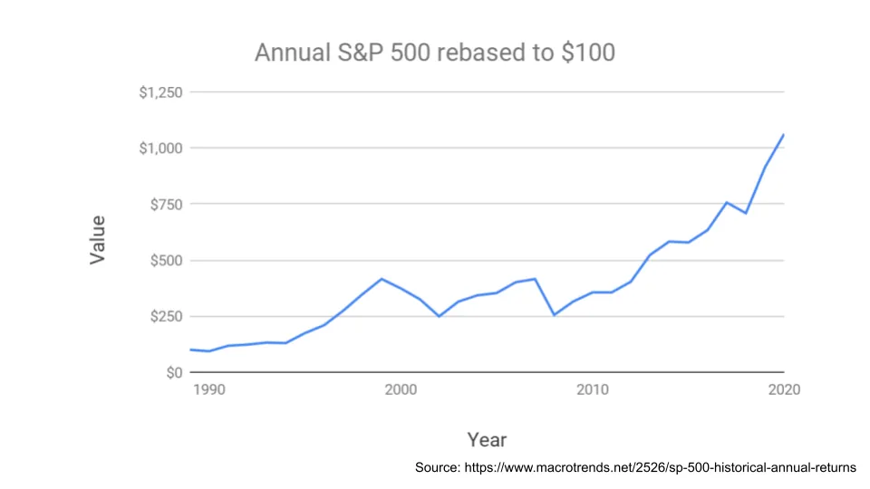

## Mensagem

A vantagem comportamental nos investimentos vem da capacidade de fazer coisas que são impopulares\. Todo mundo adora apostar\, o mais importante é avaliar seu risco adequadamente\.

## Vantagem comportamental e por que é difícil

John Huber gosta de dividir a \"vantagem\" que você pode obter ao investir [three main sources:](https://sabercapitalmgt.com/what-is-your-edge/ 'edge')

1. Vantagem de informação \- você tem mais\/melhores informações
2. Vantagem analítica \- sua análise dessa informação é melhor
3. Vantagem comportamental \- sua mentalidade e ações

Acredito que as vantagens de informação e análise continuam diminuindo\, e já não são muito grandes\, mesmo para os profissionais\. Lembre\-se de que é o [relative difference](/writing/relative_billionaire 'relative') Isso importa\, e não o nível absoluto\. Se você está usando dados de satélite e seu concorrente também\, você não tem vantagem de informação\. Se seu processo de diligência detalhada for igual ao de outro [Tiger cub](https://en.wikipedia.org/wiki/Tiger_Management 'Tiger') Como seus chefes costumavam trabalhar juntos\, você não tem uma vantagem analítica\.

Também acredito que a vantagem comportamental não está diminuindo e continuará sendo um diferencial para os retornos financeiros\. A velocidade de transferência de informações mudou\, métodos analíticos são bem conhecidos\, mas os humanos ainda se comportam da mesma forma\.

Alguns exemplos de vantagem comportamental\:

**Curto e longo prazo\.** Se você colocasse \$100 no S\&P 500 em 1990\, teria 10x seu dinheiro este ano\. Isso parece um número grande\.

Em média\, porém\, você teria ganhado \~8\% ao ano\. Isso parece um valor pequeno\.

Essa diferença de \"sentimento\" é o motivo pelo qual as pessoas podem ganhar o grande número\. A composição leva tempo para fazer seu trabalho\; você é pago pela paciência\.

**Risco vs ruína\.** Ao pensar em investir a longo prazo\, não importa quanto você ganhe\, se você perde tudo\. Um ganho de 10\.000\% seguido de uma queda de 100\% ainda é um resultado horrível\. Evitar o risco de ruína e \"ficar no jogo\" é a única coisa que importa\. Não acredite em mim\, aqui estão tanto Howard Marks quanto Charlie Munger\:

> \'Assim\, em vez de apenas buscar lucros potenciais\, damos a maior prioridade à prevenção de perdas\. Acreditamos que\, especialmente nos mercados oportunistas em que trabalhamos\, \"se evitarmos os perdedores\, os vencedores se cuidarão sozinhos\.\"\' \- Howard Marks

> \"É impressionante o quanto pessoas como nós conseguiram vantagem a longo prazo tentando ser consistentemente não burras\, em vez de tentar ser muito inteligentes\.\" \- Charlie Munger

**Não fazer nada versus fazer algo\.** Gestores profissionais de fundos são incentivados a renovar sua carteira\, já que eles mesmos têm clientes para atender\. Imagine a seguinte reunião\:

> Cliente \- \"Então\, o que há de novo no portfólio\?\"

> Investidor \- \"Nada\, ainda estamos na livraria que mencionamos\.\"

> Cliente \- \"Não era a mesma ação do ano passado\?\"

> Investidor \- \"Sim\, e o mesmo de quatro anos atrás\. Na verdade\, não fizemos nada\.\"

> Cliente \- \"Então para que estou te pagando\?\"

É por isso que vemos ações como a Amazon \>100x em nossa vida\, e não vemos gestores ativos fazendo o mesmo\. Se todo mundo _tem_ Para fazer trocas e manter o emprego\, não fazer nada pode realmente te dar uma vantagem\.

**Chato vs empolgante\.** Por que os comportamentos acima são difíceis\? Porque são _entediante_\. Gostamos de atividade e odiamos ficar parados\. É difícil se gabar em uma festa de coquetel que seus ganhos são pequenos\, lentos e simples\. Assim como ["sin stocks" need to have higher expected excess returns](https://www.aqr.com/Insights/Perspectives/Virtue-is-its-Own-Reward-Or-One-Mans-Ceiling-is-Another-Mans-Floor 'asness')\, comportamentos de \"tédio\" no stock também te dão uma vantagem\.

Tendo sugerido tudo isso\, será que espero que alguém siga isso\? Será que devemos simplesmente comprar o S\&P e dormir\?

Não\, na verdade não\. Senhor\, me faça casta – mas ainda não\. É um ótimo plano\, mas difícil demais para a maioria das pessoas seguir\. Lembrando que isso não é um conselho de investimento\, vamos adicionar um pequeno ajuste ao portfólio\:

Uma grande razão pela qual as pessoas não seguem esse tipo de plano é que **Todos nós amamos jogo\.** Vemos oportunidades que parecem boas demais para serem verdadeiras \(dica\: são\)\, e estamos tentados a participar\. Faço isso o tempo todo\, mesmo sabendo tudo isso\.

Sabendo que é assim\, **Ter uma pequena porcentagem do portfólio dedicada a apostas selvagens** Parece um compromisso razoável para nosso próprio comportamento falível\. Em vez de resistir à tentação para sempre \(improvável\)\, uma abordagem melhor é antecipar os desafios comportamentais que provavelmente ocorrerão\.

Muito do conhecimento financeiro comum é um bom conselho \(diversificar\, investimentos de baixo custo\, etc\.\)\, mas muitas vezes deixamos de levar em conta o fato de que as pessoas querem uma forma de apostar\. Isso acaba sair pela culatra quando as pessoas não resistem mais e assumem riscos demais em um momento de fraqueza\. Não ajuda o fato de você ter investido em um fundo de índice por 10 anos antes de retirá\-lo para vender uma ação com queda ilimitada\.

Em vez disso\, digamos que você reserve 5\% do seu capital para investir [Fyre festival time shares](https://en.wikipedia.org/wiki/Fyre_Festival 'fyre') e o mais recente esquema de pump and dump\. Você poderá satisfar tanto o desejo de jogar quando surgir\, quanto nunca estar em posição de arriscar sua vida\. É uma abordagem um pouco parecida com a [Kelly criterion](/writing/kelly 'kelly') que já discutimos antes\.

Se você perder todos os 5\%\, é uma pena\, mas você limitou sua queda e precisa reduzir ainda mais o risco se quiser apostar de novo\. E se você encontrou a próxima Amazon\, isso é fantástico\.

**O melhor plano de investimento é aquele que você realmente pode seguir\.** Pode não ser a solução financeiramente ideal\, mas é focada no comportamento que pode ajudar você a saciar a vontade de jogar\.
