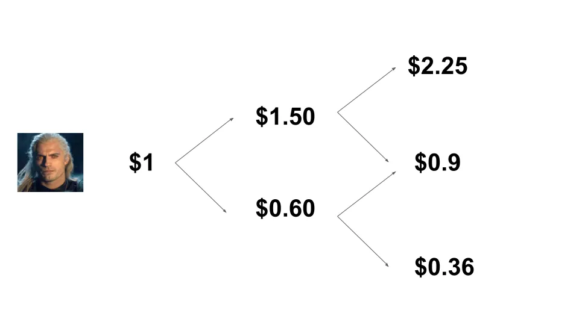
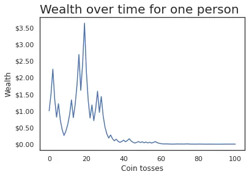

## Mensagem

Saber se um processo é ergódico ou não ergódico é fundamental para saber quanto risco assumir\. Investir e riqueza são processos não ergódicos\, o que implica que nossas primeiras reflexões sobre valores esperados estão muito erradas\.

---

Já ouvi falar [ergodicity](https://en.wikipedia.org/wiki/Ergodic_process 'wiki') antes\, mas não consegui entender direito até assistir [this video](https://www.youtube.com/watch?v=VCb2AMN87cg 'youtube') pela Ergodicity TV\. É um conceito importante\, mas parece mais conhecido em física do que em finanças\. Quero tentar explicar com minhas próprias palavras abaixo\.

Estamos familiarizados com diferentes tipos de \"médias\" \- média\, mediana\, modo [^1]\. Vamos focar na média de hoje e considerá\-la como o valor esperado de algum evento aleatório [^2]\. **A forma como definimos o valor esperado pode nos trazer resultados drasticamente diferentes\, mudando nossa mentalidade sobre a atratividade das apostas e quanto apostar\.**

**Ergodicidade significa que a média do conjunto é a mesma da média de tempo\.** Algo não ergódico significa o oposto\, que a média do conjunto não é a média do tempo\.

Sim\, não tenho certeza do que significa conjunto e tempo aqui [^3] Ambos\, então vamos ver um exemplo de lançar uma moeda\.

Suponha que algum cara aleatório jogue uma moeda 5 vezes\, ganhando caras e coroa\. Podemos calcular a média de tempo dessa simulação obtendo a média de caras de uma pessoa ao longo de um período de tempo\. Tem 3 cara em 5 lançamentos\, então são 0\,6 caras \(3 dividido por 5\)\.

Suponha que algumas pessoas a mais joguem moedas\. Temos algo como abaixo\, onde estou representando cara como 1 e coroa como 0 para maior conveniência\:

Existem dois tipos de médias que podemos usar aqui\. A primeira é a média de tempo de antes\, onde obtemos o **Média por um período de tempo para uma pessoa\.**

A segunda é a média do conjunto\, onde obtemos o **A média ao longo de um período de tempo para várias pessoas\.**

A grande questão que a ergodicidade tenta responder é\: **Devemos esperar que essas duas médias sejam as mesmas a longo prazo\?**

Se pensarmos por um tempo\, conseguiremos raciocinar que deveríamos fazer isso\, neste exemplo\. Um cara ou coroa é aleatório e não depende do resultado anterior\. A média do conjunto é a mesma que a média do tempo no longo prazo\. Com lançamentos suficientes\, esperaríamos que essas médias fossem 0\,5 [^4] \.

Foram muitas palavras para mostrar algo que você provavelmente já acreditava\, então por que acho isso tão importante\?

Vamos construir sobre o exemplo\, fazendo as pessoas apostarem no cara ou coroa\. Todos começam com \$1\, ganham 50\% de lucro se ganharem\, e pagam 40\% da aposta se perderem\. Por exemplo\:

Em vez dos resultados do cara ou coroa em si\, vamos pensar na riqueza que cada pessoa terá\. Se representarmos esses gráficos\, **Devemos esperar que a média temporal da riqueza de uma pessoa seja a mesma que a média do conjunto da riqueza de todos a longo prazo\?**

Ou\, em outras palavras\: **Você gostaria de apostar assim** Se for oferecido repetidamente\?

O valor esperado de uma aposta assim é 50\% vezes \$1\,50\, mais 50\% vezes \$0\,60\, para ganhar \$1\,05\. Com um valor esperado positivo\, parece que devemos continuar apostando\. Vamos simular alguns lançamentos de moeda para ver o que acontece\.

Eu programei uma simulação de lançamento de moeda nisso [jupyter notebook](https://colab.research.google.com/drive/1KI_PPhtXVQDfVGRFbi4pl0ZIhL2Y4x2X?usp=sharing 'colab') [^5] \. Executando o cenário acima para uma pessoa que faz 100 lançamentos de moeda\, percebemos que a riqueza dela aumenta até \$4\, antes de cair essencialmente para \$0\.

Hmm\, talvez tenhamos tido um cenário azarado\. Vamos repetir isso com 100 pessoas\, ainda fazendo 100 lançamentos de moeda\. Também vou calcular a riqueza média \(média do conjunto\) em cada lançamento de moeda e representar isso com uma linha vermelha tracejada [^6] \.

Os dois gráficos abaixo são idênticos em dados\; Estou apenas reescalando com um eixo logarítmico para melhor visualização\.

Algo estranho está acontecendo\. Vemos um caso atipicado que chegou a \$1k em riqueza\, e também vemos que a média da riqueza \(linha vermelha tracejada\) está aumentando continuamente\. No entanto\, note que **A maioria dessas pessoas perdeu dinheiro\!** Nessa simulação\, 94 das 100 pessoas que jogaram acabaram com menos do que o \$1 com que começaram\.

Se você não estiver convencido\, o caderno tem um exemplo com mil pessoas\; também fique à vontade para ajustar os parâmetros\.

O que estamos vendo é que\, mesmo que o valor esperado seja positivo e a média do conjunto esteja aumentando\, a média de tempo para qualquer pessoa solitária geralmente diminui\. **A média de todo o \"sistema\" aumenta\, mas isso não significa que a média de uma única unidade esteja aumentando\.** Grandes valores fora da curva distorcem a média\, mas a maioria das pessoas está perdendo\.

Isso merece ser repetido\. **Mesmo quando o valor esperado de uma aposta assim era positivo\, 94 em cada 100 pessoas que jogaram tal jogo perdem a maior parte do seu dinheiro\.** Esses resultados acontecem dentro do mesmo sistema\, mas te dão a lição oposta sobre se você quer jogar ou não\.

A riqueza nesse cenário é não ergódica\, pois a riqueza futura depende da riqueza do passado \(dependência do caminho\)\. A média do conjunto não é igual à média do tempo\.

**Riqueza em geral também é não ergódica**\, já que o retorno do seu portfólio de investimentos amanhã depende do tamanho atual e da alocação do portfólio hoje\.

Na prática\, o que isso significa para investir é\:

1. **Tenha cuidado com a forma como você aplica os valores esperados\,** Já que você quer saber se essa é a média de todo o sistema\, ou o que um indivíduo como você deve esperar em média\. Se você tem probabilidades em mente\, modele\-as e veja o que isso implica

2. **O que pode parecer atraente no começo muitas vezes é terrível\,** pois um pequeno número de valores de outliers distorce a média para cima [^7]\.

3. **Se você não gosta das probabilidades que está vendo\, tente mudar o jogo\.** O post anterior que fiz em [the Kelly Criterion](/writing/kelly 'kelly') Fala sobre dimensionar sua aposta\, o que vai influenciar quanto você ganha ou perde\.

Em resumo\, ergodicidade é sobre se a média de longo prazo em muitas simulações é a mesma que a média em uma simulação\. Quando as coisas não são ergódicas\, e muitas coisas na vida são não ergódicas\, você precisa ter muito cuidado com a quantidade de risco que está assumindo\.

## Leitura adicional

1. [Ergodicity](https://squidarth.com/math/2018/11/28/ergodicity.html 'squid')
2. [What are we weighting for?](https://researchers.one/articles/20.04.00012 'paper')
3. [The ergodicity problem in economics](https://www.nature.com/articles/s41567-019-0732-0 'paper')

Obrigado a [Tyler Richards](http://www.tylerjrichards.com/)\, e membros do Recurse Center Vaibhav Sagar\, Sidharth Shanker\, SengMing Tan\, Alex Yeh para dar opiniões sobre isso\.

[^1]: [In case you need a refresher](https://www.purplemath.com/modules/meanmode.htm)\, a média é a média onde você soma todos os números e divide pela contagem de números\, a mediana é o número do meio\, e o modo é o número mais comum

[^2]: Talvez eu esteja [conflating mean and expected value here](https://stats.stackexchange.com/questions/30365/why-is-expectation-the-same-as-the-arithmetic-mean 'stats')\, mas acho que podemos simplificar para essa explicação

[^3]: Hmm

[^4]: 50\% de chance de cara e 50\% de chance de coroa\, por definição

[^5]: Alguém realmente deveria conferir meu código\. Também acho que existe uma forma mais elegante de codificar em menos linhas\.

[^6]: Essa não é a média teórica do conjunto\, que seria 1\,05 elevado ao poder do número de lançamentos de moeda e aumentaria linearmente\. Aqui estou apenas fazendo a média dos resultados reais\, por isso a linha não aumenta continuamente \(aumenta monotonamente\)

[^7]: A riqueza tem um piso de \$0\, mas não tem teto\, então a média também é ilimitada\, eu acho\.
