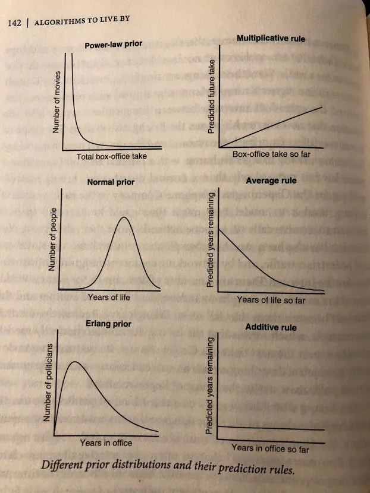

## Mensagem

Um algoritmo é um processo definido a ser seguido para alcançar o resultado desejado\. Grande parte de nossas vidas é decidida por algoritmos\. Saber quais algoritmos seguir pode resultar em decisões mais eficientes e eficazes\.

## Algoritmos na vida

Recentemente reli [Algorithms to Live By](https://algorithmstoliveby.com/ 'algo')\, um livro de Brian Christian e Tom Griffiths sobre como algoritmos podem nos ajudar a ser mais eficazes em nossas vidas\. Tendo aprendido programação no ano passado\, aproveitei mais desta vez\.

Um algoritmo é um processo\, e você pode pensar nele como instruções a seguir para completar uma tarefa\. Por exemplo\, aprender a somar números é um algoritmo simples [^1]\.

Instruções mais complexas podem calcular resultados para outros problemas da vida\. Taxas de juros\, rankings de buscas na web ou feeds de redes sociais são todos baseados no resultado de algoritmos\. O livro aborda muitos desses algoritmos e os relaciona a problemas que você pode enfrentar pessoalmente\.

É muito difícil explicar todos os algoritmos que eles mencionam [^2]\, então\, em vez disso\, farei pequenos destaques de alguns e geralmente me concentro nos pontos qualitativos\, não quantitativos\.

Além disso\, a maioria dos algoritmos depende de certas suposições\; em vez de especificar isso toda vez\, considere isso dado ao ler\. Vou adicionar algumas das suposições em notas de rodapé para quem se interessar\.

Alguns dos problemas discutidos incluem\:

- Quando parar de fazer entrevistas para ter a chance máxima de obter o melhor resultado
- Quando você deve parar de explorar novas opções para aproveitar as que já conhece
- Como agendar suas tarefas com base no seu objetivo

Vamos analisar nosso primeiro algoritmo\, sobre quando você deve parar de trabalhar em um problema\.

## Parada ótima

Se você está avaliando opções \(candidatos a emprego\, ofertas de moradia\, vagas de estacionamento etc\.\)\, há um equilíbrio entre o tempo que você gasta escolhendo e a chance de escolher a \"melhor\" opção\. Isso é conhecido como [secretary problem](https://en.wikipedia.org/wiki/Secretary_problem 'prob') \- Suponha que você estivesse contratando uma secretária\, quantas entrevistas deveria fazer para ter a melhor chance de encontrar a melhor\?

Nesse caso\, há uma porcentagem precisa a ser usada\. Você deve esperar depois de ver 37\% do grupo de candidatos e então escolher o próximo melhor candidato que encontrar [^3]\. Por exemplo\, se você teve 100 candidatos\, espere depois de ver os primeiros 37 e então escolha o próximo que seja melhor do que todos os que você viu até agora\.

Esse é o ponto matematicamente ótimo com maior chance de escolher a melhor pessoa para o trabalho\. Se você parar cedo demais\, pode perder alguém na entrevista mais tarde\. Se parar tarde demais\, perde tempo [^4]\.

## Explorar exploit

Semelhante à situação ótima de parada\, há um equilíbrio entre coletar informações \(explorar\) e aproveitar \(explorar\)\. Suponha que você esteja em um cassino e queira decidir quais máquinas jogar\. Você quer maximizar seus ganhos\, mas não sabe as chances exatas das máquinas \(se soubesse\, jogaria a melhor\)\.

Neste caso\, existe um número\, conhecido como [Gittins Index](https://www.cs.cornell.edu/courses/cs6840/2017sp/lecnotes/6840sp17R_Kleinberg.pdf 'gittins')\, que te dá a máquina ideal para jogar [^5]\. Se você souber o número de vitórias\, perdas e quanto valoriza os ganhos futuros\, pode calcular valores precisos para cada escolha\. Algumas propriedades interessantes\:

- Se você estiver jogando com a máquina ideal e vencer de novo\, faz sentido continuar jogando com essa máquina
- Se você estiver jogando na máquina ideal e perder uma vez\, ainda pode fazer sentido continuar jogando com essa máquina
- Uma máquina totalmente desconhecida pode ser preferível a máquinas conhecidas por vencer com frequência\, e essa máquina desconhecida se torna mais valiosa quanto mais você valoriza os ganhos futuros

Algumas outras implicações relacionadas\:

- A exploração tem um impacto maior mais cedo\; bebês colocando tudo na boca faz sentido do ponto de vista deles
- Explorar tem um impacto maior na vida adulta\; por isso\, pessoas mais velhas reduzem suas redes sociais e preferem voltar a restaurantes favoritos

## Classificação

O livro deu alguns exemplos de algoritmos de ordenação\, que são comumente usados em programação\. Por exemplo\, retornar resultados de busca exige uma ordenação dos mais relevantes para você\.

Vou deixar discussões mais detalhadas sobre algoritmos de ordenação para outro dia\, já que eles exigem compreensão [time complexity](https://www.bigocheatsheet.com/ 'time')\. Aqui estão algumas lições qualitativas\:

- Algumas formas de ordenação podem ser drasticamente mais eficientes que outras \(\>10 vezes mais rápidas\)
- Algumas situações não querem apenas eficiência de sorte\. Por exemplo\, organizar um calendário de confrontos de temporada esportiva também exige considerar o quão emocionante será a temporada\. Você pode otimizar a eficiência de sorte\, mas a temporada parecerá menos emocionante
- Quanto mais eficiente uma seleção\, mais frágil ela pode ser contra erros acidentais\. Por exemplo\, o \"melhor\" time pode ser eliminado acidentalmente em um torneio de eliminação simples \(essencialmente um algoritmo de triagem\) como a Copa do Mundo [^6]\.

## Cache e memória

A ideia de ter um cache é ter 1\) uma pequena seção de memória rápida \(armazenamento\) e 2\) uma grande seção de memória lenta\. Depois\, alternamos entre as duas dependendo da nossa intenção\. Isso nos permite obter tanto alguma velocidade quanto algum tamanho para a atividade que desejamos\.

Por exemplo\, você pode ter suas roupas favoritas no guarda\-roupa e as que não usam no sótão\. Você teria acesso rápido às peças que mais usou\, mas ainda teria espaço para aquele suéter de Natal feio\, se quisesse\. Guardar cache parece complicado\, mas você vai perceber que fazemos isso naturalmente na maior parte do nosso dia a dia\.

Como você decide quais itens devem ser colocados na seção rápida e quais na seção lenta\? Você pode colocar itens aleatórios\, o item mais novo\, o maior item etc\.

Nesse caso\, manter os itens mais usados recentemente na seção pequena e rápida é a escolha ideal\, devido a algo conhecido como [temporal locality](https://www.geeksforgeeks.org/difference-between-spatial-locality-and-temporal-locality/ 'temp')\. É mais provável que você precise de algo novamente que tenha usado recentemente\. Por exemplo\, o Google Drive destaca seus arquivos usados com frequência para acesso rápido\.

## Programação

A maioria de nós precisa decidir como priorizar os itens da nossa lista de afazeres\. Isso geralmente exige fazer um equilíbrio entre resposta \(quão rápido você responde\) e throughput \(quanto você pode fazer\)\.

Um ponto chave sobre escalonamento e priorização é definir sua métrica de meta\, pois isso determina qual algoritmo você quer usar [^7]\. Maximizar a resposta vem às custas do quanto você pode fazer\:

Se quiser minimizar o atraso máximo de todos os seus projetos [^8]\, o [Earliest Due Date](https://en.wikipedia.org/wiki/Single-machine_scheduling 'EDT') O algoritmo diz para você começar com o projeto que vence mais cedo\.

Se você quiser minimizar o tempo total de conclusão\, o [Shortest Processing Time](https://en.wikipedia.org/wiki/Single-machine_scheduling 'spt') O algoritmo diz para você fazer a tarefa mais rápida primeiro\.

Se suas tarefas não forem iguais em importância\, então colocar um peso em cada tarefa e calcular a proporção de peso ao longo do tempo necessário vai te ajudar a decidir qual tarefa realizar\; escolha o projeto com maior peso ao longo do tempo\.

Na prática\, isso significa que provavelmente vale a pena conversar com seu gerente sobre como a equipe pensa sobre essa troca e qual método eles preferem que você adote\.

Há outro conceito importante na programação\, que é a ideia de [context switching](https://blog.doist.com/context-switching/ 'switch') \- sempre que você precisa alternar entre tarefas\. Troca de contexto é tempo perdido\, pois não é trabalho real\, mas consome tempo e esforço da sua parte\.

Por exemplo\, se você estava escrevendo um e\-mail e foi interrompido por uma mensagem no Slack\, leva tempo para vocês responderem à mensagem do Slack e depois lembrarem o que queriam fazer para o e\-mail\.

No pior dos casos\, a troca de contexto vira thrash\, quando você não faz nada produtivo porque está ocupado demais só mudando\. Maneiras de evitar thrash incluem\:

- Dizer não às tarefas\, embora os autores reconheçam que muitas vezes não conseguimos fazer isso
- Trabalhar de forma mais boba e ineficiente\. Em vez de pensar na maneira ideal de realizar suas tarefas\, apenas comece em algo e termine

## Regra de Bayes e distribuições

Explicar a regra de Bayes provavelmente exigiria um artigo sozinho\, então vamos encarar isso como uma regra que ajuda a prever a probabilidade de algo acontecer [^9]\. O que os autores querem destacar é que isso depende da distribuição de onde seus eventos vêm\. Existem três distribuições principais a considerar\:

- Lei de potência\: quanto mais tempo algo dura\, mais esperamos que continue acontecendo\. Por exemplo\, se uma empresa está crescendo há muito tempo\, esperaríamos que ela continue crescendo
- Normal\: eventos iniciais são surpreendentes\, eventos tardios são esperados\. Por exemplo\, seríamos surpreendidos com pessoas que morrem cedo na vida\, e não com pessoas que morrem tarde na vida\.
- Erlang\: eventos nunca são mais ou menos surpreendentes\. Por exemplo\, uma distribuição sem memória de uma roleta ou [the coin flips we discussed last week](/writing/ergodicity 'sub')

## Teoria dos jogos

A maioria de nós provavelmente já ouviu falar de teoria dos jogos\, que é uma forma de pensar qual é a estratégia ideal ao jogar um jogo\. Alguns destaques\:

- Se você jogar muitos níveis acima do seu oponente\, vai pensar que ele tem informações que na verdade não tem\, e não vai conseguir pensar o que você quer que ele pense\. Colocando de outra forma\, você não quer conseguir _também_ Inteligente com suas estratégias
- Todo jogo para dois jogadores tem pelo menos um [Nash Equilibrium,](https://en.wikipedia.org/wiki/Nash_equilibrium 'nash') onde ambos os jogadores escolhem a estratégia ideal para si mesmos
- No entanto\, encontrar o equilíbrio de Nash é um problema intratável\, o que significa que há limites para a praticidade da teoria dos jogos
- O equilíbrio também pode não ser o resultado melhor para todos os jogadores\. [It may be optimal for an individual to compete, but optimal for the group to cooperate.](https://en.wikipedia.org/wiki/Prisoner%27s_dilemma#:~:text=The%20prisoner's%20dilemma%20is%20a,working%20at%20RAND%20in%201950. 'wiki') Podemos quantificar isso como o \"preço da anarquia\"\, que mede a lacuna entre cooperação e competição\.
- Há também um conceito contraintuitivo conhecido como [mechanism design](https://en.wikipedia.org/wiki/Mechanism_design 'mech')\, o que mostra que _Piorando_ Cada resultado pode\, na verdade\, melhorar a situação de todos\, devido à mudança do equilíbrio

Além dos algoritmos mencionados acima\, os autores também abordam\:

- Quando você pode estar superajustando seu processo de decisão e o que pode fazer a respeito
- O que fazer quando problemas do mundo real não são tão legais quanto a teoria e por que você deve relaxar as restrições
- Como pensar sobre redes de informação e como a internet funciona

No geral\, achei que o livro valia a pena para ter uma visão geral das formas interessantes como algoritmos aparecem na vida\. Eu realmente entendi melhor _depois_ Mas estou aprendendo um pouco de ciência da computação\, então tenha isso em mente\. Também gostaria que tivessem incluído exemplos mais práticos [^10]\, já que tentar aplicar as descobertas à vida pode ser difícil quando você precisa partir de suposições diferentes\.

[^1]: Fácil o suficiente ensinar crianças\, dizendo para memorizar somas e quando carregar um número\, mas surpreendentemente não é óbvio ao tentar implementar em um computador\, veja [full adder logic gate](https://www.electronics-tutorials.ws/combination/comb_7.html 'full')

[^2]: Você pode dizer que\, quando eu explicar tudo\, é como se eu tivesse explicado [written the entire book](https://en.wikipedia.org/wiki/P_versus_NP_problem 'p np')

[^3]: [The percentage is 1 divided by e, euler's number.](https://projecteuclid.org/journals/statistical-science/volume-4/issue-3/Who-Solved-the-Secretary-Problem/10.1214/ss/1177012493.full 'problem') A chance não muda conforme o número de candidatos cresce\, mas muda conforme diferentes informações que você recebe

[^4]: O problema da secretária base assume que você não pode voltar para um candidato que rejeitou\, mas há variações que se assemelham um pouco mais à vida real\.

[^5]: Esse problema é insolúvel se as probabilidades de um retorno em uma máquina mudarem ao longo do tempo\; essencialmente significando que ela é insolúvel\. Alguns problemas são insolúveis\. Nesses casos\, relaxar algumas restrições e aceitar soluções que sejam \"suficientemente próximas\" nos ajuda significativamente a estruturar o problema\.

[^6]: Ou March Madness\, para os americanos

[^7]: Apenas 9\% de todos os problemas de agendamento podem ser resolvidos de forma eficiente\.

[^8]: Ou seja\, pegue todos os seus projetos atrasados e o máximo deles\. Esse é o critério que você quer minimizar\.

[^9]: Veja [here](https://betterexplained.com/articles/an-intuitive-and-short-explanation-of-bayes-theorem/ 'bayes') para um artigo que explica Bayes\. Bayes é pouco intuitivo \(pelo menos para mim\)\, o que também significa que é bom saber

[^10]: Para ser justo\, há uma boa quantidade de informações nas notas de rodapé que elaboram mais
