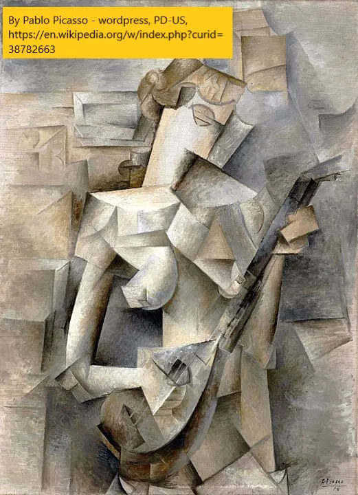

Comecei a aprender história da arte há um tempo\, para entender melhor o que eu via em museus\. Isso se transformou em aprender a desenhar\, para apreciar melhor a história da arte\. Com a recente tendência dos tokens não fungíveis \(NFTs\)\, quis compartilhar o que aprendi sobre arte hoje e depois discutir NFTs em um post de acompanhamento [^1]\.

## 1\. O que é pura arte\?

Tenho usado principalmente [smarthistory](https://smarthistory.org/ 'smart') para aprender história da arte\, embora o vídeo que impulsionou minha jornada tenha sido [this MoMa one on how to paint like Picasso](https://www.youtube.com/watch?v=rGZYfSzvPvs&list=PLfYVzk0sNiGEZXlIltPP7Yy_s5gTM7hf8 'moma')\.

Também já abordei história da arte antes\, com artigos sobre [Picasso](/writing/picasso 'picasso') e [Manet](/writing/art 'manet') Se quiser conferir\.

**A coisa mais importante que aprendi sobre história da arte foi ser mente aberta\.**

Aqui está o que quero dizer\:

Suponha que alguém viesse até você e dissesse\: \"Estou cansado da arte falsa de hoje\, quero ver arte verdadeira e pura\.\"

O que você mostraria para eles\?

Talvez você possa mostrar para eles [The School of Athens,](https://en.wikipedia.org/wiki/The_School_of_Athens 'school') uma pintura de Rafael durante o auge do Renascimento italiano no século XVI\. Com sua representação realista de filósofos famosos e uso de [linear perspective](<https://en.wikipedia.org/wiki/Perspective_(graphical)> 'perspective') para fazer as coisas parecerem 3D\, o famoso afresco é visto como uma obra\-prima que personifica o Renascimento\.

Ou talvez você rejeite temas históricos\, pensando que a arte não deveria precisar de uma lição moral\. Em vez disso\, você mostra uma pintura dos anos 1800 de Dominique Ingres que é puro prazer e fantasia\, afirmando que a arte real não precisa ser realista\. [La Grand Odalisque looks realistic on first glance, but taking a closer look shows that the spine is weirdly long, and the back leg is attached at a weird angle.](https://en.wikipedia.org/wiki/Grande_Odalisque 'wiki')

Você poderia dizer que o prazer é superficial\, e que é mais puro comemorar o sofrimento moderno\, como no século XIX de Goya [The Third of May](https://en.wikipedia.org/wiki/The_Third_of_May_1808 'may')\. É menos realista do que as obras anteriores\, com as figuras mais planas e menos acabadas\. Também não é mais uma fantasia\, já que retrata uma tragédia real da época de Goya [^2]\. Foi uma ruptura tão grande com a tradição anterior que foi chamada de \"uma das primeiras pinturas da era moderna\.\"

Mas por que limitar a pintura a mostrar apenas um instantâneo no tempo\? E se\, em vez disso\, você visse um objeto de todos os ângulos e tentasse colocar isso na tela plana\? Pense em bullet time de Matrix\, mas como pintura\; isso não seria mais fiel ao objeto\? Mostrar uma peça cubista como a de Picasso nos anos 1900 [Girl with a Mandolin](https://www.pablopicasso.org/girl-with-mandolin.jsp 'girl') seria uma boa escolha então\, com sua tentativa de mostrar alguém 3D de múltiplos pontos de vista em uma superfície 2D\.

E você poderia dizer que tudo isso é pretensioso\, e que a arte é apenas cores e linhas em tela\. Mostrar um Mondrian dos anos 1900 mostra que não devemos nos enganar com realismo\. A arte pura são formas platônicas [^3]\.

Eu poderia continuar\; existem tantos movimentos artísticos quanto criptomoedas\. O ponto principal que quero destacar\, porém\, é que a arte é subjetiva\, e manter a mente aberta é essencial\. Discutir se algo é arte ou não é uma daquelas questões filosóficas sem resposta\.

Muitos novos movimentos foram criticados durante seu tempo\, apenas para se tornarem inspiração para gerações de artistas depois [^4]\. Para muitos artistas\, ultrapassar limites é o objetivo\.

Tudo bem não gostar de algo – ainda não entendo a maioria da arte contemporânea\. Mas descartar algo só porque você não gosta vai limitar sua compreensão do mundo\. E isso não é divertido\.

## 2\. Ser flexível na arte

Também comecei a aprender a desenhar no ano passado por alguns motivos\:

- Como parte da minha busca interminável para parar de ser estereotipado [^5]
- Para apreciar melhor como os artistas criavam seu trabalho e distinguir entre habilidade e besteira
- Estava pensando em habilidades que eu poderia desenvolver por muito tempo e em outras que eu poderia continuar na velhice
- Adicione à minha caixa de ferramentas de formas de me comunicar e me expressar

Comecei com [draw a box](https://drawabox.com/ 'draw')\, e então passou para [New Masters Academy](https://www.nma.art/ 'nma')\, que ainda estou usando [^6]\. Eu trabalho principalmente com lápis e caneta\-tinteiro [^7]\.

Como observação\, se [aphantasia is real](/writing/aphantasia 'abp')\, provavelmente tenho\, já que estou com nota 3\-4 no teste abaixo\. Não foi um obstáculo ao desenhar a partir de referência\, embora possa ser um quando desenho por imaginação\.

Cerca de um ano de prática diária e 600 folhas de papel depois [^8]\, aqui está uma foto do progresso\. E sim\, eles são a mesma pessoa\:

E aqui está o que aprendi ao longo do caminho\:

**Desenhar é uma habilidade\,** E o talento é superestimado\. Eu não tenho talento\, como dá pra ver na primeira foto\. Mas a prática regular traz resultados\, e você pode melhorar aos poucos com o tempo\. Talento ajuda\, mas não é o único fator\.

**Você está desenhando\, não copiando\.** O desenho ficará sozinho depois que você terminar\, já que as pessoas não verão a referência\. Você pode e deve fazer qualquer alteração que quiser para uma peça mais interessante\. Isso me deixou menos interessado em peças hiper\-realistas\; por que não simplesmente tirar uma foto [^9]\.

**Você aprende ferramentas\, não regras\.** As aulas ensinam formas de fazer as coisas\, mas não a única maneira de fazer\.

**Pequenas coisas fazem uma grande diferença\.** Desenhar a lápis é diferente de desenhar a caneta \(experimente\!\)\. Pequenas marcas em um retrato podem mudar a sensação do desenho inteiro\.

**Correr estraga o trabalho\.** Toda vez que tentava apressar uma peça\, ficava ruim\. As melhores peças que fiz foram todas construídas pacientemente em camadas\, embora demorar muito não garanta qualidade\. E geralmente são necessários vários esboços antes de produzir uma boa peça\.

Por mais intimidador que tenha sido\, fico feliz por ter aprendido a desenhar\. Talvez eu nunca seja um especialista\, mas é muito divertido [^10]\! E todos nós poderíamos usar mais coisas divertidas para aprender\.

## Outros

1. ["San Francisco bans affordable housing"](https://johnhcochrane.blogspot.com/2021/04/san-francisco-bans-affordable-housing.html 'jc')
2. ["What I talk about when I talk about Chinese tech"](https://lillianli.substack.com/p/what-i-talk-about-when-i-talk-about 'll')
3. [Best practices for writing SQL queries](https://www.metabase.com/learn/building-analytics/sql-templates/sql-best-practices 'sql')\. É parcialmente um anúncio da metabase\, mas algumas dicas boas aí
4. [Angel investing, beginner's reading list](https://alltheangels.substack.com/p/-angel-investing-beginners-reading 'angel')
5. [How the BBC makes Planet Earth look like a Hollywood movie](https://www.youtube.com/watch?v=qAOKOJhzYXk 'yt')\, YouTube

[^1]: Sim\, perdi o prazo para fazer tudo em uma postagem só\. Para minha defesa\, estive ocupado lanchando\.

[^2]: A pintura mostra a retaliação francesa contra uma rebelião espanhola

[^3]: Ou seja\, Mondrian pensa que devemos apenas olhar e aproveitar as linhas\, cores e formas como elas são\, porque essa é a essência do que é desenhar\. Fingir tornar as coisas realistas é falso

[^4]: Dominique Ingres\, Monet\, Picasso foram todos controversos\. Talvez arte seja sobre controvérsia\.\.\.

[^5]: Com sucesso misto\, para ser sincero\.

[^6]: Eu usei [quickposes](https://quickposes.com/ 'qp') para praticar gestos também

[^7]: Uso uma linha de Staedtler Mars Lumograph de 3H a 8B \(embora não use escuros com tanta frequência\)\, uma borracha amassada\, um coto e uma Pilot Metropolitan de ponta fina\. Fiz os exercícios de drawabox a lápis\, embora você deva usar caneta de feltro\; Eu só gosto mais de lápis\.

[^8]: Eu pratiquei principalmente em um caderno de esboços de 200 páginas\, e passei por 3 desses mais um pouco mais\. Para quem tem interesse por algum motivo [here's a link](https://drive.google.com/drive/folders/1JuCf-pNB8amh2xsFSYmXyuNWUd5oBv8j?usp=sharing 'link') para todos os esboços que fiz\. As páginas estão fora de ordem porque tive dificuldades ao escaneá\-las\. Quando digo prática diária\, houve dias em que passei 10 segundos desenhando algo\, e outros dias em que passei horas\.

[^9]: Você pode apreciar a habilidade de algo sem gostar tanto quanto antes\.

[^10]: Uma leve correlação com o fato de eu conseguir rabiscar agora em reuniões entediantes\.
