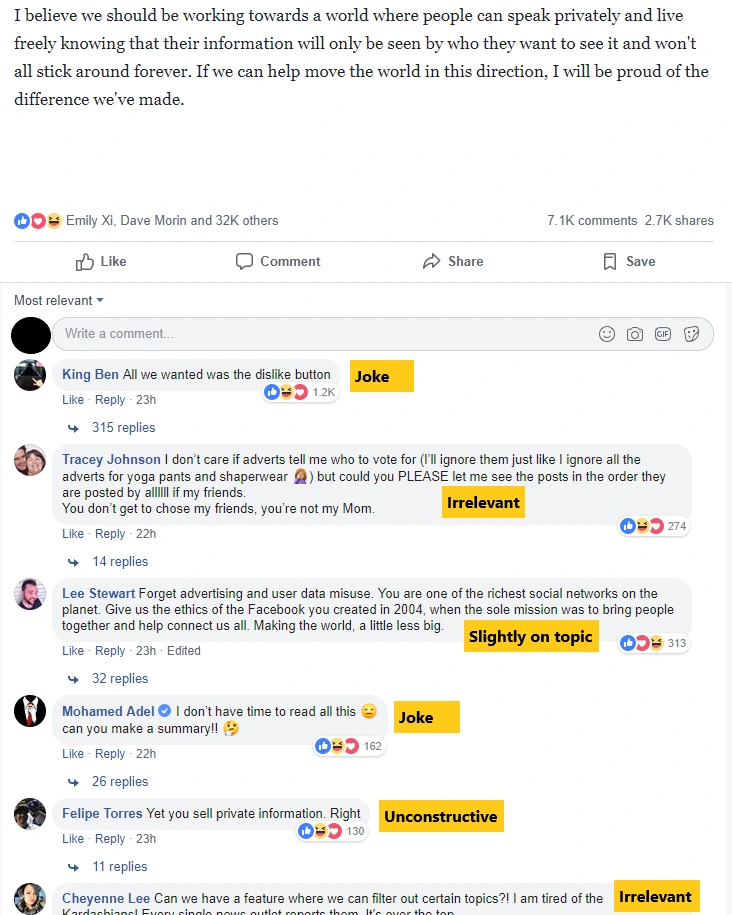
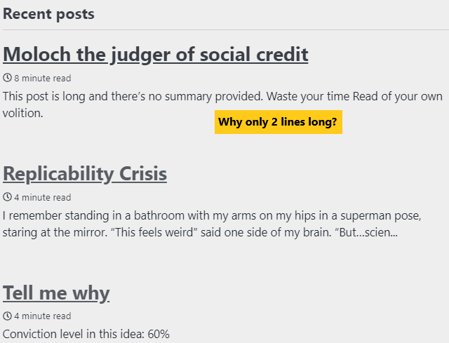

写作是自私的。

嗯，也许不是所有写作都是这样。如果你是为自己写作，且从未打算让任何人阅读，那你是个例外 [^1]\.但大多数写作都是为了让别人阅读和回应。无论是学校的论文、工作中的邮件，还是网站上的自我指涉博客文章，你都在大声喊叫来吸引读者的注意，目的通常是为了告知、娱乐或说服 [^2]\.当你想让别人读你写的东西时，你是在强行把你的想法灌输给他们。你在偷他们的时间，他们最宝贵的财富。内容创作也是注意力的占用。

不是所有写作都会以同样的强度对你大喊大叫。你用过的那份学校论文 [double spacing after each fullstop](https://www.instructionalsolutions.com/blog/one-space-vs-two-after-period 'spacing')\, [increased the font size of punctuation marks](https://www.reddit.com/r/UnethicalLifeProTips/comments/743goz/ulpt_coming_up_short_on_the_length_of_your_essay/ 'punctuation font')， 和 [messed with the line spacing between lines](https://support.office.com/en-us/article/change-the-line-spacing-in-word-1970e24a-441c-473d-918f-c6805237fbf4 'line spacing') 只是一个弱弱的呜咽，为了满足某些标准而创作，希望你被评分后再也不会被提及。但好写作，伟大的写作，会像海上风暴一样猛烈而强烈地向你袭来，要求你全神贯注 [^3]\.我们的作品很少会好，更少会是优秀的，但我们仍然希望我们的目标收件人能瞥一眼。我们想要那份偷走你时间的感觉。我们想被阅读。

然而，我们不得不面对一个不便的现实：我们的大部分文字都未被阅读。我们对着深渊大声呼喊，但深渊却没有回应 [^4]\.死一般的寂静。拿霍华德·马克斯的来说 [experience with his now-famous memos:](https://ritholtz.com/2018/10/mib-howard-marks-oaktree-capital/ 'Marks story')\:

> 马克斯以其“主席备忘录”闻名，自1990年以来一直是他的创作出口。他描述了印刷这些邮件的最初十年——字面意义上的纸张，放入带邮票的信封中，并直接寄出到世界上——但却完全没有收到任何回应。“我们甚至不知道是否有人收到了。”

那么，我们该如何处理这令人悲伤的局面？ [Marks explains how he dealt with this:](https://www.collaborativefund.com/blog/selfish-writing/ 'Marks story 2')

> 我认为答案是，我是在为自己写作。第一，这是有创造性的，我喜欢写作过程。第二，我觉得这些话题很有趣，我想把它们写下来。第三，写作让你的思维更加精炼。

摩根·侯塞尔随后阐述了他写作的理由：

> 写作是检验你的想法是否合理，还是仅仅是直觉的终极考验。关于为什么某件事会是这样的感受不需要在脑海中质疑或分析，因为它们让人感觉良好，你不想搅乱局面。

因此，我们首先应该为自己写作。这在非虚构写作中尤其适用，因为我们讨论一个想法。具体地将模糊的想法形式化，有助于我们识别理解中的薄弱环节。你以前在阐述想法时会遇到过这种感觉，比如在纸上阐述想法并发现逻辑上的漏洞，或者当 [explaining something to someone else and realising you don't understand the topic as well as you thought.](https://strategyumwelt.com/frameworks/feynman-technique?rq=feynman%20technique 'feynman technique') 有读者很棒，反馈也很棒，但我们写作时不应该假设别人会对我们说的内容感兴趣。为自己写作本身就是回报，其他好处都是积极的惊喜。我不是说要避免曝光，但要记住宣传是额外的好处，不应该成为你的主要动力。如果是，我担心你会很快感到疲惫。

这也引出了这篇文章的重点，也就是解释我开设这个博客的原因 [^5]\.我简要说明了我的理由 [in my about section](https://leonlins.com/about)巧合的是，这与上述原因相似 [^6]\.对我来说，写作的行为有助于理清思路、反思不一致之处，并综合信息。几年前，我开始整理遇到的有趣内容，并通过邮件发送给朋友。当然，我希望自己能为它们增值，但对我来说，最大的好处是，现在也是，它迫使我以简洁易懂的形式记录信息。每当有人谈论我之前写过的问题时，我的默认做法是发送相关邮件作为后续 [^7] \.随着时间推移，我增加了更多人，甚至收到了许多用心回复，这让我理解得更深。我安慰自己，因为还没有人主动要求退出名单，但我在想，这有多少是（1）觉得太尴尬不敢开口，（2）根本没看邮件。嗯\.\.\.\.\.\.

既然邮件系统运行良好，我为什么当时决定建立一个公开博客？最初是朋友推动的，后来个人情况发生变化，我变得更加认真。以下是影响我决定的利弊：

**优点：**

1. 更方便地搜索和分类我的内容。我可以按类别标记和查找帖子，也能更容易转发给感兴趣的人。Gmail搜索不够，因为邮件没有标准化的标题或标签
2. 对自己的想法负责。把我的观点表达出来会迫使我承担责任 [^8]\.你可能注意到新帖子前面的信念等级免责声明，这是我用来校准信念准确性的方法。我通常以20\%为单位对信念等级进行排名，偶尔会有5\%或95\%的推辞。我认为如果做得更细微，对我来说是错误的精确度，但我想公开表达我的观点以建立可信度
3. 打造我的个人品牌。这将是另一篇文章的话题，但我认为随着越来越多的人从工作和公司身份转向成为个人品牌，个性化趋势正在形成，比如营销和宣传领域的网红运动
4. 逼我学一点技术知识，才能把网站设置成我想要的样子
5. 内容触及更大受众并从反馈中学习的概率很低（大约20\%？） [^9]
6. 博客大规模接触受众的概率更低（5\%）

**缺点：**

1. 搭建我用的网站可能会很麻烦且耗时。下面会详细说明我遇到的困难
2. 公共内容的永久性意味着我可能会为我在这里发布的有争议观点负责
3. 潜力 [doxxing](https://en.wikipedia.org/wiki/Doxing 'wiki') 关于我的私人信息和普遍的骚扰。我一直不愿意在自己的社交媒体上发布私人信息，所以创建一个公开网站与我平时的倾向相反
4. 在失去最初的动力浪潮后，放弃了这个博客。关于写常规内容的恐惧，可以找到半认真讨论 [here](https://twitter.com/tomcritchlow/status/1103001997161185281?s=20 'twitter')
5. 写不出好材料，然后不得不大量写出糟糕的作品来完成一年的目标

仔细想想 [^10]，我本该用 [decision journal framework](https://fs.blog/2014/02/decision-journal/ 'decision journal') 想记录下来，但我想这算是个错失的机会。不过，上述利弊清单足以让我相信至少应该尝试开一个网站，看看自己是否喜欢这个体验。这又回到了我之前讨论过的，喜欢某件事的想法和喜欢实际做的事情。思考完以上内容后，是时候让我去了解了，于是我开始研究如何开始。

我有一些要求。我想要一个自定义域名，那就是 [ruled Medium out.](https://help.medium.com/hc/en-us/articles/115003053487-Custom-Domains-service-deprecation 'medium') 如果我写作是为了打造品牌，第一步就是让域名成为我自己的。不幸的是，leonlin\.com 已经被采用了 [^11]但幸运的是，加上我的中文首字母后，能以低价获得可用的名字。我是在那个名字合适的网站上买的 [namecheap](https://namecheap.com 'domain site')

理想情况下，我希望除了付费域名外，其他一切都是免费的。这排除了这个可能性 [Wix](https://www.wpbeginner.com/opinion/wix-vs-wordpress-which-one-is-better-pros-and-cons/ 'Wix vs wordpress')，显然付费层级只允许你自定义域名。Wix的功能似乎更适合搭建公司网站，而不是博客，比如格式选项、功能有限。

我也想要一个简单的网站，显然这排除了WordPress。 [Discussions](https://www.quora.com/Which-free-platform-is-best-for-creating-a-domain-name-and-hosting-website-WordPress-Weebly-or-Wix 'quora') [online](http://perfectionkills.com/moving-from-wordpress-to-github-pages/ 'moving from wordpress') 提到了WordPress的稳定性和更新问题，我不想面对这些问题。我没理解其中一些评论和功能，但感觉WordPress臃肿且运行缓慢。

我还想要一些自定义，理想情况下能学点轻量的编程。这让我选择了Github页面，它似乎满足了我所有的条件，只要我愿意花时间学习如何搭建网站。使用Github页面的一个优势是我可以亲自了解一个在技术社区中很受欢迎的应用，希望能弄明白它受欢迎的原因。另一个优势是Github页面是一个静态的网站生成器，显然意味着加载简单快捷。还有一个庞大（但令人困惑！）的自定义主题库，既能帮助设置，也能进行调整，更新也应该很简单。幸运的是，GitHub有桌面功能，不需要我本地安装Ruby或gem文件，虽然功能有所减少，我似乎无法在网页上删除文件夹 [for some reason.](https://stackoverflow.com/questions/14237674/how-to-delete-files-in-github-using-the-web-interface 'deleting folders')

存在无数种 [other options](https://stackoverflow.com/questions/22035938/alternatives-to-github-pages 'alternatives') 除了Github，但考虑到支持量和我的需求，我选择了Github Pages。如果我改变优先级，可能会决定迁移，但到目前为止它运行得还不错。

我知道自己想用什么，所以是时候开始设置了。创建账户很简单，但之后我很快就迷失了。更糟糕的是，关于如何真正运行网站的详细信息分散在不同网站上，有时也过时了。我会在网上找到一些印度YouTuber的有用教程，然后才知道gh\-pages分支是 [no longer required](https://stackoverflow.com/questions/35978862/github-pages-why-do-i-need-a-gh-pages 'no more gh-pages') 而他做的一半步骤现在都无关紧要了。我会找到五种不同的自定义域名设置方式，但都不适合我这个简单的情况 [^12]\.人们对是否要做有强烈的看法 [include the www in a domain name](https://www.yes-www.org/why-use-www/ 'www usage')

我考虑了一段时间的一个功能是是否允许评论。我最终放弃了，因为根据我的经验，公开帖子的评论区往往沦为垃圾信息或无关紧要。例如，看看扎克伯格最近关于Facebook新优先事项的帖子中的热门评论：

我对评论的看法是 [shared](https://optinmonster.com/to-allow-blog-comments-or-not-heres-what-the-data-shows/ 'nice but not necessary') 作者 [others](https://avc.com/2019/02/rethinking-avc/ 'avc comments')\.理想情况下，有一个独立的管理论坛，尽管我怀疑这个博客是否会流行到需要这样做。与此同时，有兴趣讨论这里内容的人可以通过推特给我发邮件或私信。

我花了比我愿意承认的更长时间来选博客的主题。我最终选了 [Minimal mistakes](https://mmistakes.github.io/minimal-mistakes/ 'minimal mistakes')，这个版本干净、可定制且免费。我花了不少时间编辑代码，才让它看起来像现在的状态，这既是我对简单布局的偏好，也是我放弃了一些我无法修复的功能：

**还有一些我还没解决但不知道怎么解决或还没查过的问题：**

1. 为什么帖子预览只有两行？（见本列表末尾的图片）

2. 有没有办法在我还在草稿阶段时检查我的帖子拼写？

3. 我该如何在草稿帖子中搜索一个词，比如查找或替换功能？

4. 在手机上，邮件和推特信息会合并成一个标有“关注”的按钮。这显然和RSS订阅的“关注”部分是同一文字，所以将标签编辑成“信息”会导致RSS订阅标题出现混乱。

5. 在子点内缩进图片和引言似乎不可能？例如，我本想在第一个项目符号后面插入帖子预览图片，但这会打乱编号

6. 有没有更好的方式来预览帖子？保存后的常规预览没有显示所有格式，而且似乎没有“查看未发布草稿”选项

7. Github 的主要功能之一是通过提交进行更新。我仍然不明白这一点，也不知道如何在不逐个复制每个文件的情况下，将主主题上的提交推送到我的仓库。帮助。

设置一切非常令人沮丧，甚至连添加上面那些图片这么简单的事情也花了不少时间。我还不后悔这个决定，因为我已经学到了一些关于网络运作的小细节，也有了产品可以展示给我的学习成果 [^13]\.另一个惊喜是，我现在有了正式的记录系统，记录未来想写的想法和文章，因为我意识到保持清单会很有帮助。正如保罗·格雷厄姆所说，互联网可能会让这成为 [golden age of the essay](http://www.paulgraham.com/essay.html 'essay')这进一步支持了我的个人品牌和个性化论点。我对这个想法的未来感到兴奋，也希望能继续写作。

**话虽如此，以下是一些预测：**

- 80\%的概率这个博客一年内只有\<100名读者）
- 这个博客三年内获得相当数量的追随者（\>1000名读者）的概率是20\%
- 这个博客一年内有5\%的概率能有一篇被广泛分享的文章（\>1000名读者）
- 80\%的概率这篇博客一年后还会更新
- 3年后这个博客仍有60\%的概率会更新

正如你所见，我对这个网站的受欢迎程度并不看好。也许这是一种自然的对冲，但我认为经历思考、写作和修正我的想法的过程，可能是这个实验最可能的结果。这就足够让我去做了。

归根结底，我的写作只属于我自己。

我的写作很自私。

## 附录

我原本想详细讨论保罗的著作，但找不到合适的方式将其插入文章中。以下是我觉得有趣的几句话：

> 当我把一篇文章的草稿交给朋友时，我想知道两件事：哪些部分让他们觉得无聊，哪些看起来不够令人信服。那些无聊的部分通常可以通过删减来解决。

> 试图说服人的写作可能是有效（或至少不可避免）的形式，但从历史角度看称之为散文是不准确的。散文是别的东西。\\\[\.\.\.\\\] 散文是你写来试图弄明白某件事的东西。弄明白什么？你还不知道。所以你不能从论点开始，因为你没有论点，也可能永远没有。

我对此不太确定。你还是在努力表达观点。不过这可能是语义问题。

> 为什么不坐下来好好思考呢？这正是蒙田的伟大发现。表达想法有助于形成它们。事实上，“帮助”这个词太弱了。我写作时才想到的大部分内容。这就是我写作的原因。

很高兴看到大家同意我上面讨论的内容

> 你发表的一篇文章应该告诉读者一些他之前不知道的事情。

> 我更愿意读一篇出乎意料但有趣的文章，而不是一本按规定路线走的文章。

前提是导演很有趣，这大概是他论点的核心。避免让人觉得无聊？

> 所以如果你想写论文，你需要两个要素：几个你思考过很多的主题，以及具备挖掘意想不到内容的能力。

我觉得很多这些都源于阅读和与各种人的交流

> 酷的关键之一是避免缺乏经验让你显得愚蠢的情况。如果你想发现惊喜，应该反过来。多研究不同的东西，因为最有趣的惊喜往往是不同领域之间的意外联系。

我写过关于这些的 [specialisation vs generalisation](/writing/specialist 'post link') 之前

> 任何人都可以在网上发表论文，而评判，正如任何写作应有的，都是根据内容来评判，而不是写者是谁。你凭什么写x？你就是你写的什么。

我同意互联网帮助好点子凭借价值成功，尽管名人的想法传播本身就比冷门人有优势。出版成本降低确实意味着你的创意可以更长时间地被发现。幸运的话，你会得到想要的回应，尽管这不能成为你的主要动力。

[^1]: 日记可能是这里的大例外，尽管即使是最畅销的日记也是写的 [with intent on publication,](https://www.annefrank.org/en/anne-frank/go-in-depth/two-versions-annes-diary/ 'anne frank two versions') 这让我很惊讶。我没有公开写作材料和私人写作材料比例的统计数据，但假设大多数写作材料都是供他人阅读的。甚至 [writers famous for being reclusive](https://www.telegraph.co.uk/books/what-to-read/the-late-harper-lee-and-five-other-reclusive-authors/ 'reclusive authors') 他们最终还是发表了自己的作品。这里存在选择性偏差，因为它们出名是因为发表过，但我认为人们写作是为了被阅读。就是这样 [list of quotes](https://www.aerogrammestudio.com/2014/03/27/why-i-write-23-quotes-famous-authors/ 'why i write quotes') 著名作者们关于为什么他们写作相关值得浏览的文章，我尤其喜欢以下几句话：

> “写作是我表达——从而消除——我们可能犯错的各种方式的方式。”——扎迪·史密斯

> “当我坐下来写书时，我不会对自己说，\'我要创作一件艺术品。\'我写它是因为我想揭露某个谎言，某个事实我想引起注意，我最初关心的是获得一个听力。”——乔治·奥威尔

> “我写作是因为只有读懂自己说的话，才知道自己在想什么。”——弗兰纳里·奥康纳

[^2]: “作者目的”，正如我们中有些人可能被教导的那样。稍微让人恼火的是，快速搜索作者目的时会出现 [different](http://www.mdc.edu/kendall/collegeprep/documents2/author's%20purposerev818.pdf 'purpose 1') [categorisations](https://www.lancasterschools.org/cms/lib/NY19000266/Centricity/Domain/451/B1.pdf 'purpose 2')，尽管大多数在一定程度上有重叠

[^3]: 写得很棒 [stays with you](https://www.reddit.com/r/books/comments/88ike0/whats_your_favorite_quote_from_a_book/)\.

[^4]: 对一词含义的扭曲 [quote](https://en.wikiquote.org/wiki/Friedrich_Nietzsche 'abyss') 但我认为这有助于说明我的观点。我认为这既适用于学校、工作，也适用于已发表的写作。想想你自己有多少次浏览论文、扫描邮件，或者只是瞥见一篇文章的标题。我相信大多数写作从未被完整阅读过。

[^5]: 真是太棒了 [burying the lead huh](https://www.merriam-webster.com/words-at-play/bury-the-lede-versus-lead 'lede or lead')

[^6]: 在建立这个博客之前，我并没有看过Marks和Morgan的评论\;我是在写这篇文章之前偶然看到它们的，正好是个巧合

[^7]: 坦白说，这很懒，不过我想自我宣传也无妨

[^8]: 也有同感 [Fred](https://avc.com/2019/03/being-wrong/ 'being wrong') 以及 [Howard](http://howardlindzon.com/where-were-you-on-march-9-2009/ 'where were you') 在他们的博客上

[^9]: 我勉强把我的邮箱和推特信息放到了博客上，看看有没有帮助

[^10]: 写作如何帮助思考的实时示例

[^11]: 而那个人似乎只是把这个网站占在地上，直到2020年，作为一个半完成的学校项目的一部分。我想我本可以提出买断他的股份，但我觉得我的名字价值不高\.\.\.\.\.\.

[^12]: 尝试了几次才把自定义域名绑定到博客，网上的教程似乎都没有我用的设置

[^13]: 我之前在某处读过一套原则，有人说过一份每个人都应该知道的事项清单，而搭建网站和自定义域名就是其中之一。我记不清是谁或在哪里看到的，这很遗憾，因为那份清单上还有其他有趣的评论，但这让我印象深刻，觉得值得学习。
