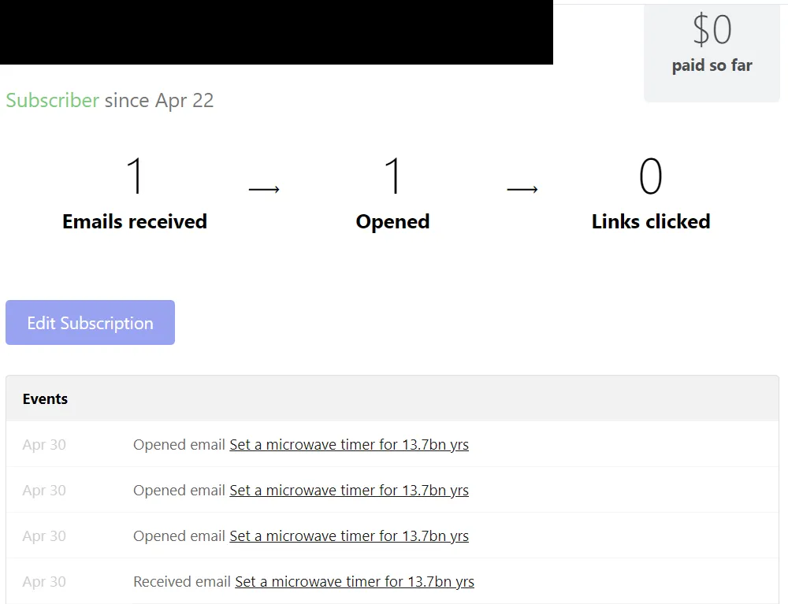
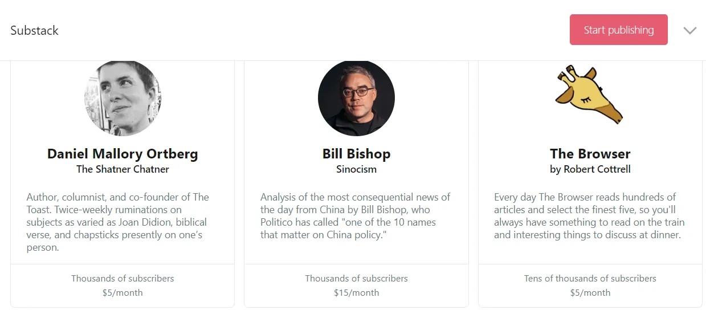

我已经 [previously described](/writing/write 'why write') 我开设公开博客的理由。除了这个网站，我最近还注册了Substack来发布我的 [monthly newsletters](https://avoidboringpeople.substack.com/ 'substack')\.在加入Substack之前，我一直直接给分发列表发邮件。

在这篇文章中，我会介绍：

1. 我从私人邮件转向Substack的原因
2. Substack 的其他优势
3. 产品可能改进
4. 其他更不可能的暗示

## 我转用Substack是因为以下好处

1. 这是一种管理邮件列表的简单方式，而不是每次都复制粘贴邮件，避免忘记添加或移除订阅者。

   > 你可以通过Substack建立邮件列表，随时带着它。如果你已经有邮件列表，可以通过设置点击按钮导入。

   

   导入列表后，您可以查看每位订阅者的状态及其近期活动

   

   你可以点击每个订阅者查看更多详情，并编辑他们的订阅类型

   

2. 对于不感兴趣的读者来说，退订方式更简单，也比直接给我发邮件更不尴尬 [^1]\.

   

   我更希望文本能更明显一些，而不是稍微隐藏。是的，我确实想让人们更容易取消订阅。人们不喜欢垃圾信息，我也不想把内容发给不想要的人。如果可以的话，我会把取消订阅选项直接放在通讯开头。我知道我可能是少数有这种感觉的人。

3. 更专业的新闻通讯，更易包含丰富的媒体内容。

   > 很容易将YouTube和Vimeo的视频、Spotify曲目和推文嵌入到你的帖子中。只需复制粘贴相关网址，嵌入效果就会如魔法般自然出现。你还可以拖拽图片和动图。

   

   比起往Gmail或这个网站添加媒体要简单得多。动图制作 [LICEcap](https://www.cockos.com/licecap/ 'LICEcap') 顺便说一句。

4. 对我的读者群体进行分析，比如点击率。我猜随着功能增加，这会有所改善。

   

5. 最终变现的潜力 [^2]\.商业模式也很简单，Substack在你开始向订阅者收费后会抽10\%的佣金。Substack还允许你按月和按年定价。付款通过Stripe处理，如果你还没有账户，需要在那里注册。

   > 一旦您将 Stripe 账户连接到 Substack，我们将可靠且安全地管理您的支付。

   

## 我喜欢的其他东西包括

1. 客户服务是为了让你不用自己处理行政问题。

   > 如果有人在信用卡、登录或其他任何方面遇到问题，我们会代表你通过以下方式解决问题 support@substack.com\.

   我还没用过，但如果将来需要，有它挺好的。

2. Substack 上的“关于”和“感谢订阅”页面预先填充了内容，我可以调整以便快速搭建服务，而不是空白表单，需要我从零开始创建更多内容。我觉得这是一个贴心的小细节，让设置过程更轻松。

3. 还有排行榜可以帮助推广最受欢迎的内容，如果你能在排名中攀升，这可能形成良性循环。Substack声称这有助于发现，不过我在本文后面还有一个建议。

   > 排行榜帮助读者发现优秀的出版物，也帮助出版商找到新读者。

   

   还有顶级出版商的简短介绍 [^3]\.

   

4. 你的新闻通讯欢迎页面会提示读者订阅，但不会强制触发这个问题，这对我来说很合理。我不想在没有先看过样本的情况下订阅。

   

5. 注册出版社后，创始人也会提供他的联系方式，以防你在常见问题中得不到答案。我还没试过发邮件，所以不知道他们是否真的回复。

   

6. 如果你想面向更企业化的受众，还有一个团体订阅功能。

   > 如果你认为组织、公司或其他机构可能想为其会员购买多个订阅，你可以出售团体订阅。

## 我也认为以下内容可以改进

1. 似乎没有简单的方法可以把整个邮件列表上传成免费订阅者，因为表单只能一次上传一封邮件。上传邮件后，我不得不手动切换所有读者群的订阅设置 [^4]\.这更让人烦恼的是，我无法同时切换多个读者的设置，只能逐个调整。如果能同时编辑多个订阅者的功能会更好。

   

2. 上传旧帖也很麻烦。由于编辑版块的日期和时间设置更深层，上传帖子和逐篇回溯到我想要的正确日期需要时间。我只有几篇帖子，但我无法想象一个发表历史更长的人会费心把旧内容放上正确的日期。

   > 最后，如果你从其他网站的存档导入文章，可以追溯发布日期，使其按正确顺序和发布日期关联。发布文章后，进入该帖子的设置（发布按钮左侧），选择目标日期

   

3. 我最初在创建账户和登录时遇到了一些问题。我不明白为什么默认选项是“邮件登录链接”，这导致我一直循环通过邮件请求链接，结果被引导到同一个登录页面和提示。这让我很困惑。

   

4. 主页有一个指向博客的链接，提供了更多关于该服务的信息。不过，一旦你点击进入博客，就没有直观的方法能直接回到 substack 主页，除非按下浏览器返回按钮。下拉菜单无法让你返回，主文中也没有返回按钮。

   

5. 似乎没有办法编辑帖子的网址。在下面的例子中，我在编辑“即将发布”的占位帖，但尽管更改了帖子标题，仍无法修复链接。

   

6. 他们能简单地用鼠标悬停说明“打开”和“点击”的定义也很有帮助。我猜这和我们用常识思考的差不多，但如果能更清楚地理解一下会更好。

## 我还有以下额外的建议

1. 如上所述，有排行榜固然不错，但无法发现新内容。也许可以加一个“热门”订阅者快速增长的栏目？或者由Substack团队策划的定期轮换一些不太知名的出版商？是的，我显然有偏见，作为一个较小的出版商。

2. 我喜欢 [this page](https://on.substack.com/p/what-you-get-when-you-start-a-substack 'substack features') 它讲了Substack的所有功能，但需要更容易找到。

3. 有一个谷歌文档，出版商注册后会共享，里面有有用的信息。这应该是一个独立的网页，方便大家参考。举个例子，我已经丢失了它的链接。

4. 密码重置链接只需要我输入一次新密码\;它应该要求我确认或重新输入新密码，以减少错误的密码重置。

5. 有没有简单的方法可以做链接脚注？

6. 他们会重新考虑添加自定义域名吗，还是说这太麻烦了？而且缺乏更高级的自定义功能，我猜这是刻意为之。

Substack 提供免费的新闻通讯服务，设置相对简单，外观专业，并且有对订阅者基础的有用分析。我很喜欢用它来做我的 [monthly newsletters](https://avoidboringpeople.substack.com/ 'substack') 到目前为止，这比简单的邮件有了很大进步。我仍会继续用Github Pages作为主网站，因为它提供了更高的自定义功能，比如自定义域名、独立页面布局或格式化。不过，Substack里有很多值得喜欢的地方。

[^1]: 不过，到目前为止，我唯一的退订是朋友告诉我他想先退订再取消订阅，所以我不确定这是不是按预期运作\.\.\.\.\.\.

[^2]: 这句名言无论成功还是失败，都会让人觉得很久了

[^3]: 不过如果你不在名单里，我不知道怎么拿这些

[^4]: 通过上述订阅者资料页
