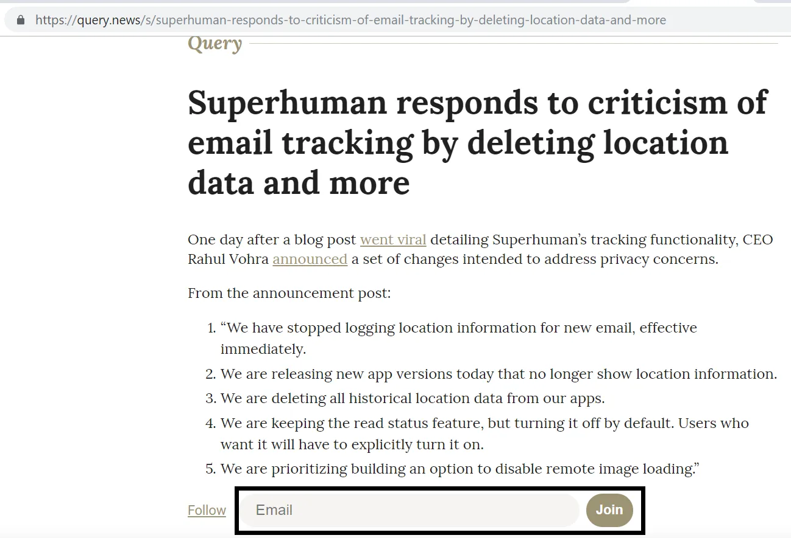

一位朋友最近启动了一个新项目， [Query News](https://query.news/ 'Query')\.这是项目的介绍和我的一些建议。

## 攻略

Query 想成为什么？ [Based on their own words:](https://query.news/s/we-launched-kinda)

> 把它称为Quora，以获取及时新闻，准确吗？

> 差不多是这样！只是我不太确定它到底想成为什么。但Quora绝对是一个很好的起点。我们对Quora最大的顾虑是关于竞争答案和协作回答的模式。我觉得鼓励更多协作可能更合理。不过我们拭目以待吧！

所以目前的目标是为新闻事件实时提供问答形式。人们会提出他们对某个话题的问题，然后有人（谁？）来回答。

登陆页很简单，按时间顺序排列问题，最近一天放在前面。我不确定问题在当天内是如何排序的。我猜问题发布后顺序会固定，因为更新时间似乎不会影响顺序。网站在手机端上运行也很好。

点击各个主题会进入更详细的问答页面。每个问答页面都有自己的网址。该页面包含新闻主题的简短总结、来源引用，随后是问题目录和问题本身。

有多个提示可以提问，简单直接输入问题栏即可。据我所知，这个问题没有立即审核，你的问题会立即发布到页面上。该网站让你提问变得简单。

例如，当我发布下面这个问题时，页面刷新后它会弹出问题列表底部，页面在发布后自动刷新。

目前看起来你不能直接自己回答问题，但你可以“建议更新”，这样你的评论会发送给编辑：

你可以自己浏览当前的主题和问题列表 [here](https://query.news/ 'Query')看看有没有你想评论的。这听起来是个有趣的想法！大多数新闻都是单方面的，试图向大众传递信息。在线评论区通常是灾难。通过让讨论成为网站的重点，而不是附加产品，希望能带来更有成效的使用场景。如果你曾经读到某样东西时想“那X怎么办”，Query会对你有帮助。

大规模化后会是什么样子？它可以按主题领域设立独立板块，由经过验证的账号发布新文章，接收感兴趣读者的提问，然后回答这些问题。这样就能成为查询 _遗址_ 这里可以实时获取各种主题的信息，你可以深入挖掘并调查故事的发展。

接下来是问题和建议！

## 问题

1. 这和Quora有什么不同， [Hacker News](https://news.ycombinator.com/ 'HN')，或者 [Reddit](https://www.reddit.com/)\?
   - 看起来他们有意比 Quora 更协作（见上文），所以我猜他们会开发一个功能，允许多个编辑回答一个问题
   - 如果是这样，我猜他们不会允许线程对话，而是把所有内容合并成每个问题的一个答案。这和Hacker News和Reddit不同
   - 也许我们可以把这里看作是Quora X Wiki，实时获取新闻？
2. 他们将如何扩大规模？
   - 审核问题（以及回答，一旦实现此功能）需要手动编辑，而且并非每个网站都有 [Steven Pruitt](https://www.cbsnews.com/news/meet-the-man-behind-a-third-of-whats-on-wikipedia/ 'Steven')\.部分垃圾邮件可能会自动删除，但通常会有一定的人工审核
   - 他们如何决定谁回答问题，谁在某个领域有足够的专业知识发表评论？
3. 所有利益相关者有哪些激励措施？
   - 致创始人们， [I think they want to create an experiment and see if there's demand from people to read news in a different format](https://query.news/s/we-launched-kinda/q/what-are-your-short-term-goals-for-the-query#q-52 'ST goals')
   - 对于提问者来说，是为了获得更多信息（理想情况下比普通新闻更少偏见），由专家回答
   - 为了最终回答者，为了建立声誉？好感？建立地位？
4. 如果他们允许别人回答问题，是不是意味着人们需要随着时间创建账户？
   - 也许问题仍然可以自由流畅匿名，但也许获批的账号可以编辑答案？
   - 意图是呈现一个统一的“查询新闻”声音来回答，还是展示对问题的多重观点？

5. 会有图片功能吗？

6. 是否也需要调节回答的质量？
   - 我不确定像Quora或Reddit这样的点赞\/反对系统是否违背了这个网站的初衷

## 建议

1. 固定 [Query self-referential Q&A page](https://query.news/s/we-launched-kinda/ 'Query Q&A') 在首页。第一次访问首页的人不会清楚网站内容。在顶部设置“关于”标签，可能有助于人们理解网站的意图，也可以是一个简单的问答页面链接。

   

2. 澄清一下“关注”选项具体起到什么作用。我不确定输入邮件后，是订阅了该新闻主题的所有问题，还是订阅了Query上的所有问题，或者只订阅了该主题的一个问题

   

   即使点击了“关注”，我也不知道加入应该做什么：

   

3. 给问题打标签和提供搜索功能似乎会很有帮助，甚至在它的发展过程中是必需的

4. 针对各个问题都有单独的分享按钮，但主新闻话题本身没有？

5. 我猜这已经在规划中，但最终允许人们自己发布新闻话题似乎是合乎逻辑的下一步。

6. 有没有办法通过RSS订阅获取这些信息？看起来他们最近把它做成了新闻通讯格式。
