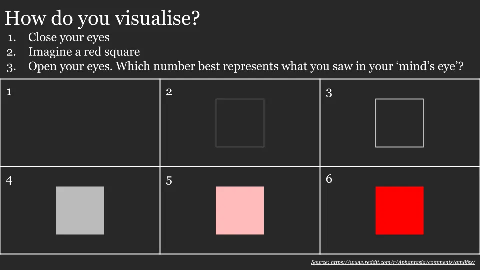

## 你能多清晰地想象某件事？

我刚了解到，人们的视觉化方式不同。做这个10秒测试：

我是3到4分，而我表妹坚称她是6分 [^1]\.这很大程度上解释了我为什么每次别人让我去想象事物时的困惑\.\.\.\.\.\.我从未能得到别人那种细节和清晰度。

**对于那些得1分的人来说，你很可能已经有了 [aphantasia](https://www.bbc.com/news/health-34039054 'BBC')，一种你无法想象心理图像的状态。** [There's skepticism over whether it's real,](https://www.reddit.com/r/slatestarcodex/comments/ab1fi4/is_aphantasia_real_exaggerated_or_a/ 'reddit') 但研究看起来很有说服力。那个 [initial paper](https://www.researchgate.net/publication/26792259_Loss_of_imagery_phenomenology_with_intact_visuo-spatial_task_performance_A_case_of_'blind_imagination' 'older') 研究了一个最初视觉记忆较强但后来失去的人。既然他能谈论自己两种状态的明显差异，我倾向于认为这是一个真实存在的现象。

研究估计有2\%的人口患有心像缺失症，极少数人处于极端（超心象），大多数人处于中间状态，且具备良好的视觉化能力。

[The newer paper](https://www.eugencpopa.ro/wp-content/uploads/Afantazia-.pdf 'newer') 有一份问卷，比我上面的简单测试更科学，你可以看看以确认。我推测分数\~30或以下表示心像缺失，接近80分则表示超心像 [^2]\.

那天我意识到我的思维方式和大多数人完全不同，那是很有趣的一天！奇怪的是，我可能一辈子都不知道，因为这不是你自己能发现的。加上低发病率，难怪科学界花了这么久才意识到无心像症的存在。

更奇怪的是，尽管我知道了这份真正改变人生的事实，我却看不出自己有什么会改变。 [It doesn't seem like you can learn to get better](https://www.scientificamerican.com/article/when-the-minds-eye-is-blind1/ 'learning')暗示我们都被困在自己成长（或者出生时的环境）里。

到目前为止，似乎也没有太多负面副作用 [^3]\.知道这些 _具有_ 不过每当我读到或听到别人谈论用想象力时，这让我没那么困惑了！记得告诉我你是怎么得分的！

[^1]: 我还没排除这是她一个极其精心设计的恶作剧\.\.\.\.\.\.我也意识到，对于有正常视觉能力的人来说，这远没有那些想象能力低、一直怀疑自己一生中出了问题的人那么有趣

[^2]: 第9页的两个图表在32 VVIQ附近明显有断点，最高得分是80

[^3]: 除了那种令人沮丧的事实——我永远无法达到大多数人那种生动的画面能力。
