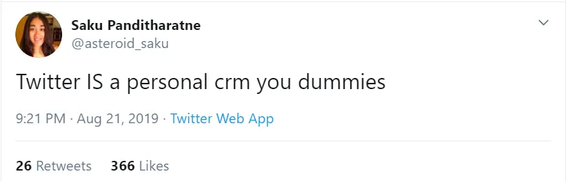
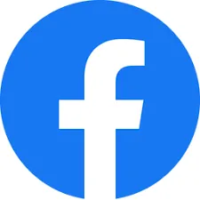

## 要点

1. 在泡沫中找到一对交易对可能比做空或乘势而行更好
2. 什么是个人CRM，为什么人们会谈论它？
3. 我们对自己了解得并不深\;如何提升自我意识

### 泡泡与俄罗斯间谍

鉴于今年关于气泡的各种新闻，我想重点介绍一下 [Byrne Hobart's post about them.](https://medium.com/@byrnehobart/so-youve-spotted-a-bubble-3f2fa5cf49a9 'Bubble') [^1] 如果你认为某资产当前价格代表泡沫，你该怎么办？伯恩在下面提出了三种观点。一如既往，这些都不是财务建议。

> \\\[首先：\\\] 勇敢、愚蠢且智力一致的方法。你可以直接做空。\\\[\.\.\.\\\] 但这很难，因为通常泡沫资产的定价是让它们获得比同等资产更高的回报，只是回报还不够高以抵消风险。\\\[\.\.\.\\\] 泡沫也往往存在很长时间，尽管它们本身不稳定，因为它部分自我延续。

短头 [^2] 很吸引人，因为你在逆向，承担理论上无限的风险，以证明你在智力上优于普通愚蠢投资者。 [There's even an oscar nominated movie about shorting the 2008 housing crisis](<https://en.wikipedia.org/wiki/The_Big_Short_(film)> 'movie')\.做空的问题在于时机至关重要。你可以做空，但你可能太早，结果依然爆红。有很多臭名昭著的做空让投资者损失了数十亿美元，比如 [Ackman and Herbalife](https://www.cnbc.com/2018/04/05/how-bill-ackmans-hedge-fund-empire-crumbled-in-less-than-three-years.html 'Ackman')\, [Einhorn and Netflix](https://www.forbes.com/sites/antoinegara/2019/03/05/after-horrendous-investing-run-david-einhorn-exits-billionaire-club/#3a140043498c 'Einhorn')，或者 [whoever was short squeezed by Porsche and Volkswagen in 2008.](https://www.reuters.com/article/us-volkswagen/short-sellers-make-vw-the-worlds-priciest-firm-idUSTRE49R3I920081028 'Porsche') 请注意，我并不是说阿克曼和艾因霍恩对这些公司的看法是错的。他们可能仍然正确，但他们在此期间亏损了太多钱，这已经无关紧要了。

我们再举 Overstock\.com 为例。在他们之前 [CEO resigned so he could let everyone know he'd dated a Russian spy,](https://www.forbes.com/sites/laurendebter/2019/08/22/the-exclusive-inside-story-of-the-fall-of-overstocks-mad-king-patrick-byrne/#176918ea53a5 'Forbes') [^3] 他在2017年试图通过转向区块链来拯救公司。假设你认为Overstock也会失败，并在2017年8月以20美元做空Overstock：

随着股价缓慢上涨，你加码，坚信这种状态不会持续太久。不知怎的，它确实持续了，你看到的是2017年11月的60美元价格：

哎呀。你不仅有纸面亏损，而且你的风险暴露是你最初持有且舒适的倍数。如果你现在清仓，你会损失40美元——当前60美元减去你最初赚的20美元。你现在怀有仇恨，决心做空这只股票，否则会破产，所以你坚持到下一年：

你的经纪人度假回来后发现忘了给你发一张 [margin call](https://www.investopedia.com/ask/answers/05/shortmarginrequirements.asp 'margin') 这段时间，现在却慌了。做空股票时，通常需要约130\%的股票价值作为抵押，作为备用资金 [^4]\.当股票价格为20美元时，预留26美元并不是问题。但现在，你需要预留104美元，经纪人要求你补足78美元的差额（104美元减去26美元）。根据你最初拥有的资金，这额外的78美元（是初始敞口的3倍！）很容易让你破产。你被迫清仓，并通过设置Go Fund Me来弥补差额。

然后当然会发生这样的事：

关键是你说得对——Overstock尝试的区块链枢纽行不通。但你时机错了，损失了资金和声誉。即使做空股票是“显而易见”的，比如 [bad quality companies changing their name to get a price bump](https://www.winton.com/longer-view/the-history-of-company-names 'names')， [time period](https://www.sciencedirect.com/science/article/pii/S0165176519301703 'time') 论文的必要条件可能会让你提前破产。

有趣的是，著名的做空者 [Robert Wilson and Jim Chanos have this to say about shorting:](https://blogs.cfainstitute.org/investor/2016/12/22/lessons-from-a-legendary-short-seller/ 'short')

> “我会说从头到尾，\\\[\.\.\.\\\] 我可能在短裤上打平了。”

> “一个好的空头投资组合能让你做更长的\.\.\.\.\.\.这正是我们工作的核心。”

明确来说，我并不是说要避免做空，或者做空对经济有害。 [There's research](https://marginalrevolution.com/marginalrevolution/2019/08/short-selling-reduces-crashes.html 'short MR') 这表明它可能不错，很多人靠短片赚了钱。我是说，这很难做到完美。

有什么替代方案吗？

> \\\[第二：\\\] 雇佣兵式但盈利的方法。\\\[\.\.\.\\\] “我们很乐意成为泡沫的一部分，但选择高度流动的仓位，这样如果想退出市场，我们就能迅速退出。”

在这个版本中，你尽量尽量长时间地乘风，然后尽量晚些时候下船 [^5]\.在我看来，这似乎是大多数专业投资者现实中所做的，尽管他们不断宣称自己是长期持有者。但如果有效，那就有效，而且有很多成功人士采用了这种策略。

> 由于只用一个杠杆做这件事很危险，他们会一次性选几个，希望不会同时全部崩盘。这种分散投资让他们能够稍微提高杠杆，从而获得回报。\\\[\.\.\.\\\] 随着风险的测量上升，他们想要降低杠杆。但降低杠杆意味着同时平仓多笔交易 \\\[\.\.\.\\\] 会损害跟随你策略的交易者的回报，提高相关性，迫使他们卖出更多。

缺点是当你在几次投注中太晚时，公司设定的风险参数限制你每次可亏损，不得不被迫撤仓。这有点像是快活早死，换个名字的新基金。

> \\\[最后：\\\] 涅槃：正向携带与正向偏移。我将谦逊地提交我对刘易斯错了的观点：《大空头》其实不是一笔伟大的交易。如果他真懂，他早就写了《大配对交易》。\\\[\.\.\.\\\]

拜恩以住房危机为例。住房危机的一个因素是贷款被打包成大池，假设它们无相关性。事实证明，次贷的相关性比预期更高，这意味着：

> 这意味着AAA评级的次贷支持CDO片段实际上并不配得AAA评级。但这也意味着风险最高的部分——股票分段，风险比看起来低：证券池内高相关性意味着大规模违约的可能性更大，但也意味着零违约的可能性更高。

由于证券相关性更高，你很可能不仅在下跌上看到更极端的事件。换个例子来说，

> 投资者可以买入一小部分股权，购买针对AAA级债务大块的保险，最终获得\\\[\.\.\.\\\]：

> 股权的回报远远弥补了购买AAA评级分片保险的成本。

> 如果房地产价格上涨，它会赚点钱，因为资产价值更高，而AAA保险的价值也不会低多少。

> 如果房地产下跌，它会赚很多钱。

Byrne总结说，并非所有泡沫都有上述第三种情况，且很难找到利用泡沫的建仓策略。如果能做到，可能是处理泡沫风险较低的策略。

### 别担心，你是我个人CRM里的5级联系人\\\*\\\*

发展 [Superhuman](https://techcrunch.com/2019/06/27/my-six-months-with-30-month-email-service-superhuman/ 'techcrunch')一款收取费用以换取所谓革命性体验的电子邮件应用，引发了一场热潮 [premium subscription services](https://techcrunch.com/2019/08/27/kleiner-perkins-bets-on-a-premium-email-service-thats-bringing-slack-groups-into-gmail/ 'kleiner')\.最近，科技推特重新提出了个人CRM（客户关系管理）的概念，即一种可以帮助你管理个人关系的软件。

\)

意见分歧。有些人\.\.\.\.\.\.态度冷淡

还有人声称Twitter已经是一个个人CRM平台

[And some people pointed out how this recurring idea continues to attract new startups](https://twitter.com/devahaz/status/1164224618602758144 'twitter')

轻视很容易。为什么人们会想要那些追踪你所有关系、保存所有互动、让你所有生日祝福显得做作和不真实的可怕软件？

哦，等等。

无论你是否认为 [Facebook has Zucked the world](https://www.theguardian.com/books/2019/feb/07/zucked-waking-up-to-facebook-catastrophe 'FB')它的成功告诉我，人们确实需要一种方式来管理个人关系。个人CRM并不是一个愚蠢的想法，我也不会直接否定它。难点在于如何在现有系统上创新，以及如何让人们为此付费。

与人保持联系的便利让我们感觉 _应该_ 保持联系。我们以前总能用“哦，你没收到我的信？真奇怪，可能是邮政系统的问题”来为我们缺乏联系找借口。但现在我们没有那种奢侈了，只能努力应对看起来在乎你朋友第50个怀旧周四Instagram帖子。我们感到不知所措。

要求个人CRM的人希望能记住他们认识的人，知道他们分享过的相关背景，提醒你重要日期，并提醒你偶尔联系某人，同时保持高度的隐私和安全。我能理解为什么有人对这个想法感到愤怒，因为这意味着个人的社交工作外包给电脑。“哦，她真好，她记得我的生日！”听起来比“是的，他的个人CRM给我寄了一张Blockbuster礼品卡”要好得多。简化了也让它变得不真实。如果所有社交互动都是电脑在进行，那么什么是人类？

然而，存储朋友重要信息的系统并不是新鲜事。我相信我们大多数人都是在联系人的电话和通讯录中长大的。 [David Rockefeller kept index cards of all the important people he met.](https://www.forbes.com/sites/carminegallo/2017/12/07/david-rockefellers-rolodex-offers-a-master-class-in-making-friends-and-influencing-people/#5b1525625cc4 'David') 仅仅因为我们现在要迁移到云端，并不意味着真正的友谊就此结束。和大多数工具一样，我们会选择用新系统，无论好坏。

人们会为此付费吗？人们会为LinkedIn Premium付费，所以有先例。这里的难点在于，这个CRM数据越多，越有用，也就是说使用的人越多，体验越好。就是这样 [network effect](https://www.nfx.com/post/network-effects-manual 'network') 这意味着收费会影响用户增长，因为你希望进入门槛最低。这也是为什么大多数社交网络通过广告而非订阅赚钱。

我天生很黏人，喜欢和别人保持联系 [^6]\.拥有个人CRM会有帮助，但我不愿意为它付费，我想大多数人也不会。它们似乎占据了一个有潜力但无法高效变现的细分领域。虽然我认为个人CRM会继续存在并被重新发明，但我有60\%的把握，只要它们专注于向个人销售，就无法实现大规模 [^7]\.

### 到处都是沃贝贡湖

大多数人试图证明自己是对的——关于他们的商业想法、热门股票推荐，或者有史以来最棒的时光旅行节目 [^8]\.我建议你做相反的事。如果你对某个话题有强烈的看法，你应该努力证明自己错了 [^9]\.死死坚持自己的信念而不去审视它们，是通往最容易的道路 [confirmation bias.](https://www.psychologytoday.com/us/blog/science-choice/201504/what-is-confirmation-bias 'confirm')

我们喜欢认为自己很美好\;我们的喜好、厌恶和偏见。毕竟，还有谁比你自己更适合形容自己呢？就像这样 [Atlantic article](https://getpocket.com/explore/item/people-don-t-actually-know-themselves-very-well 'Atlantic') 不过，我们并没有那么有自我意识。我们预测自己应该如何行为和实际行为之间存在差异，别人可能更擅长描述我们的真实行为。文章引用 [a meta-analysis](https://psycnet.apa.org/record/2010-25587-001 'meta')\:

> 我们的结果表明，基于观察者评分的FFM性状的操作效度高于基于自我报告评分的。

上述FFM指的是 [Five Factor Model of personality](https://www.psychologistworld.com/personality/five-factor-model-big-five-personality 'FFM')，即 [usually better regarded than the popular MBTI test.](/writing/moloch 'MBTI') 元分析声称别人对我们的人格评价比我们自己更准确。我无法访问完整论文，但有类似的论文 [older study](https://home.ubalt.edu/NTYGMITC/641/barrick%20mount%20strauss%20big%20five%20obs%20ratings%20JAP%2094.pdf 'old test') 类似地说，别人对你的评分更有说服力。

《大西洋月刊》的文章继续写道：

> 研究中，人们在预测自己演讲时的焦虑表现方面优于朋友\[\.\.\.\]但在预测自己在小组讨论中会有多坚定时，并不比朋友（或刚认识他们八分钟的陌生人）更好。当他们试图预测自己在智商测试和创造力测试中的表现时，准确度也不如朋友。

人类通常在评估上校准不佳，在某些情况下高估自己的能力，低估表现，这取决于我们可能受到的激励。你可能还记得 [Lake Wobegon effect](https://en.wikipedia.org/wiki/Lake_Wobegon#The_Lake_Wobegon_effect 'Lake') 这描述了每个人都认为自己高于平均水平的感觉。文章提出了几种提升自我觉察的方法。

> 第一：如果你想让别人真正了解你，每周见面是不够的。你需要在高强度的情境下与他们深入探讨。

> 第二：\\\[\.\.\.\\\] 我看到越来越多的经理自己编写用户手册，帮助人们了解哪些能激发他们最好的和最差的特点。但更好的是，让真正了解你的人帮你写用户手册。

> 第三：让自己处于无法忽视多方反馈的情境中。

其中，第三点听起来是最简单的入门方式，只要你和你的消息来源都知道如何给予和接受反馈 [^10]\.第一点可能会暴露你的真实内心，但我怀疑有多少团队会把自己置于真正极端的境地，相比于更常见的荒野豪华露营公司 [^11]\.我喜欢第二册里有用户手册的想法，也希望自己也有一本，但让别人花时间帮你写这本书很难说服。如果有读到这里的人愿意自愿\.\.\.\.\.\.

知道我们并不了解自己是第一步。不幸的是，仅仅因为你知道行为偏见，并不意味着你能轻易解决，甚至根本无法解决。 [Kahneman](https://en.wikipedia.org/wiki/Daniel_Kahneman 'Kahneman') 他一生都在研究偏见，并且说他仍然会相信其中大多数偏见。除了上面提到的三点，试试看 [Steelmanning](https://rationalwiki.org/wiki/Straw_man#Steelmanning 'Steelmanning') 而不是用稻草人式的方式去讨论你不同意的话题，或者 [seeking out the weak points in your beliefs rather than continuing to emphasise the strong ones](https://medium.com/the-polymath-project/the-ideological-turing-test-how-to-be-less-wrong-6803a8c290cf 'less wrong')\.证明自己错了，你可能会更常是对的。

## 其他

1. 其他人讨论 [why](https://www.perell.com/blog/why-you-should-write 'why') 以及 [how](https://jasonzweig.com/a-few-thoughts-on-journalism/ 'how') 你应该考虑多写点东西 [^12]

   > 写作就像大脑的举重训练。挑战你想法的极限是提升它们、提升智力最快的方法

   > 我认为你需要这六种品质才能在新闻行业取得成功。\\\[\.\.\.\\\] 好奇心、怀疑、坚持、注重细节、责任感、厚脸皮

2. [Violent protests increased support for liberal policy due to greater mobilisation of voters](https://scholar.harvard.edu/files/renos/files/enoskaufmansands.pdf 'violent')\.考虑到最近的抗议活动，这些抗议是否有效，值得深思。
3. ["Nobody ever says at a funeral, “He was too generous, too kind, and much too loving."](https://www.fastcompany.com/90348896/why-not-being-a-jerk-is-important-to-your-happiness-and-success 'jerks')
4. [SMCP came out with an overview of China Internet](https://www.scmp.com/china-internet-report 'smcp')，他们的主要趋势如下：

   > 中国的“模仿者”科技产业现在正被模仿

   > 中国正以5G技术领先

   > 中国正在大规模使用人工智能

   > 社会信用正在中国成为现实

   我同意第一个观点（而且已经坚持了一段时间），但觉得另外三个趋势可能被夸大了。 [I've written about social credit misunderstandings before](/writing/moloch 'social')

5. [Wait but why writes about why we do what we do](https://waitbutwhy.com/2019/08/fire-light.html 'wait but why')\.如果你喜欢这个话题， [Behave](https://www.goodreads.com/book/show/31170723-behave 'Behave') 这是对它的更全面解读。

**注释**

[^1]: 伯恩餐厅 [WeWork analysis](https://medium.com/@byrnehobart/what-is-we-understanding-the-wework-ipo-b74f0f1f1b46 'WeWork') 最近被介绍在 [Matt Levine's Money Stuff](https://www.bloomberg.com/opinion/articles/2019-08-19/we-looks-out-for-our-selves 'Money Stuff') 还有\;太棒了，拜恩！

[^2]: 对于非金融领域的人， [shorting](https://www.investopedia.com/terms/s/shortselling.asp 'short') 就是你押注股票价格会下跌，然后借钱买入，比如借一股FB股票180美元，然后以180美元卖出，然后希望它涨到100美元，从而以100美元买回。你归还了FB股票，赚了80美元。但如果FB涨到280美元，你现在必须以280美元买入才能归还借来的股票，这意味着损失100美元。由于股票价格理论上可以无限涨，但至少可以跌到零，你在做空时可能会损失无限金额，而潜在收益有限。

[^3]: 本文由 [The Profile](https://theprofile.substack.com/p/the-profile-the-government-informant 'Profile')这是Polina Marinova每周发布的通讯，刊登了许多有趣的人物故事。快去看看吧！

[^4]: 真的需要有人帮我算算一下

[^5]: 我以前从未冲过浪，这可能是个糟糕的比喻

[^6]: 不幸的是，反过来情况并不完全正确\.\.\.\.\.\.

[^7]: 推特目前是一家300亿美元的公司，所以我们以100亿美元为“实质规模”

[^8]: 顺便说一句，是 [Doctor Who](https://en.wikipedia.org/wiki/Doctor_Who 'Dr Who')尤其是那些精彩的剧集 [Blink](<https://en.wikipedia.org/wiki/Blink_(Doctor_Who)> 'Blink')\, [Vincent and the Doctor](https://en.wikipedia.org/wiki/Vincent_and_the_Doctor 'Vincent')， 和 [Heaven Sent](<https://en.wikipedia.org/wiki/Heaven_Sent_(Doctor_Who)> 'Heaven')\.

[^9]: 不是开玩笑，我甚至考虑过把通讯命名为“证明我错了”。

[^10]: 这本身就是一项难掌握的技能，但留待以后再说。我之前学到的一个好建议是，即使你认为反馈是假的，它依然很重要，因为它代表了同事们对你的看法，而不是你以为他们在你身上看到的样子。最终他们怎么看你才是关键。

[^11]: 我不是在黑野外豪华露营，只是觉得这还不够极端，不会触发第一种情景。

[^12]: 由于大卫和杰森都是网络作家，自然存在偏见，但这并不影响他们的观点。
